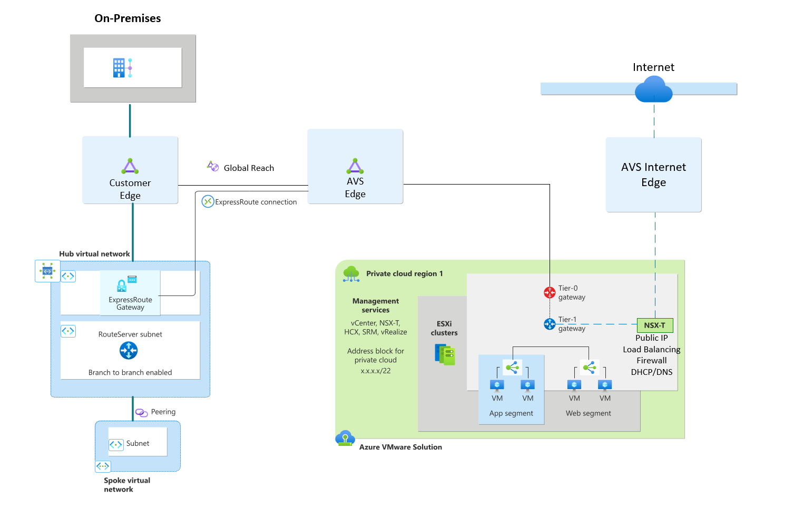
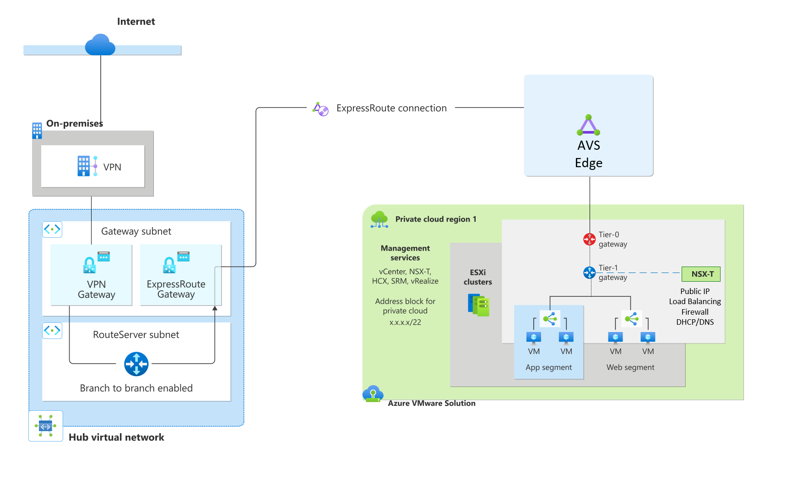
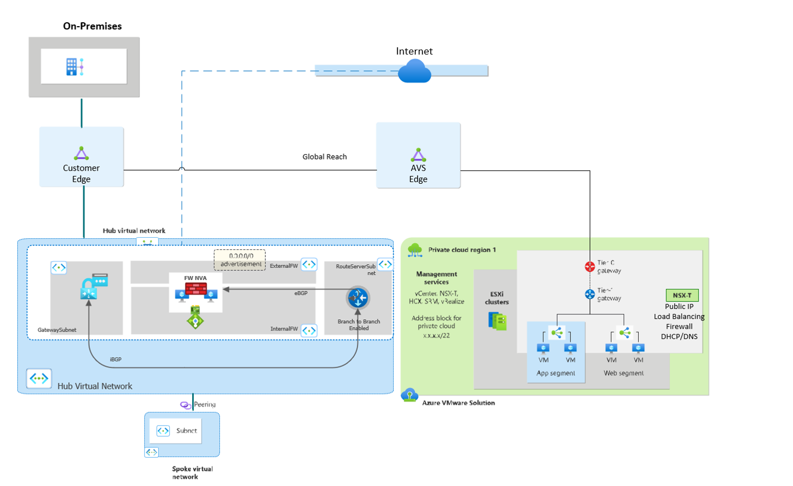
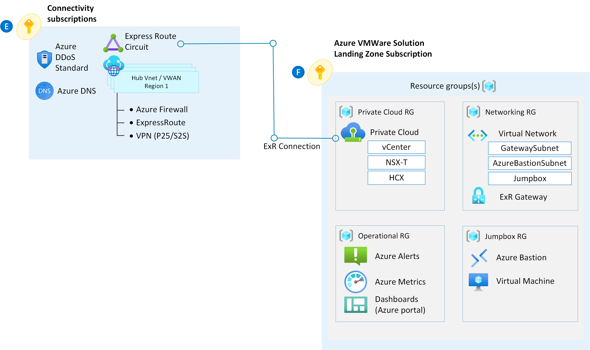

# Enable connectively from Azure VMware Solution 

## Introduction

In this design pattern, traffic has a dedicated path over the Microsoft backbone from the on-premises datacenter to the Azure VMware Solution (AVS) private cloud. This connection occurs through the Expressroute Global Reach, a mechanism that supplies a direct path between the customer managed which can then connect to the AVS-dedicated Expressroute circuits. The private cloud also has a separate, isolated breakout from the NSX Edge to the internet so that this traffic doesn't traverse over the Expressroute.  

>[!IMPORTANT] 
>If you’re in a region today where Global Reach isn't supported, transit from on-premises to the AVS private cloud is possible by deploying an Expressroute Gateway in Azure. To supply the transitivity end-to-end, a virtual appliance in the Hub Virtual Network (VNET) is needed. See the section [Traffic Inspection & Default Route Advertisement](network-hub-spoke.md#traffic-inspection). 

### Customer profile

This architecture is ideal for:

- Low latent, egress natively from the Azure VMware Solution SDDC (software-defined datacenters) to the internet.
- Direct traffic from on-premises directly to Azure via Expressroute or VPN.
- Inbound L4/L7 services for workloads in the SDDC such as HTTPS

The traffic, which flows through the AVS NSX routers, covered in this design include:

- Azure VMware Solution to Azure native virtual networks
- Azure VMware Solution to the internet 
- Azure VMware Solution to on-premises datacenters

### Architectural components

Implement this scenario with:

-	An NSX Distributed Firewall (DFW) – version 3.2.2 or higher for IDS/IPS
-	An NSX Advanced Load balancer 
-	Public IP for Internet breakout from Azure VMware Solution for both source and destination address translation (SNAT/DNAT)

>[!NOTE] 
>While NSX Advanced load balancer (Avi) provides inbound capabilities directly within NSX, this functionality is also possible with WAF or App Gateway v2 in Azure.

#### Key Decision

This document assumes and recommends default route advertisement from either on-premises or AVS. If you need the default route to originate from Azure, refer to the section [Traffic Inspection & Default Route Advertisement](network-hub-spoke.md#traffic-inspection). 
 
### Considerations 

-	Enable Public IP down to the NSX Edge in Azure portal. This way allows for low-latency direct connections to Azure VMware Solution, and the ability to scale the number of outbound connections.
-	Apply the NSX firewall's rule creation, URL filtering, and TLS Inspection services.
-	Use the NSX Advanced load balancer to evenly distribute traffic to workloads.
-	Enable DDoS protection.

### Egress from AVS using NSX-T or NVA 

|  Traffic inspection coverage  | Recommended solution design | Considerations | Internet Breakout |
|----|---|---|---|
| - Internet ingress      - Internet egress   - Traffic to and on-premises datacenter   - Traffic to Azure Virtual Network   - Traffic within Azure VMware Solution  |   Use NSX-T or a third-party NVA firewall in Azure VMware Solution.     Use NSX-T Advanced Load Balancer for HTTPs, or NSX-T Firewall for non-HTTPs traffic.    Public IP for Internet breakout from Azure VMware Solution, SNAT, and DNAT. | Choose this option to advertise the `0.0.0.0/0` route from the Azure VMware Solution Private Cloud   Enable Public IP down to the NSX Edge in Azure portal. This option allows for low-latency connections to Azure, and the ability to scale the number of outbound connections. | Azure VMware Solution

### Egress from Azure VMware Solution through 0.0.0.0/0 advertisement from on-premises

|  Traffic inspection coverage  | Recommended solution design | Considerations | Internet Breakout |
|----|---|---|---|
| - Internet ingress   - Internet egress   - To on-premises datacenter| Use a virtual appliance on-premises     For HTTP/S traffic, use NSX Advanced Load balancer or Application Gateway in Azure. For non-HTTP/S traffic, use the NSX Distributed Firewall.   Enable public IP in Azure VMware Solution. | Choose this option to advertise the `0.0.0.0/0` route from on-premises datacenters. | On-premises

> [!IMPORTANT]
> Some traditional VMware appliances use service insertion to place appliances at the tier-0 router. The tier-0 routers are provisioned and managed by Microsoft and are not consumable by end users. All network appliances and load balancers must be placed at tier-1. The next section discusses default route propagation from a party device in AVS. 
 
### Third Party NVA integration in AVS

Integration with Third Party appliances is possible with careful consideration. In this design, third party NVA(s) sit behind one or more T-1 edge routers. 
 
It's the users' responsibility to bring a license and implement any high availability capabilities native to the device.
 
Be aware of the limits when choosing this implementation. For example, there's a limit of up to eight virtual network interface cards (NICs) on a virtual machine. For more information on how to place NVAs in AVS, see: [NSX-T firewall patterns](https://github.com/Azure/Enterprise-Scale-for-AVS/tree/main/BrownField/Networking/Concepts/Nsx-Firewall-Patterns)

> [!NOTE] 
> Microsoft does not support the use of Mobility Optimized Networking when Third party NVAs are used.

## Landing Zone considerations

This section references best practices for integrating AVS with your Azure Landing Zone. 

### Azure Route Server

Azure route server (ARS) is used to dynamically propagate learned routes from AVS and supply Branch-to-Branch connectivity to VPN Gateways. VNETs that's peered to the VNET where ARS lives also dynamically learn the routes, meaning it's possible to learn routes from AVS to Hub and Spoke environments in Azure. Use cases for Azure route server include:

Dynamic route propagation:

- Learn specific routes from AVS to local VNETs via BGP (Border Gateway Protocol). The peered VNETs can then learn the routes also.
- Third Party NVA integration
   - Peer ARS with NVAs so that you don’t need UDRs for each AVS segment to filter traffic.
   - Return traffic from peered VNETs needs a UDR (User Defined Routes) back to the local interface of the firewall 
Transit mechanism from Expressroute to VPN Gateways
-	VPN Gateway must be of type Site-to-Site and configured in Active-Active 

To use Azure Route Server, you must:

-	Enable Branch to Branch
-	Use route summarization for > 1000 routes or use `NO_ADVERTISE BGP communities` flag refenced in the [Azure Route Server frequently asked questions (FAQs)](/azure/route-server/route-server-faq#can-azure-route-server-filter-out-routes-from-nvas)

-	Peer  NVA with specific, non-Azure ASNs. For example, since ARS uses 65515, no other appliance in the VNET can use that ASN (Autonomous System Number). 
-	No support for IPV6

## Integration with Azure NetApp Files 

Azure NetApp Files (ANF) provides you with a Network Attached datastore via the NFS protocol. ANF lives in an Azure VNET and connects to workloads in AVS. 
By using NFS datastores backed by Azure NetApp Files, you can expand your storage instead of scaling the clusters.
- 	Create Azure NetApp Files volumes using Standard network features to enable optimized connectivity from your AVS private cloud via ExpressRoute FastPath
-  Deploy ANF in a delegated subnet 
- 	Hub & Spoke deployment supports ER GW SKU of up 10 Gbps
-  Ultra & ErGw3AZ SKU is required for bypassing the gateway port speed limits
-  Read traffic ingresses and write traffic is egresses over the Expressroute. Egress traffic over Expressroute circuits bypasses the gateway and go directly to the edge router 
-  Ingress/Egress charges are suppressed from AVS, however there's an egress charge if data is going across peered VNETs. 
- Only NFS v3 is supported today. 
 
If you’re seeing unexpected latency, make sure your AVS Private cloud, and ANF deployment are pinned to the same AZ (Azure Availability Zones). For high availability, create ANF volumes in separate AZs and enable `Cross Zone Replication`

> [!IMPORTANT] 
> Microsoft does not support Fastpath for Secured Azure VWAN hub where the maximum port speed possible is 20Gbps. Consider using hub & spoke VNET's if larger throughput is required. 
See how to attach Azure Netapp Files datastores to Azure VMware Solution hosts [here](/azure/azure-vmware/attach-azure-netapp-files-to-azure-vmware-solution-hosts?tabs=azure-portal)

### VPN connectivity from On-premises

While an Expressroute circuit is recommended, connecting to AVS from on-premises with IPSEC using a transit hub VNET in Azure is also possible. This scenario requires a VPN gateway and Azure Route Server. As referenced earlier, Azure Route Server enables transitivity between the VPN gateway and the AVS Expressroute gateway.

## Traffic Inspection

As seen earlier, default route advertisement is happening from AVS with the Public IP down to the NSX Edge option, but it's also possible to continue advertising the default route from on-premises. End-to-end traffic filtering from on-premises to AVS is possible with the firewall placed at either of these endpoints. 

Default route advertisement from Azure is possible with Third party NVA in either a Hub VNET or when using Azure vWAN. In a Hub & Spoke deployment, Azure Firewall isn't possible because it doesn't speak BGP, however use of a third party BGP capable device will work. This scenario works for inspecting traffic from 
-	On premises to Azure
-	Azure to the internet
-	AVS to the internet 
-	AVS to Azure

### A third-party NVA in the hub VNet inspects traffic between AVS and the internet and between AVS and Azure VNets

| Traffic inspection requirements | Recommended solution design | Considerations | Internet Breakout |
|----|---|---|---|
| - Internet ingress   - Internet egress   - To on-premises datacenter   - To Azure Virtual Network   | Use third-party firewall solutions in a hub virtual network with Azure Route Server.    For HTTP/S traffic, use Azure Application Gateway. For non-HTTP/S traffic, use a third-party firewall NVA on Azure.    Use an on-premises third-party firewall NVA.    Deploy third-party firewall solutions in a hub virtual network with Azure Route Server. | Choose this option to advertise the `0.0.0.0/0` route from an NVA in your Azure hub virtual network to an Azure VMware Solution.| Azure

## Additional Information 

-	 Access vCenter using Bastion + Jumpbox VM -   If accessing vCenter from on-premises, make sure to have a route from your on-premises networks to the /22 AVS management network.  Validate that the route in CLI by typing `Test-NetConnection  x.x.x.2 -port 443`
- DNS considerations -  If using private endpoints follow the guidance detailed here: Azure Private Endpoint DNS configuration | Microsoft Learn

## Next steps

- For more information on how to transit from on-premises VPN to Azure VMware Solution, see the following [VPN to ExR transit how to article:](https://github.com/Azure/Enterprise-Scale-for-AVS/tree/main/BrownField/Networking/Step-By-Step-Guides/Hub%20VNET%20with%20VPN%20to%20ExpressRoute%20Gateway%20transit)
- For more information about Azure VMware Solution in hub-and-spoke networks, see [Integrate Azure VMware Solution in a hub and spoke architecture](/azure/azure-vmware/concepts-hub-and-spoke).
- For more information on VMware NSX-T Data Center network segments, see [Configure NSX-T Data Center network components using Azure VMware Solution](/azure/azure-vmware/configure-nsx-network-components-azure-portal#create-an-nsx-t-segment-in-the-azure-portal).
- For more information Azure Router Server, see the product overview [What is Azure Route Server?](/azure/route-server/overview)

Next, observe other design patterns for establishing connectivity to the Azure VMware Solution

  > [!div class="nextstepaction"]
  > [Multi region network topology ](./eslz-dual-region-network-topology.md)
