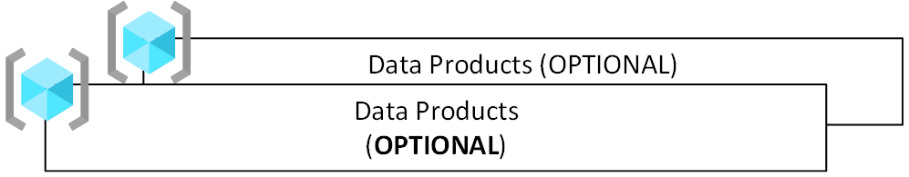

# Cloud-scale analytics data products in Azure

[Data products](../../cloud-scale-analytics/architectures/what-is-data-product.md) are data served as products and computed, saved, and served by polyglot persistence services, which may be required by certain use cases. The process of creating and serving a data product can require services and technologies that aren't included in the [data landing zone](./data-landing-zone.md) core services. An example of this would be reporting with niche requirements, such as compliance and tax reporting.

## Design considerations

A data landing zone can serve multiple data products created by ingesting data from within the same data landing zone or from across multiple data landing zones. This is shown in the following diagram.

:::image type="content" source="../images/data-product-cross-data-landing-zone.png" alt-text="Diagram of cross-data landing zone consumption.":::

The example above shows:

- Intrazone data consumption:
  - Data product B consumes data from data product A and other data or data products existing in the data lake within its own landing zone.
  - Data products C and D only consume data from within their own respective data landing zones.
- Interzone data consumption:
  - Data product B also consumes data from data product C and the data in landing zone 3's data lake.

> [!IMPORTANT]
> In the case of interzone data consumption, since data product B is created by reading from data landing zone 3, this read access requires approval from the [data landing zone operations](../../cloud-scale-analytics/organize-roles-teams.md#data-landing-zone-teams) and [integration operations](../../cloud-scale-analytics/organize-roles-teams.md#data-landing-zone-teams) teams of data landing zone 3.

> [!IMPORTANT]
> Data product B consumes data from data products A and C. Before this can happen, data product B must register its consumption of data products via data sharing agreements. This data sharing agreement should update the lineage from data product A to data product B and from data product C to data product B.

The resource group for a data product includes all services required to create and maintain it. We can call this resource group a **data application**. Examples of services that might be part of a data application include Azure Functions, Azure App Service, Logic Apps, Azure Analysis Services, Azure Cognitive Services, Azure Machine Learning, Azure SQL Database, Azure Database for MySQL, and Azure Cosmos DB.

Data products have data from *READ* data sources that have had some data transformations applied. Examples might be a newly curated dataset or a BI report.

## Design recommendations

Build data products within your data landing zone by adhering to design principles that allow you to scale with data governance. The following sections provide design recommendations to help as you plan your data application ecosystem.

### Deploy multiple resource groups

Each data application is a resource group. Since data applications are compute services, polyglot persistence services, or both, they can only be required depending on certain use cases. As such, they're considered an optional data landing zone component. In cases where you do need data applications, create multiple resource groups by data application as the following diagram shows.

### Set guardrails

Azure Policy drives the default configuration of services within a data landing zone. Think of operational analytics as multiple resource groups that your data product team can request from a standard service catalog. Using Azure Policy, you can configure the security boundary and required feature set.

> [!IMPORTANT]
> To drive consistency, configure one Azure Policy for each data application.

### Consume data from multiple places

Data applications manage, organize, and make sense of data from multiple data assets and present any insights gained. A data product is the result of data from one or many data applications within data landing zones. Allow your data applications to access data from multiple and various sources when necessary.

### Scale as needed

Services that make up data applications are incremental deployments to the data landing zone. Scale your data applications as needed.

### Enable data discovery

Automatically register your data products in a data catalog such as [Microsoft Purview](/purview/data-catalog-best-practices) to allow data scanning.

### Identify your data products

While starting to plan a data landing zone, identify as many data products (and the data applications that output and maintain them) as necessary to help drive your data product application architecture. Conformity to implemented platform governance should play the largest role in your decisions.

Focus on how your data applications are data producers and consumers for others. For example, assume you've identified a suite of data products (A, B, C, and D) which are produced and consumed data. You require data products A and D as sources for the data in Data Application B for data product B. Data product B is created from the data that Data Application B consumes from data products A and D. Data Application B acts as a data producer itself, and also produces data for data product C.

:::image type="content" source="../images/data-producers-consumers.png" alt-text="Diagram of a data producer and consumers.":::

### Control your data application environment with infrastructure-as-code

Governance and infrastructure-as-code should control the data application environment across your data products ecosystem, as shown in the previous diagram.

### Publish data models

Your data product teams should publish their data models in a modeling repository.

### Set expectations for data product users

Update your data sharing contracts with service-level agreements and certifications for your data products so you can convey accurate expectations to potential users of the data product.

### Capture lineage

If data product B is created from data coming from data products A and D, lineage must be captured from A and D to B. Further lineage should also be captured for data product C, since it's created using data from data product B. Updated lineage should be captured in a data lineage application before every release of your data product.

> [!NOTE]
> Using Azure Pipelines allows you to build approval gates and invoke functions that can ensure metadata, lineage, and SLAs are registered in the correct governance service.

### Define data application architecture

You must create a detailed architecture for each data product that fully defines its relationship to other data products, its dependencies, and its access requirements.

## Next steps

[Data applications (source-aligned)](../../cloud-scale-analytics/architectures/data-application-source-aligned.md)