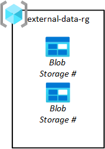

# Data landing zones

Data landing zones are connected to your [data management landing zone](./data-management-landing-zone.md) by virtual network (VNet) peering. Each data landing zone is considered a [landing zone](../../../ready/landing-zone/index.md) related to Azure landing zone architecture.

> [!IMPORTANT]
> Before provisioning a data landing zone, make sure your DevOps and CI/CD operating model is in place and a data management landing zone is deployed.
>

Each data landing zone has several layers that enable agility for the service data integrations and data products it contains. You can deploy a new data landing zone with a standard set of services that let the data landing zone begin ingesting and analyzing data.

Your Azure subscription associated with your data landing zone has the following structure:

| Layer | Required |Resource groups |
|---|---|---|
|[Core services](#core-services-layer) | Yes |<ul><li>[Network](#networking) <li> [Monitoring for Azure Databricks workspaces](#azure-databricks-workspaces-monitoring) <li>[Hive metastore for Azure Databricks](#hive-metastore-for-azure-databricks) <li> [Data lake services](#data-lake-services) <li> [Upload ingest storage](#upload-ingest-storage) <li> [Data agnostic ingestion](#data-agnostic-ingestion) <li> [Shared integration runtimes](#shared-integration-runtimes) <li> [CI/CD Agents](#cicd-agents) <li> [Data agnostic ingestion](#data-agnostic-ingestion) <li> [Shared Databricks](#shared-databricks) <li> [Shared Azure Synapse Analytics](#shared-azure-synapse-analytics) |
|[Data application](#data-application)     |Optional         |<ul><li>[Data application](#data-product-resource-group) (1 or more)</li></ul>         |
|[Visualization](#visualization)    |Optional         |<ul><li>[Reporting and visualization](#visualization)</li></ul>         |

> [!NOTE]
> A data application produces one or more data products.

## Data landing zone architecture

Data landing zone architecture illustrates the layers, their resource groups, and services each resource group contains. The architecture also provides an overview of all groups and roles associated with your data landing zone, plus the extent of their access to your control and data planes.

:::image type="content" source="../images/data-landing-zone-2.png" alt-text="Diagram of the data landing zone architecture." lightbox="../images/data-landing-zone-2.png":::

 > [!TIP]
> Before you deploy a data landing zone, make sure you [consider the number of initial data landing zones you want to deploy](../../cloud-scale-analytics/architectures/scale-architectures.md).

Use this architecture as a starting point. Download the [Visio file](https://www.microsoft.com/download/details.aspx?id=104215) and modify it to fit your specific business and technical requirements when planning your data landing zone implementation.

## Core services layer

The core services layer includes all services required to enable your data landing zone within the context of cloud-scale analytics. The following table lists the resource groups that provide the standard suite of available services in every data landing zone you deploy.

| Resource Group        | Required | Description             |
|-----------------------|----------|-------------------------|
| network-rg            | Yes      | Networking              |
| databricks-monitoring-rg | Optional | Monitoring for Azure Databricks workspaces |
| hive-rg            | Optional      | Hive metastore for Azure Databricks   |
| storage-rg            | Yes      | Data lakes services     |
| external-data-rg      | Yes      | Upload ingest storage   |
| runtimes-rg           | Yes      | Shared integration runtimes |
| mgmt-rg               | Yes      | CI/CD Agents |
| metadata-ingestion-rg | Optional | Data agnostic ingestion |
| databricks-monitoring-rg | Optional | Log analytics workspace for databricks workspaces in landing zone|
| shared-synapse-rg  | Optional | Shared Azure Synapse |
| shared-databricks-rg  | Optional | Shared Azure Databricks workspace |

### Networking

:::image type="content" source="../images/data-landing-zone-network-rg.png" alt-text="Diagram of a data landing zone network resource group.":::

The network resource group contains core components, including Azure [Network Watcher](/azure/network-watcher/network-watcher-monitoring-overview), [network security groups](/azure/virtual-network/network-security-groups-overview) (NSG), and a virtual network. All of these services are deployed into a single resource group.

The virtual network of your data landing zone is [automatically peered with your data management landing zone's VNet](../eslz-network-topology-and-connectivity.md) and your [connectivity subscription's VNet](../../../ready/landing-zone/index.md).

### Azure Databricks workspaces monitoring

This resource group is optional and only deploys with Azure Databricks.

:::image type="content" source="../images/data-landing-zone-monitoring-rg.png" alt-text="Diagram of data landing zone monitoring resource group.":::

The Azure landing zone pattern recommends that you send all logs to a central Log Analytics workspace. However, each data landing zone also includes a monitoring resource group to capture Spark logs from Databricks. Each resource group contains a shared Log Analytics workspace and Azure Key Vault to store Log Analytics keys.

> [!IMPORTANT]
> Only use the Log Analytics workspace in your Databricks monitoring resource group to capture Azure Databricks Spark logs.

For more information, see [Monitoring Azure Databricks](/azure/architecture/databricks-monitoring/).

### Hive metastore for Azure Databricks

This resource group is optional and should only be deployed with Azure Databricks.

The Hive metastore for Azure Databricks provisions an Azure Database for MySQL database and a key vault. All Azure Databricks workspaces in your data landing zone use this metastore as their external Apache Hive metastore.

For more information, see [External Apache Hive metastore](/azure/databricks/data/metastores/external-hive-metastore).

### Data lake services

:::image type="content" source="../images/data-landing-zone-data-lake-services-rg.png" alt-text="Diagram of data landing zone data lake services resource group.":::

As shown in the previous diagram, three [Azure Data Lake Storage Gen2](/azure/storage/blobs/data-lake-storage-introduction) accounts are provisioned in a single data lake services resource group. Data transformed at different stages is saved in one of your data landing zone's data lakes. The data is available for consumption by your analytics, data science, and visualization teams.

[!INCLUDE [data-lake-layers](../../cloud-scale-analytics/includes/data-lake-layers.md)]

> [!NOTE]
> In the previous diagram, each data landing zone has three data lakes. However, depending on your requirements, you might want to consolidate your raw, enriched and curated layers into one storage account, and maintain another storage account called 'development' for data consumers to bring in other useful data products.

For more information, see:

- [Overview of Azure Data Lake Storage for cloud-scale analytics](../best-practices/data-lake-overview.md)
- [Data Standardization](../../cloud-scale-analytics/architectures/data-standardization.md)
- [Provision Azure Data Lake Storage Gen2 accounts for each data landing zone](../../cloud-scale-analytics/best-practices/data-lake-zones.md)
- [Key considerations for Azure Data Lake Storage](../best-practices/data-lake-key-considerations.md)
- [Access control and data lake configurations in Azure Data Lake Storage](../best-practices/data-lake-access.md)

### Upload ingest storage

Third-party data publishers need to land data in your platform so your data application teams can pull it into their data lakes. As seen in the following diagram, your upload ingest storage resource group lets you provision blob stores for third-parties.

Your data application teams request these storage blobs. Their requests are then approved by your data landing zone operations team. Data should be removed from its source storage blob once it's been pulled from the storage blob into raw.

> [!IMPORTANT]
> Since Azure Storage blobs are provisioned on an *as-needed* basis, you should initially deploy an empty storage services resource group in each data landing zone.

### Shared integration runtimes

Deploy a virtual machine scale set with self-hosted integration runtimes into your data landing zone. Host it in the shared integration resource group. This deployment lets you rapidly onboard data products to your data landing zone.

:::image type="content" source="../images/data-landing-zone-shared-integration-rg.png" alt-text="Diagram of a data landing zone shared integration resource group.":::

To enable the resource group:

- Create at least one Azure Data Factory in your data landing zone's shared integration resource group. Use it only for linking the shared self-hosted integration runtime, not for data pipelines.
- Create a [shared image for the Azure virtual machine scale set](/azure/virtual-machine-scale-sets/tutorial-use-custom-image-powershell) with a self-hosted integration runtime configured.
- Set up the self hosted integration runtimes in [high availability mode](/azure/data-factory/create-self-hosted-integration-runtime#high-availability-and-scalability).
- Associate the self-hosted integration runtimes with Azure data factories in your data landing zone(s).
- Set up Azure Automation to [periodically update the self hosted integration runtime](/azure/data-factory/self-hosted-integration-runtime-automation-scripts).

> [!IMPORTANT]
> Deploy shared integration runtimes as close to the data source as possible. Their deployment does not restrict your deployment of integration runtimes in a data landing zone or into third-party clouds. Instead, it provides a fallback for cloud native, in-region data sources.

### CI/CD Agents

CI/CD Agents help you deploy data applications and changes to the data landing zone.

For more information, see [Azure Pipeline agents](/azure/devops/pipelines/agents/agents).

### Data agnostic ingestion

:::image type="content" source="../images/data-landing-zone-ingest-processing-rg.png" alt-text="Diagram of Data landing zone ingest and processing resource group.":::

This resource group is optional, and doesn't prohibit you from deploying your landing zone. 

This resource group applies if you have (or are developing) a data agnostic ingestion engine for automatically ingesting data based on registering metadata (including connection strings, path to copy data from and to, and ingestion schedule. The ingestion and processing resource group has key services for this kind of framework.

Deploy an Azure SQL Database instance to hold metadata used by Azure Data Factory. Provision an Azure Key Vault to store secrets relating to automated ingestion services. These secrets can include:

- Azure Data Factory metastore credentials
- Service principal credentials for your automated ingestion process

For more information, see [How automated ingestion frameworks support cloud-scale analytics in Azure](../best-practices/automated-ingestion-pattern.md).

Services included in this resource group include:

|Service | Required | Guidelines |
|---|---|---|
|Azure Data Factory | Yes | Azure data factory is your orchestration engine for data agnostic ingestion. |
|Azure SQL DB | Yes | Azure SQL DB is the metastore for Azure Data Factory. |
|Event Hubs or IoT Hub | Optional | Event Hubs or IoT Hub can provide real-time streaming to Event Hubs, plus batch and streaming processing via a Databricks engineering workspace. |
| Azure Databricks | Optional | You can deploy Azure Databricks or Azure Synapse Spark for use with your data agnostic ingestion engine. |
| Azure Synapse | Optional | You can deploy Azure Databricks or Azure Synapse Spark to use with the data agnostic ingestion engine. |

### Shared Databricks

This resource group is optional and only deploys with Azure Databricks. Everyone in your data landing zone can use a Databricks workspace.

Azure Databricks is a key consumer of the Azure Data Lake Storage service. Atomic file operations are optimized for Spark analytic engines. This optimization speeds up the completion of Spark jobs that Azure Databricks service issues.

:::image type="content" source="../images/data-landing-zone-shared-databricks-rg.png" alt-text="Diagram of data landing zone shared databricks resource group.":::

> [!IMPORTANT]
> An Azure Databricks workspace called the Azure Databricks (analytics) workspace is provisioned for all data scientists and DataOps, as shown in the shared products resource group.
>
> You can configure this workspace to connect to your Azure Data Lake using either Azure Active Directory passthrough or table access control. Depending on your use case, you can configure conditional access as another security measure.

Follow cloud-scale analytics best practices to integrate Azure Databricks:

- [Secure access to Azure Data Lake Gen2 from Azure Databricks](https://github.com/hurtn/datalake-ADLS-access-patterns-with-Databricks/blob/master/readme.md)
- [Azure Databricks best practices](https://github.com/Azure/AzureDatabricksBestPractices/blob/master/toc.md)

The Azure landing zone pattern recommends that you send all logs to a central Log Analytics workspace. However, each data landing zone also contains a monitoring resource group to capture Spark logs from Databricks.

### Shared Azure Synapse Analytics

This resource group is optional.

During your initial setup of a data landing zone, a single Azure Synapse Analytics workspace is deployed for use by all data analysts and scientists in your shared products resource group.

You can set up more synapse workspaces for data products if cost management and recharge are required. Your data application teams might make use of dedicated Azure Synapse Analytics workspaces to create dedicated Azure SQL Database pools as a read data store used by your visualization layer.

> [!IMPORTANT]
> Prevent the use of your shared Azure Synapse workspace for data product creation by locking down the workspace to only allow SQL On-demand queries. It is there for exploitative purposes only.

## Data application

Each data landing zone can have multiple data products. You can create these data products by ingesting data from source. You can also create data products from other data products within the same data landing zone or from other data landing zones. Data product creation of the data products is subject to data steward approval.

### Data product resource group

Your data product resource group product includes all the services required to make that data product. For example, an Azure Database is required for MySQL, which is used by a visualization tool. Data must be ingested and transformed before it lands into that MySQL database. In this case, you can deploy Azure Database for MySQL and an Azure Data Factory into the data product resource group.

> [!TIP]
> If you choose not to implement a data agnostics engine for ingesting once from operational sources, or if complex connections aren't facilitated in your data agnostics engine, create a source aligned data application. For more information, see [Data applications (source-aligned)](../../cloud-scale-analytics/architectures/data-application-source-aligned.md)

For more information on how to onboard data products, see [Cloud-scale analytics data products in Azure](./data-landing-zone-data-products.md).

## Visualization

An empty visualization resource group is created for every data landing zone. Fill this resource group with services you need to implement your visualization solution. Using your existing VNet lets your solution connect to data products.

This resource group can host virtual machines for third-party visualization services.

> [!TIP]
> Due to licensing costs, it might be more economical to deploy third-party visualization products into your data management landing zone, and for those products to connect across data landing zones to pull data back.

## Next steps

- [Cloud-scale analytics data products in Azure](data-landing-zone-data-products.md)
