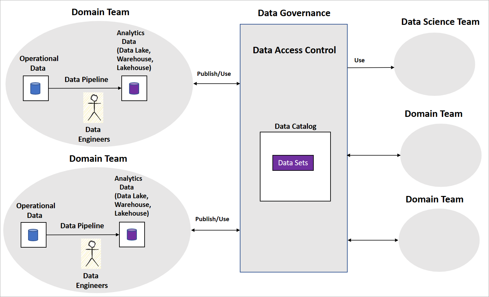
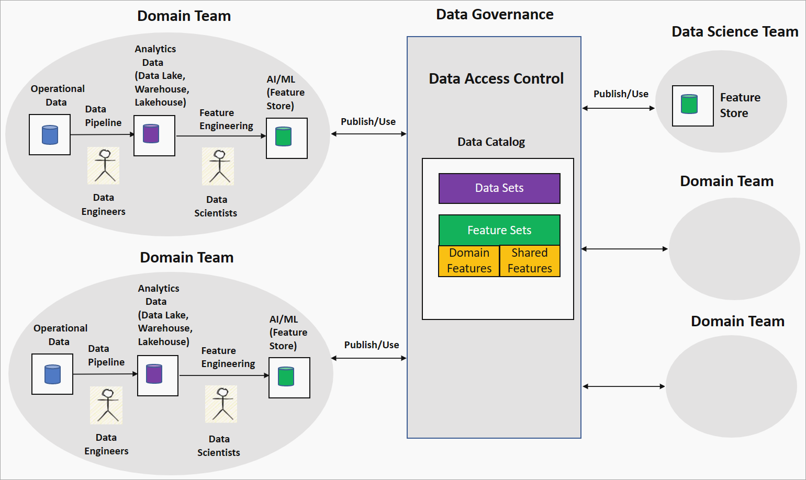

# Operationalize data mesh for AI/ML domain driven feature engineering

Data mesh helps organizations move from a centralized data lake or data warehouse to a domain-driven decentralization of analytics data underlined by four principles: Domain Ownership, Data as a Product, Self-serve Data Platform, and Federated Computational Governance. [Data mesh](what-is-data-mesh.md) provides the benefits of distributed data ownership and improved data quality and governance that accelerates business and time to value for organizations.

## Data mesh implementation

A typical data mesh implementation includes domain teams with data engineers who build data pipelines. The team maintains operational and analytical data stores, like data lakes, data warehouses, or data lakehouses. They release the pipelines as [data products](what-is-data-product.md) for other domain teams or data science teams to consume. Other teams consume the data products using a central data governance platform as shown in the following diagram.

Data mesh is clear on how data products serve transformed and aggregated data sets for business intelligence. But it's not explicit about the approach organizations should take to build AI/ML models. Nor is there guidance on how to structure their data science teams, the AI/ML model governance, and how to share AI/ML models or features among domain teams.

The following section outlines a couple of strategies that organizations can use to develop AI/ML capabilities within data mesh. And you see a proposal for a strategy on domain-driven feature engineering or feature mesh.

## AI/ML strategies for data mesh

One common strategy is for the organization to adopt data science teams as data consumers. These teams access various domain data products in data mesh as per the use case. They perform data exploration and feature engineering to develop and build AI/ML models. In some cases, domain teams also develop their own AI/ML models by using their data and other teams’ data products to extend and derive new features.

[Feature engineering](https://en.wikipedia.org/wiki/Feature_engineering) is the core of model building and is typically complex and requires domain expertise. This strategy can be time-consuming since data science teams need to analyze various data products. They might not have complete domain knowledge to build high-quality features. Lack of domain knowledge can lead to duplicate feature engineering efforts between domain teams. Also, issues like AI/ML model reproducibility due to inconsistent feature sets across teams. Data science or domain teams need to continuously refresh features as new versions of data products are released.

Another strategy is for domain teams to release AI/ML models in a format like Open Neural Network Exchange (ONNX), but these results are black boxes and combining AI/ML models or features across domains would be difficult.

Is there a way to decentralize the AI/ML model building across domain and data science teams to address the challenges? The proposed domain-driven feature engineering or feature mesh strategy is an option.

## Domain driven feature engineering or feature mesh

The domain-driven feature engineering or feature mesh strategy offers a decentralized approach to AI/ML model building in a data mesh setting. The following diagram shows the strategy and how it addresses the four main principles of data mesh.

## Domain ownership feature engineering by domain teams

In this strategy, the organization pairs data scientists with data engineers in a domain team to run data exploration on clean and transformed data in, for example, a data lake. Engineering generates features that store in a feature store. A feature store is a data repository that serves features for training and inference and helps track feature versions, metadata, and statistics. This capability lets the data scientists in the domain team work closely with domain experts and keep the features refreshed as data changes in the domain.

### Data as a product: Feature sets

Features generated by the domain team, known as domain or local features, are published to the data catalog in the data governance platform as feature sets. These feature sets are consumed by data science teams or other domain teams for building AI/ML models. During AI/ML model development, the data science or domain teams can combine domain features to produce new features, called shared or global features. These shared features are published back to the feature sets catalog for consumption.

## Self-serve data platform and federated computation governance: Feature standardization and quality

This strategy can lead to adopting a different technology stack for feature engineering pipelines and inconsistent feature definitions between domain teams. Self-serve data platform principles ensure that domain teams are using common infrastructure and tools to build the feature engineering pipelines and enforce access control. The Federated Computational Governance principle ensures interoperability of feature sets through global standardization and checks on feature quality.

Using the domain-driven feature engineering or feature mesh strategy offers a decentralized AI/ML model building approach for organizations to help reduce time in developing AI/ML models. This strategy helps keep features consistent across domain teams. It avoids duplication of efforts and results in high-quality features for more accurate AI/ML models, which increase the value to the business.

## Data mesh implementation in Azure

This article describes the concepts around operationalizing AI/ML in a data mesh and doesn't cover tools or architectures to build these strategies. Azure has feature store offerings like [Azure Databricks](/azure/databricks/machine-learning/feature-store) feature store and [Feathr](https://github.com/feathr-ai/feathr) from LinkedIn. You can develop [Microsoft Purview](/azure/purview/) custom connectors to manage and govern feature stores.

## Next steps

- [Getting started with data mesh checklist](data-mesh-checklist.md)