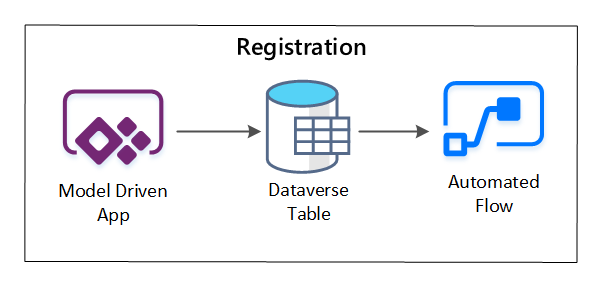

# Data agnostic ingestion engine

This article explains how you can implement data agnostic ingestion engine scenarios using a combination of PowerApps, Azure Logic Apps, and metadata-driven copy tasks within Azure Data Factory.

Data agnostic ingestion engine scenarios are typically focused on letting non-technical (non-data-engineer) users publish data assets to a Data Lake for further processing. To implement this scenario, you must have onboarding capabilities that enable:

- Data asset registration
- Workflow provisioning and metadata capture
- Ingestion scheduling

You can see how these capabilities interact:

:::image type="content" source="../images/registration-capabilities.png" alt-text="Diagram of data registration capabilities and interactions":::

*Figure 1: Data registration capabilities interactions.*

The following diagram shows how to implement this process using a combination of Azure services:

:::image type="content" source="../images/automated-ingestion-flow.png" alt-text="Diagram of an data agnostic engine ingestion process":::

*Figure 2: Automated ingestion process.*

## Data asset registration

To provide the metadata used to drive automated ingestion, you need data asset registration. The information you capture contains:

- **Technical information:** Data asset name, source system, type, format and frequency.
- **Governance information:** Owner, stewards, visibility (for discovery purposes) and sensitivity.

PowerApps is used to capture metadata describing each data asset. Use a model-driven app to enter the information that gets persisted to a custom Dataverse table. When metadata is created or updated within Dataverse, it triggers an Automated Cloud flow that invokes further processing steps.



*Figure 3: Data asset registration.*

## Provisioning workflow / metadata capture

In the provisioning workflow stage, you validate and persist data collected in the registration stage to the metastore. Both technical and business validation steps are performed, including:

- Input data feed validation
- Approval workflow triggering
- Logic processing to trigger persistence of metadata to the metadata store
- Activity auditing

:::image type="content" source="../images/ingestion-step-2-workflow.png" alt-text="Diagram of registration workflow":::

*Figure 4: Registration workflow.*

After ingestion requests are approved, the workflow uses the Microsoft Purview REST API to insert the sources into Microsoft Purview.

### Detailed workflow for onboarding data products

:::image type="content" source="../images/new-dataset-ingestion.png" alt-text="Diagram showing how new datasets are ingested (automated)":::

*Figure 5: How new datasets are ingested (automated).*

Figure 5 shows the detailed registration process for automating the ingestion of new data sources:

- Source details are registered, including production and data factory environments.
- Data shape, format, and quality constraints are captured.
- Data application teams should indicate if data is **sensitive (Personal data)** This classification drives the process during which data lake folders are created to ingest raw, enriched and curated data. The source names raw and enriched data and the data product names curated data.
- Service principal and security groups are created for ingesting and giving access to a dataset.
- An ingestion job is created in the data landing zone Data Factory metastore.
- An API inserts the data definition into Microsoft Purview.
- Subject to the validation of the data source and approval by the ops team, details are published to a Data Factory metastore.

## Ingestion scheduling

Within Azure Data Factory, [metadata-driven copy tasks](/azure/data-factory/copy-data-tool-metadata-driven) provide functionality that enables orchestration pipelines to be driven by rows within a Control Table stored in Azure SQL Database. You can use the Copy Data Tool to pre-create metadata-driven pipelines. 

After a pipeline has been created, your provisioning workflow adds entries to the Control Table to support ingestion from sources identified by the data asset registration metadata. The Azure Data Factory pipelines and the Azure SQL Database containing your Control Table metastore can both exist within each data landing zone to create new data sources and ingest them into data landing zones.

:::image type="content" source="../images/ingestion-step-3-orchestration.png" alt-text="Diagram of scheduling of data asset ingestion":::

*Figure 6: Scheduling of data asset ingestion.*

### Detailed workflow for ingesting new data sources

The following diagram shows how to pull registered data sources in a Data Factory SQL Database metastore and how data is first ingested:

:::image type="content" source="../images/new-datastore-ingestion.png" alt-text="Diagram of how new data sources are ingested":::

Your Data Factory ingestion master pipeline reads configurations from a Data Factory SQL Database metastore, then runs iteratively with the correct parameters. Data travels from the source to the raw layer in Azure Data Lake with little to no change. The data shape is validated based on your Data Factory metastore. File formats are converted to either Apache Parquet or Avro formats, then copied into the enriched layer.

Data being ingested connects to an Azure Databricks data science and engineering workspace, and a data definition gets created within the data landing zone Apache Hive metastore.

If you need to use an Azure Synapse serverless SQL pool to expose data, your custom solution should create views over the data in the lake.

If you require row-level or column-level encryption, your custom solution should land data in your data lake, then ingest data directly into internal tables in the SQL pools and set-up appropriate security on the SQL pools compute.

## Captured metadata

When using automated data ingestion, you can query the associated metadata and create dashboards to:

- Track jobs and the latest data-loading timestamps for data products related to their functions.
- Track available data products.
- Grow data volumes.
- Obtain real-time updates about job failures.

Operational metadata can be used to track:

- Jobs, job steps, and their dependencies.
- Job performance and performance history.
- Data volume growth.
- Job failures.
- Source metadata changes.
- Business functions that depend on data products.

## Use the Microsoft Purview REST API to discover data

Microsoft Purview REST APIs should be used to register data during the initial ingestion. You can use the APIs to submit data to your data catalog soon after it's ingested.

For more information, see [how to use Microsoft Purview REST APIs](/azure/purview/tutorial-using-rest-apis).

### Register data sources

Use the following API call to register new data sources:

````HTTP
PUT https://{accountName}.scan.purview.azure.com/datasources/{dataSourceName}
````

**URI parameters for the data source:**

|Name  |Required  |Type  |Description  |
|---------|---------|---------|---------|
|`accountName`    | True       | String        | Name of the Microsoft Purview account         |
|`dataSourceName` | True       | String        | Name of the data source         |

### Use the Microsoft Purview REST API for registration

The following examples show how to use the Microsoft Purview REST API to register data sources with payloads:

**Register an Azure Data Lake Storage Gen2 data source:**

```json
{
  "kind":"AdlsGen2",
  "name":"<source-name> (for example, My-AzureDataLakeStorage)",
  "properties":{
    "endpoint":"<endpoint> (for example, https://adls-account.dfs.core.windows.net/)",
    "subscriptionId":"<azure-subscription-guid>",
    "resourceGroup":"<resource-group>",
    "location":"<region>",
    "parentCollection":{
      "type":"DataSourceReference",
      "referenceName":"<collection-name>"
    }
  }
}
```

**Register a SQL Database data source:**

```json
{
  "kind":"<source-kind> (for example, AdlsGen2)",
  "name":"<source-name> (for example, My-AzureSQLDatabase)",
  "properties":{
    "serverEndpoint":"<server-endpoint> (for example, sqlservername.database.windows.net)",
    "subscriptionId":"<azure-subscription-guid>",
    "resourceGroup":"<resource-group>",
    "location":"<region>",
    "parentCollection":{
      "type":"DataSourceReference",
      "referenceName":"<collection-name>"
    }
  }
}
```

> [!NOTE]
> The `<collection-name>`is a current collection that exists in an Microsoft Purview account.

### Create a scan

[Learn how you can create credentials](/azure/purview/manage-credentials) to authenticate sources in Microsoft Purview before setting up and running a scan.

Use the following API call to scan data sources:

````HTTP
PUT https://{accountName}.scan.purview.azure.com/datasources/{dataSourceName}/scans/{newScanName}/
````

**URI parameters for a scan:**

|Name  |Required  |Type  |Description  |
|---------|---------|---------|---------|
|`accountName`    | True        | String        | Name of the Microsoft Purview account         |
|`dataSourceName` | True        | String        | Name of the data source         |
|`newScanName`    | True        | String        | Name of the new scan         |

### Use the Microsoft Purview REST API for scanning

The following examples show how you can use the Microsoft Purview REST API to scan data sources with payloads:

**Scan an Azure Data Lake Storage Gen2 data source:**

```json
{
  "name":"<scan-name>",
  "kind":"AdlsGen2Msi",
  "properties":
  {
    "scanRulesetType":"System",
    "scanRulesetName":"AdlsGen2"
  }
}
```

**Scan a SQL Database data source:**

```json
{
  "name":"<scan-name>",
  "kind":"AzureSqlDatabaseMsi",
  "properties":
  {
    "scanRulesetType":"System",
    "scanRulesetName":"AzureSqlDatabase",
    "databaseName": "<database-name>",
    "serverEndpoint": "<server-endpoint> (for example, sqlservername.database.windows.net)"
  }
}

```

**Use the following API call to scan data sources:**

```http
POST https://{accountName}.scan.purview.azure.com/datasources/{dataSourceName}/scans/{newScanName}/run
```

## Next steps

- [Overview of Azure Data Lake Storage for cloud-scale analytics](data-lake-overview.md)
