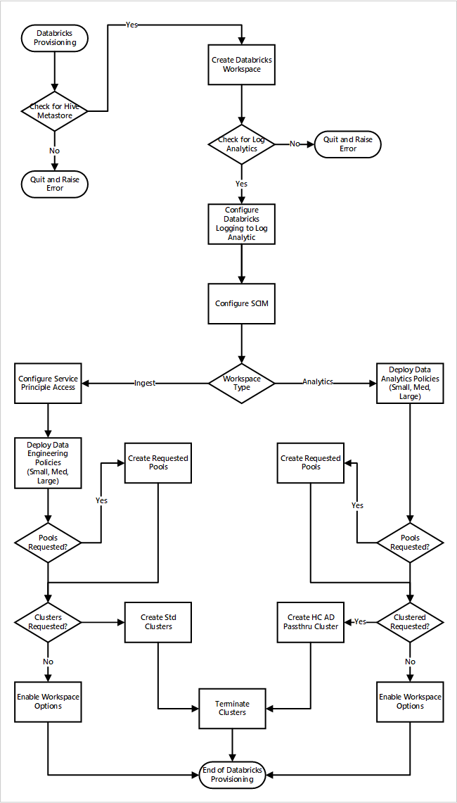

# Use Azure Databricks within cloud-scale analytics in Azure

Azure Databricks is a data analytics platform optimized for the Microsoft Azure Cloud Services platform. Azure Databricks offers two environments for developing data-intensive applications:

- Azure Databricks SQL which allows you to run quick ad-hoc SQL queries on your data lake.

- Azure Databricks Data Science & Engineering (sometimes called simply "Workspace") is an analytics platform based on Apache Spark. It is integrated with Azure to provide one-click setup, streamlined workflows, and an interactive workspace that enables collaboration between data engineers, data scientists, and machine learning engineers.

For cloud-scale analytics, we'll focus on Azure Databricks Data Science & Engineering.

## Overview

For every data landing zone you deploy, you have the option to deploy two shared workspaces. One for data agnostic ingestion and another for analytics.

- The Azure Databricks engineering workspace for ingestion and processing would connects to Azure Data Lake via Azure service principals. It is called by the data agnostic ingestion.
- The Azure Databricks analytics workspace could be provisioned for all data scientists and data operations teams. This workspace would connect to Azure Data Lake by using Microsoft Entra pass-through authentication. You share the Azure Databricks analytics and data science workspace across the data landing zone with all users who have access to the workspace.

If you have an automated data agnostic ingestion engine, the Azure Databricks engineering workspace uses both an Azure Key Vault instance created in the Azure metadata service resource group for running data ingestion pipelines from **raw** into **enriched**.

The Azure Databricks analytics workspace should have cluster policies that require you to create high concurrency clusters. This type of cluster allows data lake to be explored by using Microsoft Entra credential pass-through. For more information, see [Access control and data lake configurations in Azure Data Lake Storage](data-lake-access.md).

## Configure Azure Databricks

The Azure Databricks deployment is partly parameter-based via an Azure Resource Manager template and YAML scripts, but it also requires some manual intervention to configure all workspaces.

All Azure Databricks workspaces should use the premium plan, which provides the following required features:

- Optimized autoscaling of compute
- Microsoft Entra credential pass-through authentication
- Conditional authentication
- Role-based access control for notebooks, clusters, jobs, and tables
- Audit logs

To align to cloud-scale analytics, we recommend that all workspaces have the following default deployment options configured:

- The Azure Databricks workspaces connects to an external Apache Hive metastore instance in the data landing zone.
- Configure each workspace to send Databricks diagnostic logging to Azure Log Analytics in the databricks-monitoring-rg
- Implement cluster policies to limit the ability to create clusters based on a set of rules. For more information, see [Manage cluster policies](/azure/databricks/administration-guide/clusters/policies).
  - Define multiple cluster policies. As part of the onboarding process, assign each target group permission to use by the data landing zone operations team. By default, cluster creation permission is given only to the operations team. Different teams or groups are given permission to use cluster policies.
  - Use cluster policies in combination with Azure Databricks pools to reduce cluster start and autoscaling times by maintaining a set of idle, ready-to-use instances. For more information, see [Pools](/azure/databricks/clusters/instance-pools/).
- Retrieve all Azure Databricks operational secrets, such as SPN credentials and connection strings, from an Azure Key Vault instance.
- Configure a separate enterprise application per workspace for use with SCIM (system for cross-domain identity management). Link to Azure Databricks workspace to control access and permissions to each workspace. For more information, see [Provision users and groups using SCIM](/azure/databricks/administration-guide/users-groups/scim/) and [configure SCIM provisioning for Microsoft Entra ID](/azure/databricks/administration-guide/users-groups/scim/aad).

> [!WARNING]
> Failure to configure Azure Databricks workspace to use the Azure Databricks SCIM interface impacts how you provide security controls. It moves from an automated to a manual process and breaks all deployment CI/CD pipelines.

The following access control options are set for all Databricks workspaces:

- Workspace visibility control: enabled (default: disabled)
- Cluster visibility control: enabled (default: disabled)
- Job visibility control: enabled (default: disabled)

You might want to enable the following options for the Azure Databricks analytics workspace:

- Notebook exporting: disabled (default: enabled)
- Notebook table clipboard features: disabled (default: enabled)
- Table access control: enabled (default: disabled)
- Microsoft Entra Conditional Access

## Deploy Azure Databricks

If you deploy the Azure Databricks workspaces as part of a new data landing zone deployment. This following image shows a sample workflow of deploying an Azure Databricks environment in cloud-scale analytics.

1. The provisioning process first makes sure an Apache Hive metastore instance exists in the data landing zone. If it fails to find Apache Hive metastore, it quits and raises an error.
2. Upon successfully finding Apache Hive metastore, a workspace is created.
3. The process checks for a Log Analytics workspace in the data landing zone. If it fails to find the Log Analytics workspace, it quits and raises an error.
4. For each workspace, it creates a Microsoft Entra application and configures SCIM.

For the Azure Databricks ingest workspace:

1. The process configures the workspace with the service principal access.
2. Data engineering policies that were defined by the data platform operations team are deployed.
3. If the data landing zone operations team has requested Databricks pools or clusters, they can be integrated into the deployment process.
4. It enables workspace options specific to the Azure Databricks engineering workspace.

For the Azure Databricks analytics workspace:

1. The process deploys data analytic policies that were defined by the data platform operations team.
2. If the data landing zone operations team has requested Databricks pools or clusters, they can be integrated into the deployment process.
3. It enables workspace options specific to the Azure Databricks engineering workspace.

### External Hive metastore

In an Azure Databricks workspace deployment:

- A new global init script configures Apache Hive metastore settings for all clusters. This script is managed by the new [global init scripts](https://docs.databricks.com/clusters/init-scripts.html#global-init-scripts) API.

The new global init scripts API is in public preview. Public preview features in Azure Databricks are ready for production environments and are supported by the support team. For more information, see [Azure Databricks preview releases](/azure/databricks/release-notes/release-types).

- This solution uses [Azure Database for MySQL](https://azure.microsoft.com/services/mysql/) to store the Apache Hive metastore instance. This database was chosen for its cost effectiveness and its high compatibility with Apache Hive.

## Next steps

Cloud-scale analytics takes the following guidelines into account for integrating Azure Databricks:

- [Securing access to Azure Data Lake Gen2 from Azure Databricks](https://github.com/hurtn/datalake-ADLS-access-patterns-with-Databricks/blob/master/readme.md)
- [Azure Databricks best practices](https://github.com/Azure/AzureDatabricksBestPractices/blob/master/toc.md)
