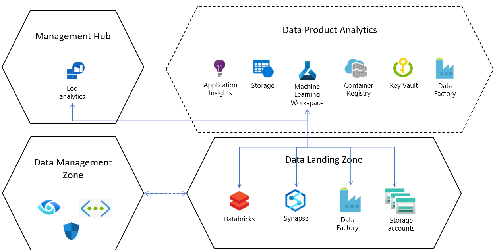

# Azure Machine Learning as a data product for cloud-scale analytics

Azure Machine Learning is an integrated platform for managing the machine learning lifecycle from beginning to end, including help with the creation, operation, and consumption of machine learning models and workflows. A few benefits of the service include:

- Capabilities support creators to increase their productivity by helping them to manage experiments, access data, track jobs, tune hyperparameters, and automate workflows.

- The model's capacity to be explained, reproduced, audited, and integrated with DevOps, plus a rich security control model, can support operators to meet governance and compliance requirements.

- Managed inference capabilities and robust integration with Azure compute and data services can help to simplify how the service is consumed.

Azure Machine Learning covers all aspects of the data science lifecycle. It covers datastore and dataset registration to model deployment. It can be used for any kind of machine learning, from classical machine learning to deep learning. It includes supervised and unsupervised learning. Whether you prefer to write Python, R code, or use zero-code or low-code options such as the designer, you can build, train, and track accurate machine learning and deep learning models in an Azure Machine Learning workspace.

Azure Machine Learning, the Azure platform, and Azure AI services can work together to manage the machine learning lifecycle. A machine learning practitioner can use Azure Synapse Analytics, Azure SQL Database, or Microsoft Power BI to start analyzing data and transition to Azure Machine Learning for prototyping, managing experimentation, and operationalization. In Azure landing zones, Azure Machine Learning can be considered a [data product](../architectures/data-landing-zone-data-products.md).

## Azure Machine Learning in cloud-scale analytics

A Cloud Adoption Framework (CAF) landing zone foundation, cloud-scale analytics data landing zones, and the configuration of Azure Machine Learning set up machine learning professionals with a preconfigured environment to which they can repeatedly deploy new machine learning workloads or migrate existing workloads. These capabilities can help machine learning professionals to gain more agility and value for their time.

The following design principles can guide the implementation of Azure Machine Learning Azure landing zones:

- **Accelerated data access:** Preconfigure landing zone storage components as data stores in the Azure Machine Learning workspace.

- **Enabled collaboration:** Organize workspaces by project and centralize access management for landing zone resources to support data engineering, data science, and machine learning professionals to work together.

- **Secure implementation:** As a default for each deployment, follow best practices and use network isolation, identity, and access management to secure data assets.

- **Self-service:** Machine learning professionals can gain more agility and organization by exploring options to deploy new project resources.

- **Separation of concerns between data management and data consumption:** Identity passthrough is the default authentication type for Azure Machine Learning and storage.

- **Faster data application (source-aligned):** Azure Data Factory, Azure Synapse Analytics, and Databricks landing zones can be preconfigured to link to Azure Machine Learning.

- **Observability:** Central logging and reference configurations can help to monitor the environment.

## Implementation overview

> [!NOTE]
> This section recommends configurations specific to cloud-scale analytics. It complements Azure Machine Learning documentation and Cloud Adoption Framework best practices.

### Workspace organization and setup

You can deploy the number of machine learning workspaces that your workloads require and for every landing zone that you deploy. The following recommendations can help your setup:

- Deploy at least one machine learning workspace per project.

- Depending on your machine learning project's lifecycle, deploy one development (dev) workspace to prototype use cases and explore data early on. For work that requires continuous experimentation, testing, and deployment, deploy a staging and production workspace.

- When multiple environments are needed for dev, staging, and production workspaces in a data landing zone, we recommend avoiding data duplication by having each environment land in the same production data landing zone.

- See [Organize and set up Azure Machine Learning environments](../../../ready/azure-best-practices/ai-machine-learning-resource-organization.md) to learn more about how to organize and set up Azure Machine Learning resources.

For each default resource configuration in an data landing zone, an Azure Machine Learning service is deployed in a dedicated resource group with the following configurations and dependent resources:

- Azure Key Vault
- Application Insights
- Azure Container Registry
- Use Azure Machine Learning to connect to an Azure Storage account and Microsoft Entra identity-based authentication to help users connect to the account.
- Diagnostic logging is set up for each workspace and configured to a central Log Analytics resource in enterprise-scale; this can help Azure Machine Learning job health and resource statuses to be analyzed centrally within and across landing zones.
- See [What is an Azure Machine Learning workspace?](/azure/machine-learning/concept-workspace) to learn more about Azure Machine Learning resources and dependencies.

### Integration with data landing zone core services

The data landing zone comes with a default set of services that are deployed in the [platform services layer](../architectures/data-landing-zone.md#platform-services). These core services can be configured when Azure Machine Learning is deployed in data landing zone.

- Connect Azure Synapse Analytics or Databricks workspaces as linked services to integrate data and process big data.

- By default, data lake services are provisioned in the data landing zone, and Azure Machine Learning product deployments come with connections (data stores) that are preconfigured to these storage accounts.

### Network connectivity

Networking for implementing Azure Machine Learning in Azure landing zones is set up with [security best practices for Azure Machine Learning](/azure/machine-learning/concept-enterprise-security) and CAF [networking best practices](/azure/security/fundamentals/network-best-practices?bc=/azure/cloud-adoption-framework/_bread/toc.json&toc=/azure/cloud-adoption-framework/toc.json). These best practices include the following configurations:

- Azure Machine Learning and dependent resources are configured to use Private Link endpoints.
- Managed compute resources are deployed only with private IP addresses.
- Network connectivity to the Azure Machine Learning public base image repository and partner services like Azure Artifacts can be configured at a network level.

### Identity and access management

Consider the following recommendations for managing user identities and access with Azure Azure Machine Learning:

- Data stores in Azure Machine Learning can be configured to use credential- or identity-based authentication. When you use [access control and data lake configurations in Azure Data Lake Storage Gen2](./data-lake-access.md?branch=scenario-data-management), configure data stores to use identity-based authentication; this allows Azure Machine Learning to optimize user access permissions for storage.

- Use Microsoft Entra groups to manage user permissions for storage and machine learning resources.

- Azure Machine Learning can use [user-assigned managed identities for access control](/azure/machine-learning/how-to-use-managed-identities?tabs=python) and limit the range of access to Azure Container Registry, Key Vault, Azure Storage, and Application Insights.

- Create user-assigned managed identities to managed compute clusters created in Azure Machine Learning.

### Provision infrastructure through self-service

Self-service can be enabled and governed with [policies for Azure Machine Learning](/azure/machine-learning/how-to-integrate-azure-policy). The following table lists a set of default policies when you deploy Azure Machine Learning. For more information, see [Azure Policy built-in policy definitions for Azure Machine Learning](/azure/machine-learning/policy-reference).

| Policy | Type | Reference |
| ------ | ------ | ----- |
| Azure Machine Learning workspaces should use Azure Private Link. | Built-in | [View in the Azure portal](https://portal.azure.com/#blade/Microsoft_Azure_Policy/PolicyDetailBlade/definitionId/%2Fproviders%2FMicrosoft.Authorization%2FpolicyDefinitions%2F40cec1dd-a100-4920-b15b-3024fe8901ab) |
| Azure Machine Learning workspaces should use user-assigned managed identities. | Built-in | [View in the Azure portal](https://portal.azure.com/#blade/Microsoft_Azure_Policy/PolicyDetailBlade/definitionId/%2Fproviders%2FMicrosoft.Authorization%2FpolicyDefinitions%2F5f0c7d88-c7de-45b8-ac49-db49e72eaa78) |
| [Preview]: Configure allowed registries for specified Azure Machine Learning computes. | Built-in | [View in the Azure portal](https://portal.azure.com/#blade/Microsoft_Azure_Policy/PolicyDetailBlade/definitionId/%2Fproviders%2FMicrosoft.Authorization%2FpolicyDefinitions%2F5853517a-63de-11ea-bc55-0242ac130003) |
| Configure Azure Machine Learning workspaces with private endpoints. | Built-in | [View in the Azure portal](https://portal.azure.com/#blade/Microsoft_Azure_Policy/PolicyDetailBlade/definitionId/%2Fproviders%2FMicrosoft.Authorization%2FpolicyDefinitions%2F7838fd83-5cbb-4b5d-888c-bfa240972597) |
| Configure machine learning computes to disable local authentication methods. | Built-in | [View in the Azure portal](https://portal.azure.com/#blade/Microsoft_Azure_Policy/PolicyDetailBlade/definitionId/%2Fproviders%2FMicrosoft.Authorization%2FpolicyDefinitions%2Fa6f9a2d0-cff7-4855-83ad-4cd750666512) |
| Append-machinelearningcompute-setupscriptscreationscript | Custom (CAF landing zones) | [View on GitHub](https://github.com/Azure/data-management-zone/blob/main/infra/Policies/PolicyDefinitions/MachineLearning/params.policyDefinition.Append-MachineLearningCompute-SetupScriptsCreationScript.json)   |
| Deny-machinelearning-hbiworkspace | Custom (CAF landing zones) | [View on GitHub](https://github.com/Azure/data-management-zone/blob/main/infra/Policies/PolicyDefinitions/MachineLearning/params.policyDefinition.Deny-MachineLearning-HbiWorkspace.json)   |
| Deny-machinelearning-publicaccesswhenbehindvnet | Custom (CAF landing zones) | [View on GitHub](https://github.com/Azure/data-management-zone/blob/main/infra/Policies/PolicyDefinitions/MachineLearning/params.policyDefinition.Deny-MachineLearning-PublicAccessWhenBehindVnet.json)   |
| Deny-machinelearning-AKS | Custom (CAF landing zones) | [View on GitHub](https://github.com/Azure/data-management-zone/blob/main/infra/Policies/PolicyDefinitions/MachineLearning/params.policyDefinition.Deny-MachineLearningAks.json)   |
| Deny-machinelearningcompute-subnetid | Custom (CAF landing zones) | [View on GitHub](https://github.com/Azure/data-management-zone/blob/main/infra/Policies/PolicyDefinitions/MachineLearning/params.policyDefinition.Deny-MachineLearningCompute-SubnetId.json)   |
| Deny-machinelearningcompute-vmsize | Custom (CAF landing zones) | [View on GitHub](https://github.com/Azure/data-management-zone/blob/main/infra/Policies/PolicyDefinitions/MachineLearning/params.policyDefinition.Deny-MachineLearningCompute-VmSize.json)   |
| Deny-machinelearningcomputecluster-remoteloginportpublicaccess | Custom (CAF landing zones) | [View on GitHub](https://github.com/Azure/data-management-zone/blob/main/infra/Policies/PolicyDefinitions/MachineLearning/params.policyDefinition.Deny-MachineLearningComputeCluster-RemoteLoginPortPublicAccess.json)   |
| Deny-machinelearningcomputecluster-scale | Custom (CAF landing zones) | [View on GitHub](https://github.com/Azure/data-management-zone/blob/main/infra/Policies/PolicyDefinitions/MachineLearning/params.policyDefinition.Deny-MachineLearningComputeCluster-Scale.json)   |

## Recommendations for managing your environment

Cloud-scale analytics data landing zones outline reference implementation for repeatable deployments, which can help you to set up manageable and governable environments. Consider the following recommendations for using Azure Machine Learning to manage your environment:

- Use Microsoft Entra groups to manage access to machine learning resources.

- Publish a central monitoring dashboard to monitor pipeline health, compute utilization, and quota management for machine learning.

- If you traditionally use built-in Azure policies and need to meet additional compliance requirements, build custom Azure policies to enhance governance and self-service.

- To track research and development costs, deploy one machine learning workspace in the landing zone as a shared resource during the early stages of exploring your use case.

> [!IMPORTANT]
> Use Azure Machine Learning clusters for production-grade model training, and Azure Kubernetes Service (AKS) for production-grade deployments.

> [!TIP]
> Use Azure Machine Learning for data science projects. It covers the end-to-end workflow with subservices and features, and allows to the process to be fully automated.

## Next steps

Use the [Data Product Analytics](https://github.com/Azure/data-product-analytics) template and guidance to deploy Azure Machine Learning, and reference [Azure Machine Learning documentation and tutorials](/azure/machine-learning/) to get started with building your solutions.

Continue to the following four Cloud Adoption Framework articles to learn more about Azure Machine Learning deployment and management best practices for enterprises:

- [Organize and set up Azure Machine Learning environments](../../../ready/azure-best-practices/ai-machine-learning-resource-organization.md): When planning an Azure Machine Learning deployment, how do team structures, environments, or the geography of resources affect how workspaces are set up?

- [Azure Machine Learning best practices for enterprise security](../../../ready/azure-best-practices/ai-machine-learning-enterprise-security.md): Learn how to secure your environment and resources with Azure Machine Learning.

- [Manage budgets, costs, and quota for Azure Machine Learning at organizational scale](../../../ready/azure-best-practices/optimize-ai-machine-learning-cost.md): Organizations face many management and optimization challenges when managing workload, team, and user compute costs incurred from Azure Machine Learning.

- [Machine learning DevOps guide](../../../ready/azure-best-practices/ai-machine-learning-mlops.md): Machine learning DevOps is an organizational change that relies on a combination of people, process, and technology to deliver machine learning solutions in a robust, scalable, reliable, and automated way. This guide summarizes best practices and information for enterprises to use Azure Machine Learning to adopt machine learning DevOps.
