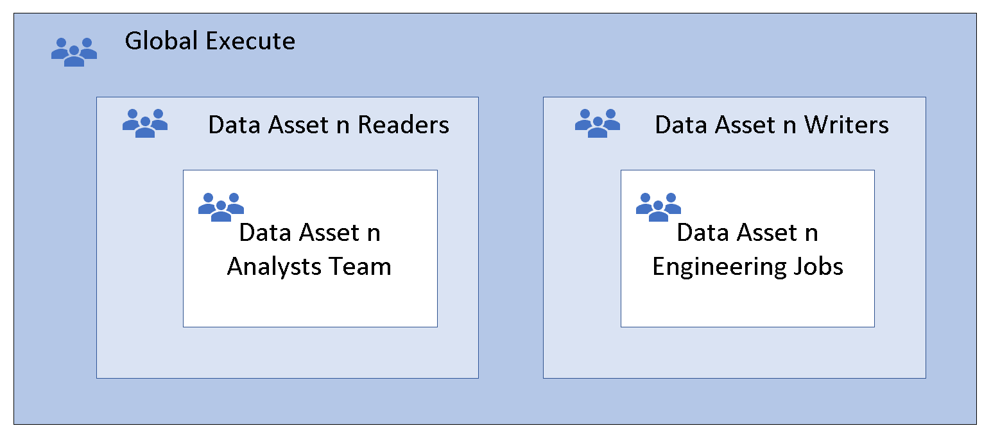
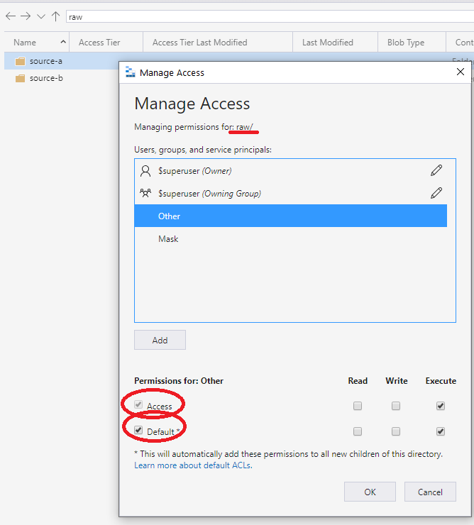

# Access control and data lake configurations in Azure Data Lake Storage Gen2

This article helps you assess and understand the access control mechanisms in Azure Data Lake Storage Gen2. These mechanisms include Azure role-based access control (RBAC) and access control lists (ACLs). You learn:

- How to evaluate access between Azure RBAC and ACLs
- How to configure access control using one or both of these mechanisms
- How to apply the access control mechanisms to data lake implementation patterns

You need a basic knowledge of storage containers, security groups, Azure RBAC, and ACLs. To frame the discussion, we reference a generic data lake structure of raw, enriched, and curated zones.

You can use this document with [Data access management](../security-provisioning.md).

## Use the built-in Azure RBAC roles

Azure Storage has two layers of access: service management and data. You can access subscriptions and storage accounts through the service management layer. Access containers, blobs, and other data resources through the data layer. For example, if you want a list of storage accounts from Azure, send a request to the management endpoint. If you want a list of file systems, folders, or files in a storage account, send a request to a service endpoint.

Roles can contain permissions for management or data layer access. The Reader role grants read-only access to management layer resources but not read access to data.

Roles such as Owner, Contributor, Reader, and Storage Account Contributor, permit a security principal to manage a storage account. But they don't provide access to the data in that account. Only roles explicitly defined for data access permit a security principal to access the data. These roles, except for Reader, get access to the storage keys to access data.

### Built-in management roles

Following are the built-in management roles.

- [Owner](/azure/role-based-access-control/built-in-roles#owner): Manage everything, including access to resources. This role provides key access.
- [Contributor](/azure/role-based-access-control/built-in-roles#contributor): Manage everything, except access to resources. This role provides key access.
- [Storage Account Contributor](/azure/role-based-access-control/built-in-roles#storage-account-contributor): Full management of storage accounts. This role provides key access.
- [Reader](/azure/role-based-access-control/built-in-roles#reader): Read and list resources. This role doesn't provide key access.

### Built-in data roles

Following are the built-in data roles.

- [Storage Blob Data Owner](/azure/role-based-access-control/built-in-roles#storage-blob-data-owner): Full access to Azure Storage blob containers and data, including setting ownership and managing POSIX access control.
- [Storage Blob Data Contributor](/azure/role-based-access-control/built-in-roles#storage-blob-data-contributor): Read, write, and delete Azure Storage containers and blobs.
- [Storage Blob Data Reader](/azure/role-based-access-control/built-in-roles#storage-blob-data-reader): Read and list Azure Storage containers and blobs.

The Storage Blob Data Owner is a super-user role that's granted full access to all mutating operations. These operations include setting the owner of a directory or file and ACLs for directories and files for which they aren't the owner. Super-user access is the only authorized manner to change the owner of a resource.

> [!NOTE]
> Azure RBAC assignments can take up to five minutes to propagate and take effect.

## How access is evaluated

During security principal-based authorization, the system evaluates permissions in the following order. For more information, see the following diagram.

- Azure RBAC is evaluated first and takes priority over any ACL assignments.
- If the operation is fully authorized based on RBAC, ACLs aren't evaluated at all.
- If the operation isn't fully authorized, ACLs are evaluated.

For more information, see [How permissions are evaluated](/azure/storage/blobs/data-lake-storage-access-control-model#how-permissions-are-evaluated).

> [!NOTE]
> This permission model applies to Azure Data Lake Storage only. It doesn't apply to general purpose or blob storage without hierarchical namespace enabled.
> This description excludes shared key and SAS authentication methods. It also excludes scenarios in which the security principal is assigned the Storage Blob Data Owner built-in role, which provides super-user access.
> Set `allowSharedKeyAccess` to false so that access is audited by identity.

:::image type="content" source="../images/how-access-evaluated.png" alt-text="Diagram of a flow chart that shows how access is evaluated." lightbox="../images/how-access-evaluated.png":::

For more information about what ACL-based permissions are required for a given operation, see [Access control lists in Azure Data Lake Storage Gen2](/azure/storage/blobs/data-lake-storage-access-control#common-scenarios-related-to-permissions).

> [!NOTE]
>
> - Access control lists apply only to security principals in the same tenant, including guest users.
> - Any user with permissions to attach to a cluster can create Azure Databricks mount points. Configure the mount point using service principal credentials or the Microsoft Entra passthrough option. At the time of creation, permissions are not evaluated. Permissions are evaluated when an operation uses the mount point. Any user who can attach to a cluster can attempt to use the mount point.
> - When a user creates a table definition in Azure Databricks or Azure Synapse Analytics, they need to have read access to the underlying data.

## Configure access to Azure Data Lake Storage

Set up access control in Azure Data Lake Storage using Azure RBAC, ACLs, or a combination of both.

### Configure access using Azure RBAC only

If container-level access control suffices, Azure RBAC assignments offer a simple management approach to securing data. It's recommended that you use access control lists for a large number of restricted data assets or where you require granular access control.

### Configure access using ACLs only

The following are access control lists configuration recommendations for cloud-scale analytics.

Assign access control entries to a security group rather than an individual user or service principal. For more information, see [Use security groups versus individual users](/azure/storage/blobs/data-lake-storage-best-practices#use-security-groups-versus-individual-users).

When you add or remove users from the group, you aren't required to make updates to Data Lake Storage. Also, using groups reduces the chance of exceeding the 32 access control entries per file or folder ACL. After the four default entries, there are only 28 remaining entries for permission assignments.

Even when you use groups, you could have many access control entries at top levels of the directory tree. This situation happens when granular permissions for different groups are required.

:::image type="content" source="../images/flat-groups-issue.png" alt-text="Diagram that shows several security groups requiring access to three data products." lightbox="../images/flat-groups-issue.png":::

### Configure access using both Azure RBAC and access control lists

The Storage Blob Data Contributor and Storage Blob Data Reader permissions provide access to the data and not the storage account. You can grant access at the storage account level or container level. If Storage Blob Data Contributor is assigned, ACLs can't be used to manage access. Where Storage Blob Data Reader is assigned, you can grant elevated write permissions using ACLs. For more information, see [How access is evaluated](#how-access-is-evaluated).

This approach favors scenarios where most users need read access but only a few users need write access. The data lake zones could be different storage accounts and data assets could be different containers. The data lake zones could be represented by containers and data assets represented by folders.

## Nested access control list group approaches

There are two approaches for nested ACL groups.

### Option 1: The parent execute group

Before you create files and folders, begin with a parent group. Assign that group run permissions to both default and access ACLs at the container level. Then add the groups that require data access to the parent group.

> [!WARNING]
> We would recommend against this pattern where you have recursive deletes and instead use [Option 2: The access control list other entry](#option-2-the-access-control-list-other-entry).

This technique is known as nesting groups. The member group inherits the permissions of the parent group, which provides global run permissions to all member groups. The member group doesn't need run permissions because these permissions are inherited. More nesting might provide greater flexibility and agility. Add security groups that represent teams or automated jobs to the data access reader and writer groups.



### Option 2: The access control list other entry

The recommended approach is to use the ACL other entry set at the container or root. Specify defaults and access ACLs as shown in the following screen. This approach ensures that every part of the path from root to lowest level has run permissions.



This run permission propagates downward to any added child folders. The permission propagates to the depth where the intended access group needs permissions to read and run. The level is in the lowest part of the chain, as shown in the following screen. This approach grants group access to read the data. The approach works similarly for write access.


## Recommended data lake zones security

The following usages are the recommended security patterns for each of the data lake zones:

- Raw should allow access to data only by using security principal names (SPNs).
- Enriched should allow access to data only by using security principal names (SPNs).
- Curated should allow access with both security principal names (SPNs) and user principal names (UPNs).

<a name='example-scenario-for-using-azure-ad-security-groups'></a>

### Example scenario for using Microsoft Entra security groups

There are many different ways to set up groups. For example, imagine that you have a directory named `/LogData` that holds log data that's generated by your server. Azure Data Factory ingests data into that folder. Specific users from the service engineering team upload logs and manage other users of this folder. The Azure Databricks analytics and data science workspace clusters could analyze logs from that folder.

To enable these activities, create a `LogsWriter` group and a `LogsReader` group. Assign the following permissions:

- Add the `LogsWriter` group to the ACL of the `/LogData` directory with `rwx` permissions.
- Add the `LogsReader` group to the ACL of the `/LogData` directory with `r-x` permissions.
- Add the service principal object or managed service identity (MSI) for Data Factory to the `LogsWriters` group.
- Add users in the service engineering team to the `LogsWriter` group.
- Azure Databricks is configured for Microsoft Entra passthrough to the Azure Data Lake store.

If a user in the service engineering team transfers to a different team, just remove that user from the `LogsWriter` group.

If you didn't add that user to a group, but instead, added a dedicated ACL entry for that user, you'll need to remove that ACL entry from the `/LogData` directory. You'll also need to remove the entry from all subdirectories and files in the entire directory hierarchy of the `/LogData` directory.

## Azure Synapse Analytics data access control

To deploy an Azure Synapse workspace, it requires an Azure Data Lake Storage Gen2 account. Azure Synapse Analytics uses the primary storage account for several integration scenarios and stores data in a container. The container includes Apache Spark tables and application logs under a folder called `/synapse/{workspaceName}`. The workspace also uses a container for managing libraries that you install.

During the workspace deployment through the [Azure portal](/azure/azure-portal/), provide an existing storage account or create a new one. The provided storage account is the primary storage account for the workspace. The deployment process grants the workspace identity access to the specified Data Lake Storage Gen2 account, using the **Storage Blob Data Contributor** role.

If you deploy the workspace outside of the Azure portal, manually add Azure Synapse Analytics workspace identity to the **Storage Blob Data Contributor** role. It's recommended you assign the role **Storage Blob Data Contributor** on the container level to follow the least privilege principle.

When you run pipelines, workflows, and notebooks through jobs, they use the workspace identity permission context. If any of the jobs read or write to the workspace primary storage, the workspace identity uses the read/write permissions granted through the **Storage Blog Data Contributor**.

When users sign in to the workspace to run scripts or for development, the user's context permissions allow read/write access on the primary storage.

### Azure Synapse Analytics fine-grained data access control using access control lists

When you set up data lake access control, some organizations require granular level access. They might have sensitive data that can't be seen by some groups in the organization. Azure RBAC allows read or write at the storage account and container level only. With ACLs, you can set up fine-grained access control at the folder and file level to allow read/write on a subset of data for specific groups.

#### Considerations when using Spark tables

When you use Apache Spark tables in Spark pool, it creates a warehouse folder. The folder is in the root of the container in the workspace primary storage:

```output
synapse/workspaces/{workspaceName}/warehouse
```

If you plan to create Apache Spark tables in Azure Synapse Spark pool, grant write permission on the **warehouse** folder for the group running the command that creates the Spark table. If the command runs through a triggered job in a pipeline, grant write permission to the workspace MSI.

This example creates a Spark table:

```python
df.write.saveAsTable("table01")
```

For more information, see [How to set up access control for your synapse workspace](/azure/synapse-analytics/security/how-to-set-up-access-control).

### Summary of Azure Data Lake access

No single approach to managing data lake access suits everyone. A major benefit of a data lake is to provide friction-free access to data. In practice, different organizations want different levels of governance and control over their data. Some organizations have a centralized team to manage access and provision groups under rigorous internal controls. Other organizations are more agile and have decentralized control. Choose the approach that meets your level of governance. Your choice shouldn't result in undue delays or friction in gaining access to data.

## Next steps

- [Use Azure Databricks within cloud-scale analytics in Azure](./azure-databricks-implementation.md)
