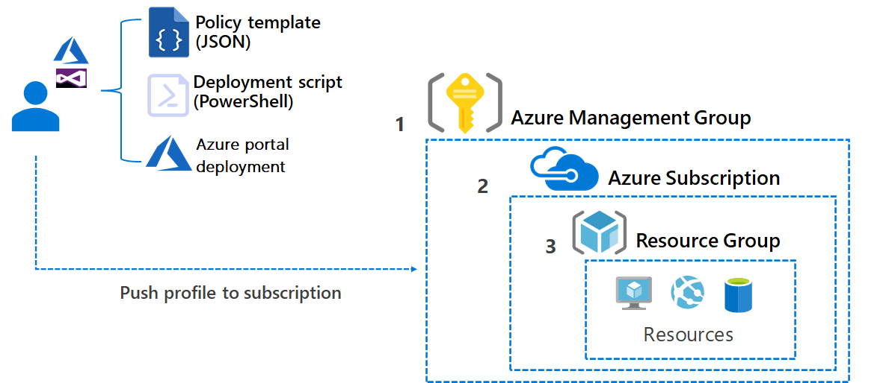

# Policies in cloud-scale analytics

Before considering a deployment, it's important for your organization to put guardrails in place. By using [Azure policies](/azure/governance/policy/overview), you can implement governance for resource consistency, regulatory compliance, security, cost, and management.

## Background

A core principle of cloud-scale analytics is to make it easy to create, read, update, and delete resources as needed. However, while giving unrestricted resource access to developers can make them agile, it can also lead to unintended cost consequences. The solution to this problem is resource access governance. This governance is the ongoing process of managing, monitoring, and auditing the use of Azure resources to meet the goals and requirements of your organization.

The [Start with Cloud Adoption Framework enterprise-scale landing zones](../../ready/enterprise-scale/index.md) already uses this concept. Cloud-scale analytics adds [Custom Azure policies](#azure-policies-for-cloud-scale-analytics) to build on these standards. The standards are then applied to our data management landing zones and data landing zones.

Azure Policy is important when ensuring security and compliance within cloud-scale analytics. It helps to enforce standards and to assess compliance at scale. Policies can be used to evaluate resources in Azure and compare them to the wanted properties. Several policies, or business rules, can be grouped into an initiative. Individual policies or initiatives can be assigned to different scopes in Azure. These scopes might be management groups, subscriptions, resource groups, or individual resources. The assignment applies to all resources within the scope, and subscopes can be excluded with exceptions if necessary.

## Design considerations

Azure policies in cloud-scale analytics were developed with the following design considerations in mind:

- Use Azure policies to implement governance and enforce rules for resource consistency, regulatory compliance, security, cost, and management.
- Use available prebuilt policies to save time.
- Assign policies to the highest level possible in the management group tree to simplify policy management.
- Limit Azure Policy assignments made at the root management group scope to avoid managing through exclusions at inherited scopes.
- Only use policy exceptions if necessary, and they require approval.

## Azure policies for cloud-scale analytics

[Implementing custom policies](/azure/governance/policy/tutorials/create-and-manage) allows you to do more with Azure Policy. Cloud-scale analytics comes with a set of precreated policies to help you implement any required guardrails in your environment.

Azure Policy should be the core instrument of the Azure (Data) Platform team to ensure compliance of resources within the Data management landing zone, data landing zones, and other landing zones within the organization's tenant. This platform feature should be used to introduce guardrails and enforce adherence to the overall approved service configuration within the respective management group scope. The platform teams can use Azure Policy to, for example, enforce private endpoints for any storage accounts that are being hosted within the data platform environment or enforce TLS 1.2 encryption in transit for any connections being made to the storage accounts. When done right, this policy prohibits any data application teams from hosting services in an incompliant state within the respective tenant scope.

The responsible IT teams should use this platform feature to address their security and compliance concerns and open up for a self-service approach within (Data) Landing Zones.

Cloud-scale analytics contains custom policies related to **resource and cost management, authentication, encryption, network isolation, logging, resilience, and more**.

- [All services](#all-services)
- [Storage](#storage)
- [Key Vault](#key-vault)
- [Azure Data Factory](#azure-data-factory)
- [Azure Synapse Analytics](#azure-synapse-analytics)
- [Azure Databricks](#azure-databricks)
- [Azure IoT Hub](#azure-iot-hub)
- [Azure Event Hubs](#azure-event-hubs)
- [Azure Stream Analytics](#azure-stream-analytics)
- [Azure Data Explorer](#azure-data-explorer)
- [Azure Cosmos DB](#azure-cosmos-db)
- [Azure Container Registry](#azure-container-registry)
- [Azure Cognitive Services](#azure-cognitive-services)
- [Azure Machine Learning](#azure-machine-learning)
- [Azure SQL Managed Instance](#azure-sql-managed-instance)
- [Azure SQL Database](#azure-sql-database)
- [Azure Database for MariaDB](#azure-database-for-mariadb)
- [Azure Database for MySQL](#azure-database-for-mysql)
- [Azure Database for PostgreSQL](#azure-database-for-postgresql)
- [Azure AI Search](#azure-ai-search)
- [Azure DNS](#azure-dns)
- [Network security group](#network-security-group)
- [Batch](#batch)
- [Azure Cache for Redis](#azure-cache-for-redis)
- [Container instances](#container-instances)
- [Azure Firewall](#azure-firewall)
- [HDInsight](#hdinsight)
- [Power BI](#power-bi)

> [!NOTE]
> The policies should be viewed as guidance-only and can be applied depending on business requirements. Policies should always be applied to the highest level possible and in most cases this will be a [management group](/azure/governance/management-groups/overview).

## All services

|Policy name  |Policy area  |Description  |
|---------|---------|---------|
| Deny-PublicIp|Network Isolation|Restrict deployment of public IPs.|
|Deny-PrivateEndpoint-PrivateLinkServiceConnections|Network Isolation| Deny private endpoints to resources outside of the Microsoft Entra tenant and subscription.|
|Deploy-DNSZoneGroup-{Service}-PrivateEndpoint|Network Isolation|Deploys the configurations of a Private DNS Zone Group by a parameter for service's private endpoint. Used to enforce the configuration to a single Private DNS Zone.|
|DiagnosticSettings-{Service}-LogAnalytics|Logging|Send diagnostic settings for Azure Cosmos DB to log analytics workspace.|

## Storage

|Policy name  |Policy area  |Description  |
|---------|---------|---------|
|Append-Storage-Encryption|Encryption|Enforce encryption for storage accounts.|
|Deny-Storage-AllowBlobPublicAccess|Network Isolation|Enforces no public access to all blobs or containers in the storage account.|
|Deny-Storage-ContainerDeleteRetentionPolicy|Resilience|Enforce container delete retention policies larger than seven days for storage account.|
|Deny-Storage-CorsRules|Network Isolation|Deny cors rules for storage account.|
|Deny-Storage-InfrastructureEncryption|Encryption|Enforce infrastructure (double) encryption for storage accounts.|
|Deny-Storage-MinimumTlsVersion|Encryption|Enforces minimum TLS version 1.2 for storage account.|
|Deny-Storage-NetworkAclsBypass|Network Isolation|Enforces network bypass to none for storage account.|
|Deny-Storage-NetworkAclsIpRules|Network Isolation|Enforces network ip rules for storage account.|
|Deny-Storage-NetworkAclsVirtualNetworkRules|Network Isolation|Denies virtual network rules for storage account.|
|Deny-Storage-Sku|Resource Management|Enforces storage account SKUs.|
|Deny-Storage-SupportsHttpsTrafficOnly|Encryption|Enforces https traffic for storage account.|
|Deploy-Storage-BlobServices|Resource Management|Deploy blob services default settings for storage account.|
|Deny-Storage-RoutingPreference|Network Isolation||
|Deny-Storage-Kind|Resource Management||
|Deny-Storage-NetworkAclsDefaultAction|Network Isolation||

## Key Vault

|Policy name  |Policy area  |Description  |
|---------|---------|---------|
|Audit-KeyVault-PrivateEndpointId|Network Isolation|Audit public endpoints that are created in other subscriptions for key vault.|
|Deny-KeyVault-NetworkAclsBypass|Network Isolation|Enforces bypass network level rules for key vault.|
|Deny-KeyVault-NetworkAclsDefaultAction|Network Isolation|Enforces default network acl level action for key vault.|
|Deny-KeyVault-NetworkAclsIpRules|Network Isolation|Enforces network ip rules for key vault.|
|Deny-KeyVault-NetworkAclsVirtualNetworkRules|Network Isolation|Denies virtual network rules for key vault.|
|Deny-KeyVault-PurgeProtection|Resilience|Enforces purge protection for key vault.|
|Deny-KeyVault-SoftDelete|Resilience|Enforces soft delete with minimum number of retention days for key vault.|
|Deny-KeyVault-TenantId|Resource Management|Enforce tenant ID for key vault.|

## Azure Data Factory

|Policy name  |Policy area  |Description  |
|---------|---------|---------|
|Append-DataFactory-IdentityType|Authentication|Enforces use of system assigned identity for data factory.|
|Deny-DataFactory-ApiVersion|Resource Management|Denies old API version for data factory V1.|
|Deny-DataFactory-IntegrationRuntimeManagedVirtualNetwork|Network Isolation|Denies Integration Runtimes that aren't connected to the Managed Virtual Network.|
|Deny-DataFactory-LinkedServicesConnectionStringType|Authentication|Denies non Key Vault stored secrets for linked services.|
|Deny-DataFactory-ManagedPrivateEndpoints|Network Isolation|Denies external private endpoints for linked services.|
|Deny-DataFactory-PublicNetworkAccess|Network Isolation|Denies public access to data factory.|
|Deploy-DataFactory-ManagedVirtualNetwork|Network Isolation|Deploy managed virtual network for data factory.|
|Deploy-SelfHostedIntegrationRuntime-Sharing|Resilience|Share self-hosted integration runtime hosted in the Data Hub with Data Factories in the Data Nodes.|

## Azure Synapse Analytics

|Policy name  |Policy area  |Description  |
|---------|---------|---------|
|Append-Synapse-LinkedAccessCheckOnTargetResource|Network Isolation|Enforce [LinkedAccessCheckOnTargetResource](/dotnet/api/microsoft.azure.management.synapse.models.managedvirtualnetworksettings.linkedaccesscheckontargetresource) in managed virtual network settings when Synapse Workspace is created.|
|Append-Synapse-Purview|Network Isolation|Enforce connection between central purview instance and Synapse Workspace.|
|Append-SynapseSpark-ComputeIsolation|Resource Management|When a Synapse Spark Pool is created without compute isolation then this adds it.|
|Append-SynapseSpark-DefaultSparkLogFolder|Logging|When a Synapse Spark Pool is created without logging then this will add it.|
|Append-SynapseSpark-SessionLevelPackages|Resource Management|When a Synapse Spark Pool is created without session level packages then this adds it.|
|Audit-Synapse-PrivateEndpointId|Network Isolation|Audit public endpoints that are created in other subscriptions for Synapse.|
|Deny-Synapse-AllowedAadTenantIdsForLinking|Network Isolation||
|Deny-Synapse-Firewall|Network Isolation|Set up firewall of Synapse.|
|Deny-Synapse-ManagedVirtualNetwork|Network Isolation|When a Synapse Workspace is created without managed virtual network then this adds it.|
|Deny-Synapse-PreventDataExfiltration|Network Isolation|Enforced prevention of data exfiltration for Synapse managed virtual network.|
|Deny-SynapsePrivateLinkHub|Network Isolation|Denies Synapse Private Link Hub.|
|Deny-SynapseSpark-AutoPause|Resource Management|Enforces auto pause for Synapse Spark Pools.|
|Deny-SynapseSpark-AutoScale|Resource Management|Enforces auto scale for Synapse Spark Pools.|
|Deny-SynapseSql-Sku|Resource Management|Denies certain Synapse SQL Pool SKUs.|
|Deploy-SynapseSql-AuditingSettings|Logging|Send auditing logs for Synapse SQL pools to log analytics.|
|Deploy-SynapseSql-MetadataSynch|Resource Management|Set up metadata sync for Synapse SQL pools.|
|Deploy-SynapseSql-SecurityAlertPolicies|Logging|Deploy Synapse SQL pool security alert policy.|
|Deploy-SynapseSql-TransparentDataEncryption|Encryption|Deploy Synapse SQL transparent data encryption.|
|Deploy-SynapseSql-VulnerabilityAssessment|Logging|Deploy Synapse SQL pool vulnerability assessments.|

## Azure Databricks

|Policy name  |Policy area  |Description  |
|---------|---------|---------|
|Append-Databricks-PublicIp|Network Isolation|Enforces no public access on Databricks workspaces.|
|Deny-Databricks-Sku|Resource Management|Deny nonpremium Databricks SKU.|
|Deny-Databricks-VirtualNetwork|Network Isolation|Deny nonvirtual network deployment for databricks.|

Other policies that are applied in the Databricks workspace through cluster policies:

|Cluster policy name |Policy area  |
|---------|---------|
|Restrict Spark version|Resource Management|
|Restrict cluster size and VM types|Resource Management|
|Enforce Cost Tagging|Resource Management|
|Enforce Autoscale|Resource Management|
|Enforce Auto-Pause|Resource Management|
|Restrict DBUs per hour|Resource Management|
|Deny public SSH|Authentication|
|Cluster credential passthrough enabled|Authentication|
|Enable process isolation|Network isolation|
|Enforce Spark monitoring|Logging|
|Enforce cluster logs|Logging|
|Allow only SQL, Python|Resource management|
|Deny additional setup scripts|Resource management|

## Azure IoT Hub

|Policy name  |Policy area  |Description  |
|---------|---------|---------|
|Append-IotHub-MinimalTlsVersion|Encryption|Enforces minimal TLS version for iot hub.|
|Audit-IotHub-PrivateEndpointId|Network Isolation|Audit public endpoints that are created in other subscriptions for iot hubs.|
|Deny-IotHub-PublicNetworkAccess|Network Isolation|Denies public network access for iot hub.|
|Deny-IotHub-Sku|Resource Management|Enforces iot hub SKUs.|
|Deploy-IotHub-IoTSecuritySolutions|Security|Deploy Microsoft Defender for IoT for IoT Hubs.|

## Azure Event Hubs

|Policy name  |Policy area  |Description  |
|---------|---------|---------|
|Deny-EventHub-Ipfilterrules|Network Isolation|Deny adding ip filter rules for Azure Event Hubs.|
|Deny-EventHub-MaximumThroughputUnits|Network Isolation|Denies public network access for my SQL servers.|
|Deny-EventHub-NetworkRuleSet|Network Isolation|Enforces default virtual network rules for Azure Event Hubs.|
|Deny-EventHub-Sku|Resource Management|Denies certain AKUs for Azure Event Hubs.|
|Deny-EventHub-Virtualnetworkrules|Network Isolation|Deny adding virtual network rules for Azure Event Hubs.|

## Azure Stream Analytics

|Policy name  |Policy area  |Description  |
|---------|---------|---------|
|Append-StreamAnalytics-IdentityType|Authentication|Enforces use of system assigned identity for stream analytics.|
|Deny-StreamAnalytics-ClusterId|Resource Management|Enforces use of Stream Analytics cluster.|
|Deny-StreamAnalytics-StreamingUnits|Resource Management|Enforces number of stream analytics streaming units.|

## Azure Data Explorer

|Policy name  |Policy area  |Description  |
|---------|---------|---------|
|Deny-DataExplorer-DiskEncryption|Encryption|Enforces use of disk encryption for data explorer.|
|Deny-DataExplorer-DoubleEncryption|Encryption|Enforces use of double encryption for data explorer.|
|Deny-DataExplorer-Identity|Authentication|Enforces use of system or user assigned identity for data explorer.|
|Deny-DataExplorer-Sku|Resource Management|Enforces data explorer SKUs.|
|Deny-DataExplorer-TrustedExternalTenants|Network Isolation|Denies external tenants for data explorer.|
|Deny-DataExplorer-VirtualNetworkConfiguration|Network Isolation|Enforces virtual network ingestion for data explorer.|

## Azure Cosmos DB

|Policy name  |Policy area  |Description  |
|---------|---------|---------|
|Append-Cosmos-DenyCosmosKeyBasedMetadataWriteAccess|Authentication|Deny key based metadata write access for Azure Cosmos DB accounts.|
|Append-Cosmos-PublicNetworkAccess|Network Isolation|Enforces no public network access for Azure Cosmos DB accounts.|
|Audit-Cosmos-PrivateEndpointId|Network Isolation|Audit public endpoints that are created in other subscriptions for Azure Cosmos DB.|
|Deny-Cosmos-Cors|Network Isolation|Denies CORS rules for Azure Cosmos DB accounts."|
|Deny-Cosmos-PublicNetworkAccess|Network Isolation|Denies public network access for Azure Cosmos DB accounts.|

## Azure Container Registry

|Policy name  |Policy area  |Description  |
|---------|---------|---------|
|Audit-ContainerRegistry-PrivateEndpointId|Network Isolation|Audit public endpoints that are created in other subscriptions for cognitive services.|
|Deny-ContainerRegistry-PublicNetworkAccess|Network Isolation|Denies public network access for container registry.|
|Deny-ContainerRegistry-Sku|Resource Management|Enforces premium Sku for container registry.|

## Azure Cognitive Services

|Policy name  |Policy area  |Description  |
|---------|---------|---------|
|Append-CognitiveServices-IdentityType|Authentication|Enforces use of system assigned identity for cognitive services.|
|Audit-CognitiveServices-PrivateEndpointId|Network Isolation|Audit public endpoints that are created in other subscriptions for cognitive services.|
|Deny-CognitiveServices-Encryption|Encryption|Enforces use of encryption for cognitive services.|
|Deny-CognitiveServices-PublicNetworkAccess|Network Isolation|Enforces no public network access for cognitive services.|
|Deny-CognitiveServices-Sku|Resource Management|Deny cognitive services free SKU.|
|Deny-CognitiveServices-UserOwnedStorage|Network Isolation|Enforces user owned storage for cognitive services.|

## Azure Machine Learning

|Policy name  |Policy area  |Description  |
|---------|---------|---------|
|Append-MachineLearning-PublicAccessWhenBehindVnet|Network Isolation|Deny public access behind virtual network for machine learning workspaces.|
|Audit-MachineLearning-PrivateEndpointId|Network Isolation|Audit public endpoints that are created in other subscriptions for machine learning.|
|Deny-MachineLearning-HbiWorkspace|Network Isolation|Enforce high business impact machine learning workspaces across the environment.|
|Deny-MachineLearningAks|Resource Management|Deny AKS creation (not attaching) in machine learning.|
|Deny-MachineLearningCompute-SubnetId|Network Isolation|Deny public IP for machine learning compute clusters and instances.|
|Deny-MachineLearningCompute-VmSize|Resource Management|Limit allowed vm sizes for machine learning compute clusters and instances.|
|Deny-MachineLearningComputeCluster-RemoteLoginPortPublicAccess|Network Isolation|Deny public access of clusters via SSH.|
|Deny-MachineLearningComputeCluster-Scale|Resource Management|Enforce scale settings for machine learning compute clusters.|

## Azure SQL Managed Instance

|Policy name  |Policy area  |Description  |
|---------|---------|---------|
|Append-SqlManagedInstance-MinimalTlsVersion|Encryption|Enforces minimal TLS version for SQL Managed Instance servers.|
|Deny-SqlManagedInstance-PublicDataEndpoint|Network Isolation|Denies public data endpoint for SQL Managed Instances.|
|Deny-SqlManagedInstance-Sku|Resource Management||
|Deny-SqlManagedInstance-SubnetId|Network Isolation|Enforces deployments to subnets of SQL Managed Instances.|
|Deploy-SqlManagedInstance-AzureAdOnlyAuthentications|Authentication|Enforces Microsoft Entra-only authentication for SQL Managed Instance.|
|Deploy-SqlManagedInstance-SecurityAlertPolicies|Logging|Deploy SQL Managed Instance security alert policies.|
|Deploy-SqlManagedInstance-VulnerabilityAssessment|Logging|Deploy SQL Managed Instance vulnerability assessments.|

## Azure SQL Database

|Policy name  |Policy area  |Description  |
|---------|---------|---------|
|Append-Sql-MinimalTlsVersion|Encryption|Enforces minimal TLS version for SQL servers.|
|Audit-Sql-PrivateEndpointId|Network Isolation|Audit public endpoints that are created in other subscriptions for Azure SQL.|
|Deny-Sql-PublicNetworkAccess|Network Isolation|Denies public network access for SQL servers.|
|Deny-Sql-StorageAccountType|Resilience|Enforces geo-redundant database backup.|
|Deploy-Sql-AuditingSettings|Logging|Deploy SQL auditing settings.|
|Deploy-Sql-AzureAdOnlyAuthentications|Authentication|Enforces Microsoft Entra-only authentication for SQL server.|
|Deploy-Sql-SecurityAlertPolicies|Logging|Deploy SQL security alert policies.|
|Deploy-Sql-TransparentDataEncryption|Encryption|Deploy SQL transparent data encryption.|
|Deploy-Sql-VulnerabilityAssessment|Logging|Deploy SQL vulnerability assessments.|
|Deploy-SqlDw-AuditingSettings|Logging|Deploy SQL DW auditing settings.|

## Azure Database for MariaDB

|Policy name  |Policy area  |Description  |
|---------|---------|---------|
|Append-MariaDb-MinimalTlsVersion|Encryption|Enforces minimal TLS version for MariaDB servers.|
|Audit-MariaDb-PrivateEndpointId|Network Isolation|Audit public endpoints that are created in other subscriptions for MariaDB.|
|Deny-MariaDb-PublicNetworkAccess|Network Isolation|Denies public network access for my MariaDB servers.|
|Deny-MariaDb-StorageProfile|Resilience|Enforces geo-redundant database backup with minimum retention time in days.|
|Deploy-MariaDb-SecurityAlertPolicies|Logging|Deploy SQL security alert policies for MariaDB|

## Azure Database for MySQL

|Policy name  |Policy area  |Description  |
|---------|---------|---------|
|Append-MySQL-MinimalTlsVersion|Encryption|Enforces minimal TLS version for MySQL servers.|
|Audit-MySql-PrivateEndpointId|Network Isolation|Audit public endpoints that are created in other subscriptions for MySQL.|
|Deny-MySQL-InfrastructureEncryption|Encryption|Enforces infrastructure encryption for MySQL servers.|
|Deny-MySQL-PublicNetworkAccess|Network Isolation|Denies public network access for MySQL servers.|
|Deny-MySql-StorageProfile|Resilience|Enforces geo-redundant database backup with minimum retention time in days.|
|Deploy-MySql-SecurityAlertPolicies|Logging|Deploy SQL security alert policies for MySQL.|

## Azure Database for PostgreSQL

|Policy name  |Policy area  |Description  |
|---------|---------|---------|
|Append-PostgreSQL-MinimalTlsVersion|Encryption|Enforces minimal TLS version for PostgreSQL servers.|
|Audit-PostgreSql-PrivateEndpointId|Network Isolation|Audit public endpoints that are created in other subscriptions for PostgreSQL.|
|Deny-PostgreSQL-InfrastructureEncryption|Encryption|Enforces infrastructure encryption for PostgreSQL servers.|
|Deny-PostgreSQL-PublicNetworkAccess|Network Isolation|Denies public network access for PostgreSQL servers.|
|Deny-PostgreSql-StorageProfile|Resilience|Enforces geo-redundant database backup with minimum retention time in days.|
|Deploy-PostgreSql-SecurityAlertPolicies|Logging|Deploy SQL security alert policies for PostgreSQL.|

## Azure AI Search

|Policy name  |Policy area  |Description  |
|---------|---------|---------|
|Append-Search-IdentityType|Authentication|Enforces use of system assigned identity for Azure AI Search.|
|Audit-Search-PrivateEndpointId|Network Isolation|Audit public endpoints that are created in other subscriptions for Azure AI Search.|
|Deny-Search-PublicNetworkAccess|Network Isolation|Denies public network access for Azure AI Search.|
|Deny-Search-Sku|Resource Management|Enforces Azure AI Search SKUs.|

## Azure DNS

|Policy name  |Policy area  |Description  |
|---------|---------|---------|
|Deny-PrivateDnsZones|Resource Management|Restrict deployment of private DNS zones to avoid proliferation.|

## Network security group

|Policy name  |Policy area  |Description  |
|---------|---------|---------|
|Deploy-Nsg-FlowLogs|Logging|Deploy NSG flow logs and traffic analytics.|

## Batch

|Policy name  |Policy area  |Description  |
|---------|---------|---------|
|Deny-Batch-InboundNatPools|Network Isolation|Denies inbound NAT pools for batch account VM pools.|
|Deny-Batch-NetworkConfiguration|Network Isolation|Denies public IP addresses for batch account VM pools.|
|Deny-Batch-PublicNetworkAccess|Network Isolation|Denies public network access for batch accounts.|
|Deny-Batch-Scale|Resource Management|Denies certain scale configurations for batch account VM pools.|
|Deny-Batch-VmSize|Resource Management|Denies certain VM sizes for batch account VM pools.|

## Azure Cache for Redis

|Policy name  |Policy area  |Description  |
|---------|---------|---------|
|Deny-Cache-Enterprise|Resource Management|Denies Redis Cache Enterprise.|
|Deny-Cache-FirewallRules|Network Isolation|Denies firewall rules for Redis Cache.|
|Deny-Cache-MinimumTlsVersion|Encryption|Enforces minimum TLS version for Redis Cache.|
|Deny-Cache-NonSslPort|Network Isolation|Enforces turning off the non-SSL port for Redis Cache.|
|Deny-Cache-PublicNetworkAccess|Network Isolation|Enforces no public network access for Redis Cache.|
|Deny-Cache-Sku|Resource Management|Enforces certain SkKUs for Redis Cache.|
|Deny-Cache-VnetInjection|Network Isolation|Enforces use of private endpoints and denies virtual network injection for Redis Cache.|

## Container instances

|Policy name  |Policy area  |Description  |
|---------|---------|---------|
|Deny-ContainerInstance-PublicIpAddress|Network Isolation|Denies public Container Instances created from Azure Machine Learning.|

## Azure Firewall

|Policy name  |Policy area  |Description  |
|---------|---------|---------|
|Deny-Firewall|Resource Management|Restrict deployment of Azure Firewall to avoid proliferation.|

## HDInsight

|Policy name  |Policy area  |Description  |
|---------|---------|---------|
|Deny-HdInsight-EncryptionAtHost|Encryption|Enforce encryption at host for HDInsight clusters.|
|Deny-HdInsight-EncryptionInTransit|Encryption|Enforces encryption in transit for HDInsight clusters.|
|Deny-HdInsight-MinimalTlsVersion|Encryption|Enforces minimal TLS version for HDInsight clusters.|
|Deny-HdInsight-NetworkProperties|Network Isolation|Enforces private link enablement for HDInsight clusters.|
|Deny-HdInsight-Sku||Enforces certain SKUs for HDInsight clusters.|
|Deny-HdInsight-VirtualNetworkProfile|Network Isolation|Enforces virtual network injection for HDInsight clusters.|

## Power BI

|Policy name  |Policy area  |Description  |
|---------|---------|---------|
|Deny-PrivateLinkServicesForPowerBI|Resource Management|Restrict deployment of private link services for Power BI to avoid proliferation.|

## Next steps

- [Requirements for governing data in a modern enterprise](./govern-requirements.md)
- [Components needed for data governance](./govern-components.md)
