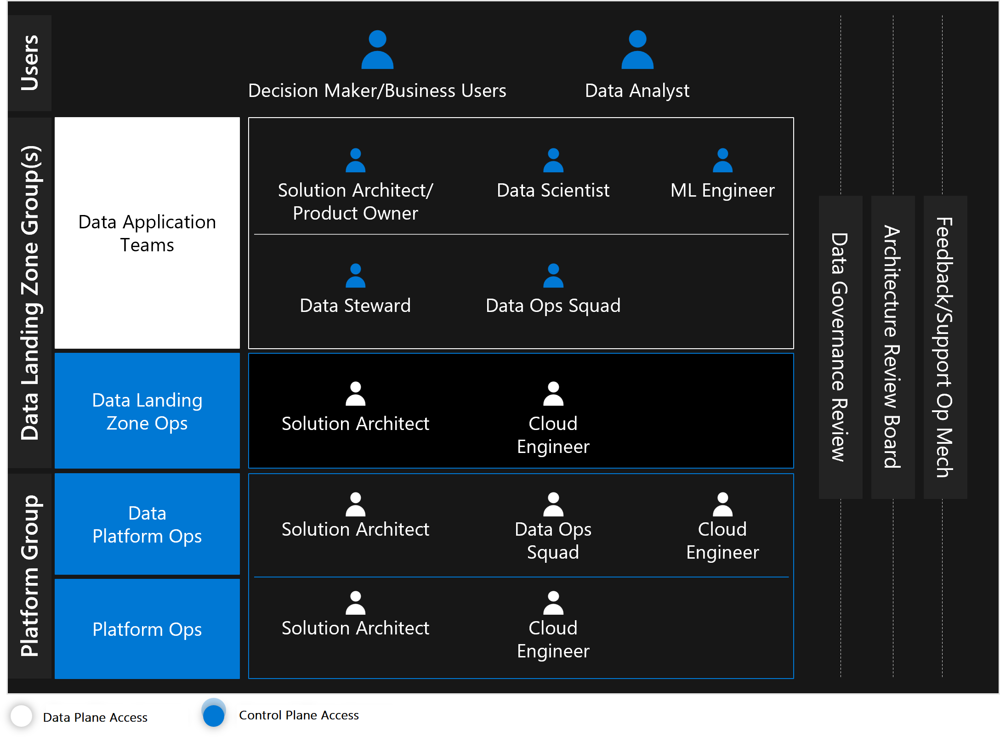

# Understand teams and functions for cloud-scale analytics in Azure

For cloud-scale analytics, we recommend moving teams such as ingest, processing, analysis, consumption, and visualization from working in horizontally siloed teams to agile vertical cross-domain teams in each tier. Platform teams like data platform operations and platform operations are grouped together in a common platform group.

## Platform group

The platform group consists of two teams:

- **Platform ops:** Platform ops are part of the platform group. They operate and own the cloud platform. This team is responsible for instantiating the data management landing zone and data landing zone scaffolding, such as networking, peering, core services, and monitoring within cloud-scale analytics. They usually help data platform ops develop IT service management interfaces for personas in the data landing zone at the start of rolling out cloud-scale analytics. These interfaces tend to be REST API calls to a service to onboard data products, set security, and add services to data landing zones.

- **Data platform ops:** The data platform ops group is housed within the platform group. Data platform ops provide services such as central monitoring, cataloging, and reusable policies for data landing zones and products. Data platform ops own the data management landing zone, and the team's other responsibilities are:

### Develop infrastructure

- Develop infrastructure-as-code templates for data landing zones; the templates must be updated and maintained over time, and they can cover multiple scenarios.
- Prioritize templates and add new functionalities based on feedback from other teams.
- Work in an agile framework with the common goal of producing standard infrastructure templates.

### Respond to new data landing zone requests

The data platform ops team must provide the tools and services to support the templates they've created. IT service management tools like ServiceNow can handle ticket requests approved by the data platform ops team for creating new data landing zones. After its approved, a new landing zone would fork from the base template to create a new DevOps project, and pipelines would deploy templates to a new environment.

### The data platform ops feedback and enhancement loop

Two options are available to enhance the templates:

- Teams in charge of infrastructure template instances can enhance their DevOps templates and deployments. If teams discover issues in the templates, data platform ops can support the teams and merge changes back from their fork into the template.
- Other data landing zone teams should be able to create improvement and backlog tickets that would enhance templates based on how the tickets are prioritized.

### Azure policies for cloud-scale analytics

Cloud-scale analytics principles emphasize self-service agility and guardrails to protect data, costs, and patterns. Data platform ops work with platform ops to define quality, and these teams collaborate to implement specific data policies. Data platform ops should follow a review process to update and maintain new features that are added to products.

### Deploy and operate data management landing zones

Data platform ops and platform ops work together to deploy and operate data management landing zones. A data management landing zone provides shared services to data landing zones, making it a central piece of cloud-scale analytics.

## Data landing zone ops

Data landing zone ops operate and maintain their data landing zone instance while responding to data application team requests. They provide many of the same services as data platform ops but are limited to their data landing zone.

They work out of the forked repo that's created when a data landing zone is established. To request policy changes, they have to raise tickets to data platform ops to allow these exceptions.

### Support the data application team to customize data products

The data landing zone ops team supports the data application team by using pull requests to submit new product templates to their respective data product repositories.

As the owner of the landing zone, Azure DevOps routes the approval for changes to data landing zone ops:

- If approved, the template changes are moved to the main branch and deployed to production via continuous integration/continuous development, causing the data product platform/infrastructure to be updated.
- If denied, data landing zone ops work with the data application team to fix the changes.

### Respond to new data product requests

Data landing zone ops support data application teams in creating new data products. When a data application team requests assistance, an IT service management solution, such as an automation logic app, orchestrates the approval or deployment of a new data application repository. Data landing zone ops are notified of new requests and approve or decline deployments. After approved, a new DevOps project is created, the main template and artifacts are forked, and a new data application is deployed.

### Adhere to the Azure Well-Architected Framework

Data landing zone ops are responsible for the data landing zone, and it's recommended for the team to be proficient in the [Azure Well-Architected Framework](/azure/architecture/framework/), which provides guidance on cost optimization, reliability, and security.

### Business as usual

Data landing zone ops are responsible for business tasks that include gathering feedback and enhancement requests. These requests are prioritized and shared with data platform ops regularly. The team monitors the data landing zone for incidents and health events. They engage other ops teams during severe incidents to mitigate, restore backups, failover, and scale services.

## Data application team

The data application team delivers new data products to the business. They source from data integrations' read data stores and transform them into business solutions. Anything that transforms data for use is classified as a **data product**. This team is often a mix of technical specialists and subject matter experts who can help the business achieve value quickly. Data products can range from simple reports and new data products to custom setups with data-driven Kubernetes web apps.

### New data products

Product owners and business representatives create requests for new data products when they're needed. The data office assesses the requirements and assembles a new data application team with a range of expertise. The team identifies the data products required and requests permission to access the data asset. If a new data product is needed, the data application team receives a ticket to ingest it. The team identifies the services required for the new data product and requests a new data product via the [data application deployment process](../cloud-scale-analytics/manage-provision-platform.md#data-application-deployment-process). The data application team receives a forked repo from the master data application template to deploy the data application.

### Certify data products

In a self-service platform, anyone can create reports, curate data products in an Azure Data Lake developer storage account, and release data products for the business to use. Data product review requests occur when:

- Business sponsors log tickets to certify data products.
- Data platform ops nominate data products based on popularity.

A data application team can drive a certification process, defined by data platform ops and digital security, which might include:

- Tests devised to validate data transformations and business logic
- Assessments for security, compliance, or performance impact

Upon certification, artifacts are collated and uploaded to a data product repository, documentation is published, and the data application team is notified.

### Product support

Users can submit feedback with an IT service management solution or directly within the product as a ticket routed to the data product owner. This individual triages the request and determines whether to escalate it to the data application team to fix or enter feedback into a product backlog and review during product planning cycles.

## Data science applications team

While the data science products team creates data products, it's distinct because their functions lead to data products. Their work results in published models becoming data products for others to use, and the pattern follows a Machine Learning ops model associated with the data landing zone.

The data science products team starts by searching for and finding relevant data products for their use case. Data governance solutions can reveal more details like data quality, lineage, or a similar dataset or profile. They research if a sample dataset is available and if the data is relevant to the project. After data access is granted via a data catalog or a Microsoft Entra access package, the team uses the services in the data landing zone to explore and analyze the data.

Before processing all data, the team uses local or remote compute to process and analyze sample data products. They can optimize remote compute targets with larger data products to train and develop machine learning models with runs, outputs, and models tracked inside Azure Machine Learning.

When the team has developed machine learning models, they start operationalizing them. For achieving this objective, they expand the team to include DataOps and machine learning engineers who can assist with moving the models into a new data product, as outlined in a data application team role.

The data science team continues to work with the associated data product owners to capture feedback, support, and update models in production using a [machine learning ops methodology](/azure/machine-learning/concept-model-management-and-deployment).

## Analyst

Analysts represent a large group that includes business analysts, power users, and generally anyone in the organization with an interest in optimizing data to create new business insights. Self-service enablement is a key principle that supports analysts in accessing analytics and data without having to secure a formal IT budget and resources.

> [!TIP]
> Enterprises should view insights created by analysts as the next set of potential data products to be certified for others to use within the business.

### Find and request data

Analysts consult data marketplaces/catalogs to discover relevant data products.

- If the data asset can't be found or doesn't exist, analysts open a support ticket with the data application team. The data application team assists with finding the dataset or adds the request to their backlog to assess it in another development cycle.

- If the dataset exists, analysts can identify Microsoft Entra group membership for assets listed in the catalog and use the Azure access package portal to request access to the Microsoft Entra group.

### Build new reports

Analysts can use tools like Microsoft Power BI to integrate data products into reports. These reports can be for their individual use or for publishing a certified data product. Before publishing the report across the organization, it would need to be certified with a data product certification process for security, compliance, and performance.

### Run as-needed queries

Cloud-scale analytics has shared workspaces where analysts can query data, subject to permissions. It's common for data products to provide dedicated compute to run queries as needed. In both cases, analysts can run queries against data products in the data landing zones, subject to permissions. The results from the queries can be stored in Azure Data Lake workspaces to be used again.

### User feedback

Since analysts can serve as an untapped source of information and improvements, enterprises are highly encouraged to create user feedback groups for each data landing zone.

In addition to participating in these user groups, analysts should submit data asset feedback to the data application team and data catalog issues within the data catalog or the IT service management solution. They can submit data process issues to the data application team or within an IT service management solution.

> [!NOTE]
> An IT service management solution should serve as a central location for submitting feedback and escalating issues. Submitting direct feedback to individual teams might seem to be a faster solution, but this approach doesn't give the business visibility into the challenges in the platform. An IT service management solution with correct routing to the data application teams can give the business one view across the enterprise.

## Responsibility assignment matrix

- **Responsible:** Who is completing the task?
- **Accountable:** Who is making decisions and taking actions on the task?
- **Consulted:** Who receives communications about decisions and tasks?
- **Informed:** Who is updated about the decisions and actions during the project?

|Role |Cloud environment|Data management landing zone|Data landing zone|Data integration|Data products|
|-|-|-|-|-|-|
|Service owner|Informed|Accountable|Consulted informed|Consulted informed|Consulted informed|
|Data landing zone service owner|Informed|Consulted informed|Accountable|Accountable|Accountable|
|Cloud platform ops|Responsible|Consulted|Consulted|Consulted|Consulted|
|Data platform ops|Consulted|Responsible|Responsible|Consulted|Consulted|
|Data landing zone ops|Informed|Responsible|Responsible|Responsible|Responsible|
|Data application team||Informed|Informed|Informed|Responsible|

## Next steps

The [Azure Well-Architected Framework for data workloads](./well-architected-framework.md)
