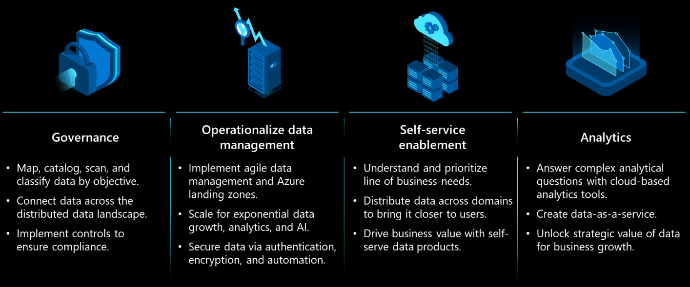
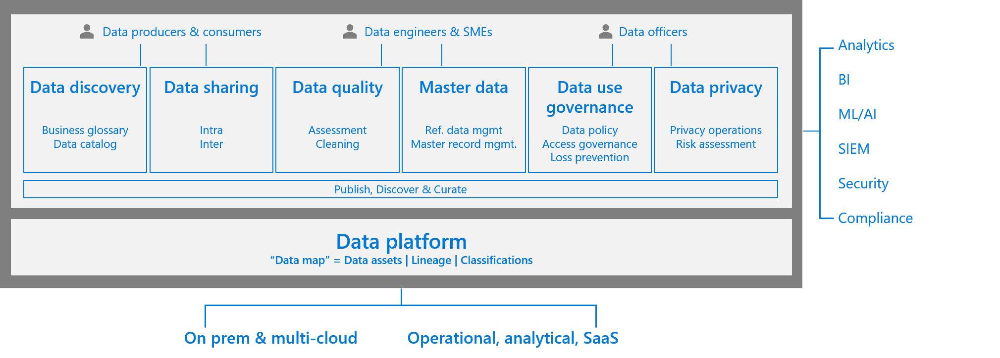
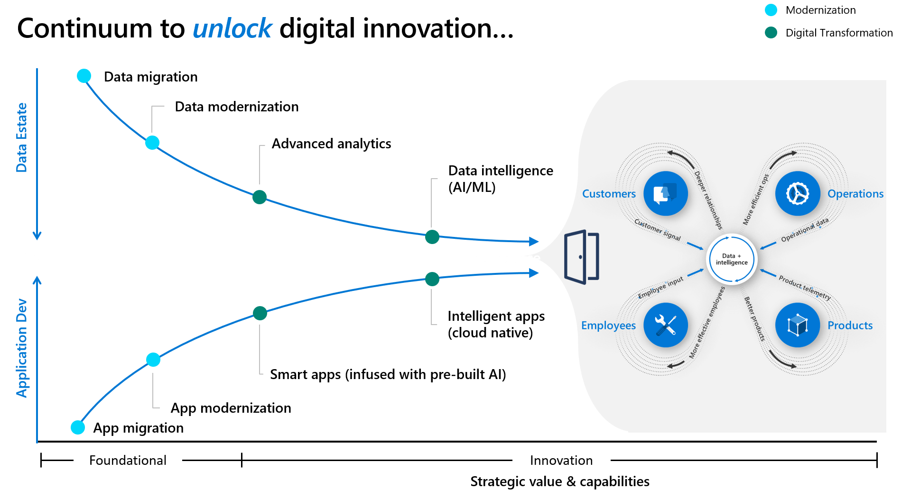

# Integrate cloud-scale analytics into your cloud adoption strategy

Create a single, centralized cloud adoption strategy for your organization using the [Strategy methodology in Azure's Cloud Adoption Framework](../../strategy/index.md). If you haven't already recorded your cloud adoption strategy, use the [strategy and plan template](https://raw.githubusercontent.com/microsoft/CloudAdoptionFramework/master/plan/cloud-adoption-framework-strategy-and-plan-template.docx) to do so.

This article contains considerations for cloud-scale analytics scenarios that affect your broader strategy.

Before implementing cloud-scale analytics, have a plan in place for your data strategy. You can start small with a single use case, or you can have a larger set of use cases that require prioritization. Having a strategy helps you establish your processes and spark initial conversations about pillars you need to focus on.

## Prioritize business outcomes for your data strategy

Having a successful data strategy gives you a competitive advantage. You should always align your data strategy with your desired business outcomes. Most business outcomes can be classified into one of the following four categories:

- **Empower your employees:** Provide your workforce with real-time knowledge of customers, devices, and machines. This knowledge helps them efficiently collaborate to meet customer or business needs with agility.

- **Engage with customers:** Deliver a rich, personalized, and connected experience inspired by your brand. Harness the power of data and insights to drive customer loyalty along every step of a customer journey.

- **Optimize operations:** Increase the flow of information across your entire organization. Synchronize your business processes and use a data-driven approach to make every interaction valuable.

- **Transform your products and development life cycle:** Gather telemetry data about your services and offerings. Use the telemetry data to prioritize a release or create a new feature, and to evaluate effectiveness and adoption continuously.

After prioritizing your business outcomes, examine your current projects and long-term strategic initiatives and classify them accordingly. Consider combining the four categories of business outcomes in a matrix format that's based on complexity and impact. Also, consider adding architectural pillars to help you dive deeper into your scenario.

## Unlock strategic value

Building a data-driven culture that drives business forward in a consistent, forward-thinking, agile, and informed way has some inherent complexities and ground realities. Before you enter your deployment phase, focus efforts towards the formation of a coherent data strategy that can help you achieve your desired business outcomes.

Cloud-scale analytics are aligned with [innovation-focused motivations](../../strategy/motivations.md). The following common drivers motivate customers to integrate this scenario into their cloud adoption strategy:

- A scalable analytics framework, which lets you build an enterprise data platform
- Self-service, which empowers users in data exploration, data asset creation, and product development
- A data-led culture with reusable data assets, data communities, secure third-party exchange, and in-place sharing
- Sharing data with confidence, using policies, common identity, confidentiality, and encryption
- Improved customer experiences and engagements
- Transformation of products or services
- Market disruption with new products or services

The following diagram contains key themes that help you realize these motivations in your own strategy. Carefully analyze these themes and how they contribute to a coherent data strategy. Also, consider how they can unlock your data's strategic value and enable consistent business growth.

*"A data strategy is the foundation to using data as an asset and driving business forward. It's not a patch job for data problems. It's a long-term, guiding plan that defines the people, processes, and technology to put in place to solve data challenges."*

Creating your strategy is one step. Executing your strategy at an enterprise scale poses a great challenge to your organization's existing culture, people, processes, and technology choices. Execution requires commitment and clear ownership at all levels of your organization.

### Increasing efficiencies

The agility of the cloud requires organizations to adapt quickly and bring efficiencies to all areas of business. According to the [report on emerging risks by Gartner](https://www.gartner.com/en/newsroom/press-releases/2018-10-24-gartner-survey-shows-digitalization-misconceptions-threaten-organizations-as-the-top-emerging-risk-in-3q19), despite organizations continuing to focus on and invest in digital initiatives, two-thirds of these organizations demonstrate enterprise weaknesses and fail to deliver upon expectations, even though they continue to focus on and invest in digital initiatives.

## Operationalize data management

Many organizations have slowly been decentralizing central IT to enable agility. Organizations want to innovate quickly, and having access to enterprise-wide unified data in a self-serve manner helps them meet challenging business requirements.

There are many reasons why businesses fail to tap into the full potential of their data. It might be because business functions work in silos, where each team is using different tools and standards for data analysis. Or it might be because of a failure to link key performance indicators to overall business goals.

Data democratization helps you deliver value back to business and achieve challenging business growth targets.

- Understand and prioritize your LOBs needs.
- Distribute your data across domains to enable ownership and bring data closer to users.
- Deploy self-service data products to drive insights and business value.

For data governance, you must strike a proper balance in the decentralized world of data democratization. If you enforce governance too strictly, you can stifle innovation. However, if you don't have at least some core principles and processes in place, you're likely to end up with data silos. These silos can damage your organization's reputation and potential revenues. A holistic data governance approach is fundamental for you to unlock the strategic value of your data in a consistent manner.

The absence of a well-thought-out data strategy leads to a need to just "get going" and quickly start providing value to your organization. Address current business problems by acting on the previously mentioned key themes or using them as strategic principles within a framework. Using these key themes can also help you create a holistic data strategy that is iterative with validation, yet still provides timely results. Business and technology leaders must develop the strategies and mindset required to generate value from data and quickly scale in a simplified, structured manner.

For more information, see [What is data governance?](./govern.md).

## Develop a data-driven culture

To build a successful data strategy, you need a data-driven culture. Develop a culture that consistently fosters open, collaborative participation. In this type of culture, your entire workforce can learn, communicate, and improve the organization's business outcomes. Developing a data-driven culture also improves each employee's ability to generate impact or influence backed by data.

Your journey's starting point depends on your organization, your industry, and your current location along the maturity curve. The following diagram shows an example maturity model outlining the maturity levels of an organization's AI usage:

:::image type="content" source="./images/data-strategy-maturity.png" alt-text="Diagram of an organization's maturity evolving." lightbox="./images/data-strategy-maturity.png":::

### Level 0

Data isn't exploited programmatically and consistently. The organization's data focus is from an application development perspective.

At Level 0, the organization often has unplanned analytics projects. Each application is highly specialized to unique data and stakeholder needs. Each application also has significant code bases and engineering teams, with many engineered outside IT. Use case enablement and analytics are siloed.

### Level 1

At Level 1, teams are being formed and strategy is being created, but analytics remains departmentalized. The organization tends to be good at traditional data capture and analytics. It might have some level of commitment to a cloud-scale approach. For example, it might already access data from the cloud.

### Level 2

The organization's innovation platform is almost ready. Workflows are in place to address data quality. The organization can answer a few "why" questions.

At Level 2, the organization is actively searching for an end-to-end data strategy that uses centrally governed data lake stores to control data store sprawl and improve data discoverability. The organization is ready for smart applications that bring compute to centrally governed data lakes. These smart applications reduce privacy risks, compute costs, and the need for federated copies of important data.

At this level, the organization is also ready to use multitenant, centrally hosted, shared data services for common data computing tasks. These shared data services enable rapid insights from data-science-driven intelligence services.

### Level 3

The organization uses a holistic data approach. Projects related to data are integrated within business outcomes. The organization uses analytics platforms to make predictions.

At Level 3, the organization unlocks digital innovation from both data estate and application development standpoints. Foundational data services are in place, including data lakes and shared data services.

Multiple teams across the organization successfully deliver on critical business workloads, key business use cases, and measurable outcomes. New shared data services are identified using telemetry. IT is a trusted advisor to teams across the company, using a trusted and connected end-to-end data strategy to help improve critical business processes.

### Level 4

At Level 4, the entire organization uses frameworks, standards, enterprise, and a data-driven culture. Automation, data-driven feedback loops, and centers of excellence around analytics or automation can be observed in action.

## Develop business-aligned objectives

Identifying priorities in line with the business vision and keeping a "think big, start small, and act fast" ideology are keys to success. Picking up the right use case doesn't always need to be a long-haul, difficult vetting process. It could be an ongoing problem in any business unit where there's enough data to validate its return on investment, more appetite, and easy buy-in. Things can move quickly, and that's where most of the organization can be struggling to get started.

## Understand data attributes

To build a strong data strategy, you need to understand how data works. Knowing data's core characteristics helps you build a principled practice for dealing with data.

Data travels fast, but its velocity can't defy the laws of physics. Data must conform to the laws of the land and the industry that created it.

Data doesn't change on its own, but it's prone to changes and accidental loss unless you put measures in place to mitigate such challenges. Put anti-corruption measures for controls, databases, and storage in place so you can deal with unforeseen changes. Also, ensure you set up monitoring, audits, alerts, and downstream processes.

On its own, data doesn't produce any insights or yield any value. To gain insights or extract value, you must put most or all of your data through four discrete steps:

1. Ingestion
2. Storage
3. Processing
4. Analytics

Each of these four steps has its own principles, processes, tools, and technologies.

Withholding your data assets and related insights can affect socioeconomic, political, research, and investment decisions. It's critical that your organization is capable of providing insights in a secure and responsible way. All data you generate or acquire must go through a data classification exercise unless otherwise explicitly stated. Encryption is the gold standard for handling confidential data both at rest and in transit.

Data, applications, and services all have their own gravitational pulls, but data's pull is the largest. Unlike Sir Isaac Newton's legendary apple, data doesn't have any physical mass that affects surrounding objects. It instead has latency and throughput, which act as accelerators for your analytics process. Latency, throughput, and ease of access often require you to duplicate data, even when that isn't desirable. Set up your people, processes, tools, and technologies appropriately so you can balance such requirements with your organization's data policies.

Architectural constructs govern the speed at which you can process data. Constructs are facilitated through innovations in software, hardware, and networking. Some architectural considerations are:

- Setting up data distribution
- Partitioning
- Cache technologies
- Batch versus stream processing
- Balancing back-end and client-side processing

## Define your data strategy

Using data as a competitive advantage for building better products and higher-value services is not a new concept. However, the volume, velocity, and variety of data enabled by cloud computing are unprecedented.

The design of a modern data analytics platform in the cloud consists of security, governance, monitoring, on-demand scaling, data operations, and self-service. Understanding the interplay between these facets is what distinguishes a great data strategy from a good one. Use tools like the Cloud Adoption Framework to ensure architectural cohesiveness, integrity, and best practices.

To be effective, your data strategy must contain provisions for data governance. The following diagram shows the main stages of a data life cycle, focusing on data governance as its focus:

The following sections describe considerations you should use while deciding on design principles for your data strategy's layers. Focus on delivering business outcomes and value from your data.

### Data ingestion

A key consideration for data ingestion is your ability to build a data pipeline quickly in a secure and compliant manner, from requirements all the way to production. Important elements include metadata-driven, self-service, and low-code technologies that hydrate your data lake.

When building pipelines, consider both design and your ability to wrangle data, distribute data, and scale compute. You must also ensure you have the right DevOps support for your pipeline's continuous integration and delivery.

Tools like Azure Data Factory support a plethora of on-premises data sources, software as a service (SaaS) data sources, and other data sources from other public clouds.

### Storage

Tag and organize your data in both physical and logical layers. Data lakes are part of all modern data analytics architectures. Your organization must apply appropriate data privacy, security, and compliance requirements that meet all data classification and industry compliance requirements you operate under. Cataloging and self-service aid organization-level data democratization, which fuels your innovation while being guided by appropriate access control.

Choose the right storage for your workload. Even if you don't get storage exactly correct the first time, the cloud allows you to fail over quickly and restart your journey. Use your application requirements to choose the best database. Be sure to consider your ability to process batch and streaming data as you're choosing your analytics platform.

### Data processing

Your data processing needs vary with each workload. Most large-scale data processing contains elements of both real-time and batch processing. Most enterprises also have elements of time series processing requirements and a need to process free-form text for enterprise search capabilities.

Online transaction processing (OLTP) provides the most popular organizational processing requirements. Some workloads need specialized processing like high-performance computing (HPC), sometimes called "big compute." These workloads solve complex mathematical tasks using many CPU or GPU-based computers.

For certain specialized workloads, customers can secure execution environments like Azure confidential computing, which helps users secure data while the data is in use within public cloud platforms. This state is required for efficient processing. Data is protected inside a trusted execution environment (TEE), also known as an enclave. A TEE protects code and data against any outside viewing and modification. TEEs allow you to train AI models without sacrificing data confidentiality, even while you use data sources from different organizations.

### Analytical processing

The extract, transform, load (ETL) construct relates to online analytical processing (OLAP) and data warehousing needs. A business-aligned data model and a semantic model allowing organizations to implement business rules and Key Performance Indicators (KPIs) are often implemented as part of the analytical process. One useful capability is automatic schema drift detection.

### Data strategy summary

Taking a principled approach to other considerations, like data governance and responsible AI, pays dividends later on.

At Microsoft, we follow four core principles: fairness, reliability and safety, privacy and security, and inclusiveness. The two foundational principles of transparency and accountability underpin all four core principles.

We put our principles and responsible AI into practice by developing resources and a system of governance. Some of our guidelines address human/AI interaction, conversational AI, inclusive design, an AI fairness checklist, and a data sheet for datasets.

We've also developed a set of tools to help others understand, protect, and control AI at every stage of innovation. These tools are a result of multidisciplinary collaboration efforts to strengthen and accelerate responsible AI. Collaboration has spanned software engineering and development, social sciences, user research, law, and policy.

To improve collaboration, we open-sourced many tools like InterpretML and Fairlearn. Others can contribute to and build upon these open-source tools. We also democratized tools through Azure Machine Learning.

The pivot to becoming a data-driven organization is fundamental to delivering competitive advantage in the new normal. We want to help our customers shift from an application-only approach to an application and data-led approach. An approach focusing on applications and data helps create an end-to-end data strategy that ensures repeatability and scalability across current and future use cases that affect business outcomes.

## Foster commitment, communication, and engagement

All key roles involved in making your data strategy a success must clearly understand your adopted approach and common business objectives. Your key roles might include a leadership team (C-level), business units, IT, operations, and delivery teams.

Communication is one of the most important parts of this framework. Your organization must devise a process for effective communication across roles. Communication helps you deliver effectively in the context of your current project. It also establishes a forum that helps everyone involved remain in line, up to date, and focused on the overall objective of building a holistic data strategy for your future.

Engagement is essential between the following two groups:

- Team members who design and implement the data strategy
- Team members who contribute to, consume, and exploit the data (such as business units that make decisions and build outcomes based upon the data)

To put it another way, data strategies and associated data platforms that are built without user engagement risk challenges in relevance and adoption.

Two strategic processes help you deliver successfully in this framework:

- Formation of a center of excellence
- Adoption of an agile delivery method

For more information, see [Develop a plan for cloud-scale analytics](./plan.md).

## Deliver value

When you deliver data products against the success criteria in a standardized and structured way, that delivery validates your iterative framework. Additionally, using your learning to continuously innovate helps you build business confidence and widen data strategy goals. This process provides clearer and faster adoption across your organization.

The same applies to your data platform. When you have a setup where multiple teams operate fairly autonomously, you should drive towards a mesh. Getting there's an iterative process. In many cases, it requires significant changes to your organizational setup, readiness, and business alignment.

## Next steps

Read the following articles to find guidance for your cloud adoption journey and make your cloud adoption scenario successful:

- [Develop a plan for cloud-scale analytics](./plan.md)
- [Review your environment for Azure landing zones](./ready.md)
- [Govern cloud-scale analytics](./govern.md)
- [Secure cloud-scale analytics](./secure.md)