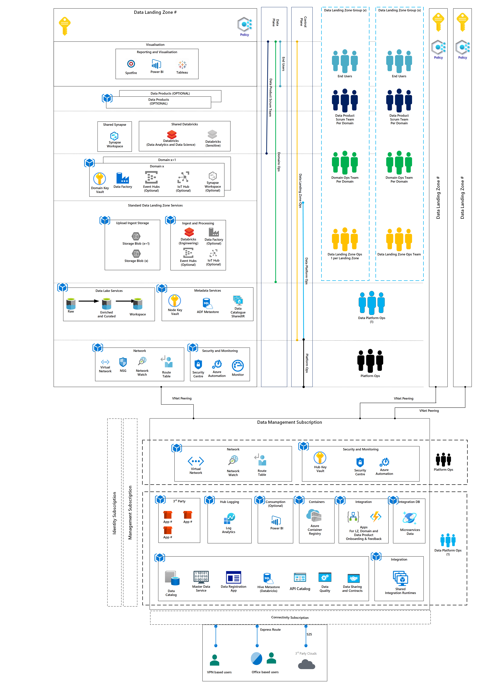
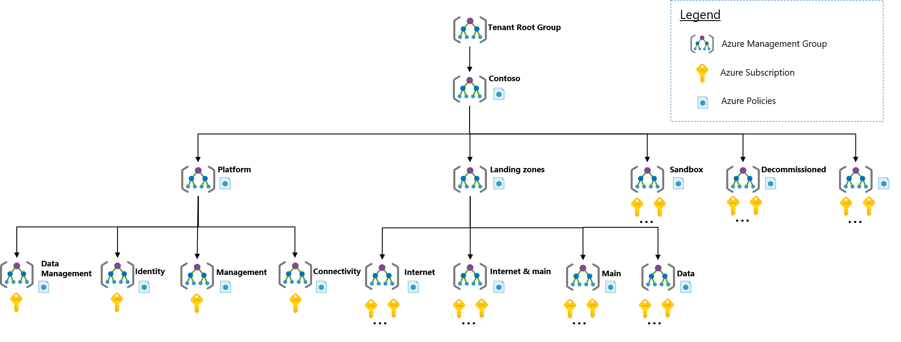

# Enterprise Scale Analytics and AI

Today, customers are investing in moving data to the cloud and have been following a modern data warehouse (MDW) pattern published by multiple cloud vendors. This MDW pattern includes pushing for singular enterprise data lakes which focuses the organization on a centralized analytics or core services provider pattern. These patterns are aligned to on-premises as opposed to the agility and self-service of the cloud.

The Enterprise Scale Analytics and AI solution pattern represents the strategic design path and targets the technical state for an Azure Analytics and AI environment. It addresses the challenges of a centralized monolithic data lake using a harmonized data mesh.

Distribution of the data and pipelines enables the Domains to have ownership of accessibility, usability, and development. The Enterprise Scale Analytics and AI solution pattern includes storage, data lineage, data classification, data ingestion, networking, security, access management, encryption, resiliency, and monitoring.

## Overview

The Enterprise Scale Analytics and AI solutions pattern consists of a Data Management Subscription with multiple connected Data Landing Zones:

* The Data Management Subscription consists of a data catalogue, master data management, data quality, data contracts and API management.
* The Data Landing Zone can host multiple analytics and AI solutions relevant to their respective business domain.

The platform is extensible to include other Azure services on-demand. The proposed approach is to provision the analytics platform with the required services, with t-shirt sizing, and extend it further as when new use cases are on-boarded. This allows enterprises to regulate the platform cost effectively. The framework builds on our [Enterprise-Scale Architecture](https://docs.microsoft.com/azure/cloud-adoption-framework/ready/enterprise-scale/) and should be considered a supplement to it.

Figure 1: High Level Picture of Enterprise Scale Analytics and AI

## Concept of Enterprise Scale Analytics and AI

### Architecture Design Principals

The Enterprise Scale Analytics and AI solutions pattern is adhering to the following design principles:

#### Domain and Data Product Democratization

Enterprise Scale Analytics and AI is a modern, modular and highly extensible solution, which emphasizes data Domain Driven Design as well as data democratization through data virtualization. Gone are the old days of monolithic data platforms. This construct decouples core data platforms and data management services from Central IT to enable an agile, efficient and secure development of data solutions.

#### Microservice-Driven Design

Best practices from Microservice Architectures are leveraged and applied to the data estate. Cross-functional teams take ownership of data product design, development and operation in order to shorten the time to market and the agility within the platform. A combination of subscriptions and resource groups are used to scale within the data platform and to enable teams a quick and independent development of new Data Products and insights. Core principles like DevOps, Infrastructure as Code (IaC) and resilient designs are used to avoid human error and single-points of failure.

#### Policy-Driven Governance

Azure Purview Data Policy engine is used to enforce the necessary guardrails for datasets to comply with data requirements as well as data regulations that are imposed by law or other entities. In addition, Azure Policy should be used to apply guardrails on a service level and ensure continued compliance with your organization's platform, along with the data applications deployed onto it. Azure Policy also provides data teams with sufficient freedom and a secure unhindered path to the cloud.

#### Single Control and Management Plane

Abstraction layers over existing UIs and solutions provided by Microsoft are avoided wherever possible. In order to provide a consistent experience for all users and teams, native control and data planes should be used across all Azure resources and provisioning channels subject to role-based access and policy-driven controls.

#### Align Azure-Native Design and Roadmaps

The Enterprise Scale Analytics and AI solution pattern advocates using Azure-native platform services and capabilities whenever possible. The solution aligns with Azure platform roadmaps to ensure that new capabilities are available within your environments. Azure platform roadmaps should help to inform the migration strategy and enterprise-scale trajectory.

## Data Management Subscription and Data Landing Zone(s)

The below diagram gives the overview of an Enterprise Scale Analytics and AI platform with a central Data Management Subscription and spokes (known as Data Landing Zones).

Figure 2: Enterprise Scale Management and Data Landing Zones

The Enterprise Scale Analytics and AI framework advocates consistent governance using a common architecture that defines baseline capabilities and policies. Thus, all Data Landing Zones adhere to the same controls, and auditing. Crucially however, teams operating within respective Data Landing Zone have the freedom to create data pipelines, ingest sources, and create Data Products (which may be reports/dashboards) and ad-hoc Spark/SQL analysis. Furthermore, Data Landing Zone capabilities can be augmented by adding services on top of the baseline capability set out in the policy. Thus, a team could, for instance, add a 3rd-party graph engine to address some niche business requirement.

The second key-point to call out is that Data Landing Zones can connect to data lakes hosted in other Data Landing Zones, allowing groups to collaborate cross-org (subject to SSO access controls). Thus, *underscoring data virtualization vs data duplication*.

This setup places strong emphasis on central cataloguing and classification to protect data and allow various groups to discover datasets.

## Critical Design Areas

Enterprise Scale Analytics and AI considers seven critical design areas that help translate organizational requirements to Azure constructs and capabilities. These design areas can help address the mismatch between on-premises and cloud-design infrastructure as well as data monoliths and a data mesh. These areas typically creates dissonance and friction between the enterprise-scale definition and Azure adoption:

1. Data Management
2. Data Domains
3. Data Products
4. Data Platform Operational Excellence
5. Data Science Environment
6. Data Science Workflow and MLOps

## Data Management Subscription

* The Data Management Subscription hosts centralized services such as data cataloguing, monitoring, audits, etc.
* The Data Landing Zones are automatically peered to the Data Management Subscription to allow the data catalogue to crawl across the Data Landing Zones for data discovery and governance. The Data Management Subscription as deployed is peered to the Connectivity Management Subscription.
* This environment is highly controlled and subject to stringent audits.
* All data classification types will be stored in a central Data Catalogue. Access patterns are enforced by meta-data dependent policies. The Data Catalogue can serve as a back-end repository for data market front-ends.

The Data Management Subscription is discussed in detail in [Data Management Subscription Detail](../02-datamanagement/01-overview.md).

## Data Landing Zone(s)

* Data Landing Zones are subscriptions within the solution pattern representing primary business groups, integrators and enablers as these groups own, operate and often provide innate understanding for the source systems.
* Ingestion capabilities will exist in each Data Landing Zone to allow Domain subject matter experts to pull in data sources from 3rd-party clouds or on-premise environments.
* Data Landing Zone are instantiated based on the Data Landing Zone core architecture, including all key capabilities to host an analytics platform.
* A Data Landing Zone can host one or many Domains relevant to their respective business.
* A Data Landing Zone can also host Data Products.
* A data product is anything that drives business value, i.e. reports, workbooks, bespoke database or data API. It can leverage additional services/technologies not part of Data Landing Zone core architecture. For example:
  * Reporting with niche requirements, i.e., compliance, tax reporting, HR, etc.
  * Specialized capabilities that address gaps in the baseline policies.

The Data Landing Zone is discussed in detail in [Data Landing Zone Overview](../03-datalandingzones/01-datalandingzone.md)

Figure 3: Integration into Cloud Adoption Framework

## Additional Resources

[Enterprise Scale Teams](02-esa-ai-teams.md)

## Log Feedback to Enterprise Scale Analytics v-team

[Log Feedback for this page](https://github.com/Azure/enterprise-scale-analytics/issues/new?title=&body=%0A%0A%5BEnter%20feedback%20here%5D%0A%0A%0A---%0A%23%23%23%23%20Document%20Details%0A%0A%E2%9A%A0%20*Do%20not%20edit%20this%20section.%20It%20is%20required%20for%20Solution%20Engineering%20%E2%9E%9F%20GitHub%20issue%20linking.*%0A%0A*%20Content%3A%2001-overview%20%E2%9E%9F%2001-overview.md)

>[Next](02-esa-ai-teams.md)