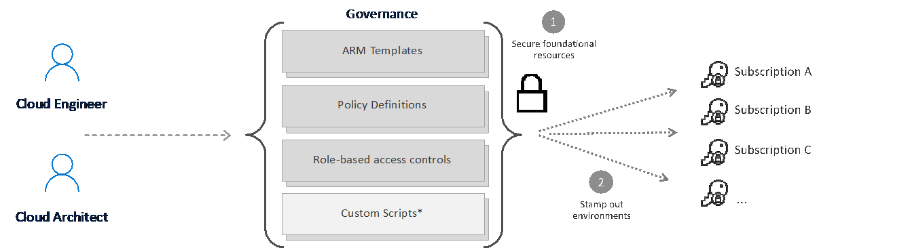
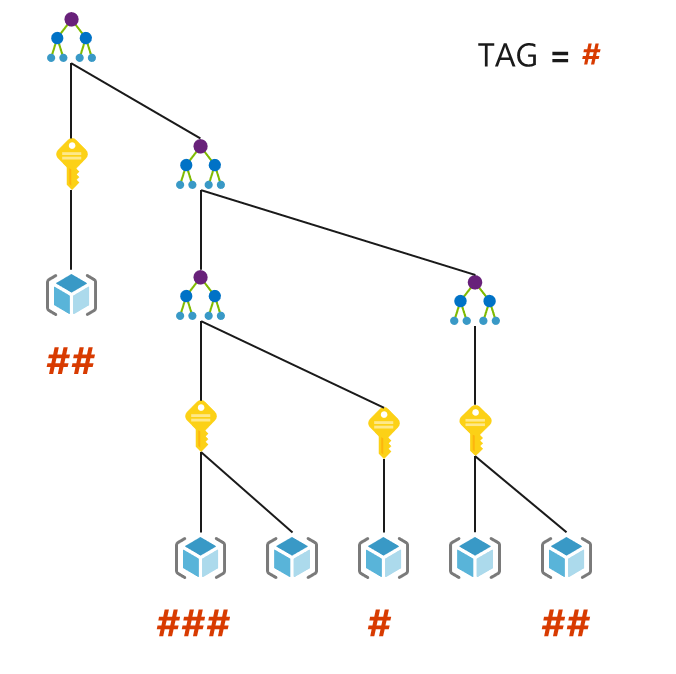

\
**General disclaimer: DO NOT COPY - UNDER DEVELOPMENT - MS INTERNAL ONLY** \
&nbsp;

# Cost Management and Policies

Before considering a deployment, it is important for the business to decide upon the guard rails that you wish to put in place.

## Azure Policies for Analytics and AI

A core principle of the Enterprise Scale Analytics and AI solution pattern is to enable agility by making it easy to create, read, update, and delete resources as needed. However, while giving unrestricted resource access to developers can make them very agile, it can also lead to unintended cost consequences. The solution to this problem is resource access governance, which is the ongoing process of managing, monitoring, and auditing the use of Azure resources to meet the goals and requirements of your organization. The [Enterprise-Scale Architecture](https://docs.microsoft.com/azure/cloud-adoption-framework/ready/enterprise-scale/) already uses this concept, and Enterprise Scale Analytics and AI solution pattern builds upon these standards by adding additional Azure Policies which are applied to our Data Management Landing Zone and Data Landing Zones.

Figure 1: How Azure Governance Works

Azure Policy is essential to ensuring security and compliance within Enterprise Scale Analytics and AI.

Azure Policy helps to enforce standards and to assess compliance at-scale. Policies can be used to evaluate resources in Azure and compare them to the desired properties. Several policies (business rules) can be grouped into an initiative. Individual policies or initiatives can be assigned to different scopes in Azure, such as management groups, subscriptions, resource groups, or individual resources. The assignment applies to all resources within the scope, and sub-scopes can be excluded with exceptions if necessary.

Azure Policy should be used to implement governance and enforce rules for resource consistency, regulatory compliance, security, cost, and management. Pre-built policies are available and should be used to save time.

Policies should be assigned to the highest level possible in the management group tree to simplify the management of policies. Also, the number of Azure Policy assignments made at the root management group scope should be limited to avoid managing through exclusions at inherited scopes.

Policy exceptions should only be used if required and should require global admin approval.

## Cost Management

Cost transparency across a technical estate is a critical management challenge faced by every large enterprise organization. Different principles should be followed to reduce, optimize, and allocate cost between organizations.

A well-planned organizational structure for your Azure billing and resource hierarchies helps to give you a good understanding and control over costs as you create your Enterprise Scale Analytics and AI solution.

We recommend checking that your enterprise is aligned to the Cloud Adoption Framework methodology for [Managing Cloud Costs](https://docs.microsoft.com/azure/cloud-adoption-framework/get-started/manage-costs).

You should use Azure Policy to set and track ARM tagging policies. For example, we could require that all of Azure resources are created with the following tags:

* Finance codes - CostCenter tag, etc.
* Application context - AppService tag, etc.
* Deployment context - Environment tag, etc.
* Who is accountable - BusinessOwner tag, etc.

Figure 2: Example of Tagging in Azure

Resource tags should be used for cost categorization and resource grouping. This model allows a chargeback mechanism for workloads that share a Data Landing Zone or for workloads that span across Data Landing Zones. Resource tags should be enforced and appended through Azure Policy to query and horizontally navigate across the management group hierarchy.

Azure cost management should be used at the first level of aggregation and should be made available to data landing zone owners.

>[!TIP]
>Azure Advisor should be used to implement cost optimization recommendations.

>[!NOTE]
>Regulatory and compliance requirements definitions and Azure RBAC role assignments.

## Enterprise Scale Analytics and AI Azure Policies

|Azure Service |Policy Scope and Type |Definition|
|-| -| -|
|All Data services| {scope}/diagnosticSettings (deployIfNotExists)| Collect all diagnostic logs in a central log analytics workspace per region.
|All Data services |Tags (modify) |Add and enforce data specific tags to resources.|
|Azure SQL Server| Microsoft.Sql/servers/vulnerabilityAssessments (deployIfNotExists) |Automatically enable vulnerability Assessments for SQL servers.|
|Azure SQL Managed Instance |Microsoft.Sql/managedInstances/vulnerabilityAssessments (deployIfNotExists) |Automatically enable vulnerability Assessments for SQL managed instances.|
|Azure SQL DB |servers/databases/backupLongTermRetentionPolicies (deployIfNotExists), servers/databases/backupShortTermRetentionPolicies (deployIfNotExists) |Automatically set default short term and long-term retention policies for all Azure SQL DBs to fulfil legal and internal requirements.|
|Azure SQL Managed Instance| managedInstances/databases/backupLongTermRetentionPolicies (deployIfNotExists), managedInstances/databases/backupShortTermRetentionPolicies (deployIfNotExists) |Automatically set default short term and long-term retention policies for all SQL Managed Instance DBs to fulfil legal and internal requirements.|
|Azure Cosmos DB |Microsoft.DocumentDB/databaseAccounts/disableKeyBasedMetadataWriteAccess (Append) |Disable the key-based metadata write access on all Cosmos DB accounts.
|Azure Data Factory |Microsoft.OperationsManagement/solutions (deployIfNotExists) |Deploy a data factory analytics service for each data factory and feed data into the central log analytics workspace.|
|Azure Data Factory| Microsoft.DataFactory/factories/linkedservices (deployIfNotExists) |Automatically add shared integration runtimes to Azure Data Factories.|
|Azure Purview| linkedServices (deployIfNotExists) |Automatically add all data sources in Data Landing Zones to the data catalog in the Data Management Landing Zone so that crawlers can detect and index datasets.|
|Azure Storage| Microsoft.Storage/storageAccounts/blobServices (deployIfNotExists), Microsoft.Storage/storageAccounts/fileServices (deployIfNotExists), Microsoft.Storage/storageAccounts/tableServices (deployIfNotExists), Microsoft.Storage/storageAccounts/queueServices (deployIfNotExists)| Automatically define default retention policies, versioning policies, snapshot policies, enable/disable changeFeed, restore policies, CORS rules and container delete retention policies.|
|Azure Storage |Microsoft.Storage/storageAccounts/managementPolicies (deployIfNotExists) |Automatically define a default data lifecycle (to cold tier, to archive tier)|
|Azure Storage |Microsoft.Storage/storageAccounts/blobServices/containers/immutabilityPolicies (deployIfNotExists) |Automatically define a default immutability policy.|
|Azure Storage |Microsoft.Storage/storageAccounts/objectReplicationPolicies (deployIfNotExists) |Automatically define a default object replication policy.|
|Azure Storage |Microsoft.Storage/storageAccounts/routingPreference.routingChoice (deny) |Enforce routing through Azure backbone and not through the internet.|
|Azure KeyVault| Microsoft.KeyVault/vaults (append)| Enforce soft delete and purge protection for all Key Vaults.|

## Log Feedback to Enterprise Scale Analytics v-team

[Log Feedback for this page](https://github.com/Azure/enterprise-scale-analytics/issues/new?title=&body=%0A%0A%5BEnter%20feedback%20here%5D%0A%0A%0A---%0A%23%23%23%23%20Document%20Details%0A%0A%E2%9A%A0%20*Do%20not%20edit%20this%20section.%20It%20is%20required%20for%20Solution%20Engineering%20%E2%9E%9F%20GitHub%20issue%20linking.*%0A%0A*%20Content%3A%2001-overview%20%E2%9E%9F%2004-policy.md)

>[Previous](03-dlzdivision.md)
>[Next](05-networking.md)
