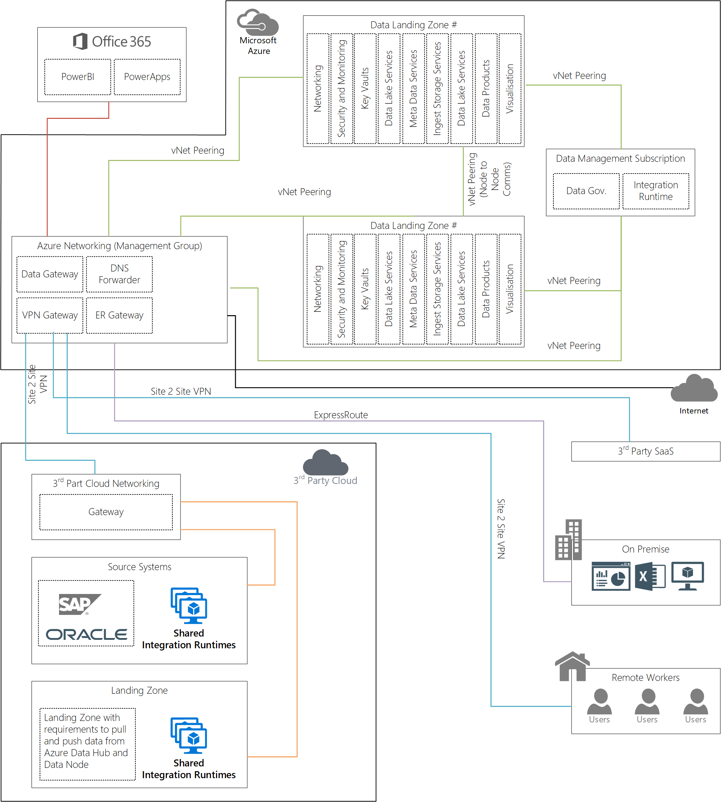

# Enterprise Scale Analytics and AI Networking

This section outlines the networking patterns to assist with cross-cloud integration, restrict data-exfiltration, remote workers, on-premise and Software-as-a-Service solutions. It builds upon the Cloud Adoption Framework for [Network topology and connectivity](https://docs.microsoft.com/azure/cloud-adoption-framework/ready/enterprise-scale/network-topology-and-connectivity).

## Private Endpoints

The Enterprise Scale Analytics and AI Framework uses [Private Link](https://docs.microsoft.com/azure/private-link/private-link-service-overview), where available, for shared PaaS services. Private Link is generally available for several services and is in public preview for numerous ones. Private Link addresses data exfiltration concerns associated with service endpoints.

For the current list of supported products see [Private Link Resources](https://docs.microsoft.com/azure/private-link/private-endpoint-overview#private-link-resource).

>[!CAUTION]
>By design, Enterprise Scale Analytics and AI Networking uses Private Endpoints where available for connectivity to PaaS services.

### Azure DNS Resolver Implementation for Private Endpoints

DNS resolution for private endpoints should be handled through central Private Azure DNS zones. Required DNS records for private endpoints can be automatically created using Azure Policy to allow access through FQDNs (Fully Qualified Domain Name). The lifecycle of the DNS records will follow the lifecycle of the private endpoints and will be automatically removed when the private endpoint is deleted.

The first challenge when trying to resolve Private Endpoints from On-premises networks, when leveraging Azure Private DNS Zones, is how to retrieve the Private Endpoint IP via 168.63.129.16 (this IP is not reachable from on-premises networks).

>[!NOTE]
>As of July 2020, you should use a custom DNS forwarder deployed in the Azure VNet (Azure Virtual Network) and have On-premises DNS Servers forward requests to them for each private endpoint.

It is important that On-Premises DNS Servers are configured correctly to forward the appropriate requests to the Custom DNS server in Azure and there are multiple ways to do that.

* If you have Custom DNS already in Azure, you just need to setup conditional forwarders on your On-Premises DNS server pointing to it.
* If you do not have a Custom DNS VM in Azure, you can deploy the Azure Virtual Machine Scale Set that includes Nginx already configured to forward DNS requests to Azure provided DNS IP **168.63.129.16**. Refer to [Deploy VMSS of a NGINX DNS Proxy into an existing Virtual Network](https://github.com/Microsoft/PL-DNS-Proxy).

When Custom DNS servers are pointing to other DNS Servers as forwarders, similar name resolution challenges are going to be faced when dealing with On-premises DNS Servers to resolve Private Endpoints records stored in Azure Private DNS Zones. Most of those challenges can be easily resolved by having your On-Premises DNS Server to use conditional forwarder for original PaaS name (i.e. blob.core.windows.net).

### IPv6 Usage

Azure's original IPv6 connectivity makes it easy to provide dual stack (IPv4/IPv6) Internet connectivity for applications hosted in Azure. It allows for simple deployment of VMs with load balanced IPv6 connectivity for both inbound and outbound initiated connections.

IPv6 usage has the following limitations:

* ExpressRoute gateways CAN be used for IPv4-only traffic in a VNet with IPv6 enabled.
* VPN gateways CANNOT be used in a VNet with IPv6 enabled, either directly or peered with "UseRemoteGateway".
* The Azure platform (AKS (Azure Kubernetes Service), etc.) does not support IPv6 communication for Containers.
* IPv6 can be load balanced only to the primary network interface controller (NIC) on Azure VMs. Load balancing IPv6 traffic to secondary NICs is not supported.
* IPv6-only Virtual Machines or Virtual Machines Scale Sets are not supported, each NIC must include at least one IPv4 IP configuration.
* Forward DNS for IPv6 is supported for Azure public DNS today but Reverse DNS is not yet supported.

>[!WARNING]
>As of July 2020, we do not recommend using dual stack within the Enterprise Scale Analytics and AI Framework and will update our guidance should this change.

## Data Management Subscription Networking

The Data Management Subscription Subscription will connect to the Azure Networking Management Subscription, via VNet Peering, which will connect to on-premises, via ExpressRoute circuit, and third-party clouds.

Data Management Subscription services which support Private Link such as Azure Purview will be injected into the Data Management Subscription VNet.

Figure 1: High Level Overview of Networking for Enterprise Scale Analytics and AI

## Data Management Subscription to Data Landing Zone

For every new Data Landing Zone, you should create a VNet peering from the Data Management Subscription to the Data Landing Zone.

You can connect virtual networks to each other with virtual network peering. These virtual networks can be in the same region or different regions (also known as Global VNet peering). Once virtual networks are peered, resources in both virtual networks can communicate with each other, with the same latency and bandwidth as if the resources were in the same virtual network.

>[!IMPORTANT]
>Data Management Subscription will connect to Analytics and AI Landing Zone(s) via Virtual Network Peering

## Data Landing Zones to Data Landing Zones

Data Landing Zones are connected to the other Data Landing Zones via VNet Peering.

## Data Management Subscription to 3rd Party Clouds

To enable connectivity to a Data Management Subscription from and/or to 3rd Party Cloud, a [Site-to-Site VPN](https://docs.microsoft.com/azure/vpn-gateway/vpn-gateway-tutorial-vpnconnection-powershell) gateway connection is used to connect your on prem or 3rd Party Cloud Landing Zone to an Azure virtual network over an IPsec or Internet Key Exchange (IKEv1 or IKEv2) VPN tunnel.

Site-to-Site VPN can provide better continuity for your workloads in hybrid cloud setup with Azure.

>[!IMPORTANT]
>For 3rd Party Clouds we recommend implementing a Site-to-Site VPN between Azure Connectivity Subscription and Amazon Web Services Connectivity Subscription.

>[!div class="step-by-step"]
>[Previous](04-policy.md)
>[Next](../02-datamanagement/01-overview.md)
