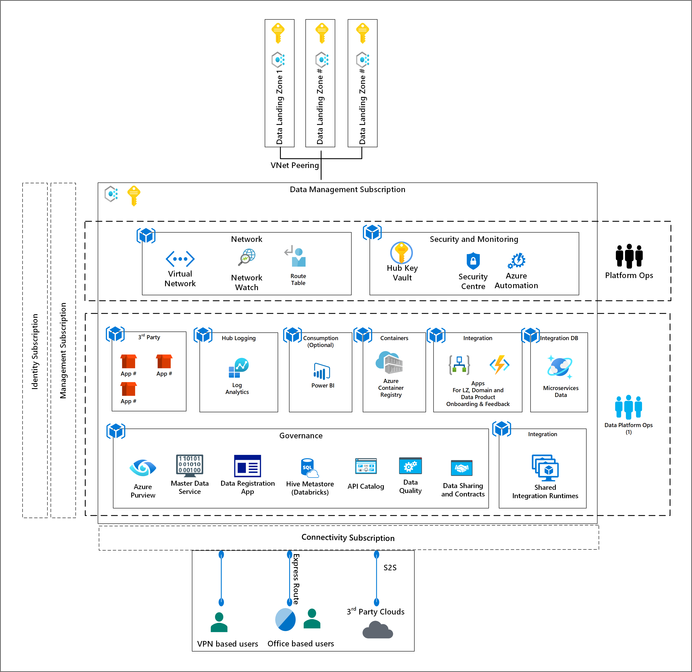

# Data Management Subscription

The Data Management Subscription is classified as a management function and is at the heart of the Enterprise Scale Analytics and AI platform. It is responsible for the governance of the platform and enables communication to ingest data sources from Azure, 3rd Party Clouds and On-Premises data sources.

Figure 1: Data Management Subscription Overview

The Data Management Subscription is a separate subscription which has the standard services of an Enterprise Scale framework but are connected to the Data Landing Zone(s) and connectivity subscription via Virtual Network Peering. This allows the data governance of the data, via crawlers, which connect to the Data Lakes and polyglot storage in the Data Landing Zone(s).

>[!NOTE]
>Polyglot persistence is an enterprise storage term used to describe choosing different data storage/data stores technologies to support the various data types and their storage needs. Polyglot persistence is essentially the idea that an application can use more than one core database (DB)/storage technology.

>[!WARNING]
>The Data Management Subscription must be deployed as a separate subscription under the platform branch of an Enterprise Scale architecture. This will allow it to control the governance across the enterprise. The [Cloud Adoption Framework Enterprise-Scale Architecture](https://docs.microsoft.com/azure/cloud-adoption-framework/ready/enterprise-scale/architecture.) illustrates the way to approach enterprise-scale.

## Data Catalogue

It is recommended to have a catalog service provisioned for defining the metadata of the data sets stored across the Data Landing Zone(s).

The catalog registers and maintains the data information on a centralized place and make it available for the organization, this ensures that you avoid redundant data ingestion's from different project teams and duplications of datasets.

[Azure Purview](https://docs.microsoft.com/azure/purview/overview) serves as:

* System of registration
* Discovery for enterprise data sources
* Data Classification
* Policy Store
* API for registering and reading data information.
* Compliance Dashboards

Figure 2: Azure Purview Overview

Being part of the Data Management Subscription, the Data Catalogue will be able to communicate with each Data Landing Zone via its VNet Peering and Self-Hosted Integration Runtimes. Data Discovery of on-premise and other public clouds is achieved by additional deployment of Self-Hosted Integration Runtimes.

>[!NOTE]
>Although this section of the documentation primarily focuses on using Azure Purview for Data Catalog capabilities combined with the data classification, labeling, and compliance policy enforcement capabilities of Azure Information Protection, we appreciate that many enterprises may have invested in other products such as Alation, Okera, Collibra, etc. If this is the case then please work with your vendor to apply the principles described for a Data Management Subscription and get as close as you can - some custom integration might be required.

### Data Discovery

The Data Discovery or Catalog reflects the state of all the data that the Enterprise owns (the data estate).

The scanning process connects directly to a data source on a schedule.

As a new Data Landing Zone is added to the environment, the associated Data Lakes and Polyglot persistence sources will be registered as a source for the Data Catalogue Crawlers to scan.

With this automated discovery of your data estate to populate the catalog, this will enable you to crawl metadata from Azure and on premises data sources, scan your data lakes, blobs and other supported targets to extract schema for XML, TSV/CSV/PSV/SSV, JSON, Parquet, Avro and Orc file types, and also allows automated Catalog updates through configurable scheduling of scans and scan rule sets.

>[!IMPORTANT]
>As a new Data Landing Zone is added to the environment, the associated Data Lakes and Polyglot storage should be registered, via Azure DevOps, as a source for the Data Catalogue Crawlers to scan.

## Data Classification

Azure Purview allows you to apply system or custom classifications on File, Table or Column assets.

Classifications are like subject tags and are used to mark and identify content of a specific type found within your data estate during scanning. Sensitivity labels are used to identify the categories of classification types within your organizational data, and to group the policies you wish to apply to each category. It makes use of the same sensitive information types as Microsoft 365, allowing you to stretch your existing security policies and protections across your entire content and data estate.

It can scan and automatically classify documentations. For example, if you have a file named "multiple.docx" and it has a National ID number in its content, Azure Purview will add classification such as EU National Identification Number in the Asset Detail page.

In addition to Azure Purview, Azure SQL Database, Azure SQL Managed Instance and Azure Synapse Analytics includes Advanced Data Security. It includes functionality for discovering and classifying sensitive data, surfacing and mitigating potential database vulnerabilities, and detecting anomalous activities that could indicate a threat to your database. It provides a single go-to location for enabling and managing these capabilities. See [Advanced Data Security](https://docs.microsoft.com/azure/azure-sql/database/advanced-data-security).

## Data Lineage

Data Lineage plays an important component in a Data Mesh. Lineage is a factor in ascertaining data quality and validating compliance. Lineage also adds context to Data Sets and Products that allows for discoverable and self-serviceable Data Products.

One of the primary features of a Data Catalog is the ability to show the lineage between datasets. Azure Purview supports capturing data lineage from ADF activities Copy Data, Data flow and Execute SSIS package. In addition to the native integration, custom lineage reporting is also supported via Atlas hooks or REST API.

Figure 3: Data Lineage

>[!IMPORTANT]
>It is recommended that Azure Data Factory which should be the default ingestion solutions as it will enable data lineage in Azure Purview and other ingestion patterns should use Apache Atlas API to update Data Lineage as part of their data processing.

## Data Quality Management

Enterprise are advised to continue with their current solution.

## Data Modelling Repository

Entity Relationship models should be stored and captured in the Data Management Subscription to allow the enterprise to have one place to go for Conceptual diagrams.

[ER Studio](https://www.idera.com/er-studio-enterprise-data-modeling-and-architecture-tools) and [iServer](https://www.orbussoftware.com/data-architecture/) are used by many Enterprise Customers to model their datasets prior to ingesting.

### Industry Specific Data Models and Common Data Model with Data Lake
An industry data model enables organizations to more holistically capture and define business concepts, refine and integrate processes, and build interoperability in their ecosystem. [Microsoft acquired ADRM Software, leader in large-scale, industry-specific data models](https://blogs.microsoft.com/blog/2020/06/18/microsoft-acquires-adrm-software-leader-in-large-scale-industry-specific-data-models/)  to support this requirement on Azure.

With the Common Data Model (CDM), organizations can use a data format that provides semantic consistency across applications and deployments. With the evolution of the Common Data Model metadata system, the model brings the same structural consistency and semantic meaning to the data stored in Microsoft Azure Data Lake Storage Gen2 with hierarchical namespaces and folders that contain schematized data in standard Common Data Model format. The standardized metadata and self-describing data in an Azure data lake facilitates metadata discovery and interoperability between data producers and data consumers such as Power BI, Azure Data Factory, Azure Databricks, and Azure Machine Learning. When combined, these elements provide compelling centralized data, structured data, fine-grained access control, and semantic consistency for apps and initiatives across the enterprise. See [Use the Common Data Model to optimize Azure Data Lake Storage Gen2](https://docs.microsoft.com/common-data-model/data-lake).

## Master Data Management

Enterprises have typically invested several years into building out a Master Data Management. Some of the vendors in this space are: -

* [SAP Master Data Governance](https://www.sap.com/products/master-data-governance.html)
* [Semarchy](https://www.semarchy.com/)
* [Profisee](https://profisee.com/)

Using Azure Data Factory, you would enable calls to pull current Master Data, via the Master Data Management's API, and join with the data we are enriching and/or curating.

A number of Master Data Management solutions are fully integrated with Azure Active Directory you can secure the Domains and provide different views for different user groups.

Here are some common Master Data Management styles and how they can be supported via the Enterprise Scale Analytics and AI framework.

### Registry

A central repository exits for all Master Data keys. The "Registry" lives in Management Subscription. Each Landing Zone owns its own Master Data repository. This model allows a centralized lookup but supports numerous source locations for Master Data. The Registry can live in the Management Subscription and can reference source systems in other Landing Zones.

Changes to Master Data continue to be made to the Source Systems. It allows Source Systems to manage their own quality of Master Data. This model can also help deal with numerous distributed sources of Master Data.

### Consolidation

Master Data is consolidated into one hub in the Management Subscription. Master Data from Landing Zones is consolidated into the central hub. Updates are made to source Master Data are written back to the source system. This is the quickest and simplest model if you have no existing Master Data Management system.

### Coexistence

This style allows you to establish a single version of the truth in the same way the consolidation style does. The difference is that the hub stores Master Data while updates can also take place in the source systems.  All the master data model attributes must have consistency. Cleansing must take place before uploading them into the MDM system.  Master data changes can happen in both the MDS system and application systems. Data from the Hub can be published back to sources.

This model can also span multiple environments such as multi-cloud and on-prem.

### Centralized

This builds on the Coexistence style above. There exists a central Master Data Management repository in the Management Subscription representing the truth, also known as "the Golden Record". Master Data can be pulled from various systems and consolidated into a central hub. Applications and systems use this as the source of Master Data. Source Systems can subscribe to updates published by the central hub.

>[!IMPORTANT]
>Regardless the Master Data Management style chosen, we recommend that the Master Data Management Hub or Registry be hosted in the Data Management Subscription. And in cases of multiple Master Data sources, they can be distributed among Landing Zones as architecturally appropriate.

## API Catalogue

It is likely across the enterprise teams will create various APIs which without an API catalog would be hard to discover. Placing an API Catalog in the Data Management Subscription can help solve this problem.

For every API registered, in the catalog, it can help you standardize documentation and offers a place for internal collaboration on APIs.

An API Catalogue can drive Consumption, Publishing and Governance controls across the organization.

### Data Sharing and Contracts

Although Enterprise Scale Analytics and AI uses Azure AD Entitlement management to control access and sharing of data, the enterprise might require a sharing and contract repository. AS this is an organizational function this repository should reside in the Data Management Subscription.

These contracts should give information on data validation, data model and security policies.

## Data Lifecycle

Data products may have different lifecycles. We recommend applying policies to regulate the data lifecycle. A typical pattern is that newly ingested data  is used and accessed often. As the age since ingesting increases the rate of data access decreases. Older data will see a drastic drop in usage. Your  data products and entities in these products may have different lifecycles. Some data can stay unused after the initial ingest or is rarely accessed once stored. Some data sets may expire days or months after creation, while other data sets are actively used and modified throughout their lifetimes. Most countries have regulations related to how long you are required to store data such as PII and accounting data. As an example, a country requires retention of primary documentation for 5 years (incoming and outgoing invoices, cash book balances, bank vouchers, salary slips, etc.) and retention of secondary documentation for 3.5 years (letters, agreements, notes etc).

In Azure this data lifecycle is handled by each relevant service containing persisted data.

Azure Blob Storage lifecycle management uses a rule-based policy. You should use the policy to transition your data to the appropriate access tiers or expire at the end of the data's lifecycle.

The lifecycle management policy lets you:

* Transition blobs from cool to hot immediately if accessed to optimize for performance.
* Transition blobs, blob versions and blob snapshots to a cooler storage tier (hot to cool, hot to archive or cool to archive) if not accessed or modified for a period of time to optimize for cost.
* Delete blobs, blob versions and blob snapshots at the end of their lifecycle.
* Define rules to be run once per day at the storage account level.
* Apply rules to containers or a subset of blobs (using name prefixes or blob index tags as filters).

Take a scenario where data is used frequently during the first stages of the lifecycle, but only occasionally after a month. Later than a month, the data set is rarely used. In this scenario, hot storage is best during the first month. Cool storage is most cost optimal for occasional access. Archive storage is the best tier option after the data gets old. Use a lifecycle management policy rule to move aging data to cooler tiers.

[Data Lake Lifecycle Management](../03-datalandingzones/02-datalakeservices.md#lifecycle-management) for Enterprise Scale Analytics and AI prescribes further thoughts around the different layers in a Data Lake.

## Automation Interfaces

The Enterprise Scale Analytics and AI solution pattern creates three resource groups to assist with building out custom onboarding solutions.

Typically, user interfaces would reside in the governance resource group. The application layer and database would reside in the automation-rg and automationdb-rg respectively.

You could use these resource groups to host application which would create data landing zones, domains and data products. You could develop a logic application to capture feedback and route to the correct teams.

### Ingestion Framework Engine User Interface

If your enterprise has already developed an ingestion framework engine for automatically ingesting data based on registering metadata which includes connection strings, path to copy data from and to, and ingestion schedule then we suggest the application resides in the Data Management Subscription.

For example, you could implement the following workflow for a Ingestion Framework Engine:

1. The Ingestion Engines Framework UI is deployed to the Data Management Subscription.
1. The application communicates with an Azure Data Factory SQL DB Metastore, in each Data Landing Zone, to create new data sources for ingestion for landing into the Data Landing Zones.
1. Once Ingest requests have been approved, it will insert the source into the Data Data Management Subscription Catalogue via its API.
1. The metadata would be used as a driver for Azure Data Factory jobs and it will have most of the parameters required for running of jobs.
1. ADF Master Pipeline will pull parameters from Metastore to land RAW Data Lake, Enrichment (with conformed data types) and creation of Hive View in Azure Databricks Metastore.

## Container Registry

To allow the Data Platform Ops to deploy standard containers for us in data science projects, the Data Management Subscription hosts an Azure Container Registry.

## Global DNS

The Enterprise Scale Analytics and AI solution pattern makes us of Private Links which relies on having a private DNS zone. Please check with you networking team before deploying another Private DNS as they might have already deployed the services.

## Shared Integration Runtime(s)

To enable rapid onboarding of datasets, from the Data Management Subscription, we recommend deploying a pair of Self Hosted Integration Runtimes, **per Data Landing Zone**. in the Data Management Subscription. These should be hosted in the Integration Resource Group.

By having a resource group, within the Data Management Subscription VNET, it allows the subnet to allow communication to on-premises or Azure cloud sources.

To enable you would need to: -

* Create at least one Azure Data Factory in the Data Landing Zone.
* Create at least two Virtual Machines, with a Self-Hosted Integration Runtime inside an availability zone using the [ARM template](https://github.com/Azure/Azure-quickstart-templates/tree/master/101-vms-with-selfhost-integration-runtime).
* [The Self Hosted Integration Runtimes should be setup in high availability mode](https://docs.microsoft.com/Azure/data-factory/create-self-hosted-integration-runtime#high-availability-and-scalability).
* The Self Hosted Integration Runtimes should be associated with Azure Data Factories in the Data Landing Zone(s).
* [Azure Automation should be setup to update the Self Hosted Integration Runtime periodically](https://docs.microsoft.com/Azure/data-factory/self-hosted-integration-runtime-automation-scripts)
* For other Data Factories, in the Data Landing Zone, which require access to on-premise data sources, you should give permission from the original Data Landing Zone to the Data Factory to [share the runtimes](https://docs.microsoft.com/Azure/data-factory/create-shared-self-hosted-integration-runtime-powershel).

>[!NOTE]
>This does not restrict the deployment of Integration Runtimes inside a Data Landing Zone or into 3rd party clouds.

## Log Feedback to Enterprise Scale Analytics v-team

[Log Feedback for this page](https://github.com/Azure/enterprise-scale-analytics/issues/new?title=&body=%0A%0A%5BEnter%20feedback%20here%5D%0A%0A%0A---%0A%23%23%23%23%20Document%20Details%0A%0A%E2%9A%A0%20*Do%20not%20edit%20this%20section.%20It%20is%20required%20for%20Solution%20Engineering%20%E2%9E%9F%20GitHub%20issue%20linking.*%0A%0A*%20Content%3A%2002-datamanagement%20%E2%9E%9F%2001-overview.md)

>[Previous](../01-overview/05-networking.md)
>[Next](../03-datalandingzones/01-datalandingzone.md)

