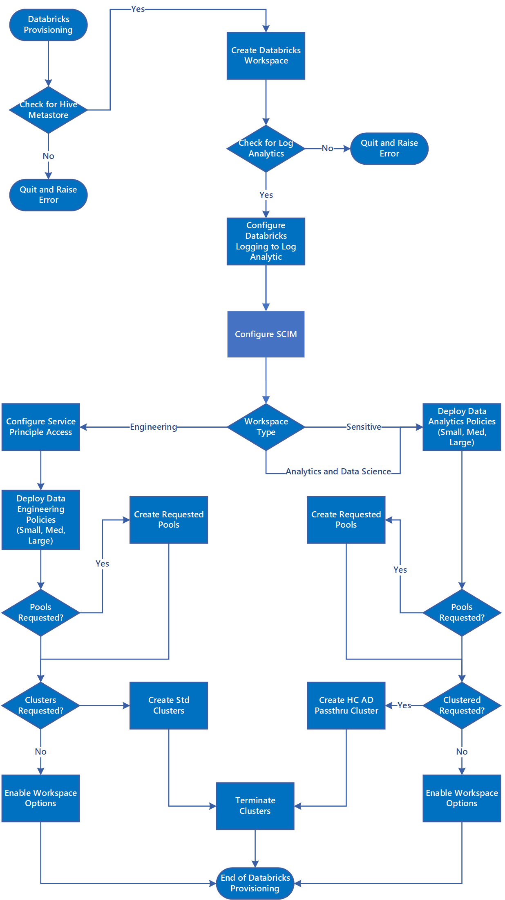

# Azure Databricks Integration

Azure Databricks is a data analytics platform optimized for the Microsoft Azure cloud services platform. Azure Databricks offers two environments for developing data intensive applications: Azure Databricks SQL Analytics and Azure Databricks Workspace.

For the purpose of Enterprise Scale Analytics v1 we have focussed on Azure Databricks Workspaces. As Azure Databricks SQL Analytics moves to General Availability we will focus on how this can be integrated into the Enterprise Scale Analytics and AI solution pattern.

## Overview

For every Data Landing Zone deployed, three shared Azure Databricks Workspaces will be created.

1. An Azure Databricks Workspace is provisioned for Ingestion and Processing which will connect to Azure Data Lake via Azure Service Principals. This is referred to as **Azure Databricks Engineering Workspace**.
1. An Azure Databricks Workspace is provisioned for all Data Scientists and Data Ops which will connect to the Azure Data Lake using AAD Passthrough. This is referred to as **Azure Databricks Analytics and Data Science Workspace**.
1. An Azure Databricks Workspace provisioned for use with Sensitive and/or Secret Data Azure Data Lake using AAD Passthrough, Table Access Control and Conditional Access. This is referred to as **Azure Databricks Sensitive Workspace**.

The **Azure Databricks Analytics and Data Science Workspace** and **Azure Databricks Sensitive Workspace** are shared across the whole Data Landing Zone, with all users, which have been given access to the Workspace. They should not be used for Data Ingestion, Transformation and Load - the **Azure Databricks Engineering Workspace** should be used for this instead.

If you have an automated ingestion framework engine the **Azure Databricks Engineering Workspace** will use both an Azure Key Vault created in the Metadata Services Resource group, data ingestion pipelines from RAW into ENRICHED and an Azure Key Vault, per Domain, for running developed engineering pipelines to transform from RAW to ENRICHED.

If you don't have an automated ingestion framework engine the **Azure Databricks Engineering Workspace** will use just the Azure Key Vault, per Domain, for running developed engineering pipelines to transform from RAW to ENRICHED.

The **Azure Databricks Data Engineering Workspace** should use Service Principals to access Data Lakes.

>[!NOTE]
>Automated ingestion framework engine refers to the case where you have developed an automated solution for registering and ingesting data which in turn drives an Azure Data Factory or other ETL product. A developed pipeline is where the Domain has had to write the pipeline, end-to-end, in Azure Data Factory or another ETL product.

The **Azure Databricks Analytics and Data Science** and **Azure Databricks Sensitive** Workspaces should have a Cluster Policies which allow creation High Concurrency Cluster. This type of cluster will allow the Data Lakes to be explored using AAD Credential passthrough see [AAD Credential passthrough](https://github.com/hurtn/datalake-ADLS-access-patterns-with-Databricks/blob/master/readme.md#pattern-3---aad-credential-passthrough).

## Azure Databricks Configuration

As at Jan 2021, the Azure Databricks deployment is part parameter based, via an ARM template and YAML scripts, but requires some manual intervention to complete the configuration of ALL Workspaces.

All Azure Databricks Workspaces should use the Premium Plan. The predominate reason for a Premium Workspace is the ability for: -

* Optimized autoscaling of compute.
* Azure AD credential passthrough.
* Conditional Authentication.
* Role-based access control for notebooks, clusters, jobs, tables.
* Audit Logs.

To align to Enterprise Scale Analytics and AI we recommend that **ALL** Workspaces have the following default deployment options configured:-

* The Azure Databricks Workspaces should connect to an external Hive Metastore which resides in the Data Management Subscription.
* Each Workspace should be configured to send Databricks Diagnostic Logging to Azure Log Analytics.
* Cluster Policies should be implemented to limit the ability to create clusters based on a set of rules. See [Manage Cluster Policies](https://docs.microsoft.com/azure/databricks/administration-guide/clusters/policies).
  * Multiple cluster policies will be defined which each target group (Domain) as part of onboarding process would be assigned permissions to use by the Data Landing Zone Ops. By default, cluster creation permission will be denied to all the users except Data Landing Zone ops team but permission to use cluster policy will be given to different teams/groups. To reduce the time it takes for clusters to spin up for jobs the time it you should Enable Databricks pools.
  * We recommend that Cluster Policies are used in combination with Azure Databricks Pools to reduce cluster start and auto-scaling times by maintaining a set of idle, ready-to-use instances. See [Pools](https://docs.microsoft.com/azure/databricks/clusters/instance-pools/)
* All Azure Databricks operational secrets such as SPN credentials and connection strings should be retrieved from Azure Key Vaults.
* Configure a separate Enterprise Application, per workspace, for use with SCIM (System for Cross-Domain Identity Management) and link to Azure Databricks Workspace to control access and permissions to each Azure Databricks Workspace. See [Provision users and groups using SCIM](https://docs.microsoft.com/azure/databricks/administration-guide/users-groups/scim/) and [Configure SCIM provisioning for Microsoft Azure Active Directory](https://docs.microsoft.com/azure/databricks/administration-guide/users-groups/scim/aad).

>[!WARNING]
>Failure to configure the Azure Databricks Workspaces to use the Azure Databricks SCIM interface will impact how you provide security controls. It will move from automated to a manual process and break all deployment CI/CD pipelines.

The following Access Control options are set for **ALL** three Databricks Workspaces.

1. Workspace Visibility Control: Enabled (default: Disabled).
1. Cluster Visibility Control: Enabled (default: Disabled).
1. Job Visibility Control: Enabled (default: Disabled).

The following options are enabled for the Azure Sensitive Workspace over and above the default deployment settings: -

1. Notebook Exporting: Disabled (default: Enabled).
1. Notebook Table Clipboard Features: Disabled (default: Enabled).
1. Table Access Control: Enabled (default: Disabled).
1. Azure Active Directory Conditional Access

## Azure Databricks Deployment

The three Azure Databricks Workspaces are deployed as part of a new Data Landing Zone deployment. Figure 1, shows the overall workflow of deploying an Azure Databricks environment in Enterprise Scale Analytics and AI.

Figure 1: Azure Databricks Deployment into a Data Landing Zone

--TO DO Explain Process

>[!NOTE]
>During the creation of a new Domain we will alter the configuration of all three Azure Databricks Workspaces within a Data Landing Zone. Please see  [Domain & Data Product Deployment Process](../06-dataops/02-es-aai-devops.md#domain--data-product-deployment-process)  for how this is implemented with Azure Databricks shared Workspaces.

## Further Reading

The Enterprise Scale Analytics and AI takes into account the following best practices for integrating Azure Databricks into the solution pattern: -

* [Securing access to Azure Data Lake Gen 2 from Azure Databricks](https://github.com/hurtn/datalake-ADLS-access-patterns-with-Databricks/blob/master/readme.md)
* [Azure Databricks Best Practices](https://github.com/Azure/AzureDatabricksBestPractices/blob/master/toc.md)

>[!div class="step-by-step"]
>[Previous](02-datalakeservices.md)
>[Next](04-synapse.md)
