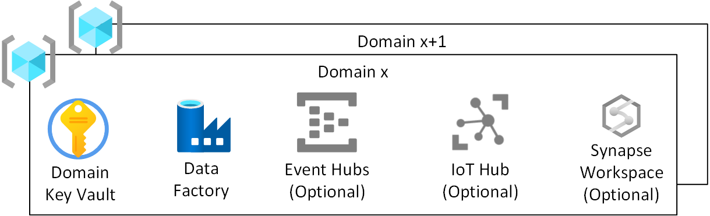
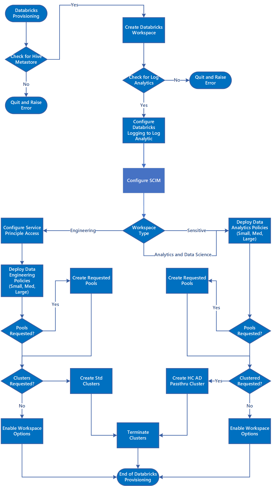

# Domains

The role of a Domain was previously explained under [Enterprise Scale Analytics and AI Teams](../01-overview/02-esa-ai-teams.md#domain-ops-per-domain) and that Domains helped understand [Data Landing Zone Division and Consumption](../01-overview/03-dlzdivision.md).

This section explains the infrastructure which is deployed for each Domain inside a Data Landing Zone.

## Overview

Figure 1: Domain Resource Group

For each Domain, in a Data Landing Zone, which is onboarded we will  create:

* A Domain Azure Key Vault.
* A Domain Azure Data Factory for running developed engineering pipelines to transform from RAW to ENRICHED.
* A Domain security user group which we use to give access to the Azure Databricks Analytics and Data Science workspace.
* A Domain sensitive security group which we use to give access to the Azure Databricks Sensitive workspace.
* A Service Principal which is used by the Domain for deploying ingest jobs to the Azure Databricks Engineering workspace.

Event Hubs, IoT Hubs, Stream Insight and Machine Learning are optional services.

This leads to a Resource Group per Domain.

>[!NOTE]
>As a Domain is responsible for data ingestion and enrichment only, our pre-scribed view is to deploy Azure Data Factory instead of Azure Synapse Analytics workspace. Our adopted policy is to reduce the surface area to required features. Azure Synapse Analytics is more suited to our data product layer.

## Azure Key Vault

Enterprise Scale Analytics and AI will make use of Azure Key Vault functionality and store secrets within Azure where possible.

Each Data Landing Zone will have an Azure Key Vault per Domain. This functionality will ensure that encryption key, secret and certificate derivation meet the requirements of the environment. This is to allow better separation of administrative duties and reduce risk associated with mixing keys, secrets of differing classifications and Domains.

>[!IMPORTANT]
>Domain specific key vaults should follow the least privilege model and avoid secret sharing across environments as well as transaction scale limits.

## Azure Data Factory

An Azure Data Factory will be deployed to allow pipelines written, by the Domain Ops, to take data from RAW to ENRICHED using developed pipelines. We prescribe using Mapping Data Flows for transformations and breaking out to use **Azure Databricks Engineering Workspace** for complex transformations.

## Event and IOT Hubs (Optional)

If the Domain has a requirement to stream data in and the Event Hubs and IoT Hubs then it is possible to deploy downstream Event and IOT Hubs in the Domains Resource Group.

## Configuration specific to Databricks during New Data Landing Zone Creation

Figure 2: Data Landing Zone Provisioning for Databricks

Figure 2, illustrates how the Databricks workspaces are created in a new Data Landing Zone and the steps which are linked to creating the three Azure Databricks Workspaces:

1. The process checks for an external Hive Metastore in the Data Management Subscription.
1. The process checks for a Log Analytics in the Enterprise Scale Management Subscription.
1. The workspace is configured to send it logs to a Log Analytics workspace
1. We create an enterprise application for each Azure Databricks workspace and Configure SCIM provisioning for [Microsoft Azure Active Directory](https://docs.microsoft.com/azure/databricks/administration-guide/users-groups/scim/aad).
1. If an engineering workspace is being created we configure it for service principle access using the service principle assigned to the domain.
1. For all workspaces we then deploy Cluster Policies which are aligned to either **Azure Databricks Engineering Workspace** or a **Azure Databricks Analytics and Data Science Workspace**.
1. If you have decided to reduce the start up times of your jobs or data exploration then you can make use of [Pools](https://docs.microsoft.com/azure/databricks/clusters/instance-pools/).
1. If you have requested clusters then the process should provision those cluster types.
1. Depending on the workspace type you should enable different workspace options see [Azure Databricks Deployment](03-databricks.md#azure-databricks-deployment).

## Subprocess of adding Domain to a Data Landing Zone

Figure 3: Adding Permissions to Databricks Workspaces

Figure 3, shows the subprocess of adding a Domain to the Data Landing Zone Azure Databricks Workspaces and how the security groups are added to the Azure Enterprise Application and then into the workspace. How we store the Domain Service Principal PAT in an Azure Key Vault-backed scope in the Domain for use with the developed engineering pipelines.

### Azure Databricks Engineering Workspace Process

1. Add the Domain Service Principal to the workspace.
1. Obtain the Personal Access Token for the Domains Service Principal to be used with tools such as Azure Data Factory.
1. Store the Personal Access Token in the Domain Key Vault.
1. Assign the Domain Service Principal access to the Cluster Policies.
1. Assign appropriate workspace permissions to Domain Service Principal.

### Azure Databricks Analytics and Data Science Workspace Process

1. Add the Domain Azure AD Groups to the workspace Azure AD Enterprise Application.
1. Wait for Azure AD Enterprise Application to sync with Azure Databricks.
1. Add Domain Engineering Azure AD Group to the workspace.
1. Add Domain User Azure AD Group to the workspace.
1. Assign the Domain Azure AD Groups access to the Cluster Policies.
1. Assign appropriate workspace permissions to Domain Azure AD Groups.

>[!NOTE]
>The Domain Engineering Azure AD Group allow Read/Write and Domain User Azure AD Group should allow Read-Only. All of this is via Azure AD Passthrough.

#### Azure Databricks Sensitive

1. Add the Domain Azure AD Groups to the workspace Azure AD Enterprise Application
1. Wait for Azure AD Enterprise Application to sync with Azure Databricks
1. Add Domain Engineering Azure AD Group to the workspace.
1. Add Domain Sensitive AD Group to the workspace.
1. Assign the Domain Azure AD Groups access to the Cluster Policies.
1. Assign appropriate workspace permissions to Domain Azure AD Groups.

>[!NOTE]
>The Domain Engineering Azure AD Group and Domain Sensitive Azure AD Group should be setup so only the Sensitive AD Group can see the sensitive data. This should be achieved by a Policy Engine or some of the methods described in [Sensitive Data](../05-securitymodel/02-sensitive.md#sensitive-data).

## Log Feedback to Enterprise Scale Analytics v-team

[Log Feedback for this page](https://github.com/Azure/enterprise-scale-analytics/issues/new?title=&body=%0A%0A%5BEnter%20feedback%20here%5D%0A%0A%0A---%0A%23%23%23%23%20Document%20Details%0A%0A%E2%9A%A0%20*Do%20not%20edit%20this%20section.%20It%20is%20required%20for%20Solution%20Engineering%20%E2%9E%9F%20GitHub%20issue%20linking.*%0A%0A*%20Content%3A%2003-datalandingzones%20%E2%9E%9F%2005-domains.md)

>[Previous](04-synapse.md)
>[Next](06-dataproducts.md)
