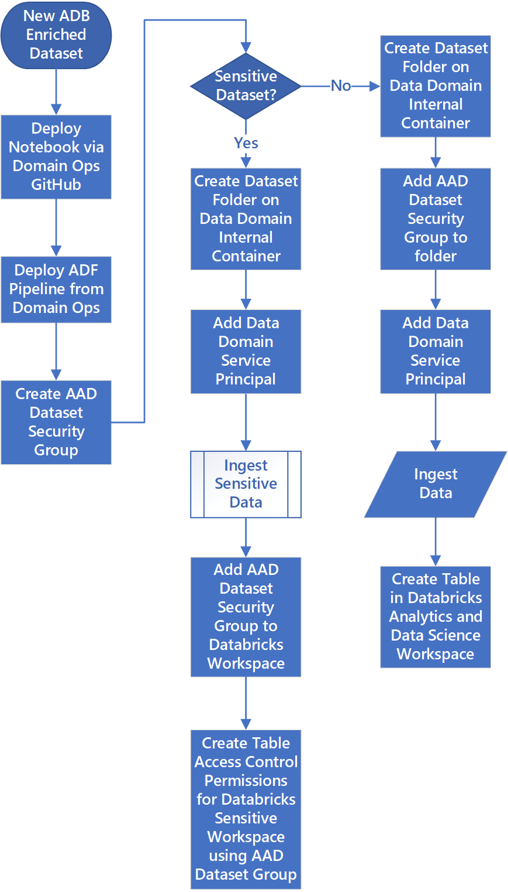

# Data Ingestion

In the Enterprise Scale Analytics and AI solution pattern, Domain and Data Product will ingress, transform and egest data.

>[!IMPORTANT]
>Domains will copy data from source to raw and then to enriched with conformed data types. Domains do not carry out any transformation of data. However, if the business has multiple use cases where it requires the same data to be joined together such as Weather and Location data then the domain could be asked to create this in the enriched layer. \
\
>Data Products Teams can apply transformations and create there datasets in the curated layer of the Data Lake as well as the [Polygot Storage](https://techcommunity.microsoft.com/t5/data-architecture-blog/polyglot-persistence-with-azure-data-services/ba-p/1514912) they have chosen to use.

Azure provides several services for ingesting and egesting data to various native and third party platforms. Depending on volume, velocity, variety, and direction, different services, such as the following, can be leveraged.

- [Azure Data Factory](https://docs.microsoft.com/azure/data-factory/introduction) integrates data silos, a service built for all data integration needs and skill levels. Easily construct ETL and ELT processes code-free within the intuitive visual environment or write your own code. Visually integrate data sources using more than 90+ natively built and maintenance-free connectors at no added cost. Using integration runtimes, engineers can extend pipelines to third party environments on-prem and other clouds.

- Some of these connectors support being used as a source (read) and sink (write). Azure native services, Oracle, SAP, and some others can be used as source or sink. However not all connectors support this, in which case you can default to the generic connectors such as ODBC, filesystem, and SFTP connectors.

- [Azure Databricks](https://docs.microsoft.com/azure/databricks/) is a fast, easy, and collaborative Apache Spark-based analytics service. For a big data pipeline, the data (raw or structured) is ingested into Azure through Azure Data Factory in batches, or streamed near real-time using Kafka, Event Hub, or IoT Hub. This data lands in a data lake for long term persisted storage, in Azure Data Lake Storage. Azure Databricks can read data from multiple data sources as part of the workflow.

- Power Platform provides [connectors to hundreds of services](https://docs.microsoft.com/connectors/connector-reference/) that can be event, schedule, or push driven. Power automate can act on events and trigger workflows, optimized for single records or small data volumes.

- Proprietary native and third party tooling provides niche capabilities to integrate with specialist systems and/or near-real-time replication.

- [Azure Data Share](https://docs.microsoft.com/azure/data-share/) enables organizations to securely share data with multiple external customers and partners. Once a data share account is created and datasets added, customers/partners can be invited to the data share. Data providers are always in control of the data that they have shared. Azure Data Share makes it simple to manage and monitor what data was shared, when and by whom.

>[!IMPORTANT]
>Every Data Landing Zone has an [Ingestion and Processing Resource Group](../03-datalandingzones/01-datalandingzone.md#ingestion-and-processing-resource-group) which exists for the purpose of Enterprises who have an ingestion framework engine. If you do not have this framework engine then the only resource we would recommend deploying is the *Azure Databricks Engineering Workspace* which would be used by Domains to run complex ingestion. See [Automated Ingestion Framework](03-dataonboarding.md#automated-ingestion-framework) for potential automation patterns.

## Azure Data Factory Ingest Considerations

If you have an ingestion framework engine then you should deploy a single Azure Data Factory, per Data Landing Zone, in the production Ingest and Processing Resource Group. The Azure Data Factory workspace should be locked off to users, and only managed identity and service principals will have access to deploy. Data Landing Zone Ops should have Read access to allow debugging of pipelines.

Each Domain will have their own Azure Data Factory which will be used by Domain Ops to move data from source to raw to enriched. By having a Azure Data Factory per domain we can enable a complete Continuos Integration(CI) and Continuos Development(CD) experience by only allowing pipelines to be deployed from Azure DevOps or GitHub.

All Azure Data Factory will predominately use the [Self-hosted Integration Runtime](https://docs.microsoft.com/azure/data-factory/concepts-integration-runtime), for their Data Landing Zone, within the Data Management Subscription. However, it will be possible to additional integration runtime to ingest On-Premises, third party clouds and third party SaaS datasources.

>[!TIP]
>By deploying a [Self-hosted Integration Runtime](https://docs.microsoft.com/azure/data-factory/concepts-integration-runtime) in the Data Management Data Landing Zone you can approve the IP range of to talk to on-premise or 3rd party cloud sources.

## Azure Databricks Ingest Considerations

This guidance builds on top of:

- [Securing access to Azure Data Lake Gen 2 from Azure Databricks](https://github.com/hurtn/datalake-ADLS-access-patterns-with-Databricks/blob/master/readme.md)
- [Azure Databricks Best Practices](https://github.com/Azure/AzureDatabricksBestPractices/blob/master/toc.md)
- [Azure Databricks Configuration in a Data Landing](../03-datalandingzones/03-databricks.md#)

A single Azure Databricks Data Engineering Premium Workspace should be deployed, per Data Landing Zone, in the production Ingest and Processing resource group. This will enable a complete CI/CD experience and only allow notebooks to be deployed from Azure DevOps or GitHub.

For Development we would expect  Domain Teams to have their own Databricks environment before checking in code to be deployed to the single Azure Databricks workspace in both Test and Production.

The test and production workspace will be locked off to users and only managed identity/service principals will have access to it. All management will be handled via Rest API.

Azure Data Factory, in the Domain Resource Group, should provide the orchestration for calling Azure Databricks jobs.

The Data Lakes will be mounted into this workspace using service principals see [Access via Service Principal](https://github.com/hurtn/datalake-ADLS-access-patterns-with-Databricks/blob/master/readme.md#pattern-1---access-via-service-principal).

Domain teams can deploy short, automated jobs on Databricks and expect their clusters to start quickly, execute the job, and terminate. Databricks Pools are recommended to be setup to reduce the time it takes for clusters to spin up for jobs.

Figure 1: New Azure Databricks Domain Dataset

Figure 1 is an example of how pipelines, written by the Domain Ops, can take data from SOURCE to RAW to ENRICH and ENRICHED to another ENRICHED datasets which want to use the Azure Databricks Engineering workspaces. Domains must deploy their notebooks via a Domain Ops repo using the Domain Ops Service Principle which was created when onboarding their domain. The notebook is called from the Domain Azure Data Factory.

It is recommended that the customer looks to implement a deployment framework for the new pipeline, in Azure DevOps which would create the dataset folders, assign ACLs, and can create a table with or without Databricks Table Access Controls enforced.

## Stream Ingestion

Organizations may have to support situations where publishers generate high-velocity event streams. For this pattern, a message queue is recommended i.e. Event Hubs or IoT Hub that can ingest these streams.

Both Event Hubs and IoT Hub are scalable event processing services that can ingest and process large volumes of events and data, with low latency and high reliability. Event Hubs is designed as a big data streaming and event ingestion service, whereas IoT Hub is a managed service that acts as a central message hub for bi-directional communication between your IoT application and the devices it manages.

From that point data can either be exported out to a data-lake target location at regular intervals (batch) and processed in near-real-time via spark streaming (Azure Data Bricks), Azure Data Explorer, Azure Stream Analytics or Time Series Insights.

The last Event Hub or Kafka Landing Zone, inside the use case specific Landing Zone should send its aggregated to both the Data Lake RAW layer, in one of the Data Landing Zones, and/or to an Event Hub related to the Domain in the Data Landing Zone.

## Ingestion Monitoring

The out of the box [Azure Data Factory pipeline monitoring](https://docs.microsoft.com/azure/data-factory/monitor-visually) will be used for monitoring and troubleshooting the exceptions from the Azure Data Factory pipelines. It reduces the effort on developing custom monitoring and reporting solution.

The in-built monitoring is one of the primary reasons to use Azure Data Factory as the main orchestration tool and the creation can be automated using Azure Policy.

## Data Sources Mapping to Service

The tables below map out the Ingestion and Processing Services to the common sources which typically need to be Ingest or Egest from Azure.

| ID | Mechanism                   | Note                           |
|----|-----------------------------|--------------------------------|
| A  | Azure Data Factory          | Built-in and generic (ODBC, SFTP, REST) connectors |
| B  | Azure Databricks            | Custom code (jdbc, jar etc.)   |
| C  | 3rd party                   | Wandisco, Attunity, GoldenGate |
| D  | Other                       | i.e. native capability         |
| E  | Power Platform + Logic Apps | Power Automate connectors      |

Table 6: Ingestion Services

| Provider | Type | Hosted | Category | Notes | Full Load Ingest | Incr. Load Ingest | Real Time Ingest | Full Load Egress | Incr. Load Egress | Real Time Egress |
|--|--|--|--|--|--|--|--|--|--|--|
| Oracle | Tabular | IaaS | Database | GoldenGate to ADLS | A, B | A, B | C | A, B | A, B | C |
| SQL Server | Tabular | IaaS | Database | SLT+Attunity | A, B | A, B | C, D2 | A, B | A, B | C, D2 |
| MySQL | Tabular | IaaS | Database | SLT+Attunity | A, B | A, B | C, D2 | A, B | A, B | C, D2 |
| SAP BW | Tabular | IaaS | Database | SLT+Attunity | A, B, C, D | A, B, C, D | C | - | - | - |
| SAP HANA | Tabular | IaaS | Database | SLT+Attunity | A, B, C, D | A, B, C, D | C | A, B | A, B | - |
| Impala | Tabular | IaaS | Database | - | A, B | A, B | - | B | B | - |
| SharePoint | List | SaaS | Record store | - | A, E | A, E | E | A, E | A, E | E |
| REST | REST | Various | REST | XML, JSON, CSV | A, B, E | A, B, E | A, B, E | A, B, E | A, B, E | A, B, E |
| Outlook | Email | SaaS | REST | XML, JSON, CSV | E | E | E | E | E | E |

Table 7: Data Sources Mapping to Service

Subject to destination Azure Data Migration service can replicate from on-prem/3rd party DB (SQL Server, Postgres, MySQL, Oracle) to Azure based DB.

## Log Feedback to Enterprise Scale Analytics v-team

[Log Feedback for this page](https://github.com/Azure/enterprise-scale-analytics/issues/new?title=&body=%0A%0A%5BEnter%20feedback%20here%5D%0A%0A%0A---%0A%23%23%23%23%20Document%20Details%0A%0A%E2%9A%A0%20*Do%20not%20edit%20this%20section.%20It%20is%20required%20for%20Solution%20Engineering%20%E2%9E%9F%20GitHub%20issue%20linking.*%0A%0A*%20Content%3A%2004-ingestion%20%E2%9E%9F%2001-overview.md)

>[Previous](../03-datalandingzones/06-dataproducts.md)
>[Next](02-sapingestion.md)
