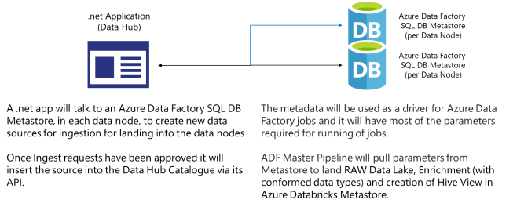
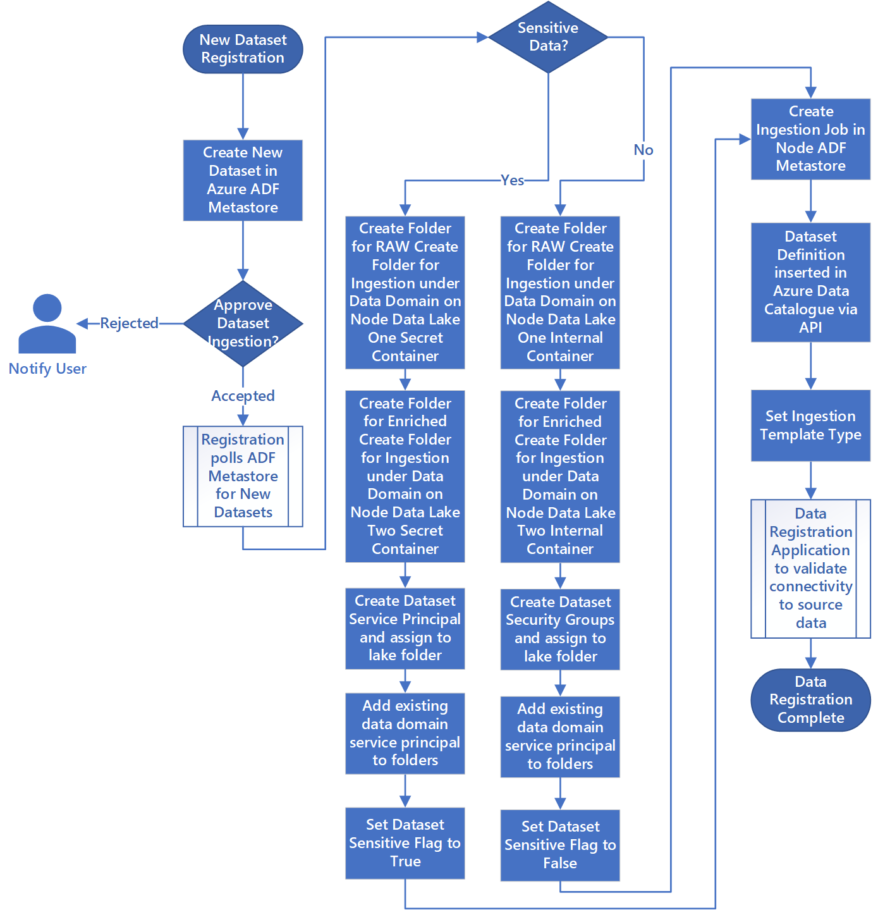
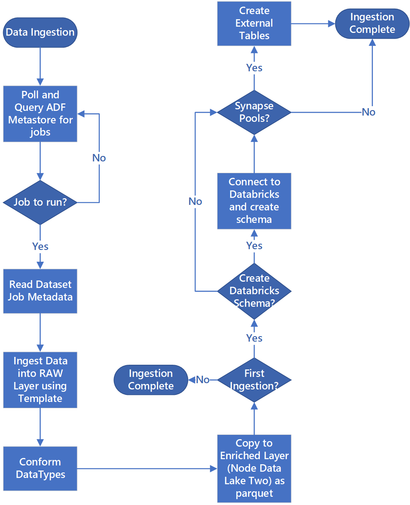

# Automated Ingestion Framework

In previous topics [Azure Data Factory Ingest Considerations](01-overview.md#azure-data-factory-ingest-considerations) and [Ingestion and Processing Resource Group](../03-datalandingzones/01-datalandingzone.md#ingestion-and-processing-resource-group) we have discussed enterprises building there own Custom Ingestion Framework.

This section suggests guidances for items and processes which such a Custom Ingestion Framework could drive.

>[!WARNING]
>The description and processes below do not constitute a Microsoft product nor are they a complete specification. They are guidance as to how you might want to think about creating an Automated Ingestion Framework

## Automated Data Source Application



Figure 1: Automated Ingestion Process

Figure 1, illustrates how Domains could register new data sources via a custom application, Logic App or PowerApps.

The application could talk to an Azure Data Factory SQL DB Metastore, in each Data Landing Zone, to create new data sources for ingestion into the Data Landing Zones. Once ingest requests have been approved it insert the source into the Azure Purview, in the Data Management Subscription, via its Azure Purview Rest API.

The metadata will be used as a drive for Azure Data Factory jobs and will have most of the parameters required for running of pipelines.

An Azure Data Factory Master pipeline would pull parameters from the Azure Data Factory SQL DB Metastore to land data, from source, into the Data Lake and Enrich with conformed data types before creating a table definition in the Azure Databricks Hive Metastore.

The app should store Jobs' Technical Metadata and Operational Metadata in an Azure SQL DB Database, for all job types (including indirect ingestion from sources like SAP) for all areas and functions. The metadata can be used by Data Platform Ops, Data Landing Zone Ops and Domain Ops for:

- Tracking of jobs and latest data loading date/time for datasets related to their functions.
- Tracking of available datasets
- Data volume growth
- Real-time updates on job failures

The technical metadata could be used as a driver for various jobs and it will have most of the parameters required for running of jobs.

Operational metadata can be used for tracking of:

- Jobs, job steps and their dependencies
- Job performance and performance history
- Data volume growth
- Job failures
- Source metadata changes etc
- Business functions dependent on datasets

Data Landing Zone Ops and Domain Ops could build PowerBI Operational reports and event notifications, over the top of the Azure SQL DB Database, should this be a requirement of the business.

## New Dataset Registration (Automated)

Figure 2, suggests a detailed registration process for automating new data sources ingestion.



Figure 2: New Dataset Ingestion (Automated)

By entering data into the Azure Data Factory Metastore via custom app, Logic Apps or PowerApps in the Data Management Subscription: -

- Source details are registered, including prod and non-prod environments.
- Data shape, format, and quality constraints are captured.
- Domains indicate if the data is sensitive and this drives the process upon which Data Lake container folders are created for ingestion of RAW and ENRICHED. RAW is named by source and ENRICHED is by Data Asset.
- Service Principal and Security Groups are created for ingesting and giving access to the dataset.
- An ingestion job is created in the Data Landing Zone ADF Metastore.
- The Data Definition is inserted in the Azure Purview via its API.
- Details validated and trailed in dev-test environment.
- Subject to validation of data source, and approval, details are published to Azure Data Factory Metastore.

## New Data Source Ingestion (Automated)

Once data has been registered figure 3 illustrates how the Azure Data Factory SQL DB Metastore is polled and how data is initially ingested.



The Azure Data Factory ingestion master pipeline reads configuration from Azure Data Factory SQL DB Metastore and runs iteratively with respective parameters. Data is moved from source to raw layer in Azure Data-lake with minimal to no change. Data shape is validated based on to Azure Data Factory Metastore and file format converted to single common format (i.e. parquet) before being copied into the enriched layer.

If it is the first time the data has been ingested, then it will connect to Azure Databricks Engineering workspace and a data definition is created within the Data Management Subscription Hive Metastore. This data definition needs to be protected so that only the automation process can create, alter, or drop data definitions.

If the Domain wants to data expose via Synapse Pools the custom solution should create external tables or ingested directly into Synapse Pools internal tables.

## Data Discovery using the Purview Rest API

The Azure Purview REST APIs may be used to submit data to the data catalog or build a custom experience, such as an automated process, for discovering data soon after it is ingested. [See our tutorial on how to use the Azure Purview REST APIs](https://docs.microsoft.com/azure/purview/tutorial-using-rest-apis) to get started.

### Registering Data Sources

To register new data sources, use the following API call:

````HTTP
PUT https://{accountName}.scan.purview.azure.com/datasources/{dataSourceName}
````

#### URI Parameters

|Name  |Required  |Type  |Description  |
|---------|---------|---------|---------|
|accountName     |  True       | string        | Name of the Purview account.         |
|dataSourceName     | True        | string         | Name of the data source         |

#### Sample Request Payloads

Following are a few example payloads to register data sources using the Purview Rest API.

##### Azure Data Lake Storage Gen2

```JSON
{
  "kind":"AdlsGen2",
  "name":"<source-name> (e.g. My-AzureDataLakeStorage)",
  "properties":{
    "endpoint":"<endpoint> (e.g. https://adls-account.dfs.core.windows.net/)",
    "subscriptionId":"<azure-subscription-guid>",
    "resourceGroup":"<resource-group>",
    "location":"<region>",
    "parentCollection":{
      "type":"DataSourceReference",
      "referenceName":"<collection-name>"
    }
  }
}
```

##### Azure SQL Database

```JSON
{
  "kind":"<source-kind> (e.g.AdlsGen2)",
  "name":"<source-name> (e.g. My-AzureSQLDatabase)",
  "properties":{
    "serverEndpoint":"<server-endpoint> (e.g., sqlservername.database.windows.net)",
    "subscriptionId":"<azure-subscription-guid>",
    "resourceGroup":"<resource-group>",
    "location":"<region>",
    "parentCollection":{
      "type":"DataSourceReference",
      "referenceName":"<collection-name>"
    }
  }
}
```

> [!NOTE]
> The `<collection-name>` is an existing collection which exists in the Purview account.

### Creating a Scan

Before setting up and running a scan, [learn how you can create credentials](https://docs.microsoft.com/azure/purview/manage-credentials) for source authentication in Azure Purview.

To set up a scan on data sources, use the following API call:

````HTTP
PUT https://{accountName}.scan.purview.azure.com/datasources/{dataSourceName}/scans/{newScanName}/
````

#### URI Parameters


|Name  |Required  |Type  |Description  |
|---------|---------|---------|---------|
|accountName     |  True       | string        | Name of the Purview account.         |
|dataSourceName     | True        | string         | Name of the data source         |
|newScanName     | True        | string         | Name of the new scan         |

#### Sample Request Payloads

Following are a few example payloads set up scans for data sources using the Purview Rest API.

#### Azure Data Lake Storage Gen2

```JSON
{
  "name":"<scan-name>",
  "kind":"AdlsGen2Msi",
  "properties":
  {
    "scanRulesetType":"System",
    "scanRulesetName":"AdlsGen2"
  }
}
```

##### Azure SQL Database

```JSON
{
  "name":"<scan-name>",
  "kind":"AzureSqlDatabaseMsi",
  "properties":
  {
    "scanRulesetType":"System",
    "scanRulesetName":"AzureSqlDatabase",
    "databaseName": "<database-name>",
    "serverEndpoint": "<server-endpoint> (e.g., sqlservername.database.windows.net)"
  }
}

```

Run the scan on data sources using the following API call:

```HTTP
POST https://{accountName}.scan.purview.azure.com/datasources/{dataSourceName}/scans/{newScanName}/run
```

>[!div class="step-by-step"]
>[Previous](02-sapingestion.md)
>[Next](../05-securitymodel/01-securitymodel.md)
