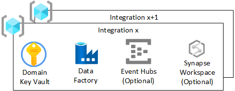

# Data integrations

The role of Integrations Operations is explained under [Integration Ops (per integration)](../organize-persona-and-teams.md#data-landing-zone-teams).

A data integration resource group is responsible for data ingestion and enrichment only from external sources such a telemetry, finance, and CRM. This layer can operate in both real-time, batch and micro-batch.

This section explains the infrastructure that's deployed for each data integration resource group inside a data landing zone.

## Overview

For each data integration resource group in a data landing zone, create:

* An Azure Key Vault.
* An Azure Data Factory for running developed engineering pipelines to transform from Raw to Enriched.
* An integration security user group used to give access to the Azure Databricks Analytics and Data Science workspace.
* A Service Principal used by the integration for deploying ingest jobs to the Azure Databricks engineering workspace.

Other services such as Event Hubs, IoT Hubs, Stream Insight, and Machine Learning can optionally be created.

There should be a data integration resource group per external integration.

>[!NOTE]
>Our prescribed view is to deploy Azure Data Factory instead of Azure Synapse Analytics workspace, for data integrations. Our adopted policy is to reduce the surface area to required features. Azure Synapse Analytics is more suited to our data product layer, large feature set and surface area.

## Azure Key Vault

Enterprise-scale for analytics and AI will make use of Azure Key Vault functionality and store secrets within Azure whenever possible.

Each data landing zone will have an Azure Key Vault per Integration. This functionality will ensure that encryption key, secret, and certificate derivation meet the requirements of the environment. This is to allow better separation of administrative duties and reduce risk associated with mixing keys, secrets of differing classifications, and Integrations.

All keys relating to the data integration should be held in this Azure Key Vault.

>[!IMPORTANT]
>Data integration-specific key vaults should follow the least-privilege model and avoid secret sharing across environments as well as transaction scale limits.

## Azure Data Factory

An Azure Data Factory will be deployed to allow pipelines written by the integration Operations team to take data from raw to enriched using developed pipelines. We prescribe using Mapping Data Flows for transformations and breaking out to use Azure Databricks engineering workspace for complex transformations.

It should be connected to the DevOps instance of the integration Ops repo responsible for the data integration to allow CI/CD deployments.

## Event Hubs

If the integration has a requirement to stream data in, it's possible to deploy downstream Event Hubs in the Integrations resource group.

## Configuration specific to Azure Databricks of adding an integration to a data landing zone

Figure 2 shows the subprocess of adding an Integration to a pre-existing Azure Databricks Engineering Workspace within the data landing zone. The subprocess should add the security groups to the Azure Enterprise Application and then into the workspace. The Integration Service Principal PAT is stored in an Azure Key Vault-backed scope in the data integration resource group for use with the developed engineering pipelines.

### Azure Databricks engineering workspace process

1. Add the Integration Service Principal to the workspace.
1. Obtain the Personal Access Token (PAT) for the Integration's Service Principal to be used with tools such as Azure Data Factory.
1. Store the PAT in the Integration Key Vault.
1. Assign the Integration Service Principal access to the Cluster Policies.
1. Assign appropriate workspace permissions to Integration Service Principal.
