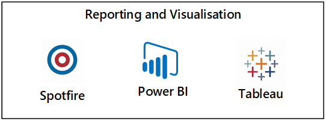

# Data products

At a high level, data products are computed or polyglot persistence services that might be required depending on certain use cases. A data product is anything that drives business value, for example, reports, workbooks, bespoke database, or data API. It can use other services and technologies that aren't part of [data landing zone](./data-landing-zone.md) core services. One example is reporting with niche requirements, such as compliance and tax reporting or specialized capabilities that address gaps in the baseline policies.

## Design considerations

- A data landing zone can have multiple data products that are created by ingesting data either inside the same data landing zone or from across multiple data landing zones as shown below.

    :::image type="content" source="../images/data-product-cross-data-landing-zone.png" alt-text="Diagram of cross data landing zone consumption.":::

     The example above shows:
     1. Intra-data landing zone consumption:
         1. Data product B consumes from data product A and the data lake within its data landing zone, for example, data landing zone 1.
         1. Data products C and D only consume from within their own respective data landing zones.
     1. Inter-data landing zone consumption: Data product B also consumes from data product C and the data lake in data landing zone 3.

    > [!IMPORTANT]
    > In the case of inter-data landing zone consumption, since data product B reads from data landing zone 3, this would require approval from the [data landing zone operations](../organize-persona-and-teams.md#data-landing-zone-teams) and [integration operations](../organize-persona-and-teams.md#data-landing-zone-teams) team of data landing zone 3.
    > [!IMPORTANT]
    > Data product B consumes from data products A and C. Before this can happen, data product B must register it's consumption of a data product via a data sharing agreement. This data sharing agreement should update the lineage from data product A to data product B and from data product C to data product B.

- The resource group for a data product would include all the service required to make that data product. Examples of services that might be part of a data product include Azure Functions, Azure App Service, Logic Apps, Azure Analysis Services, Cognitive Services, Azure Machine Learning, Azure SQL Database, Azure Database for MySQL, and Azure Cosmos DB. For more information, see [Data product samples](#sample-data-products).
- A data product has data from a *READ* data source that has had some data transformation applied. For example, tt can be a newly curated dataset or a BI report.

## Design recommendations

We recommend building data products within your data landing zone by adhering to design principles that allow you to scale with data governance. Following are design recommendations to help you plan your data products ecosystem.

### Deploy multiple resource groups

 Each data product is a resource group. Since data products are compute or polyglot persistence services, they may only be required depending on certain use cases. As such, they can be considered an optional component of your data landing zone. In the case where data products are required, you should create multiple resource groups by data product as shown below.

### Set guardrails

Azure Policy would drive the default configuration of services within a data landing zone. Consider operational analytics as multiple resource groups that the data product team can request from a standard service catalog. By using Azure Policy, we can configure the security boundary and required feature set.

> [!IMPORTANT]
> To drive consistency we recommend configuring an Azure Policy per data product.

### Consume data from many places

Data products manage, organize, and make sense of the data across data assets and present the insights gained. A data product is a result of data from one or many data integrations and other data products within data landing zones. Therefore, a data product should access data from multiple and various sources if necessary.

### Scale as needed

Services that make up a data product are an incremental deployment to the data landing zone therefore we recommend you scale data products as needed.

### Enable data discovery

Data products should be automatically registered in a data catalog such as [Azure Purview](../best-practices/purview-deployment.md) to allow scanning of data.

### Identify your data products

At the start of planning a data landing zone, you should have identified as many data products as you need to help drive the data product architecture. At the top of each decision should be conformity to implement platform governance.

For your data products, focus on how they're data producers and consumers for others. To understand further, let's assume you have identified a suite of data products (A, B, C, and D) which produce and consume data. You require data product A and D to produce data for data product B. Data product B consumes from data products A and D, and acts as a data producer itself. It also produces data for data product C.

:::image type="content" source="../images/data-producers-consumers.png" alt-text="Diagram of a data producer and consumers.":::

### Control the environment with infrastructure as code

Across the whole of your data products ecosystem, governance and infrastructure as code should control the environment as shown in the diagram above.

### Publish data models

Data product teams should publish their data model in a modeling repository.

### Set expectations for data product users

Service-level agreements and certification for the data product, should update the data sharing contracts to set the right expectation for potential users of the data product.

### Capture lineage

As data product B is consuming from data product A and D, we want to make sure the lineage is captured from A and D to B. A further lineage would be captured for data product C consuming from data product B. It should be captured in a data lineage application before every release of a data product.

> [!NOTE]
> Using Azure Pipelines would allow building of approval gates to invoke functions to make sure metadata, lineage and SLAs are registered in the correct governance service.

### Define your data product's architecture

Fully defining a data product's relationship with other data products, its dependencies, and access requirements requires a detailed architecture for a given data product.

#### Example scenario

To explain the architecture definition process, we'll look at an example of a financial institution and its credit monitoring data product.

:::image type="content" source="../images/data-product-define-detail.png" alt-text="Diagram of define data product architecture detail.":::

The credit monitoring data product shown above consumes data from a *read data store* that has been ingested by the [integration operations team](../organize-persona-and-teams.md#data-landing-zone-teams) and produces data assets for two other data products.

>[!Note]
>A read data source or store is also known as Golden Record Source. These types of data sources have been cleaned but haven't had any transformation applied to them.

The credit monitoring data product team requests read access to the read data stores they require for their data product. These requests are routed through the owners of the data for approval. Upon approval, the product teams can start to build the credit monitoring data product.

Data from the read data source is transformed into the credit monitoring data product. You'll store any new data assets in the data lake's curated layer. These new data assets should be registered, alongside the new data lineage, as part of the DevOps deployment process. A function should check registered metadata with the physical structure of the data asset. It should register the dependency on the read data source data assets.

The loan approval data product team take a dependency on some of the credit monitoring data assets. They would request read access to the credit monitoring data product assets they require for their data product. Upon release of the loan approval data product, all data assets, lineage, and models should be registered in the relevant governance services.

## Sample data products

### Visualization data product

For every data landing zone, an empty visualization resource group is created. Visualization is a data product, and depending on the complexity, can be created via a self-serve process or managed by a data product team.

>[!NOTE]
>Licensing costs might mean that is it more economical to deploy third-party visualization products into the data management landing zone and for the products to connect across to the data landing zone to pull data back.

While an initial visualization resource group will be deployed for a new data landing zone, data products might require their own reporting and visualization resource group. Security boundaries or a requirement to cross-charge for usage are the reason. It's important to remember that using Azure Active Directory passthrough authentication from services such as Power BI and Azure Analysis Services often reduces the need for a separated security boundary.

Power BI is Microsoft's strategic visualization tool for self-service analytics and for citizen data scientists.

Aligned to Microsoft investments and roadmap, we recommend using Power BI premium as the primary option for specific cases where refresh frequency, performance, or users licensing can't be met by Power BI professional.

Azure Analysis Services should be used on an exception basis. There are specific use cases where it might be required such as multidimensional models, and CI/CD advanced requirements.

As part of low-level design, we recommend enterprises consider an approach that allows access to a trial Power BI premium capacity by business users who want to evaluate whether it's a good fit for their use cases.

### Data analytics and data science data product

A data product for analytics and data science might contain the services shown in sample data product (`product-analytics-rg`).

:::image type="content" source="../images/data-product-analytics-data-science.png" alt-text="Diagram of data analytics and data science.":::

> [!NOTE]
> The data product above is [available as a template](https://github.com/Azure/data-product-analytics) that deploys a set of services which can be used for data analytics and data science. Like all our templates, this data product template is a blueprint which can be used to quickly spin up environments for cross-functional teams. Any services not required must be explicitly disabled.
>

## Next steps

[Frequently asked questions](./frequently-asked-questions.md)
