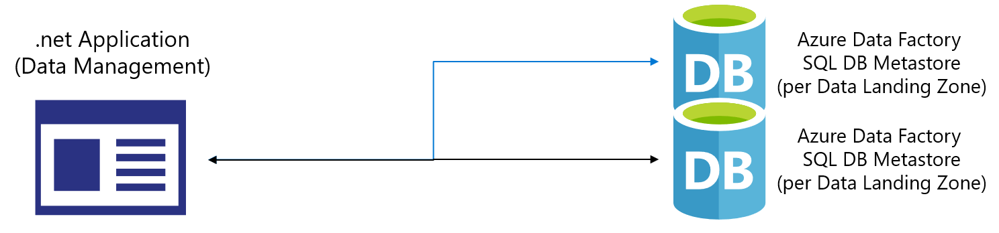
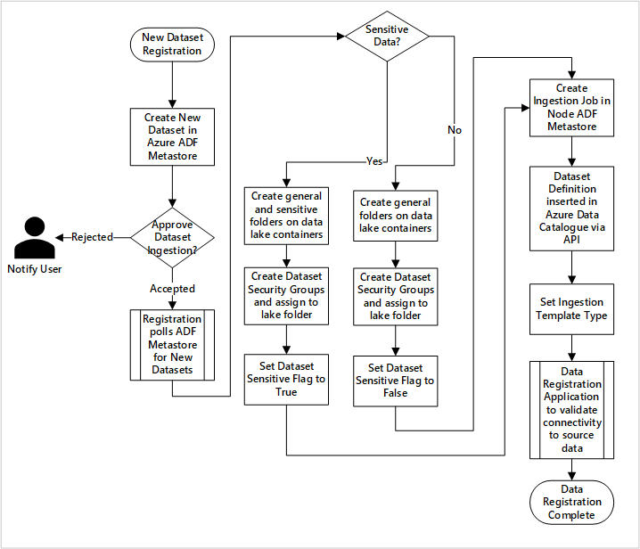
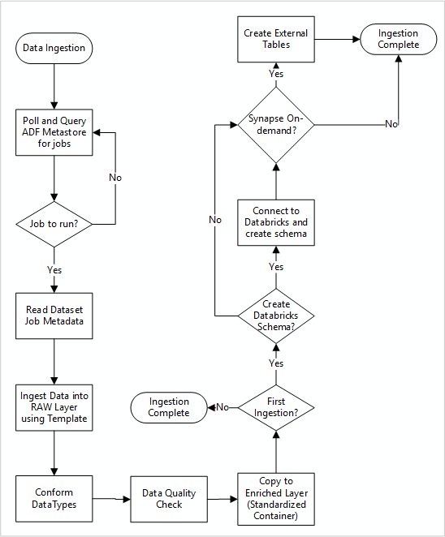

# Understand the automated ingestion framework with enterprise-scale for analytics and AI in Azure

[The ingest process with enterprise-scale for analytics and AI in Azure](./data-ingestion.md#ingest-considerations-for-data-factory) and [ingest and processing resource group](../architectures/data-landing-zone.md#ingest-and-processing) describe how enterprises can build their own custom ingestion framework.

This section provides guidance for how custom ingestion frameworks can drive services and processes.

>[!Note]
>The following suggestions for an automated ingestion framework aren't explained in detail, and they don't describe a specific Microsoft product.

## Automated data source application

Figure 1 illustrates how Integration Ops can use custom applications, Azure Logic Apps, or Microsoft Power Apps to register new data sources:



*Figure 1: The automated ingestion process.*

The application can talk to an Azure Data Factory SQL Database metastore within each data landing zone to create new data sources and ingest them into data landing zones. Once ingestion requests are approved, it uses the Azure Purview REST API to insert the sources into Azure Purview.

The metadata triggers Data Factory jobs and will have most of the parameters required for running pipelines. A Data Factory master pipeline pulls parameters from the Data Factory SQL Database metastore to transfer data from the source into the Data Lake and enrich it with conformed data types before creating a table definition in the Azure Databricks Apache Hive metastore.

For all job types (including indirect ingestion from sources like SAP), areas, and functions, the app should store the jobs' technical and operational metadata in a SQL Database. The metadata can be used by Data Platform, Data Landing Zone, and Integration Ops for:

- Tracking jobs and the latest data loading timestamps for datasets related to their functions.
- Tracking available datasets.
- Data volume growth.
- Real-time updates on job failures.

Since technical metadata will have most of the parameters required for jobs, it can drive them.

Operational metadata can be used for tracking:

- Jobs, job steps, and their dependencies.
- Job performance and performance history.
- Data volume growth.
- Job failures.
- Source metadata changes.
- Business functions that depend on datasets.

If the business needs operational reports and event notifications, Data Landing Zone Ops and Integration Ops could use Microsoft Power BI to build them by querying the SQL Database.

## Register a new dataset (automated)

Figure 2 suggests the following registration process for automating the ingestion of new data sources:



*Figure 2: How new datasets are ingested (automated).*

Enterpises can use custom applications, Azure Logic Apps, or Microsoft Power Apps in the data management landing zone to enter data into the Data Factory metastore and gain the following benefits:

- Source details are registered, including production and Data Factory environments.
- Data shape, format, and quality constraints are captured.
- Integration Ops indicate if the data is **sensitive (PII)**, and this classification drives the process during which data lake folders are created to ingest raw and enriched data. The source names raw data, and the data asset names enriched and curated data.
- Service Principal and Security Groups are created for ingesting and giving access to the dataset.
- An ingestion job is created in the data landing zone Data Factory metastore.
- An API inserts the data definition into Azure Purview.
- Details are validated and tested in development/testing environments.
- Subject to the validation of the data source and approval by the Ops team, details are published to a Data Factory metastore.

## Ingest new data sources (automated)

Figure 3 illustrates how registered data sources in a Data Factory SQL Database metastore are polled and how data is initially ingested:



*Figure 3: How new data sources are ingested.*

The Data Factory ingestion master pipeline reads configurations from a Data Factory SQL Database metastore and runs iteratively with the correct parameters. Data moves with little to no change from the source to the raw layer in Azure Data Lake. The data shape is validated based on the Data Factory metastore, and file formats are converted to either Apache Parquet or Avro formats before being copied into the enriched layer.

> [!TIP]
> The Parquet format is recommended when the I/O patterns are more read-heavy and/or when the query patterns are focused on a subset of columns in the records where the read transactions can be optimized to retrieve specific columns instead of reading the entire record.\
> \
> The Avro file format is recommended where I/O patterns are more write-heavy or query patterns favor retrieving multiple and whole rows of records (for example, the Avro format is favored by a message bus like Apache Event Hubs or Kafka, which write multiple events/messages in succession).

If the data is ingested, it connects to an Azure Databricks Engineering workspace, and a data definition is created within the data management landing zone Hive metastore. This data definition needs to be protected so that only the automation process can create, alter, or drop data definitions.

If Integration Ops wants to use SQL pools to expose data, then the custom solution is to create external tables or ingest data directly into SQL pools' internal tables.

## Use the Azure Purview REST API to discover data

As part of the integration framework, Azure Purview REST APIs should be used to register data during the first ingestion. They can be used to submit data to the data catalog for discovering data soon after it's ingested. For more information and to get started, see the tutorial for [how to use Azure Purview REST APIs](/azure/purview/tutorial-using-rest-apis).

### Register data sources

Use the following API call to register new data sources:

````HTTP
PUT https://{accountName}.scan.purview.azure.com/datasources/{dataSourceName}
````

**URI parameters for the data source**:

|Name  |Required  |Type  |Description  |
|---------|---------|---------|---------|
|`accountName`    | True       | string        | Name of the Azure Purview account         |
|`dataSourceName` | True       | string        | Name of the data source         |

### Request payloads for sample data source

The following payloads are a few examples of how to use the Azure Purview REST API to register data sources:

**Register an Azure Data Lake Storage Gen2 data source**:

```JSON
{
  "kind":"AdlsGen2",
  "name":"<source-name> (for example, My-AzureDataLakeStorage)",
  "properties":{
    "endpoint":"<endpoint> (for example, https://adls-account.dfs.core.windows.net/)",
    "subscriptionId":"<azure-subscription-guid>",
    "resourceGroup":"<resource-group>",
    "location":"<region>",
    "parentCollection":{
      "type":"DataSourceReference",
      "referenceName":"<collection-name>"
    }
  }
}
```

**Register a SQL Database data source**:

```JSON
{
  "kind":"<source-kind> (for example, AdlsGen2)",
  "name":"<source-name> (for example, My-AzureSQLDatabase)",
  "properties":{
    "serverEndpoint":"<server-endpoint> (for example, sqlservername.database.windows.net)",
    "subscriptionId":"<azure-subscription-guid>",
    "resourceGroup":"<resource-group>",
    "location":"<region>",
    "parentCollection":{
      "type":"DataSourceReference",
      "referenceName":"<collection-name>"
    }
  }
}
```

>[!NOTE]
>The `<collection-name>` is a current collection that exists in an Azure Purview account.

### Create a scan

[Learn how to can create credentials](/azure/purview/manage-credentials) to authenticate sources in Azure Purview before setting up and running a scan.

Use the following API call to scan data sources:

````HTTP
PUT https://{accountName}.scan.purview.azure.com/datasources/{dataSourceName}/scans/{newScanName}/
````

### Scan URI parameters

|Name  |Required  |Type  |Description  |
|---------|---------|---------|---------|
|`accountName`    | True        | string        | Name of the Azure Purview account         |
|`dataSourceName` | True        | string        | Name of the data source         |
|`newScanName`    | True        | string        | Name of the new scan         |

### Sample Scan Request Payloads

The following payloads are a few examples of how to use the Azure Purview REST API to scan data sources:

**Scan an Azure Data Lake Storage Gen2 data source**:

```JSON
{
  "name":"<scan-name>",
  "kind":"AdlsGen2Msi",
  "properties":
  {
    "scanRulesetType":"System",
    "scanRulesetName":"AdlsGen2"
  }
}
```

**Scan a SQL Database data source**:

```JSON
{
  "name":"<scan-name>",
  "kind":"AzureSqlDatabaseMsi",
  "properties":
  {
    "scanRulesetType":"System",
    "scanRulesetName":"AzureSqlDatabase",
    "databaseName": "<database-name>",
    "serverEndpoint": "<server-endpoint> (for example, sqlservername.database.windows.net)"
  }
}

```

Use the following API call to scan data sources:

```HTTP
POST https://{accountName}.scan.purview.azure.com/datasources/{dataSourceName}/scans/{newScanName}/run
```
