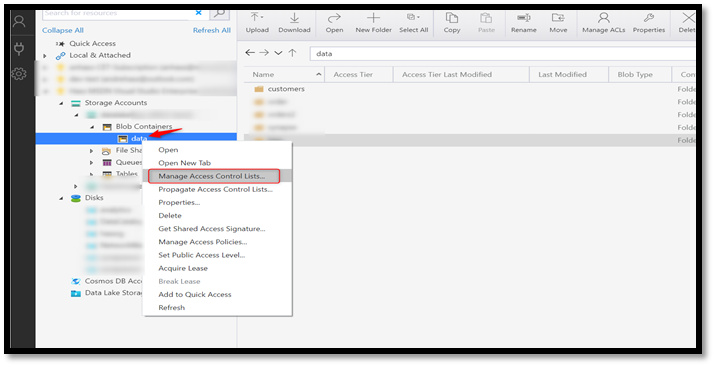
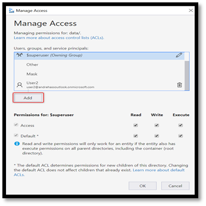
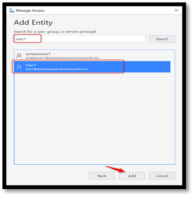
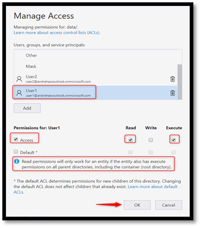
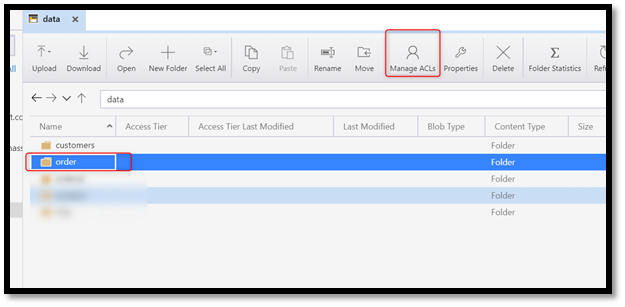
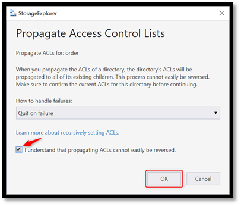

# Azure Synapse Analytics implementation

Azure Synapse Analytics is the provisioned, integrated analytics service that accelerates time to insight across data warehouses and big data systems. Azure Synapse Analytics brings together:

- The best of SQL technologies used in enterprise data warehousing.
- Spark technologies used for big data.
- Pipelines for data integration and extract, transform, and load (ETL) or extract, load, and transform (ELT).

Azure Synapse Studio is a tool in Azure Synapse that provides a unified experience for management, monitoring, coding, and security. Synapse Studio has deep integration with other Azure services like Power BI, Cosmos DB, and Azure Machine Learning.

> [!NOTE]
> This section aims to describe prescribed configurations which are specific to enterprise-scale for analytics and AI. It's a compliment to the official [Azure Synapse Analytics documentation](/azure/synapse-analytics/).

## Overview

During the initial setup of a [data landing zone](../architectures/data-landing-zone.md), you can deploy a single Azure Synapse Analytics workspace for use by all analysts and data scientists. You can create more workspaces for specific data integrations or data products.

Use Azure SQL pools, formerly SQL Data Warehouse, as the data store for both enriched and curated data. This data store serves the data science team's need for feature datasets and datasets for analytical requirements. Azure Databricks can connect to these SQL pools and update the data, which is in the SQL pools.

Azure SQL on-demand is a serverless query service that's used by data scientists and engineers to run queries against files in the storage accounts.

> [!TIP]
> You might need additional Azure Synapse Analytics workspaces if your data integration needs to provide access to the golden source with row- and column-level security. You can provide these workspaces with Azure Synapse Pools. Data products teams might require their own workspace for creating data products and a separate workspace that's only for product teams with scoped development access.

## Azure Synapse Analytics setup

The first step in the deployment Azure Synapse Analytics is to set up an Azure Synapse workspace.

As you need an Azure Data Lake storage account, we recommend using a dedicated container on the workspace data lake account. This container is used as primary storage to store Spark metadata.

We recommend Azure Databricks for premium big data processing and data science capabilities.

### Azure Synapse Analytics networking

A data landing zone creates workspaces with an [Azure Synapse Analytics managed virtual network](/azure/synapse-analytics/security/synapse-workspace-managed-vnet). Communication with Azure Synapse happens through the three endpoints it exposes: SQL Pool, SQL On-Demand, and the development endpoint.

At the network level, enterprise-scale for analytics and AI uses [Synapse Managed private endpoints](/azure/synapse-analytics/security/synapse-workspace-managed-private-endpoints). These endpoints ensure all of the traffic between the data landing zone virtual network and Azure Synapse workspaces moves entirely over the Microsoft backbone network.

### Azure Synapse data access control

Use access control lists with [Azure Active Directory (Azure AD) pass-through in Azure Synapse Analytics](/azure/synapse-analytics/sql/active-directory-authentication#azure-ad-pass-through-in-azure-synapse-analytics) to manage access to the files in the data lake.

We recommend Row-Level Security (RLS) and Column-Level Security (CLS) to restrict the data access on the tables in Synapse SQL pool using security policy. RLS and CLS are used at the database level and in addition to the database roles.

For example, RLS ensures that users in a specific data integration or data product only see their own data. Even if the table contains data for the entire enterprise.

You can combine RLS with CLS to restrict access to columns with sensitive data. This way, both RLS and CLS apply the access restriction logic at the database tier rather than the application tier. The permission is evaluated every time data access is attempted from any tier.

> [!TIP]
> We recommend that features such as Azure Defender for SQL, data classification, data encryption, and dynamic data masking are available for SQL Pool to support data protection and limit sensitive data exposure.

### Azure Synapse data access control in Azure Data Lake

When deploying an Azure Synapse Analytics workspace, you need an AzureData Lake Storage account from the subscription or by manually using the storage account URL. The specified storage account is set as **primary** for the deployed Azure Synapse workspace to store its data. Azure Synapse stores data in a container that includes Apache Spark tables and Spark application logs in a folder called **/synapse/{workspacename}**. It also has a container for managing any libraries that you choose to install.

During the Azure Synapse workspace deployment through [Azure portal](https://ms.portal.azure.com/), you can either provide an existing storage account or create a new one. The provided storage account is set as the **primary storage account** for the Azure Synapse workspace. For either account option, the deployment process automatically grants the Azure Synapse workspace identity data access to the specified Data Lake Storage account using the **Storage Blob Data Contributor** role. If the deployment of Synapse workspace happens outside of the Azure portal, you need to manually add an Azure Synapse workspace identity to the **Storage Blob Data Contributor** role later. We recommend assigning the role **Storage Blob Data Contributor** on the file system level to follow the least privilege principle.

It's also possible to manually specify the storage account URL. However, you need to contact the storage account owner and ask them to grant the workspace identity access manually using the **Storage Blob Data Contributor.**

The Azure Synapse workspace identity permission context is used when executing pipelines, workflows, and notebooks through jobs. If any of the jobs read or write to the workspace primary storage, the workspace identity uses the read/write permissions granted through the **Storage Blog Data Contributor**.

Use the **Storage Blob Data Contributor** role to grant read/write/delete permissions to blob storage resources like folders and files.

**Storage Account permissions are required when using Azure Synapse workspaces interactively and for development.** You can provide read/write permissions to other users or groups on the primary storage account after it's been deployed. However, the account requires you to grant access permissions using the **Storage Blob Data Contributor role** or **access control lists** directly to the user or groups. When users sign in to the Azure Synapse workspace to execute scripts or for development, the user's context permissions are used to allow read/write permissions on the primary storage.

## Next steps

- [High availability for Azure Synapse Analytics](../../../migrate/azure-best-practices/analytics/azure-synapse.md)

<!--

#### Fine-grained data access control using Access Control Lists

When setting-up Data Lake access control, some organizations require granular level access due to *sensitive (PII)* data stored that cannot be seen by some users or groups. Using Azure RBAC, it is only possible to give read and/or write at the container level. For example, assigning a user or group to Storage Blob Data Contributor role will allow read/write access to all folders in that container. With ACLs you can setup fine-grained access control at the folder and file level to allow read/write on the data that users or groups need access.

Before you start implementing fined-grained access with ACLs, is important to understand how ACLs permissions are evaluated.

1. Azure Role assignments are evaluated first and take priority over any ACL assignments.
2. If the operation is fully authorized based on Azure role assignment, then ACLs are not evaluated at all.
3. If the operation is not fully authorized, then ACLs are evaluated.

:::image type="content" source="../images/rbac-acls-evaluation.png" alt-text="RBAC ACLs Evaluation" lightbox="../images/rbac-acls-evaluation.png":::

Please refer to the [Access control model for Azure Data Lake Storage Gen2 | Microsoft Docs](/azure/storage/blobs/data-lake-storage-access-control-model#how-permissions-are-evaluated) for more information.

To setup ACLs in Data Lake Storage Gen 2, you can use one of the following methods:  

- **Azure CLI**  
  - For detailed instructions on how to use **Azure CLI** to grant ACLs permissions in Azure Data Lake Storage Gen2 refer to [Use Azure CLI to manage ACLs in Azure Data Lake Storage Gen2](/azure/storage/blobs/data-lake-storage-acl-cli)

- **PowerShell**  
  - For detailed instructions on how to use **PowerShell** to grant ACLs permissions in Azure Data Lake Storage Gen2 refer to [Use PowerShell to manage ACLs in Azure Data Lake Storage Gen2](/azure/storage/blobs/data-lake-storage-acl-powershell)

- **Azure Storage Explorer**  
  - For details instructions on how to use and install, refer to [Get started with Storage Explorer | Microsoft Docs.](/azure/vs-azure-tools-storage-manage-with-storage-explorer?tabs=windows)

> [!TIP]
> Consider using **Azure CLI** or **PowerShell** for automation to achieve better scalability when a large amount of folders and files are expected in the ACLs setup process.
>
#### Granting Azure RBAC Reader on the Storage Account

Assigning Azure RBAC Reader role to users or groups in the Synapse workspace primary storage account is required for them to be able to list the storage account and containers when using Data Hub in Synapse Studio.

Using Data Hub in Synapse Studio, users can browse folders and files before they start writing a query or spark code. Users also have some options available in Synapse Studio to help getting started with queries and reading the data from spark from a specific file. These options include Select Top 100 rows, Create External Table, Load to a Dataframe, New Spark Table.

Refer to the [Assign Azure roles using the Azure portal - Azure RBAC | Microsoft Docs](/azure/role-based-access-control/role-assignments-portal) for detailed instructions on how assign Reader role on the storage account.

#### Granting Read Access on Azure Data Lake Storage Gen 2 using ACLs

The first step on this process, you will need to grant the appropriate ACL permissions for users or groups at the **container level** in the Storage account. There are situations where a user or group cannot read the folders or files in the container root. However, they can be granted read/write permissions in child folders of the root. In this case, It will be still required the users or groups to have *execute* permissions on the parent folders, including the root, to traverse these folders which the identity does not have read/write access.

Please go through the following steps to get started.

1. Open Azure Storage Explorer, right click on storage container you want to setup fined-grained access with ACLs and choose Manage Access Control Lists.

    

2. Click in Add to include users or groups that you want to grant permissions.

    

3. In **Search for a user, group, or service principal.** Type the name of the user of group and click search. The users or groups should show-up. Select the user or group and choose **Add**.

    

After adding the user or group. Select the identity added in the previous step. In Permission for: <name of user or group> check the option **Access**, followed by **Read** and **Execute** options on the right-hand side.

As per [Azure Data Lake Storage Best Practices](/azure/storage/blobs/data-lake-storage-best-practices#use-security-groups-versus-individual-users), it is strongly recommended to assign **Azure Active Directory security groups** instead of assigning individual users to directories and files. Using Security Groups, adding or removing users from the group does not requires updates to Azure Data Lake Storage, consequently reduces the chance of exceeding the 32 access control entries per file or folder ACL.

It is important to notice the informative message **"Read and Write permissions will only work for an entity if the entity also has execute permissions on all parent directories, including the container (root directory)"** It means that you will also need to grant Execute permissions on all parent folders, including the container which is the root directory, when granting read or write in a sub directory.



**Granting permissions automatically to new children of the directory using the Default*** **option.**

If you want to grant ACLs permissions automatically for new children of the directory, use the option **Default*** and select the required permissions read, write, or execute.  


After granting permission at the container level, repeat the same steps for any subfolder you want to give access to users or groups.

#### Granting Write Access on Azure Data Lake Storage Gen 2 using ACLs

Select the folder you want to give users or groups write permission and choose **Manage ACLs.**



If you want to grant ACLs permissions automatically for new children of the directory, use the option **Default*** and select the appropriate permissions **Read/write** and **execute.**  As mentioned in the Granting Read Access on Azure Data Lake Storage Gen 2 section, this option will automatically propagate parent folder permissions to newly created children's items, such as folder and files.

After selecting the appropriate permissions, click **OK** to close.


Repeat the same steps for any additional folders and subfolder you may want to grant access to users or groups.

#### Propagate ACLs permissions to children objects  

When granting ACLs permissions to folders that already contain child objects such as folder and files, you may need to use the option **Propagate Access Control Lists option.** This option enables propagation of ACLs from the parent folder to its child objects. It is important to understand that ACLs propagation is not easily reversible. You will need to evaluate case by case to ensure you are propagating the correct ACL permissions to the right security group. If you use this option at the container level, it will propagate the permissions from the container level to all sub-folders within the container.

To propagate ACL permissions, right-click on the parent folder you desire to propagate the ACL permissions. This action will propagate permissions for all users to the existing child objects from the parent folder you are performing the action.


In Propagate Access Control Lists, choose How to handle failures depending on the desired behavior you want in case of failures. You can choose from the two options: **Continue on Failure** or **Quit on failure.**

Check the box I understand that propagating ACLs cannot be easily reversable and click OK.



#### Considerations when using Spark Tables in Synapse Spark Pool

When you use Spark Tables in Synapse Spark Pool, the following folder structure will be created automatically by Synapse workspace in the root of the container in the workspace primary storage.  

```text
synapse/workspaces/{workspacename}/warehouse
```

If you plan to create spark tables in Synapse Spark Pool. It is required that you grant write permission on the **warehouse** folder for the users or group executing the command that creates the Spark Table. If the command is executed through triggered job in a pipeline, you will need to grant write permission to the Synapse workspace identity.

#### Create Spark Table example

```python
df.write.saveAsTable("<tablename>")
```

## References

[How to set up access control for your Synapse workspace - Azure Synapse Analytics | Microsoft Docs](/azure/synapse-analytics/security/how-to-set-up-access-control?WT.mc_id=Portal-Microsoft_Azure_Synapse)-->
