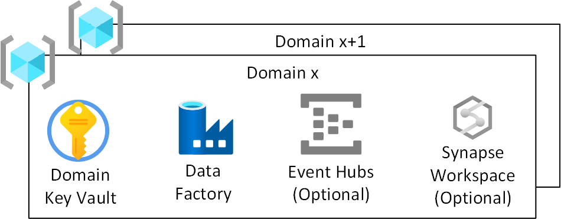
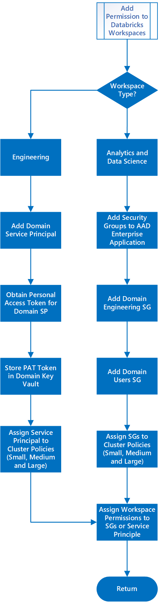

# Domains

Previously, we explained the role of a Domain under [Enterprise Scale Analytics and AI Teams](persona-and-teams.md#domain-ops-per-domain)  and that Domains help understand [Data Landing Zone Division and Consumption](data-landing-zone-division-and-consumption.md).

This section explains the infrastructure which is deployed for each Domain inside a Data Landing Zone.

## Overview

*Figure 1: Domain Resource Group*

For each Domain in a Data Landing Zone, we will  create:

* A Domain Azure Key Vault.
* A Domain Azure Data Factory for running developed engineering pipelines to transform from Raw to Enriched to Curated.
* A Domain security user group which we use to give access to the Azure Databricks Analytics and Data Science workspace.
* A Domain sensitive security group which we use to give access to the Azure Databricks Sensitive workspace.
* A Service Principal which is used by the Domain for deploying ingest jobs to the Azure Databricks Engineering workspace.

Additional services such as Event Hubs, IoT Hubs, Stream Insight, and Machine Learning can optionally be created.

This leads to a Resource Group per Domain.

>[!NOTE]
>As a Domain is responsible for data ingestion and enrichment only, our prescribed view is to deploy Azure Data Factory instead of Azure Synapse Analytics workspace. Our adopted policy is to reduce the surface area to required features. Azure Synapse Analytics is more suited to our data product layer.

## Azure Key Vault

Enterprise Scale Analytics and AI will make use of Azure Key Vault functionality and store secrets within Azure whenever possible.

Each Data Landing Zone will have an Azure Key Vault per Domain. This functionality will ensure that encryption key, secret, and certificate derivation meet the requirements of the environment. This is to allow better separation of administrative duties and reduce risk associated with mixing keys, secrets of differing classifications, and Domains.

>[!IMPORTANT]
>Domain-specific key vaults should follow the least-privilege model and avoid secret sharing across environments as well as transaction scale limits.

## Azure Data Factory

An Azure Data Factory will be deployed to allow pipelines written by the Domain Ops team to take data from Raw to Enriched to Curated using developed pipelines. We prescribe using Mapping Data Flows for transformations and breaking out to use **Azure Databricks Engineering Workspace** for complex transformations.

## Event Hubs (Optional)

If the Domain has a requirement to stream data in, it is possible to deploy downstream Event Hubs in the Domains resource group.

## Configuration specific to Databricks of adding a Domain to a Data Landing Zone

*Figure 2: Adding Permissions to Databricks Workspaces*

Figure 2 shows the subprocess of adding a Domain to a pre-existing Azure Databricks workspaces within the Data Landing Zone. The subprocess adds the security groups to the Azure Enterprise Application and then into the workspace. The Domain Service Principal PAT is stored in an Azure Key Vault-backed scope in the Domain for use with the developed engineering pipelines.

### Azure Databricks Engineering Workspace Process

1. Add the Domain Service Principal to the workspace.
1. Obtain the Personal Access Token (PAT) for the Domain's Service Principal to be used with tools such as Azure Data Factory.
1. Store the PAT in the Domain Key Vault.
1. Assign the Domain Service Principal access to the Cluster Policies.
1. Assign appropriate workspace permissions to Domain Service Principal.

### Azure Databricks Analytics and Data Science Workspace Process

1. Add the Domain Azure AD Groups to the workspace Azure AD Enterprise Application.
1. Wait for Azure AD Enterprise Application to sync with Azure Databricks.
1. Add Domain Engineering Azure AD Group to the workspace.
1. Assign the Domain Azure AD Groups access to the Cluster Policies.
1. Assign appropriate workspace permissions to Domain Azure AD Groups.

>[!NOTE]
>The Domain Engineering Azure AD Group allows read/write access, and the Domain User Azure AD Group should allow read-only access.
