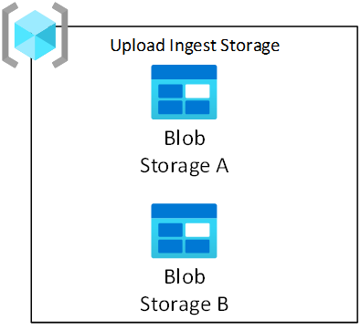
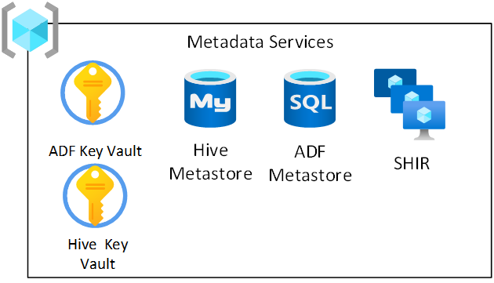

# Enterprise Scale Analytics and AI Architecture Data Landing Zone

## Overview

Data Landing Zones are connected to the [Data Management Landing Zone](data-management-landing-zone.md) by virtual network (VNet) peering and are considered a [landing zone](/azure/cloud-adoption-framework/ready/landing-zone/) in relation to the Enterprise-Scale Architecture.

> [!IMPORTANT]
> Before provisioning a Data Landing Zone, you should have your DevOps and CI/CD operating model in place and a Data Management Landing Zone deployed. 
>

A Data Landing Zone has several layers, as illustrated below, to enable agility to service data integrations and data products within it. A new Data Landing Zone is always deployed with a standard set of services to enable the Data Landing Zone to start ingesting and analyzing data.

The Azure subscription associated with the Data Landing Zone is structured as follows:

|Layer  |Required  |Resource group(s)  |
|---------|---------|---------|
|[Core Services ](#core-services-layer)    |Yes         |<ul><li>[Network](#network)</li><li>[Monitoring](#monitoring)</li><li>[Data Lake Services](#data-lake-services)</li><li>[Upload Ingest Storage](#upload-ingest-storage)</li><li>[Metadata Services](#metadata-services)</li><li>[Ingest and Processing](#ingest-and-processing)</li><li>[Shared Products](#shared-products)</li><li>[Shared Integration](#shared-integration)</li></ul>         |
|[Data Integration](#data-integration-layer)     |Yes         |<ul><li>[Data Integration](#data-integration-resource-group) (1 or more)</li></ul>         |
|[Data Products](#data-products-layer)     |Optional         |<ul><li>[Data Products](#data-product-resource-group) (1 or more)</li></ul>         |
|[Visualization](#visualization-layer)    |Optional         |<ul><li>[Reporting and Visualization](#reporting-and-visualization)</li></ul>         |

## Data landing zone architecture

The architecture of the data landing zone below illustrates the above-mentioned layers, their respective resource groups and services which are contained within each resource group. It also provides an overview of the groups and roles associated with the data landing zone and the extent of their access to the control and data planes.

:::image type="content" source="./images/data-landing-zone-2.png" alt-text="Data Landing Zone" lightbox="./images/data-landing-zone-2.png":::

 > [!TIP]
> Before getting started with deploying a Data Landing Zone, it is highly recommended that you first [consider the number of initial Data Landing Zones you want to deploy](/azure/cloud-adoption-framework/scenarios/data-management/scale?branch=scenario-data-management).

## Core Services Layer

In this layer, all the required services to enable the Data Landing Zone within the context of Enterprise Scale Analytics and AI are included. The following resource groups form the suite of standard services available in every Data Landing Zone that is deployed:

- Networking
- Monitoring
- Data Lake Services
- Metadata Services
- Ingest and Processing
- Upload Ingest Storage
- Shared Integration
- Shared Products

### Network

:::image type="content" source="images/data-landing-zone-network-rg.png" alt-text="data landing zone network rg":::

The network resource group, as shown above, contains core enterprise components such as [network security groups](/azure/virtual-network/network-security-groups-overview) (NSG), Azure  [Network Watcher](/azure/network-watcher/network-watcher-monitoring-overview) and Virtual Network. All of these services are deployed into a single resource group. As part of the deployment, the virtual network of a Data Landing Zone is [automatically peered with the Data Management Landing Zone's VNet](/azure/cloud-adoption-framework/scenarios/data-management/eslz-network-topology-and-connectivity) and the [Connectivity Subscription's VNet](/azure/cloud-adoption-framework/ready/enterprise-scale/architecture).

### Monitoring

:::image type="content" source="images/data-landing-zone-monitoring-rg.png" alt-text="data landing zone monitoring rg":::

The Enterprise-Scale pattern recommends that all logs should be sent to a central Log Analytics workspace. However, we also have a monitoring resource group, as shown above, in each Data Landing Zone for the purpose of capturing Spark logs from Databricks. The resource group contains a shared Log Analytics workspace and Key Vault to store the Log Analytics keys.

> [!IMPORTANT]
> The Log Analytics workspace in the monitoring resource group should only be used for capturing Databricks Spark logs.

### Data Lake Services

:::image type="content" source="images/data-landing-zone-data-lake-services-rg.png" alt-text="data landing zone data lake services rg":::

Three [Azure Data Lake Storage Gen2](/azure/storage/blobs/data-lake-storage-introduction) accounts will be provisioned in the single Data Lake Services resource group as shown above. The data transformed at different stages will be saved on one of the Data Landing Zone's three data lakes and will be available for analytics, data science and visualizations teams to consume. 

> [!IMPORTANT]
> Why do we recommend three data lakes? Please visit [Data Lake Services Overview](data-lake-overview.md) to learn more.

### Upload Ingest Storage

Third-party data publishers require the ability to land their data into the platform so Integration Ops teams can pull it into their data lakes. The Upload Ingest Storage resource group, shown below, enables provisioning of blob stores for third-parties.

These storage blobs are requested by the Integration Ops Teams and approved by the Data Landing Zone Ops Team. Once the data has been pulled from the storage blobs into RAW, the data should be removed from the source storage blob.

>[!IMPORTANT]
>As the provisioning of Azure Storage Blobs is on an *as-needed* basis, deploy an **empty** storage services resource group initially in every Data Landing Zone.

### Ingest and Processing

:::image type="content" source="images/data-landing-zone-ingest-processing-rg.png" alt-text="data landing zone ingest and processing rg":::

All services related to ingesting source data will be deployed into a the ingest and processing resource group as shown above. If your enterprise has already developed an ingestion framework engine for automatically ingesting data based on registering metadata which includes connection strings, path to copy data from and to, and ingestion schedule, the ingestion and processing resource group has key services to leverage such a framework.

Consider the following guidelines for ingestion and processing:

1. The ingestion framework engine should copy data through the layers of the data lake service from source to *Raw* to *Enriched and Curated*.
2. As data sources are registered and integrated into respective data lakes using a repeatable and consistent framework, the data should be registered with [Azure Purview](purview-deployment.md) for discovery.
3. If you have an ingestion framework engine, we recommend using Azure Data Factory as the primary orchestration engine for getting data into *Raw* to *Enriched and Curated*.

>[!TIP]
>Ingestion and processing is discussed at length under [Data Ingestion](data-ingestion.md).

Services included in the ingest and processing resource group include:

|Service  |Required  |Guidelines  |
|---------|---------|---------|
|Azure Databricks     |Yes         |<ul><li>Azure Databricks should always deployed because it would be used by Integration Ops teams for ingestion, transformation, and loading of data. See the [Azure Databricks section](#azure-databricks-in-shared-products) for details of workspace deployments.</li><li>An Azure Databricks workspace is provisioned for Ingestion and Processing which will connect to Azure Data Lake via Azure Service Principals. These are referred to as **Azure Databricks Engineering Workspaces**.</li><li>The Databricks workspaces should be locked down to only allow deployment of notebooks or jars from the Data Integration Azure DevOps Repo via a Data Integrations Service Principal.</li></ul>         |
|Event Hubs (or IoT Hub)     |Optional         |<ul><li>Event Hubs or IoT Hub could be used by your ingestion framework engine for real-time streaming to Event Hubs and for processing of both batch and streaming via a Databricks Engineering Workspace.</li></ul>|
|Azure Data Factory    |Optional         | |

### Metadata Services

Across the Data Landing Zone there is a requirement for a number of shared metadata services which provide functionality to other shared services. These will be deployed into a single resource group as shown below.

> [!TIP]
> If your organization has decided to develop your own ingestion framework engine based on the recommendations in the Enterprise Scale Analytics and AI ingestion flow, using either a PowerApp or a .Net Application, in the Data Management Landing Zone, we would suggest deploying an Azure SQL DB to hold metadata for Azure Data Factory to use. Having this custom application will speed up the onboarding of data sources, allowing teams to create new data sources for ingestion for landing into the Raw to Enriched in the Data Landing Zone data lakes.
>

A Self-Hosted Integration Runtime will be deployed for use with Azure Purview to scan data inside the Data Landing Zone. Although the DevOps CI/CD process will handle the registration of these runtimes into Azure Purview in the future, we recommend understanding how to [create and manage a self-hosted integration runtime in Azure Purview](/azure/purview/manage-integration-runtimes).

An Azure Key Vault will be provisioned to store secrets relating to Data Landing Zone Services such as:

- Azure Data Factory Metastore credentials
- Azure Databricks PAT tokens for use with the automated ingestion process
- Service Principal Credentials for the automated ingestion process
- Data Landing Zone Data Lake Services Keys

The types of data which you will store in the Data Landing Zone will help determine any additional services which should reside here. For example, if you are storing *sensitive (PII)* data, you may choose to include a tokenization engine to ensure that all *sensitive (PII)* data can be tokenized as it is ingested into the data lake.

A Azure MySQL database will be provisioned. The **Azure Databricks Engineering Workspaces** and **Azure Databricks Analytics and Data Science Workspace** will uses this as there Hive Metastore.

### Shared Integration

To enable rapid onboarding of datasets, to the Data Landing Zone, we recommend deploying a virtual machine scale set with Self Hosted Integration Runtimes, into the Data Management Landing Zone. These should be hosted in the Integration Resource Group as shown below.

:::image type="content" source="images/data-landing-zone-shared-integration-rg.png" alt-text="data landing zone shared integration rg":::

To enable this resource group you would need to:

- Create at least one Azure Data Factory (as shown above) in the Shared Integration resource group in the Data Landing Zone which would **only** be used for linking the Shared Self-hosted Integration Runtime (SHIR) and not for data pipelines.
- Create a [shared image for the Azure virtual machine scale set](/azure/virtual-machine-scale-sets/shared-images-powershell) with a Self-Hosted Integration Runtime configured.
- [The Self Hosted Integration Runtimes should be setup in high availability mode](/azure/data-factory/create-self-hosted-integration-runtime#high-availability-and-scalability).
- The Self Hosted Integration Runtimes should be associated with Azure Data Factories in the Data Landing Zone(s).
- [Azure Automation should be setup to update the Self Hosted Integration Runtime periodically](/azure/data-factory/self-hosted-integration-runtime-automation-scripts)

>[!NOTE]
>This does not restrict the deployment of Integration Runtimes inside a Data Landing Zone or into 3rd party clouds.

### Shared Products

For each Data Landing Zone, a shared Synapse Analytics workspace and Azure Databricks workspaces will be provisioned for use by everybody in the Data Landing Zone for exploratory purposes as shown below.

:::image type="content" source="images/data-landing-zone-shared-products-rg.png" alt-text="data landing zone shared products rg":::

#### Azure Databricks in Shared Products

Azure Databricks service is envisioned to be one of the key consumers of the data lake storage service. The atomic file operations are optimized for Spark Analytic Engines. This speeds up completion of Spark jobs issued from the Databricks service.

> [!IMPORTANT]
> An Azure Databricks workspace will be provisioned for all Data Scientists and Data Ops called the **Azure Databricks Analytics and Data Science Workspace** as shown above in the Shared Products resource group.
> 
This workspace can be configured to connect to the Azure Data Lake using AAD Passthrough or Table Access Control. Depending on the use case Conditional Access can be configured as an additional security measure.

The Enterprise Scale Analytics and AI construction set takes into account the following best practices for integrating Azure Databricks into the construction set:

- [Securing access to Azure Data Lake Gen 2 from Azure Databricks](https://github.com/hurtn/datalake-ADLS-access-patterns-with-Databricks/blob/master/readme.md)
- [Azure Databricks Best Practices](https://github.com/Azure/AzureDatabricksBestPractices/blob/master/toc.md)

#### Azure Synapse Analytics in Shared Products

**Azure Synapse Analytics** is the provisioned integrated analytics service that accelerates time to insight across data warehouses and big data systems. Azure Synapse Analytics brings together the best of **SQL** technologies used in enterprise data warehousing, **Spark** technologies used for big data, and **Pipelines** for data integration and ETL/ELT. **Synapse Studio** provides a unified experience for management, monitoring, coding and security. Synapse has deep integration with other Azure services such as **Power BI**, **CosmosDB** and **Azure Machine Learning**.

> [!IMPORTANT]
> During the initial setup of a Data Landing Zone. a single Azure Synapse Analytics Workspace will be deployed to for use by all Data Analysts and Scientists in the Shared Products resource group as shown above. Additional Synapse workspaces can be optionally setup for Data Integrations and Data Products should cost management and recharge be required. Integration and Data Products teams might make use of dedicated Synapse Analytics workspaces for creating dedicated SQL Pools, as a read data store, which is used by the visualization layer.

## Data Integration Layer

### Data integration (resource group)

:::image type="content" source="images/data-landing-zone-data-integration-rg.png" alt-text="data landing zone data integration rg":::

A Data Integration resource group, as shown above, is responsible for data ingestion and enrichment only from external sources such a telemetry, finance, CRM, etc. This layer can operate in both real-time, batch and micro-batch.

> [!IMPORTANT]
> To learn more about each of the services deployed in the Data Integration resource group, please see [Data Integrations](data-landing-zone-data-integration.md).
> 
## Data products layer

A Data Landing Zone can have multiple data products which are created by ingesting data from Data Integrations read data stores or other Data Products either inside the same Data Landing Zone or from across multiple Data Landing Zones (subject to approval of the data steward).

### Data product (resource group)

The resource group for a data product includes all the service required to make that data product. For example, there is a requirement to have an Azure Database for MySQL which is used by a visualization tool. The data must be ingested and transformed before landing into the MySQL database. To achieve this, you would deploy both an Azure Data Factory and Azure Database for MySQL into the Data Product Resource Group.

Further reading on onboarding [Data Products](data-landing-zone-data-products.md) explains the process for creating the services and resource groups.

## Visualization Layer

### Reporting and visualization

For every Data Landing Zone, an empty visualization resource group will be created. This group can be filled with services required to implement your visualization solution. Using the existing VNet will enable your solution to connect to Data Products.

This resource group could host third-party Virtual Machines for services such as Spotfire or Tableau.

>[!TIP]
>Licensing costs might mean that is it more economical to deploy third-party products such Spotfire and Tableau into the Data Management Landing Zone and for the products to connect across Data Landing Zone(s) to pull data back.
