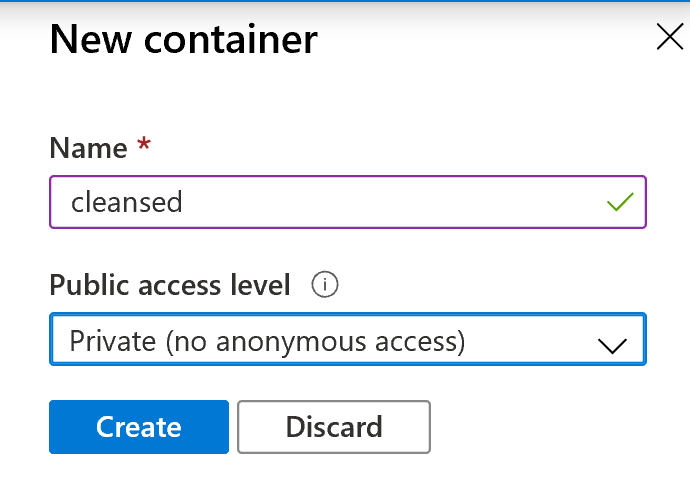
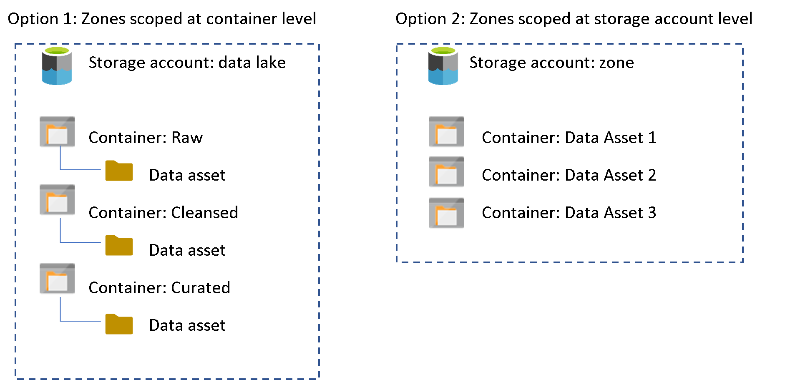
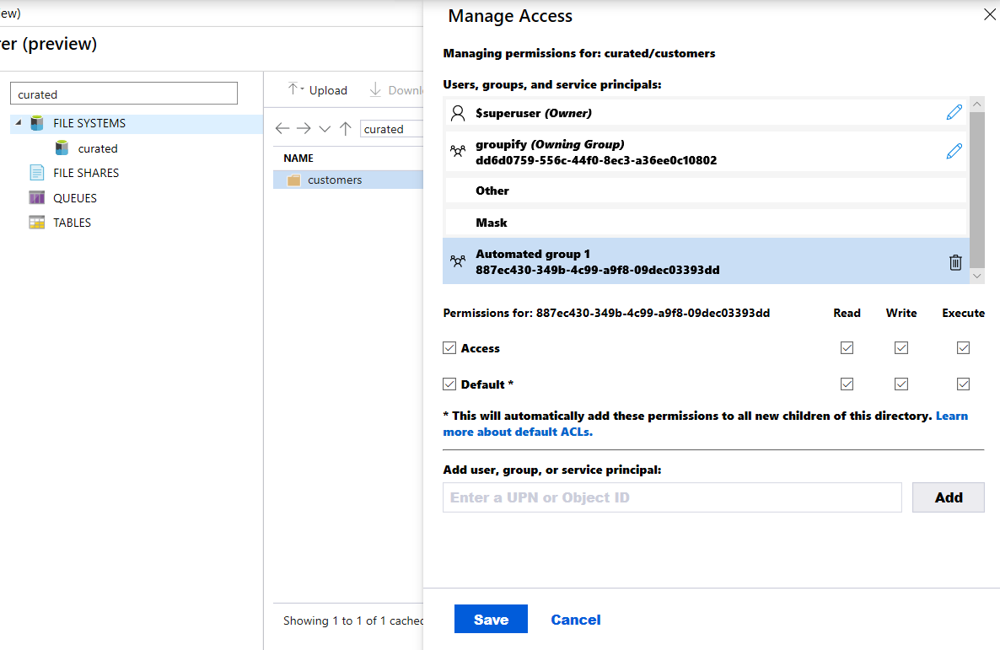

# Understanding access control and data lake configurations in ADLS Gen2

Whilst the end goal of this article is to help the reader assess and understand the access control mechanisms in Azure Data Lake Storage (ADLS) Gen2, namely RBAC and ACLs, they will also learn 

- How access is evaluated between these two mechanisms
- How to configure access control using RBAC or ACLs or both
- How these access control mechanisms can be applied to different data lake implementation patterns and the associated design considerations

The topics covered assume a basic knowledge of storage containers, security groups, RBAC and ACLs. To frame the discussion a generic data lake structure of raw, cleansed and curated layers is referenced. This is one of many possible approaches but not necessarily the correct structure for your organisation. Additionally, the examples use an over simplified representation of folder structures to illustrate the point but is not necessarily a reflection of reality. When a path such as 

```text
/raw/data_asset
```

is referenced, in reality this may be a more complex structure with "self-documenting" metadata embedded in the path that lead to the files, e.g.:

```text
/datalake/raw/internal/datasource/entity/YYYY/MM/DD/*
```

For further ideas on data lake structure and design there are a number of online resources such as this [TechNet article](https://cloudblogs.microsoft.com/industry-blog/en-gb/technetuk/2020/04/09/building-your-data-lake-on-azure-data-lake-storage-gen2-part-1/).

To guide the reader through the process of creating a data lake and configuring access control, step-by-step portal instructions have been provided, along with sample code to support "LakeOps". All code samples are written in Python and use the Azure APIs instead of the associated SDK. The reason is twofold: a.) it can be adapted to any other programming language or utility (such as cUrl or Postman) which supports REST APIs and b.) SDK availability or operation support at the time of writing. The code is provided "as is" and can be run locally if Python 3.6 is installed, or using various options in Azure such as Azure Notebooks, Azure Databricks or even Azure DevOps. If you are new to the Azure REST APIs, please refer to the following [documentation](https://docs.microsoft.com/rest/api/azure/) to help you get started.

>[!NOTE]
>Creating security groups requires necessary permissions to your Azure Active Directory (AAD) tenant or the Microsoft Graph API. In some organizations this level of access can be difficult to obtain, therefore to follow the steps in this article it may be easier to use a [free account](https://azure.microsoft.com/free/), or personal account with a [Visual Studio subscription](https://docs.microsoft.com/visualstudio/subscriptions/vs-azure) or ask your Azure Administrator to create a new AAD tenant and [add a subscription](https://docs.microsoft.com/azure/active-directory/fundamentals/active-directory-how-subscriptions-associated-directory) to the new directory. 

## Understanding the built-in RBAC roles

Azure Storage has two layers of access: management and data. Subscriptions and storage accounts are accessed through the management layer. Containers, blobs, and other data resources are accessed through the data layer. For example, if you want to get a list of your storage accounts from Azure, you send a request to the management endpoint. If you want a list of blob containers in an account, you send a request to the appropriate service endpoint.

RBAC roles can contain permissions for management or data layer access. The Reader role, for example, grants read-only access to management layer resources.

Only roles explicitly defined for data access permit a security principal to access blob or queue data. Roles such as Owner, Contributor, Reader and Storage Account Contributor permit a security principal to manage a storage account, but do not provide access to the blob or queue data within that account. However, these roles (excluding Reader) can obtain access to the storage keys which can be used in various client tools to access the data.

## Built-in Management Roles

- [Owner](https://docs.microsoft.com/azure/role-based-access-control/built-in-roles#owner):Manage everything, including access to resources. This role will give you key access.
- [Contributor](https://docs.microsoft.com/azure/role-based-access-control/built-in-roles#contributor): Manage everything, excluding access to resources. This role will give you key access.
- [Reader](https://docs.microsoft.com/azure/role-based-access-control/built-in-roles#reader): Read and list resources.

## Built-in Data Roles

- [Storage Account Contributor](https://docs.microsoft.com/azure/role-based-access-control/built-in-roles#storage-account-contributor): Full management of storage accounts. **Note**: this role will give you key access.

- [Storage Blob Data Owner](https://docs.microsoft.com/azure/role-based-access-control/built-in-roles#storage-blob-data-owner): Full access to Azure Storage blob containers and data including setting of ownership and managing POSIX access control (ACLs)

- [Storage Blob Data Contributor](https://docs.microsoft.com/azure/role-based-access-control/built-in-roles#storage-blob-data-contributor): Read, write, and delete Azure Storage containers and blobs.

- [Storage Blob Data Reader](https://docs.microsoft.com/azure/role-based-access-control/built-in-roles#storage-blob-data-reader):  Read and list Azure Storage containers and blobs.

Storage Blob Data Owner is considered a super-user and is granted full access to all mutating operations, including setting the owner of a directory or file as well as ACLs for directories and files for which they are not the owner. Super-user access is the only authorized manner to change the owner of a resource.

>[!NOTE] 
> RBAC assignments can take up to 5 minutes to propagate and take affect.

## How data lake structure relates to access control

A very basic data lake structure may consist of three "layers" or "zones" which represent the stage and quality of data at a particular stage in its transformation lifecycle. While raw data may not yield business value or insights im./imagestely, storing historical high fidelity data in a cost effective manner will allow the value to be unlocked later as transformation pipelines are built to cleanse and enrich the data. Data often needs to be prepared, modelled and optimized for analytics before it is transformed and stored in the curated layer.


Often the value of data, and therefore implicitly the layers also, have a bearing on which groups of users (automated or human) access the data at a particular point in the lifecycle. For example, analysts will typically only want to work with curated data, whilst engineers building transformation pipelines may need read access to all three layers to pull samples of data into the development environment in order to develop and test a new pipeline. Data in the curated layer may not have reached its end state, it is plausible that new datasets may be developed with other curated datasets. Whilst users may need read access to various parts of the lake, no-one should have write access except for the service principals or managed identities used for automated processing such as ADF pipelines or Azure Databricks jobs. These automated processes should have passed the necessary test and review phases to prevent data corruption, or even worse data loss.

From an ADLS Gen2 perspective, the data lake layers can be implemented as multiple storage accounts, containers or folders, so when considering access control throughout these layers, decide on a level of granularity which suits your business needs. For some, coarse grained access at the data lake zone may be sufficient control, but for others, fine-grained access control at the data asset level may be required. Decide which is the most granular level of access control appropriate and apply permissions at that level. Review the possible scenarios later in this document to decide whether RBAC or ACLs, or a combination of both, will best suits your scenario. When assigning permissions at a greater scope than the data lake level, please refer the [RBAC documentation](https://docs.microsoft.com/azure/storage/common/storage-auth-aad-rbac-portal?toc=%2fazure%2fstorage%2fblobs%2ftoc.json#determine-resource-scope). 

>[!NOTE]
> If your subscription includes an Azure Databricks namespace, roles that are scoped to the subscription will not grant access to storage account data. Scope roles to the resource group, storage account, or container level instead.

## How access is evaluated in ADLS

During security principal-based authorisation, permissions will be evaluated in the following order as depicted in the diagram below and described in [the documentation](https://docs.microsoft.com/azure/storage/blobs/data-lake-storage-access-control#the-impact-of-role-assignments-on-file-and-directory-level-access-control-lists):

- RBAC is evaluated first and takes priority over any ACL assignments. 
- If the operation is fully authorised based on RBAC then ACLs are not evaluated at all. 
- If the operation is not fully authorised then ACLs are evaluated.

>[!NOTE]
>This description excludes [Shared Key and SAS authentication](https://docs.microsoft.com/azure/storage/blobs/data-lake-storage-access-control) methods in which no identity is associated with the operation and assumes that the storage account is accessible via appropriate networking configuration. It also excludes scenarios in which the security principal has been assigned the Storage Blob Data Owner built-in role which provides *super-user* access.


See [here](https://docs.microsoft.com/azure/storage/blobs/data-lake-storage-access-control#common-scenarios-related-to-permissions)
for another example of what ACL based permissions are required for a
given operation.

>[!NOTE]
>
> - ACLs apply only to security principals in the same tenant, including guest users.
> -	Azure Databricks mount points can be created by any user with permissions to attach to a cluster. The mount point will be configured using service principal credentials or the AAD passthrough option, but at the time of creation permissions are not evaluated. Only when an operation is performed using the mount point will permissions be evaluated and any user who can attach to a cluster can attempt to use the mount point. Securing access to ADLS from Azure Databricks is covered in more detail [here](https://github.com/hurtn/datalake-ADLS-access-patterns-with-Databricks).

## How to create a data lake container

### Using the Portal

1. [Create a storage account](https://docs.microsoft.com/azure/storage/common/storage-account-create?tabs=azure-portal) with HNS enabled
1. Navigate to the storage account
1. Under the Data Lake Storage sub-menu, click Containers
1. Click + Container
1. Specify a container name in accordance with the [naming convention](https://docs.microsoft.com/azure/storage/blobs/storage-blob-container-create#name-a-container)



### Using Storage Explorer

1. [Download](https://azure.microsoft.com/features/storage-explorer/) Azure Storage Explorer
1. [Log in](https://docs.microsoft.com/azure/storage/blobs/storage-quickstart-blobs-storage-explorer#log-in-to-storage-explorer) to Storage Explorer
1. [Create a storage account](https://docs.microsoft.com/azure/storage/common/storage-account-create?tabs=azure-portal) with HNS enabled
1. Find the subscription which hosts the storage account and expand it
1. Expand the Storage Accounts list and expand the storage account. *Note* it should specify (ADLS Gen2) after the storage account name
1. Right click on Blob Containers, click Create Blob Container
1. Enter a [valid](https://docs.microsoft.com/azure/storage/blobs/storage-blob-container-create#name-a-container) container name and hit enter


>[!NOTE]
> Storage Explorer requires access to both management layer (subscriptions and storage accounts) and data layer (containers, blobs and data), therefore will require at least the Reader role to list storage accounts, and the Storage Blob Data Reader role to list or download folders and files. Alternatively, a SAS URI can be used if access to the management layer is not impossible. For information please see the [documentation](https://docs.microsoft.com/azure/storage/common/storage-explorer-troubleshooting?toc=%2Fazure%2Fstorage%2Fblobs%2Ftoc.json&tabs=Windows%2C1904).

### Using the API
-------------

1. [Create a service principal](https://docs.microsoft.com/azure/active-directory/develop/howto-create-service-principal-portal) and [secret](https://docs.microsoft.com/azure/active-directory/develop/howto-create-service-principal-portal#create-a-new-application-secret)
1. [Create a storage account](https://docs.microsoft.com/azure/storage/common/storage-account-create?tabs=azure-portal) with HNS enabled
1. Use the following python code to create an authorisation token and create a container. Replace the tokens in parentheses with the required information. Ensure that a [valid container name](https://docs.microsoft.com/azure/storage/blobs/storage-blob-container-create#name-a-container) is specified.

[Click here to view the code sample](./APIs/create_ADLS_container.py)

## How to create security groups 

### Using the Portal 

1. From the Portal dashboard click on Azure Active Directory
2. Under the Manage sub-menu click on Groups
3. Click + New group
4. Enter the security group name
5. Optionally click on "No members selected" to add members
6. Click Create


### Using the API

The API request below uses the Microsoft Graph API and requires the
service principal (registered application) to be granted [appropriate
permissions](https://docs.microsoft.com/graph/permissions-reference).
Run the following code substituting tokens in parentheses. The members
section is optional but allows you to add members to the group. See
[here](https://docs.microsoft.com/graph/api/group-post-groups?view=graph-rest-beta&tabs=http)
for more details about the permissions required and the API definition.

[Click here to view the code sample](./APIs/create_security_group.py)

## Configuring access to ADLS and data lake storage configurations

This section reviews the three possible approaches to implement access control in ADLS using RBAC or ACLs or a combination of both. It demonstrates how to configure these mechanisms either through the portal, storage explorer or the APIs.

### Configure access using RBAC only

When using only RBAC, one may question whether ADLS Gen2 is required at all, particularly as there is an [additional cost](https://azure.microsoft.com/pricing/details/storage/data-lake/) associated with the hierarchical namespace (HNS)option. The answer is flexibility because HNS cannot be enabled on a general purpose v2 storage account after the account has been created. Therefore to accommodate fine-grained access control later, without having to migrate the data, it is advisable to use ADLS with HNS enabled when building a data lake on Azure. Additionally, without HNS enabled, renaming or deleting folders is not possible without incuring recursive operations, therefore performance for certain Spark based workloads may suffer.

> **_Caution:_** Role assignments are limited to 2000 per subscription therefore option 2 is not recommended for a large number of data assets. Instead grant RBAC at storage account level or use ACLs as a method of access control.

### Using the Portal

1.  Navigate to the containers section of the storage account.
2.  Click on a container and click on Access Control (IAM)
3.  Click Add -\> Add role assignment
4.  Select a built-in or custom role
5.  Keep the default selection for "Assign access to"
6.  Select the security principal to assign the role to


### Using the API

[Click here to view the code sample](./APIs/assign_rbac.py)

For more information see:

-   [Assigning roles using API](https://docs.microsoft.com/azure/role-based-access-control/role-assignments-rest)
-   [Unique ID for each built-in role](https://docs.microsoft.com/azure/role-based-access-control/built-in-roles#all)
- 
## Storage permutations



__Option 1:__

Using this pattern the lowest level of granularity at which permissions could be applied is at the zone level, meaning that consumers and producers will either have access read or write to all of the data in particular zone.

__Option 2:__

In this pattern each storage account will represent a particular zone, for example raw or curated, and the lowest level of granularity at which permissions could be applied is at the data asset level.

Configure access using ACLs only
--------------------------------

As per the [ADLS best practices](https://docs.microsoft.com/azure/storage/blobs/data-lake-storage-best-practices#use-security-groups-versus-individual-users) it is recommended to assign access control entries to a security group rather than an individual user or service principal. When adding or removing users from the group no updates to ADLS are required and using groups also reduces the chance of exceeding the 32 access control entries per file or folder ACL. After the 4 default entries that leaves only 28 remaining for permission assignments. However, even when using groups, a proliferation of access control entries may occur at top levels of the directory tree, particularly when very granular permissions with many different groups are required. In order for each group to obtain read access to the files contained in their folder, they will need execute permissions from root, which is the container level, all the way down to the folder they are trying to access. It is likely that the 32 access control entry limit will be reached in the root or levels close to root. An example of this scenario is depicted below: 


There are two possible solutions to this outlined below but the recommended approach is to make use of nested groups.

### Option 1 The parent execute group
Where possible before files and folders are created, begin with a parent group which is assigned execute permissions to both default and access ACLs at the container level. Then add the groups requiring data access to the parent group. This technique is known as nesting groups, and from an ADLS authorisation perspective, the member group inherits the permissions of the parent group, providing "global" execute permissions to all member groups. The member group in this case will not need execute permissions as these permissions will be inherited because it belongs to the parent group.  Additional nesting may provide greater flexibility and agility if the security groups that represent teams or automated jobs are added to the data access reader and writer groups.


### Option 2 The Other ACL entry
Another way to ensure that every part of the path from root to lowest level has execute permissions (--x) is to use the "Other" ACL entry set at the container/root, with defaults and access ACLs applied as shown in the first diagram below. This exceute permission propogates down any subsequently added child folders until the depth/folder where the intended access group should have Read and Execute permissions (in the lowest part of the chain as depicted in the second image), which will grant that group access to read the data appropriately. This approach works similarly for write access.


### Using Storage Explorer in the Portal (Preview)

Prerequisite: Follow the steps in "How to create a data lake container" above if you do not have an HNS enabled storage account and a container created.

> **_Note:_** Using Storage Explorer in the Portal (currently in Preview) does not support managing permissions (ACLs) at the container (root) level, only on the files and folders below root

1.  Navigate to the storage account in the Azure Portal and select the Storage Explorer (Preview) menu item

2.  Expand the containers section and click on the relevant container

3.  In the explorer panel, navigate to the folder or file you which to add permissions for

4.  Click "More" from the menu above and select "Manage Access"

5.  Add the UPN or object ID into the field and click Add

6.  With the security principal highlighted in blue, select the access (and default if required) checkbox and select the read, write and execute permissions as required.

7.  Click Save



### Using Azure Storage Explorer

Prerequisite: Follow the steps in "How to create a data lake container" above if you do not have an HNS enabled storage account and a container created.

1.  Obtain the user principal name (UPN) or object ID of the group you wish to add permissions for.

2.  Using Storage Explorer, navigate to the container, folder or file you wish to grant access to

3.  Right click on the container, folder or file and select Manage Access

4.  Add the UPN or object ID into the field and click Add

5.  With the security principal highlighted in blue, select the access (and default if required) checkbox and select the read, write and     execute permissions as required. 

6.  Click Save


### Using the API

Setting ACLs are performed via the Path update API. The header requires the correct version, bearer token and one or more access control entries (ACE) - separated by a comma - using the x-ms-acl header.

Each ACE has the format of \[scope:\]\[type\]:\[id\]:\[permissions\] where:

-   scope is either "*default*" for a default ACL or not specified which denotes an access ACL

-   type is either user, group, mask or other. See [here](https://docs.microsoft.com/azure/storage/blobs/data-lake-storage-access-control#users-and-identities) for more details.

-   id is the identifier of the security principal. In the case of a security group, it is the Object ID of the group

-   permissions use the format of (r )ead, (w)rite, e(x)ecute and -- for no permission.

Refer to the [documentation](https://docs.microsoft.com/rest/api/storageservices/datalakestoragegen2/path/update) for further information about the API. 

This example below obtains the bearer token for storage.azure.com, creates a UUID for log analytics purposes and grants read, write and execute ACLs (default and access) to a security principal for a given account, container and path.

Substitute the parameters in parentheses, and run the following code using a security principal who has the Storage Blob Data Owner role assigned to the storage account or container, so that the request has permissions to manage ACLs.

[Click here to view the code sample](./APIs/assign_acls.py)

> **_Note:_** should you wish to apply ACL changes retrospectively (after the folders and files exist) then this could be achieved through a for loop recursively listing and setting each folder and file, however the simpler method may be to use a Powershell script with the -Recurse parameter as shown in [this example](https://docs.microsoft.com/azure/storage/blobs/data-lake-storage-directory-file-acl-powershell#set-acls-on-all-items-in-a-file-system). 

### Storage permutations


Option 1: A single physical data lake approach where the lowest level of granularity can be flexible and applied at the appropriate folder depth. Remember that execute ACLs should be applied at the container level (root) down to the required folder. As the lowest level of granularity for RBAC is the storage container it is unlikely that this data lake design would work for an RBAC-only security model. Using RBAC, every process or person accessing the data lake would have global privileges across the data whether it be read (Storage Blob Data Reader) or read-write (Storage Blob Data Contributor) permissions. Not only does this increase the risk that those with read access might see something they shouldn't, but an even greater risk is that data could inadvertently be overwritten or deleted by one of the writers. For these reasons this design was not one of the RBAC-only options above.

Option 3: This configuration provides both billing and "noisy neighbour" isolation.

Using both RBAC and ACLs
------------------------

Storage Blob Data Contributor/Reader only provides access to the data and not the storage account. It can be granted at the storage account or container level. When Storage Blob Data Contributor is assigned, ACLs __cannot__ be used to manage access. Where Storage Blob Data Reader is assigned, elevated write permissions can be granted using ACLs. Refer to the section above on [how access is evaluated in ADLS](#how-access-is-evaluated-in-adls).

This approach favours scenarios where most users need read access to but only a few need write access. The data lake zones could be different storage accounts and data assets could be different containers, or the data lake zones could be represented by containers and data assets represented by folders.

### Storage permutations


Conclusion
==========

There is no single approach to managing data lake access that will suit everyone. One of the major benefits of a data lake is to democratise and provide friction-free access to data however in reality different organisations will have different levels of governance and control over their data. Some have a centralised team which manages access and the provisioning of AAD groups with rigorous internal controls. Some are more agile and have decentralised control. The approach chosen should meet the required level of governance but should not result in undue delays or friction in gaining access to data, otherwise the value of the data lake may be diminished, or even worse may result in silos, the very thing data lakes are designed to prevent.