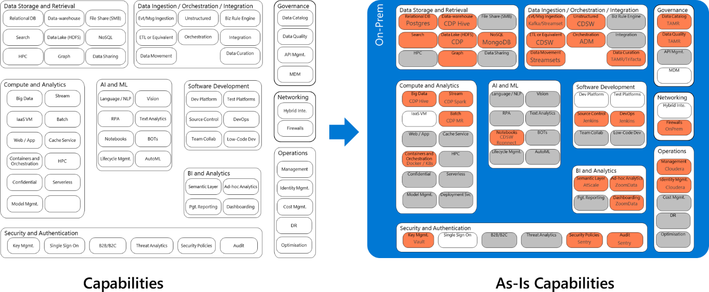
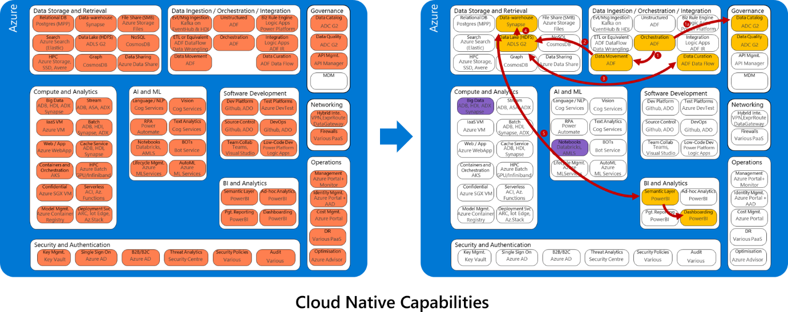

# Unlocking Strategic Value

Throughout your BI, Analytics & AI maturity journey, there are *key themes* in unlocking the strategic value of data for consistent business growth. There are inherent complexities and ground realities in building a data-driven culture to drive business forward in a consistent, forward thinking, agile and informed way. Before moving to the deploy phase your should focus efforts towards formulating a coherent Data Strategy to achieve desired business outcomes.

## Key Themes

If we carefully analyse the above key themes and how they relate to important facets of a coherent Data Strategy:

*"A **data strategy** is the foundation to leveraging **data** as an asset and driving business forward. It's not a patch job for **data** problems. It's a long-term, guiding plan that defines the people, processes, and technology to put in place to solve **data** challenges."*

However, understandably putting together a Data Strategy is an exercise which could be daunting and long enduring process, there are plenty of great blog posts / whitepapers already available in terms of how to build a Data Strategy and once such example is [3 part blog series on how to build & execute Data Strategy](https://cloudblogs.microsoft.com/industry-blog/en-gb/cross-industry/2020/10/15/how-to-build-and-deliver-an-effective-data-strategy-part-1/) (This can be used as a Reference point for acquiring further details on
individual topic areas).

Creating a strategy is one thing but to execute one on enterprise scale poses a great challenge to organization's existing culture, people, processes, and technology choices. It requires a great deal of commitment and clearer ownership at all levels of an organization.

### Increasing Efficiencies

The agility of the cloud more than ever before it has imposed the need for organizations to adapt quickly and brining efficiencies in all areas of business. According to the [report by Gartner on emerging risks](https://www.gartner.com/en/newsroom/press-releases/2018-10-24-gartner-survey-shows-digitalization-misconceptions-threaten-organizations-as-the-top-emerging-risk-in-3q19), while organizations continue to focus on digital initiatives and invest in them, two-thirds not only fail to deliver upon expectations, but also demonstrate enterprise weaknesses.

### Data Democratization

Central IT has slowly been shifting to shadow IT becoming more de-centralized and enabling agility. They want to innovate quickly by having access to enterprise-wide **unified** quality data in self-serve fashion, in order to meet challenging business requirements. There are many reasons why businesses fail to tap into the full potential of their data - business functions working in separate silos, each team using different tools & standards for data analysis, or a failure to link KPIs to overall business goals.

Data Democratization is the key to delivering that value back to business and achieving the challenging business growth targets.

### Governance

In relation to Data Governance there has to be a right balance in the decentralized world of data democratization approach. If governance is enforced too hard it could possibly stifle innovation but at the same not having some core principles & processes in place could also endanger creating "Data Wild West". Resulting in damaging organizations reputation and potential revenues. So, a holistic Data Governance approach is fundamental to unlocking strategic value of data in a consistent manner.

In the absence of a well thought-out Data Strategy, there is a clear need to just "get going" and quickly start demonstrating value back to business. In this pursuit, acting on the above Key themes or using them as strategic principles wrapped in a framework could not only lead to addressing current business problems but even assist in the formation of
future holistic data strategy in an iterative way with validation, yet yielding quick timely results.

## Iterative Data Strategy Validation Framework

Business & Technology Leaders to develop the mindset and strategies required to generate value from data and scale quickly in a simplified structured manner.

### Business Aligned Objectives

Identifying key priorities in line with business vision and keeping **"Think big, start small, and act fast"** ideology is the fundamental key for success. Picking up the right use case(s) doesn't always need to be long haul difficult vetting process, it could be an on-going problem in any business unit where there is enough data to validate its ROI, more appetite and easy buy-in. So, there is no analysis paralysis enigma and things can move quickly, as that's where most of the organization could be struggling to get started.

Otherwise, there are other approaches to validate your key business priorities against technical capabilities holistically also e.g. 
*Aligning strategic business priorities with technical complexities*

*For further Details:*
[how-to-build-and-deliver-an-effective-data-strategy-part-1](https://cloudblogs.microsoft.com/industry-blog/en-gb/cross-industry/2020/10/15/how-to-build-and-deliver-an-effective-data-strategy-part-1/)

### Commitment

There has to be clear understanding around the adopted approach and desired common business objectives among all the key roles involved in making this a success i.e. Leadership Team (C -- Level), Business Unit, IT, Ops etc.

### Capability & Skills

Clear mapping out the Product, Services or Tools capabilities Maturity Assessment along with People skills, who will help deliver on the achieving the overall objectives.

The above is not an exhaustive list by any means and could vary depending on the organisation type/structure.

## Assess Capability Maturity

There must be an exercise in assessing the Data Analytics & AI capabilities required to deliver on a specific use case, holistically or at an organisational level. However, there has to be some guiding principles/process to go about the assessment:

- Define current capabilities and ambition
- Identify risks and blockers to progress
- Clearly state benefits and key stakeholders
- Link benefits to stated business objectives
- Identify key dependencies

As a next step, look at Azure native services, and start mapping what you need to deliver success.

Along with capability maturity assessment, culture is also another important aspect which is the key focus of this framework to make it successful.

The details are covered here: [how-to-build-and-deliver-an-effective-data-strategy-part-2](https://cloudblogs.microsoft.com/industry-blog/en-gb/cross-industry/2020/10/15/how-to-build-and-deliver-an-effective-data-strategy-part-2/?amp%3Bamp%3Bamp%3Bamp%3Bamp%3Bamp%3Bamp%3Bpreview=true)

### Communication

Communication being one of the most important elements of this framework and requires communication process to be devised between Leadership, Business, IT & Delivery Teams.

As this would not only assist in delivering effectively in the context of current project but establishing a forum to stay in line, up-to date and focused on the overall objective of formulating a Holistic Data Strategy for future.

There are couple of key strategic processes which would help in delivering successfully in the context of this framework:

1) Formation of CoE

2) Adopting Agile Delivery Method

### Formation of Centre of Excellence

Centre of Excellence would assist in:

- A Centre of Excellence helps drive adoption, Standards, best practices and innovation
- Funded team for full delivery and specialist skills provision
- Deep technical skills in key technologies
- Active participation and evangelising in Communities of Practice

### Adopting Agile Delivery Method

Agile is the ability to create and respond to change. It is a way of dealing with, and ultimately succeeding in, an uncertain and turbulent
environment.

It's really about thinking through how you can understand what's going on in the environment that you're in today, identify what uncertainty you're facing, and figure out how you can adapt to that as you go along.

For further details on benefits, manifesto and why adopt please see: [agilealliance.org](https://www.agilealliance.org/agile101/)

## Deliver Value

Final Data product delivery against the set-out success criteria in a standardized & structured way is going to validate the above iterative framework. Additionally, taking the learning and continuously innovating will help in building business confidence and widening out of the Data Strategy strategic goals, for clearer and quicker adoption across
business.

<!-- # Strategic impact of 'data management and analytics'

Describe how your scenario impacts the overall strategy

## 'data management and analytics' motivations

What would motivate the customer to act on this scenario?
https://docs.microsoft.com/azure/cloud-adoption-framework/strategy/motivations

## 'data management and analytics' outcomes

When customers act on this scenario, what do they expect to see as an outcome?
https://docs.microsoft.com/azure/cloud-adoption-framework/strategy/business-outcomes/

## 'data management and analytics' business justification

Is there something special that customers have to do to justify doing this thing?
https://docs.microsoft.com/azure/cloud-adoption-framework/strategy/cloud-migration-business-case

## Next step: Plan for 'data management and analytics'

The following list of articles will take you to guidance found at specific points throughout the cloud adoption journey to help you be successful in the cloud adoption scenario.

- [Plan for 'data management and analytics'](./plan.md)
- [Review your environment or Azure Landing Zone(s)](./ready.md)
- [Assess for 'data management and analytics' migration](./migrate-assess.md)
- [Migrate 'data management and analytics'](./migrate-deploy.md)
- [Release 'data management and analytics' to production](./migrate-release.md)
- [Innovate with 'data management and analytics'](./innovate.md)
- [Govern 'data management and analytics'](./govern.md)
- [Manage 'data management and analytics'](./manage.md) -->
