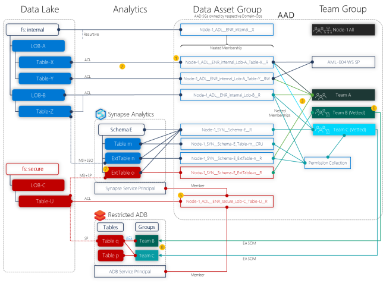

# Identity and access management for 'data management and analytics' Enterprise-Scale scenario

Enterprise Scale Analytics and AI supports an access control model using Azure Active Directory (AAD) identities which utilizes both Role-based Access Control (Azure RBAC) and Access Control Lists (ACLs).

## Role assignments - Data Landing Zone

For automation purposes, more role assignments are required.

>[!NOTE]
> The number of role assignments can be further reduced in a production scenario. The **Network Contributor** role assignment is just required to automatically setup the vnet peering between the data management landing zone and the data landing zone. Without this, DNS resolution will not work and in- and outbound traffic will be dropped because there is no line of sight to the Azure Firewall. The **Private DNS Zone Contributor** is also not required if the deployment of DNS A-records of the Private Endpoints is automated through Azure Policies with `deployIfNotExists` effect. The same is true for the **User Access Administrator** because the deployment can be automated using `deployIfNotExists` policies.

Additional required role assignments for Data Landing Zone deployment include:

| Role Name | Description | Scope |
|:----------|:------------|:------|
| [Private DNS Zone Contributor](/azure/role-based-access-control/built-in-roles#private-dns-zone-contributor) | We expect you to deploy all Private DNS Zones for all data services into a single subscription and resource group. Therefor, the service principal needs to be Private DNS Zone Contributor on the global dns resource group which was created during the Data Management Zone deployment. This is required to deploy A-records for the respective private endpoints.&nbsp;&nbsp;&nbsp;&nbsp;&nbsp;&nbsp;&nbsp;&nbsp;&nbsp;&nbsp;&nbsp;&nbsp;&nbsp;&nbsp;&nbsp;&nbsp;&nbsp;&nbsp;&nbsp;&nbsp;&nbsp;&nbsp;&nbsp;&nbsp;&nbsp;&nbsp;&nbsp;&nbsp;&nbsp;&nbsp;&nbsp;&nbsp;&nbsp;&nbsp;&nbsp;&nbsp;&nbsp;&nbsp;&nbsp;&nbsp;&nbsp;&nbsp;&nbsp;&nbsp;&nbsp;&nbsp;&nbsp;&nbsp;&nbsp;&nbsp;&nbsp;&nbsp;&nbsp;&nbsp;&nbsp;&nbsp;&nbsp;&nbsp;&nbsp;&nbsp;&nbsp;&nbsp;&nbsp;&nbsp;&nbsp;&nbsp;&nbsp;&nbsp;&nbsp;&nbsp;&nbsp;&nbsp;&nbsp;&nbsp;&nbsp;&nbsp;&nbsp;&nbsp;&nbsp;&nbsp;&nbsp;&nbsp;&nbsp;&nbsp;&nbsp;&nbsp;&nbsp;&nbsp;&nbsp;&nbsp;&nbsp;&nbsp;&nbsp;&nbsp;&nbsp;&nbsp;&nbsp; | (Resource Group Scope) `/subscriptions/{{datamanagement}subscriptionId}/resourceGroups/{resourceGroupName}` |
| [Network Contributor](/azure/role-based-access-control/built-in-roles#network-contributor) | In order to setup vnet peering between the Data Landing Zone vnet and the Data Management Landing Zone vnet, the service principal needs **Network Contributor** access rights on the resource group of the remote vnet. | (Resource Group Scope) `/subscriptions/{{datamanagement}subscriptionId}/resourceGroups/{resourceGroupName}` |
| [User Access Administrator](/azure/role-based-access-control/built-in-roles#user-access-administrator) | Required to share the self-hosted integration runtime that gets deployed into the `integration-rg` resource group with other Data Factories. It is also required to assign the Data Factory and Synapse managed identities access on the respective storage account file systems. | (Resource Scope) `/subscriptions/{{datalandingzone}subscriptionId}` |

## Role assignments - Data Domain and Data Products

For a successful *domain* and *product* deployment purposes, the following role assignments are required for each of the options:

| Role Name | Description | Scope |
|:----------|:------------|:------|
| [Private DNS Zone Contributor](/azure/role-based-access-control/built-in-roles#private-dns-zone-contributor) | We expect you to deploy all Private DNS Zones for all data services into a single subscription and resource group. Therefor, the service principal needs to be Private DNS Zone Contributor on the global dns resource group which was created during the Data Management Zone deployment. This is required to deploy A-records for the respective private endpoints.&nbsp;&nbsp;&nbsp;&nbsp;&nbsp;&nbsp;&nbsp;&nbsp;&nbsp;&nbsp;&nbsp;&nbsp;&nbsp;&nbsp;&nbsp;&nbsp;&nbsp;&nbsp;&nbsp;&nbsp;&nbsp;&nbsp;&nbsp;&nbsp;&nbsp;&nbsp;&nbsp;&nbsp;&nbsp;&nbsp;&nbsp;&nbsp;&nbsp;&nbsp;&nbsp;&nbsp;&nbsp;&nbsp;&nbsp;&nbsp;&nbsp;&nbsp;&nbsp;&nbsp;&nbsp;&nbsp;&nbsp;&nbsp;&nbsp;&nbsp;&nbsp;&nbsp;&nbsp;&nbsp;&nbsp;&nbsp;&nbsp;&nbsp;&nbsp;&nbsp;&nbsp;&nbsp;&nbsp;&nbsp;&nbsp;&nbsp;&nbsp;&nbsp;&nbsp;&nbsp;&nbsp;&nbsp;&nbsp;&nbsp;&nbsp;&nbsp;&nbsp;&nbsp;&nbsp;&nbsp;&nbsp;&nbsp;&nbsp;&nbsp;&nbsp;&nbsp;&nbsp;&nbsp;&nbsp;&nbsp;&nbsp;&nbsp;&nbsp;&nbsp;&nbsp;&nbsp;&nbsp; | (Resource Group Scope) `/subscriptions/{subscriptionId}/resourceGroups/{resourceGroupName}` |
| [Contributor](/azure/role-based-access-control/built-in-roles#contributor) | We expect you to deploy all data-domain-streaming services into a single resource group within the Data Landing Zone subscription. The service principal requires a **Contributor** role-assignment on that resource group. &nbsp;&nbsp;&nbsp;&nbsp;&nbsp;&nbsp;&nbsp;&nbsp;&nbsp;&nbsp;&nbsp;&nbsp;&nbsp;&nbsp;&nbsp;&nbsp;&nbsp;&nbsp;&nbsp;&nbsp;&nbsp;&nbsp;&nbsp;&nbsp;&nbsp;&nbsp;&nbsp;&nbsp;&nbsp;&nbsp;&nbsp;&nbsp;&nbsp;&nbsp;&nbsp;&nbsp;&nbsp;&nbsp;&nbsp;&nbsp;&nbsp;&nbsp;&nbsp;&nbsp;&nbsp;&nbsp;&nbsp;&nbsp;&nbsp;&nbsp;&nbsp;&nbsp;&nbsp;&nbsp;&nbsp;&nbsp;&nbsp;&nbsp;&nbsp;&nbsp;&nbsp;&nbsp;&nbsp;&nbsp;&nbsp;&nbsp;&nbsp;&nbsp;&nbsp;&nbsp;&nbsp;&nbsp;&nbsp;&nbsp;&nbsp;&nbsp;&nbsp;&nbsp;&nbsp;&nbsp;&nbsp;&nbsp;&nbsp;&nbsp;&nbsp;&nbsp;&nbsp;&nbsp;&nbsp;&nbsp;&nbsp;&nbsp;&nbsp;&nbsp;&nbsp;&nbsp;&nbsp; | (Resource Group Scope)  `/subscriptions/{subscriptionId}/resourceGroups/{resourceGroupName}` |
| [Network Contributor](/azure/role-based-access-control/built-in-roles#network-contributor) | In order to deploy Private Endpoints to the specified privatelink-subnet which was created during the Data Landing Zone deployment, the service principal requires **Network Contributor** access on that specific subnet.  | (Child-Resource Scope) `/subscriptions/{subscriptionId}/resourceGroups/{resourceGroupName} /providers/Microsoft.Network/virtualNetworks/{virtualNetworkName}/subnets/{subnetName}"` |

## Managing access to central datasets

Granting access to datasets should be done only on an [ACL level of the data lakes](/azure/storage/blobs/data-lake-storage-access-control-model) to allow for "finer grain" access. Most of our native services such as Azure Machine Learning, Azure Synapse Analytics and Azure Databricks already support this and more services will follow. This also gives a single pane of glass and allows reviewing access rights in a holistic way inside the Azure Graph.

<!--Not adding this as it is not GA yet.
 In addition to managing access using AAD identities using RBACs and ACLs, ADLS Gen2 also supports using SAS tokens and storage keys for managing access to data in your Gen2 account. In order to make sure that every request to Storage Account is authorized through AAD, there is a new feature (currently in preview) of disabling Key based access that permits to disallow requests to the specific storage account in case the requests were authorized with Shared Key. CAE Team is recommending enabling this feature once GA to enforce AAD level access. -->

### Design considerations for standard and sensitive data

In the case of **standard data**, the following recommendations should be considered:

1. Each data asset in Azure Data Lake Storage should own a matching AAD Data Asset group.
1. Data asset AAD registration should be automated via a script and restricted to [Domain Ops](eslz-team-functions.md#domain-ops).
1. Teams should request access via a Security Group (SG) join request which is approved by Domain Ops.
1. Once approved, teams should access data from a storage client (SSO authenticated), Azure Synapse Analytics, Azure Databricks etc.

In the case of **secure and sensitive data**, the following recommendations should be considered:

1. Access to a data asset group should only be granted to analytic services via Managed Identities or Service Principals, as opposed to individual teams.
1. Teams with access to secure data must ensure members are vetted. This can be implemented via dynamic groups.
1. Azure Synapse Analytics, like Azure Storage, should expose table-asset groups to control access.
    1. Project external tables via PolyBase and control filtering.
    1. Data is copied into table enabling row and column filtering and masking.
1. Teams should be given access to Azure Databricks (ADB) via Azure Active Directory Enterprise Application SCIM
    1. Azure Databricks table is defined to external table, optionally.
    1. Azure Databricks ACLs are mapped to groups.

### Example implementation

The figure below shows how ACLs and Groups can be applied to an Enterprise Scale Analytics and AI deployment:

*Figure 1: Data Access Model*
