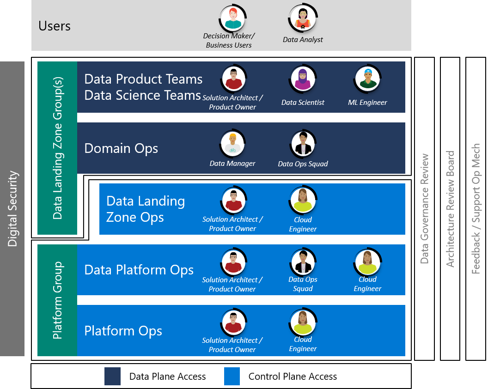

# Personas and Teams

The Enterprise Scale Analytics and AI moves teams from working horizontally across each tier such as Ingest, Processing, Analysis, Consumption and Visualization to vertical Data Landing Zone Groups coexisting together in an agile team. Platform teams such as Data Platform Ops and Platform Ops are grouped together under a common Platform Group.

*Figure 1: Enterprise Scale Analytics and AI Teams*

## Personas

There are multiple personas involved in an Enterprise Scale Analytics and AI deployment. The following sections attempts to give a high insight to those which we see are key to the success.

| Persona | Role |
|-|-|
|Product Owners| Product Owners leverage Azure to transform your solutions and bring agility to the business and optimize business processes.|
| Solution Architects | Define solutions to drive across the boundaries of the enterprise business network. Learn how to deal with diagnosis, analysis, design, deployment, and integration of Azure services. |
|Developer/DevOps Engineers|Design, build, deploy, test, and maintain continuous integration and delivery process with Azure DevOps or GitHub.|
| Security Engineers 1 | Enable your teams to design and implement a secure infrastructure on Azure leveraging best practices. |
| Technical/Business Managers 1|Build an overall understanding of Azure services. Control your cloud costs and optimize your operations and the agility of your team.|
|Decision Makers / Business Users|Leverage Azure to access actionable insight, expecting it to be delivered in most relevant form. Leverage AI embedded in existing solutions to optimize business processes.|
| Data Managers | Responsible for provisioning and managing access to data assets. |
|Data Analysts / Performance Analysts |Leverage Azure to discover and share new insights from existing data assets or *ad hoc* data. Create one-click AI transformations, consume pre-built models, and generate ML models in clicks.|
|Data Engineers | Leverage Azure to build, integrate, and manage data and analytics products. Create AI enabled applications / solutions when applicable.|
|Citizen Data Scientists |Create ML models via powerful visual, drag-and-drop, no-code tools where no coding is necessary |
| Data Scientists | Use your preferred tools and machine learning frameworks to build scalable data science solutions. Accelerate end-to-end ML lifecycle.|
| ML Engineers | Enable right processes and infrastructure for easy model deployment and model management. |

>[!NOTE]
> 1 These roles are assisted by using Azure Policies to control some of the scope over which they would have guidance and control.

## Data Landing Zone Teams

The Data Landing Zone Group consists of three teams.

### Data Product Scrum Teams (per Product)

* They are responsible for delivering new Data Products such as insights, reports, notebooks, and applications.
* They partner closely with business analysts and stakeholders.

### Domain Ops (per Domain)

* They ingest and register new data sources.
* Manage access hierarchy (groups) and approval requests.
* Furnish metadata in Data Management Landing Zone Data Catalog.

### Data Landing Zone Ops (One Group per Data Landing Zone)

* Operate and maintain their Data Landing Zone instance.
* Respond to new Domain and Data Product service requests.

### Central or Business Data Office?

The Data Landing Zone Group can be resourced in different ways depending on the size and organizational structure of your business.

For example, you create one data landing zone where the business already has it's own set of data engineers, program managers and solution architects. We will call this a business data office. In this scenario, you could decide to provision a data landing zone and allow the business data office to operate the landing zone, based upon the governance from your central platform group.

In another example, the owning business of a data landing zone doesn't have a business data office to build out their domains or data products. In this scenario the central data office should consider themselves a consultancy who would take people off the bench to work on the data landing zone. Those resources should be embedded into the business to collect and execute on use cases in either a SCRUM or AGILE manner. Once completed they would return to the central data office.

>[!NOTE]
>In the core services pattern of one data landing zone, it is likely that you will mix businesses into one data landing zone. You might then end up with a crossover of functions where Domain Ops or Data Product teams could be resourced from central and business data offices. However, in this scenario we would recommend that the function of Data Landing Zone Ops is all located in the central data office.

## Platform Group Teams

### Data Platform Ops

* The Data Platform Ops Group defines common policies for Data Landing Zone and Domain services.
* They provision and operate Data Management services such as the data catalog and shared integration runtimes.
* They instantiate Data Landing Zone scaffolding such as Data Lakes and Metadata Management configuration before passing it over to the Data Landing Zone Ops.
* Provide support and concierge to stakeholders.

### Platform Ops

* Operate and own the cloud platform all up.
* They instantiate Data Management Landing Zone and Data Landing Zone scaffolding such as networking, peering, monitoring, and other core services.

## Other Groups

Across the whole operating model, companies have the option to run several smaller teams with key stakeholders and subject matter experts to maintain a centralized view of the analytics platform.

### Digital Security Office

Digital security spans the whole of the Enterprise Scale Analytics and AI solution pattern. It is usually a dedicated department lead by a Chief Information Security Officer (CISO). This department will work closely with the Data Platform Ops, Data Governance Review Board, and Architecture Review Board.

### Data Governance Review Board

*Figure 2: Data Governance Review Board*

The Data Governance Review Board is the body that governs your organization's data governance policies, guides and advises your data strategy, prioritizes and approves your data governance initiatives and projects, and offers on-going support for these.

### Architecture Review Board

The Architecture Review Board performs the primary function of reviewing and assessing architectures and creating and maintaining standards and references. The Board consists of individuals who are experts in their field; typically, these will be the Domain architects and other technical leaders invited to give opinions where required.

### Feedback and Support Operating Board

The Feedback and Support Operating Board are responsible for taking feedback on processes and working with the other groups to create backlog items to address gaps and improvements to the solution.

For further details on all how the groups align inside the Data Management Landing Zone and Data Landing Zone(s) please see [Enterprise Scale Analytics and AI DevOps Models](eslz-team-functions.md).
