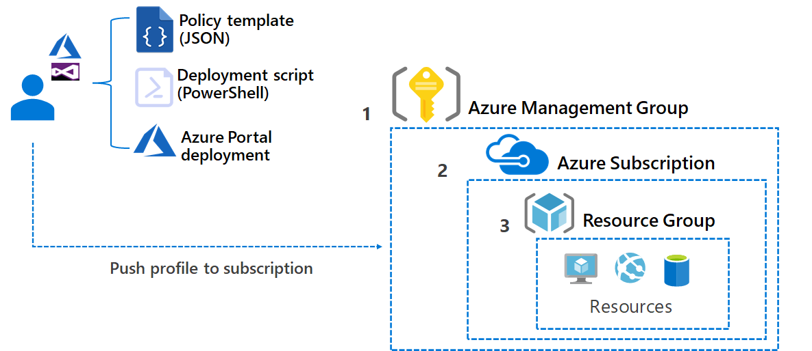

# Policies in Azure enterprise-scale for analytics and AI

Before considering a deployment, it's important for your organization to put guardrails in place. By using [Azure policies](/azure/governance/policy/overview), you can implement governance for resource consistency, regulatory compliance, security, cost, and management.

## Background

A core principle of enterprise-scale for analytics and AI is to make it easy to create, read, update, and delete resources as needed. However, while giving unrestricted resource access to developers can make them agile, it can also lead to unintended cost consequences. The solution to this problem is resource access governance. This governance is the ongoing process of managing, monitoring, and auditing the use of Azure resources to meet the goals and requirements of your organization.

The [enterprise-scale architecture](../../ready/enterprise-scale/index.md) already uses this concept. Enterprise-scale for analytics and AI adds [custom Azure policies](#azure-policies-for-enterprise-scale-for-analytics-and-ai) to build on these standards. The standards are then applied to our data management landing zones and data landing zones.

Azure Policy is important when ensuring security and compliance within enterprise-scale for analytics and AI. It helps to enforce standards and to assess compliance at scale. Policies can be used to evaluate resources in Azure and compare them to the wanted properties. Several policies, or business rules, can be grouped into an initiative. Individual policies or initiatives can be assigned to different scopes in Azure. These scopes might be management groups, subscriptions, resource groups, or individual resources. The assignment applies to all resources within the scope, and subscopes can be excluded with exceptions if necessary.

## Design considerations

Azure policies in enterprise-scale for analytics and AI were developed with the following design considerations in mind:

- Use Azure policies to implement governance and enforce rules for resource consistency, regulatory compliance, security, cost, and management.
- Use available prebuilt policies to save time.
- Assign policies to the highest level possible in the management group tree to simplify policy management.
- Limit Azure Policy assignments made at the root management group scope to avoid managing through exclusions at inherited scopes.
- Only use policy exceptions if necessary, and they should require global admin approval.

## Azure policies for enterprise-scale for analytics and AI

[Implementing custom policies](/azure/governance/policy/tutorials/create-and-manage) allows you to do more with Azure Policy. Enterprise-scale for analytics and AI comes with a set of pre-created policies to help you implement any required guardrails in your environment.

Enterprise-scale for analytics and AI contains custom policies related to **resource and cost management, authentication, encryption, network isolation, logging, resilience, and more**. See [Data service policies](https://github.com/Azure/data-management-zone/tree/main/infra/Policies) for an updated list of policies.

> [!NOTE]
> The policies provided are not applied by default during deployment. They should be viewed as guidance only, and can be applied depending on business requirements. Policies should always be applied to the highest level possible. In most cases, this is a [management group](/azure/governance/management-groups/overview). All of the policies are available in our GitHub repository.

## Next steps

- [Requirements for governing data in a modern enterprise](./govern-requirements.md)
- [Components needed for data governance](./govern-components.md)
