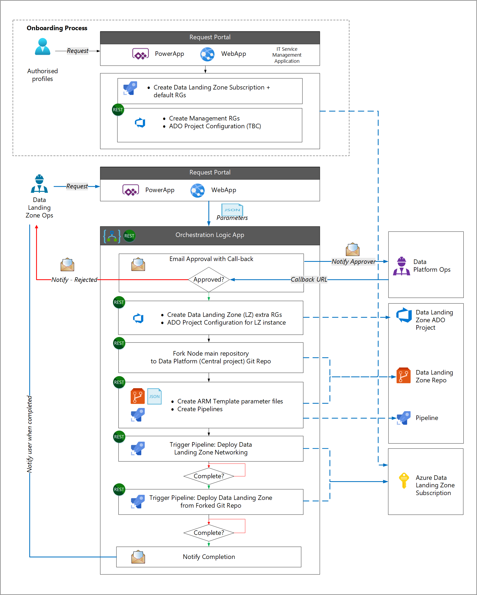
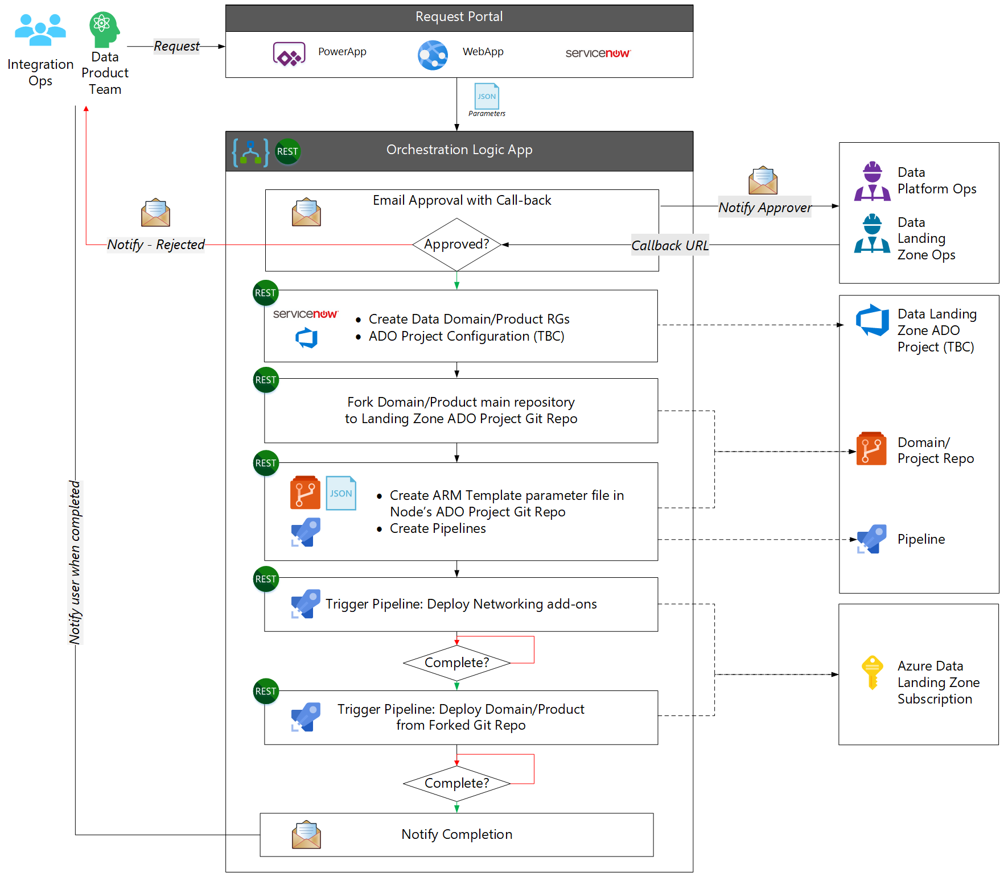
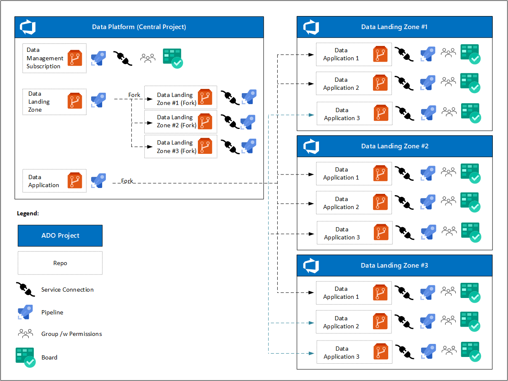

# Provision the Azure enterprise-scale for analytics and AI platform

## Data management landing zone deployment process

The data platform operations team is responsible for deploying a data management landing zone. The data-management landing zone should have its own repository maintained by the data platform operations team.

> [!CAUTION]
> Create and deploy a data-management landing zone before any data landing zone is deployed.

## Data landing zone deployment process

Teams can use templates provided by the data platform operations team to avoid starting from scratch for each asset. We recommend a forking pattern to automate the deployment of a new landing zone.

For example, a data landing zone operations team requests a new data landing zone using a IT management tool or [Power Apps](https://azure.microsoft.com/products/powerapps/). Upon approval of the request, start the following workflow using parameters from the request:

1. Deploy a new subscription for the new data landing zone.
1. Fork the main branch of the data landing zone template to create a new repository.
1. Create a service connection in the new repository.
1. Update parameters in the new repository based on parameters from the request.
1. Create a deployment pipeline to deploy the services, triggered by check-in of the updated parameters.
1. Notify the data landing zone operations team that the new landing zone is available.

The data landing zone operations team can now change or add Azure Resource Manager templates.

This workflow can be automated using multiple service sets on the Azure platform. Handle some of the steps, such as renaming parameters in parameter files, using CI/CD pipelines. Other steps can be executed using other workflow orchestration tools such as Logic Apps.

The forking pattern allows teams to update their templates from the original templates used to fork them. Also, if improvements or new features are implemented in the template repositories, operations teams can pull them into their fork.

Adopt best practices for repositories, such as:

- Secure the main branch.
- Use branches for changes, updates, and improvements.
- Define the code owners who approve pull requests before merging changes into the main branch.
- Validate branches through automated testing.
- Limit the number of actions and persons in the team, such as who can trigger build and release pipelines.

> [!TIP]
> Coordinate activities between teams to ensure that improvements or new features in the original templates are replicated in all data landing zone instances. Operations teams can pull original template changes into their fork.

The onboarding process is separate from the data landing zone deployment process. This separation is based on the assumption that most organizations have a standard Azure subscription deployment process as part of their cloud operating model. The onboarding process deploys standard corporate components (for example using a third-party IT Service Management tool). Data landing zone-specific components are deployed next.

There are no Git APIs available to clone/update/commit/push in the proposed automation solution. So our approach is to use an [Azure Automation account](/azure/automation/automation-intro) containing PowerShell runbooks that:

- Set up a data landing zone
- Fork the main repository to a data platform Git repository
- Set up the subnet configurations for the data landing zone
- Set up Azure Active Directory

The runbooks use Git functions from the [`GitAutomation`](https://github.com/webmd-health-services/GitAutomation) PowerShell module for working with Git repositories. By installing this module inside an Azure Automation account, users can do create, clone, query, push, pull, and commit operations in Git repositories. The following image shows the GitAutomation module installed inside an automation account:

:::image type="content" source="./images/git-automation.png" alt-text="Diagram of GitAutomation Module for working with Git repositories." lightbox="./images/git-automation.png":::

Use the `Copy-GitRepository` function from the GitAutomation module to clone the main Git repository from the URL specified by `URL` to the data platform Git path specified by `DestinationPath`.

This approach to data landing zone deployment is flexible, while ensuring that actions are compliant with organizational requirements. Lifecycle management is possible through the ability to apply new features or optimizations from the original templates.

## Data integration and data product deployment process

After a data landing zone has been created, onboarding can start for the data integration and data product operations teams. The data platform or data landing zone operations teams grant deployment approval.

Deployment is done either directly using DevOps tooling or called via pipelines/workflows exposed as APIs. Similar to the data landing zone, deployment begins with forking the original data integration or data product repository.

1. The user makes a request for new data integration or data product services.
1. The workflow process requests approval from the data platform or data landing zone operations team.
1. The workflow calls the IT Service Management API to create required resource groups, and creation of an Azure DevOps service connection. The workflow assigns a team to the Azure DevOps project.
1. The workflow forks the original data integration or data product repository to create the destination Azure DevOps Project.
1. The workflow creates an Azure Resource Manager template parameter file and pipelines.
1. The workflow then starts an Azure pipeline to create the networking requirements, and another Azure pipeline to deploy the data integration or data products services.
1. The workflow notifies the user on completion.

>[!TIP]
>If you are new to DataOps, the Architecture Center has a hands-on lab [DataOps for the Modern Data Warehouse (MDW)](/azure/architecture/example-scenario/data-warehouse/dataops-mdw). The lab's scenario describes how a fictional city planning office can use this deployment solution. The deployment solution provides an end-to-end data pipeline that follows the MDW architectural pattern, along with corresponding DevOps and DataOps processes, to assess parking use and make informed business decisions.

## Summary

The above patterns provide control, agility, self-service, and lifecycle management of policies.

At the start of the project, the data platform has one Azure DevOps project with one or more Azure Boards. Individual DevOps teams focus on:

- One repository for the data management landing zone, pipelines, and a service connection to the cloud environment.
- One template repository for the data landing zone, pipelines to deploy a data landing zone instance, and service connections to cloud environments.
- One template repository for a data integration service, pipelines to deploy a data integration resource group, and service connections to cloud environments. These connections are forked from data landing zone Azure DevOps Projects.
- One template repository for data product services, pipelines to deploy a data product instance, and service connections to cloud environments. These connections are forked from data landing zone Azure DevOps Projects.

Once data landing zones have been deployed, enterprise-scale for analytics and AI prescribes that:

- Each data landing zone will have its own Azure DevOps project with one or more Azure Boards.
- For each new data integration or data product service, its data landing zone Azure DevOps project fork is created after request approval.
- Each data integration or data product service includes:
  - A service connection.
  - A registered pipeline.
  - A DevOps team with access to their Azure board and repository.
  - A different set of policies for the forked repository.

To control the deployment of data integration and data product services, follow these practices:

- The data landing zone operations team owns and secures the main repository branch.
- Only the main branch is used to deploy to test and production environments.
- Feature branches can deploy to development environments.
- Feature branches are owned by the DataOps teams. They're used to test new or modified features.
- DataOps teams can merge feature branches into other feature branches without approval.
- DataOps teams create a pull request to merge feature branches into the main branch, and the data landing zone operations team provides approval.
- New features or improvements to the original templates are merged into the forked repository to keep them updated.

## Next steps

- [Deployment templates](./eslz-deployment-templates.md)
- [An introduction to Azure Automation](/azure/automation/automation-intro)
