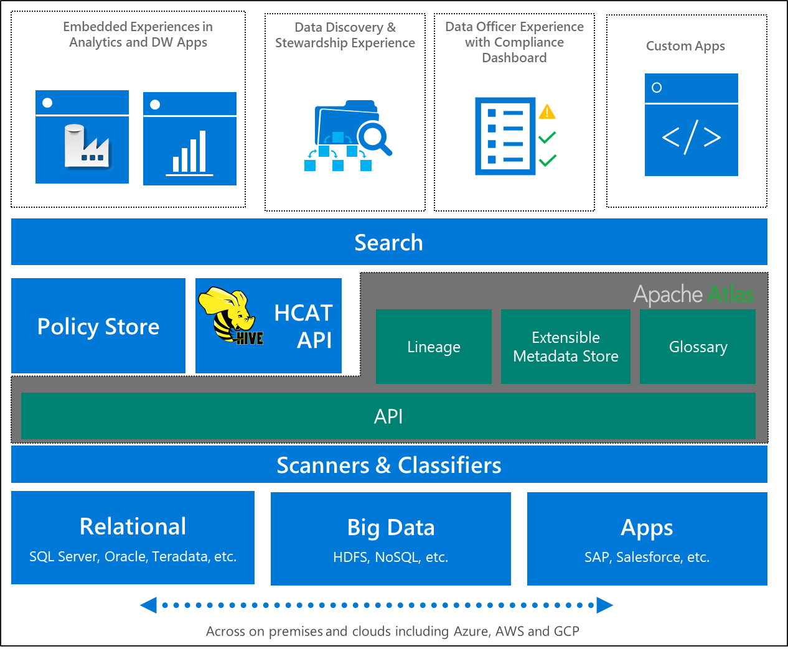

# Azure Purview deployment best practices for 'data management and analytics' Enterprise-Scale scenario

The [Data Management Landing Zone](eslz-data-management-landing-zone.md) is responsible for the governance of the Enterprise Scale Analytics and AI platform and relies on [Azure Purview](https://azure.microsoft.com/services/purview) to provide the following data management capabilities:

- [Data Catalog](eslz-data-management-landing-zone.md/#data-catalog)
- [Data Classification](eslz-data-management-landing-zone.md/#data-classification)
- [Data Lineage](eslz-data-management-landing-zone.md/#data-lineage)

Azure Purview is a unified data governance service that helps organizations to manage and govern data across on-premises, multi-cloud, and software-as-a-service (SaaS). Azure Purview creates a holistic, up-to-date map of the data landscape with automated data discovery, sensitive data classification, and end-to-end data lineage. Azure Purview empowers data consumers to find valuable, trustworthy data.

> [!TIP]
> We recommend using third-party tools of your choice to integrate the remaining capabilities of the [Data Management Landing Zone](eslz-data-management-landing-zone.md) with Azure that are currently not supported by Azure Purview.

> [!NOTE]
> This section aims to explain prescribed configurations which are specific to the Enterprise Scale Analytic and AI solution pattern and discusses a collection of Azure best practices to enhance your data governance using Azure Purview. It is a compliment to the official [Azure Purview Documentation](https://docs.microsoft.com/azure/purview/).

## Overview

One Azure Purview account is deployed inside the Data Management Landing Zone which serves as a centralized data catalog as shown in the figure above. From the Data Management Landing Zone, Azure Purview will be able to communicate with each Data Landing Zone via private network connectivity using VNet Peering across Data Management and Data Landing Zones and [Self-Hosted Integration Runtimes](https://docs.microsoft.com/azure/purview/manage-integration-runtimes#:~:text=On%20the%20home%20page%20of%20Purview%20Studio%2C%20select,a%20name%20for%20your%20IR%2C%20and%20select%20Create.). Discovery of datasets in on-premises data stores and other public clouds is achieved by additional deployments of Self-Hosted Integration Runtimes.

## Account Setup

The first step is the deployment of an Azure Purview account. During the deployment of the [Data Management Landing Zone](./eslz-data-management-landing-zone.md), a single Azure Purview account is automatically deployed inside the data management subscription. The aim is to centralize the entire data map into a single Azure Purview account across all data landing zones, therefore, it is recommended to consider a shared single Azure Purview account inside Data Management Landing Zone subscription per environment type.

In addition to the Azure Purview account, a managed resource group is also deployed. A managed *storage account* and a managed *Event Hubs namespace* are deployed inside this resource group and are used to ingest the metadata as a result of scans. Since these resources are consumed by the Azure Purview catalog, they must not be removed. Therefore, an Azure RBAC _deny assignment_ is automatically added for _all principals_ at the resource group level at the time of deployment.

### Prerequisites

Prior to deployment, review the following requirements inside your Data Management Landing Zone subscription:
- **Make policy exemptions** (if needed): If you have an existing Azure Policy assignment which is preventing administrators or applications from creating Azure Storage Accounts, Azure Event Hubs namespace, Azure Purview accounts, Azure Private DNS Zones or Azure Private Endpoints, you need to apply [Azure Policy exemptions](https://docs.microsoft.com/azure/governance/policy/concepts/exemption-structure) so the required resources can be deployed in the Data Management Landing Zone along with Azure Purview deployment.
- **Register resource providers**: Ensure the following Azure resource providers are registered in Data Management Landing Zone subscription.
  - Microsoft.EventHub
  - Microsoft.Purview
  - Microsoft.Storage

> [!IMPORTANT]
> To successfully deploy the Data Management Landing Zone with Azure Purview, the above mentioned prerequisites should be met. To learn more about registering resource providers, please see [Resource providers for Azure Services](https://docs.microsoft.com/azure/azure-resource-manager/management/azure-services-resource-providers#registration).

## Networking and Name Resolution

The Azure Purview account is deployed inside the Azure Virtual Network (VNet) within the Data Management Landing Zone.

### Private Endpoint Deployment

As shown in the figure above, Enterprise Scale Analytics and AI uses [Azure Private Endpoint](https://docs.microsoft.com/azure/private-link/private-endpoint-overview) to enable secure access to the catalog powered by [Azure Private Link](/azure/private-link/private-link-overview). The private endpoint uses IP addresses from the VNet address space for your Azure Purview account. Network traffic between the clients on the VNet and the Purview account traverses over the VNet and a private link on the Microsoft backbone network eliminating exposure from the public internet. To enable network isolation for end-to-end scan scenarios, additional private endpoints are deployed so data sources in both Azure and on-premises sources can be connected through Private Link.

> [!IMPORTANT]
> To successfully scan data sources in Azure Purview, a Self-hosted Integration Runtime must be deployed inside the private network either in the Data Management Landing Zone or the Data Landing Zone.

For further reading, see [Enterprise Scale Analytics and AI Networking](./eslz-network-topology-and-connectivity.md).

#### Private Endpoint for Account and Portal

Azure Purview is deployed with two private endpoints:

- **Account** private endpoint is used for securing APIs and it is required as a prerequisites for **portal** private endpoint.
- **Portal** private endpoint is aimed to provide private connectivity to Azure Purview Studio.

To manage the data estate using Azure Purview and to connect to Azure Purview Studio, you need to use private connectivity because public access is restricted to the Azure Purview Account that is deployed inside the Data Management Landing Zone to provide additional security.

### Access to Azure Purview Studio

To maintain the use of Azure Purview portal through private connectivity, it is recommended to [deny public network access](https://docs.microsoft.com/azure/purview/catalog-private-link#firewalls-to-restrict-public-access) in Azure Purview settings. Therefore, to connect to Azure Purview Studio, a *jump machine (or jump box)* that is deployed inside your network is needed either using a machine from the hybrid network (option 1) or as a VM inside the Data Management Landing Zone (option 2). A jump machine is a hardened remote access server, commonly using Microsoft's Remote Desktop Services or Secure Shell (SSH) software. Jump machines act as a stepping point for administrators accessing critical systems with all administrative actions performed from the dedicated host.

Use any of the following options to manage your data using Azure Purview through Azure Purview Studio:

- **Option 1**: Use a jump machine which is connected to CorpNet. To use this connectivity model, you must have connectivity between the VNet where Azure Purview Portal Private Endpoint is created which your corporate network.
  
  Review Cloud Adoption Framework Networking for more information [Network topology and connectivity](../ready/enterprise-scale/network-topology-and-connectivity.md).

- **Option 2**: If hybrid connectivity is not available in your organization, [deploy a Virtual Machine](https://docs.microsoft.com/azure/virtual-machines/windows/quick-create-portal) inside the Data Management Landing Zone and [deploy Azure Bastion](https://docs.microsoft.com/azure/bastion/quickstart-host-portal) to connect to Azure Purview using a secure connection.

> [!NOTE]
> The [Azure Bastion service](https://docs.microsoft.com/azure/bastion/bastion-overview) is a fully platform-managed PaaS service that you provision inside your virtual network that lets you connect to a virtual machine using your browser and the Azure portal instead of Public IP address. Azure Bastion offer a limited attack surface to attackers. While they are exposed to the public internet, customers (and attackers) have no access to underlying operating systems providing the services and they are typically maintained and monitored consistently via automated mechanisms at the cloud provider. This smaller attack surface limits the available options to attackers vs. classic on-premises applications and appliances that must be configured, patched, and monitored by IT personnel who are often overwhelmed by conflicting priorities and more security tasks than they have time to complete. Azure Bastion effectively provides a flexible solution that can be used by IT Operations personnel and workload administrators outside of IT to manage resources hosted in Azure without requiring a full VPN connection to the environment.

#### Private endpoints for ingestion

Azure Purview can scan data sources in Azure or on-premises environments using private or public endpoints. As part of the Data Landing Zone deployment, the network of a Data Landing Zone is automatically peered with the Data Management Landing Zone VNet and the connectivity subscription VNet, therefore data sources inside Data Landing zones can be scanned using private connectivity.

It is recommended to enable private endpoints for additional [data sources inside your landing zones](https://docs.microsoft.com/azure/purview/catalog-private-link) and scan data sources using private connectivity.

### Name resolution

DNS resolution for private endpoints should be handled through central Azure Private DNS zones. The following Private DNS Zones are deployed automatically as part of the Azure Purview deployment in the Data Management Landing Zone:

- privatelink.purview.azure.com
- privatelink.blob.core.windows.net
- privatelink.queue.core.windows.net
- privatelink.servicebus.windows.net

If you have a hybrid cloud, and cross-premises name resolution is required, it is important that on-premises DNS Servers are configured correctly to forward the appropriate requests to the Custom DNS server in Azure. There are multiple ways to do this:

- If you have Custom DNS already in Azure, you just need to setup conditional forwarders on your on-premises DNS server pointing to it.

- If you do not have a Custom DNS VM in Azure, you can deploy the Azure Virtual Machine Scale Set that includes Nginx already configured to forward DNS requests to Azure-provided DNS IP **168.63.129.16**. Refer to [Deploy VMSS of a NGINX DNS Proxy into an existing Virtual Network](https://github.com/Microsoft/PL-DNS-Proxy).

>[!TIP]
> To allow name resolution between the Data Management Landing Zone and the Data Landing Zones, use the same Private DNS Zones located inside `{prefix}-global-dns` resource group inside the Data Management Landing Zone.

For more information related to Enterprise Scale Analytics and AI networking and name resolution, see [Enterprise Scale Analytics and AI Networking](./eslz-network-topology-and-connectivity.md)

## Manage authentication for data sources in Azure Purview

Azure Purview requires access to the _control plane_ and the _data plane_ to register and scan data sources.

### Register Data Sources

When the Azure Purview Account is deployed, a system-assigned managed identity is automatically created in your Azure Active Directory tenant and assigned to this resource. To read and enumerate Azure resources under a subscription or resource group when registering data sources in Azure Purview, the Azure Purview managed identity requires the Azure RBAC _Reader_ role on the scope.

Consider assigning the _Reader_ role to the Azure Purview managed identity in each Data Landing Zone subscription before registering any of the following data sources into Azure Purview:

- Azure Blob Storage
- Azure Data Lake Storage Gen1
- Azure Data Lake Storage Gen2
- Azure SQL Database
- Azure SQL Managed Instance
- Azure Synapse Analytics

### Scan Data Sources

#### Deploy and register self-hosted integration runtimes

Deploy and register [self-hosted integration runtime (IR)](https://docs.microsoft.com/azure/purview/manage-integration-runtimes) VMs for each Data Landing Zone. Self-hosted IRs are required to scan data sources such as Azure SQL DB or any VM-based data sources in the on-premises or in each of the Data Landing Zones. A self-hosted IR can run copy activities between a cloud data store and a data store in a private network. It also can dispatch transform activities against compute resources in an on-premises network or an Azure virtual network. The installation of a self-hosted IR needs an on-premises machine or a virtual machine inside a private network.

> [!TIP]
> We recommend that you use a dedicated machine to host the IR. The machine should be separate from the server hosting the data store. Also, it is highly recommended to plan for at least 2 self-hosted IR VMs in each Data Landing Zone or on-premises environment.

You might want to host an increasing concurrent workload or you might want to achieve higher performance in your present workload level. You can enhance the scale of processing by the following approaches:

- Scale up when the processor and memory of the node are being less than fully utilized.
- You can scale out the self-hosted IR by adding more nodes (virtual machines).

#### Assign access to the data plane to scan data sources

In order to provide access to Azure Purview at data plane there are multiple options to setup the authentication for Azure Purview to access data sources:

- Option 1: Managed Identity
- Option 2: Account key or passwords stored in Azure Key Vault as a secret
- Option 3: Service principal stored in Azure Key Vault as a secret

> [!IMPORTANT]
> Currently, in order to scan data sources through Private Link in Azure Purview, you need to deploy a Self-Hosted Integration Runtime and use either **key Vault** or **Service Principal** from the options above for authentication to data sources.

>[!TIP]
> In the case where a data source cannot use Private Link, it is recommended to use Azure Purview managed identity to scan data sources.

### Store secrets inside Azure Key Vault

Multiple Azure Key Vault resources are deployed inside the Data Management Landing Zone and the Data Landing Zone subscriptions to store secrets related to metadata data sources in the Data Management Landing Zone and data sources such as Azure SQL DB (consumed by Azure Data Factory) or Azure Database for MySQL (used by Databricks workspaces) in the Data Landing Zone.

### Connect Data Landing Zones Azure Key Vaults to your Azure Purview Account

Azure Purview can use the secrets and credentials stored in Azure Key Vaults only if the Azure key Vault connection is created inside the Azure Purview Account and the secret is registered. After adding a new Data Landing Zone, it is necessary to create new Azure Key Vault connections inside the Azure Purview Account. The connection is a one-to-one association of Azure Key Vault resource with the Azure Purview account and will allow creation of credentials inside the Azure Purview account based on the secrets stored in the Key Vault.

For more information, see [Create Azure Key Vaults connections in your Azure Purview account](https://docs.microsoft.com/en-us/azure/purview/manage-credentials#create-azure-key-vaults-connections-in-your-azure-purview-account).

>[!TIP]
> Minimize Key Vault connections by removing any unused Azure Key Vaults.  

### Create credentials inside Azure Purview

You may require to setup a _Credential_ using a Key Vault _Secret_ for scenarios such as the following:

- To scan any data sources where Azure Purview managed identity cannot be used as the authentication method.
- To scan any data sources using a self-hosted integration runtime, the supported authentication types such as account keys, SQL authentication (password) or service principal must be stored in a credential.
- To scan data sources using a Private Endpoint for data ingestion.
- To scan data sources that are inside a Virtual Machine or inside an on-premises environment.

Before creating any credentials in Azure Purview, your Azure Purview Account must have access to Key Vault secrets. Use Azure Key Vault access policy or RBAC to grant Azure Purview Managed Service Identity (MSI) the required access. For more information about how to grant Azure Purview MSI access to Azure Key Vault and create Credentials inside Azure Purview, see [Credentials for source authentication in Azure Purview](https://docs.microsoft.com/en-us/azure/purview/manage-credentials).

## Azure Purview Roles and Access Control

Azure Purview has several built-in RBAC roles (such as *Purview Data Reader*, *Purview Data Curator* and *Purview Data Source Administrator*) to manage the data plane which can be combined to provide additional privileges as shown in the table below. For example the *Purview Data Reader* role is targeted for roles such as Data officers, Data Stewards and Chief Security Officers who require read-only access to the data estate such as classifications, lineage through search options and reports that are available in Azure Purview.

For more information about Azure Purview catalog roles, see [Role-based access control in Azure Purview's Data Plane](https://docs.microsoft.com/azure/purview/catalog-permissions)

Once the Data Management Landing Zone deployment completed, use the least privilege model to provide access to view and manage data in Azure Purview. Assign roles to Azure Purview resource using [Azure Role-based Access control](https://docs.microsoft.com/en-us/azure/role-based-access-control).

Review the following list of personas involved in an Enterprise Scale Analytics and AI deployment and assign them the relevant Azure Purview roles so they can contribute in the success of the program:

| Persona | Role |Recommended Azure Purview Role  |
|-|-|-|
|Product Owners| Product Owners leverage Azure to transform your solutions and bring agility to the business and optimize business processes.|Purview Data Reader |
| Solution Architects | Define solutions to drive across the boundaries of the enterprise business network. Learn how to deal with diagnosis, analysis, design, deployment, and integration of Azure services. |Purview Data Source Administrator + Data Curator    |
|Developer/DevOps Engineers|Design, build, deploy, test, and maintain continuous integration and delivery process with Azure DevOps or GitHub.|N/A  |
| Security Engineers 1 | Enable your teams to design and implement a secure infrastructure on Azure leveraging best practices. |Purview Data Reader  |
| Technical/Business Managers 1|Build an overall understanding of Azure services. Control your cloud costs and optimize your operations and the agility of your team.|N/A |
|Decision Makers / Business Users|Leverage Azure to access actionable insight, expecting it to be delivered in most relevant form. Leverage AI embedded in existing solutions to optimize business processes.|Purview Data Reader   |
| Data Managers | Responsible for provisioning and managing access to data assets. |Purview Data Reader or Purview Data Curator |
|Data Analysts / Performance Analysts |Leverage Azure to discover and share new insights from existing data assets or *ad hoc* data. Create one-click AI transformations, consume pre-built models, and generate ML models in clicks.|Purview Data Source Administrator + Data Reader   |
|Data Engineers | Leverage Azure to build, integrate, and manage data and analytics products. Create AI enabled applications / solutions when applicable.|Purview Data Source Administrator + Data Curator|
|Citizen Data Scientists |Create ML models via powerful visual, drag-and-drop, no-code tools where no coding is necessary |Purview Data Source Administrator + Data Curator |
| Data Scientists | Use your preferred tools and machine learning frameworks to build scalable data science solutions. Accelerate end-to-end ML lifecycle.|Purview Data Source Administrator + Data Curator |
| ML Engineers | Enable right processes and infrastructure for easy model deployment and model management. |Purview Data Source Administrator + Data Curator    |

For more information about Data Personas, see [Personas and Teams](eslz-persona-and-teams.md/#personas)