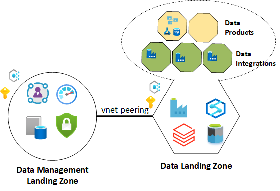
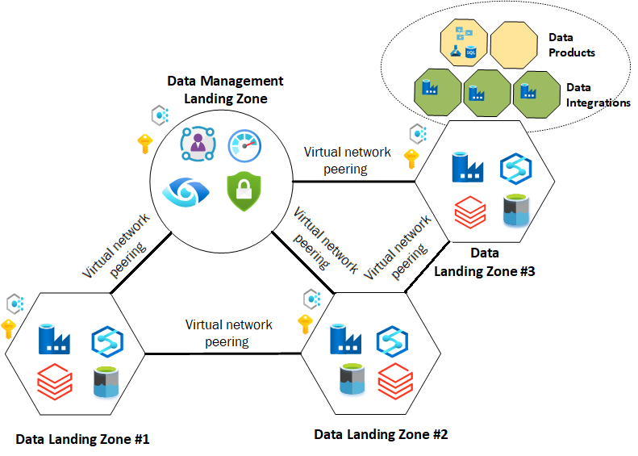

# Scaling data management and analytics in Azure

A scalable data platform is critical for your enterprise to accommodate the rapid growth of data. Vast amounts of data are generated every second. The amount of data to deal with is expected to grow exponentially over the next few years. The speed at which new data is generated and the speed at which data moves will increase. Even with more data, users expect that they'll get fast query results. Users expect to wait minutes rather than hours for results.

As an enterprise company, you want to enable business units to act on their own. Business units shouldn't rely on a central team to provision the environment, databases, and tools they need.

To extend your analytics platform to include other Azure services on demand, start by provisioning the platform with only the services you require. Extend your platform as you onboard new use cases. This approach allows your enterprise to regulate the platform cost effectively.

When designing your analytics environment, consider regional dependencies and data residency requirements. Are there any local laws or regulations requiring data to stay in a specific location?

You can start with single or multiple data landing zones:

- If you're just starting with your environment, consider a [single data landing zone](#single-data-landing-zone).

- For a more advanced environment that requires the ability to scale out using consistent patterns, consider [multiple data landing zones](#multiple-data-landing-zones).

For more information, see [Enterprise-scale for analytics and AI architecture data landing zone](./architectures/data-landing-zone.md).

## Single data landing zone

This figure gives an overview of an enterprise-scale for analytics and AI platform with a data management landing zone and a single data landing zone.

This approach allows you to conform to the principles of enterprise-scale for analytics and AI. It gives you the option to add data landing zones as needed. This pattern builds out common core services with flexibility to add customizations. If you start with a single data landing zone, plan for expanding into multiple landing zones. Such planning avoids having to migrate data later.

## Multiple data landing zones

This diagram is an overview of an enterprise-scale for analytics and AI platform with a central data management landing zone and multiple data landing zones:

Enterprise-scale for analytics advocates consistent governance using a common architecture. The architecture defines baseline capabilities and policies. All data landing zones adhere to the same controls and auditing. Teams can create data pipelines, ingest sources, and create data products, such as reports and dashboards. Teams can do Spark/SQL analysis as needed. You can augment data landing zone capabilities by adding services to the capability in the policy. For instance, a team could add a third-party graph engine to address a niche business requirement.

If you have multiple data landing zones, the zones can connect to data lakes hosted in other zones. This approach allows groups to collaborate across the enterprise.

When designing for multiple data landing zones, ensure direct communication between workloads with large amounts of traffic. For large workloads across multiple subscriptions, we recommend peering the virtual networks.

Enterprise-scale for analytics and AI places a strong emphasis on central cataloging and classification to protect data and allow various groups to discover datasets.

## Next steps

- [Enterprise enrollment and Azure AD tenants for data management and analytics enterprise-scale scenario](./eslz-enterprise-enrollment-and-azure-ad-tenants.md)
- [Network topology and connectivity for data management and analytics](./eslz-network-topology-and-connectivity.md)
