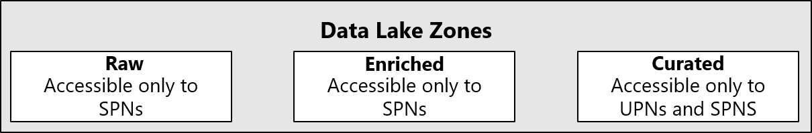

# Security, governance, and compliance for 'data management and analytics' Enterprise-Scale scenario

The Enterprise Analytics and AI solution pattern relies on a number of security features which can be enabled on Azure. They include Encryption, Role-Based Access Control, Access Control Lists, and Networking restrictions.

## Data-at-Rest Encryption

Data-at-Rest (DaR) encryption refers to the encryption of data as it persists in storage. DaR encryption is a critical security control by Microsoft as it addresses security risks related to direct physical access to storage media as the underlying data is not recoverable and cannot be changed without the underlying decryption key. This makes it an important layer in the defense-in-depth strategy of Microsoft data centers. In addition, there are often compliance and governance reasons to deploy DaR encryption.

There are multiple services that support DaR encryption, including Storage Accounts and SQL Databases. Additionally, each service may apply DaR encryption at different layers in the stack. Each specific service referenced in this document that has a specific DaR encryption requirement will be addressed in the relevant section. However, there are common concepts and models to be addressed that influence the design decisions of services throughout the Azure stack.

>[!IMPORTANT]
>All services which support Encryption at Rest should have it enabled by default.

## Networking

The Enterprise Scale Analytics and AI prescribed view is to use Private Endpoints for all PaaS services and no public IPs for any IaaS (Infrastructure-as-a-Service). See [Enterprise Scale Analytics and AI Networking](./eslz-network-topology-and-connectivity.md).

## Azure Defender

Azure Defender provides security alerts and advanced threat protection for virtual machines, SQL databases, containers, web applications, virtual networks, and more.

When you enable Azure Defender from the **Pricing and settings** area of Azure Security Center, the following Defender plans are all enabled simultaneously and provide comprehensive defenses for the compute, data, and service layers of your environment:

- [Azure Defender for servers](/azure/security-center/defender-for-servers-introduction)
- [Azure Defender for App Service](/azure/security-center/defender-for-app-service-introduction)
- [Azure Defender for Storage](/azure/security-center/defender-for-storage-introduction)
- [Azure Defender for SQL](/azure/security-center/defender-for-sql-introduction)
- [Azure Defender for Kubernetes](/azure/security-center/defender-for-kubernetes-introduction)
- [Azure Defender for container registries](/azure/security-center/defender-for-container-registries-introduction)
- [Azure Defender for Key Vault](/azure/security-center/defender-for-key-vault-introduction)
- [Azure Defender for Resource Manager](/azure/security-center/defender-for-resource-manager-introduction)
- [Azure Defender for DNS](/azure/security-center/defender-for-dns-introduction)

Each of these plans is explained separately in the Security Center documentation.

>[!IMPORTANT]
>Where this Azure Defender is available for the PaaS Services, we recommend enabling this feature by default, especially for the Azure Data Lake Storage accounts. See [Introduction to Azure Defender](/azure/security-center/azure-defender) and [Configure Azure Defender for Storage](/azure/storage/common/azure-defender-storage-configure?tabs=azure-security-center) for further details.

## Advanced Threat Protection

Advanced Threat Protection is part of the Advanced Data Security offering, which is a unified package for advanced security capabilities. Advanced Threat Protection can be accessed and managed via the Azure portal. The feature is available for General Purpose and Memory Optimized servers.

Where Advanced Threat Protection is available for the PaaS Services, we recommend enabling this feature by default.

## Azure Data Lake Gen 2 RBAC and ACLs

Azure Data Lake Gen 2 is the predominant polyglot storage within the Enterprise Scale Analytics and AI pattern. Three data lake accounts are provisioned per Data Landing Zone.

It is important to understand how Enterprise Scale Analytics and AI uses Active Directory identities to secure data in the data lake accounts. This section outlines the core terms required for the solution pattern, but for an in-depth explanation, see [Access control lists (ACLs) in Azure Data Lake Storage Gen2](/azure/storage/blobs/data-lake-storage-access-control).

Azure Data Lake Storage Gen2 supports access control models that combine both Azure RBAC (Role-based access control) and ACLs (Access control lists) to manage access to the data. You can find more information about the [Data Lake Storage Access Control](/azure/storage/blobs/data-lake-storage-access-control).

In addition to managing access using Azure Active Directory identities for RBAC and ACLs, Azure Data Lake Storage Gen2 also supports using SAS tokens and shared keys for managing access to data in your storage account.

>[!IMPORTANT]
>We recommend [Prevent Shared Key authorization for an Azure Storage account (preview)](/azure/storage/common/shared-key-authorization-prevent) for the Data Landing Zone Data Lakes.

**RBAC** lets you assign roles to security principals (a user, group, service principal, or managed identity in Azure Active Directory), and these roles are associated with sets of permissions to the data in your file system. RBAC can help manage roles related to control plane operations (such as adding other users, assigning roles, managing encryption settings and firewall rules, etc.) or for data plane operations (such as creating file systems, reading and writing data etc.).

RBAC is essentially scoped to top-level resources, either storage accounts or file systems in Azure Data Lake Storage Gen2. You can also apply RBAC across resources at a resource group or subscription level.

**ACLs** let you manage a specific set of permissions for a security principal to a much narrower scope, such as a file or a directory in Azure Data Lake Storage Gen2. There are [two types of ACLs](/azure/storage/blobs/data-lake-storage-access-control#types-of-acls): *access ACLs* and *default ACLs*.

- Access ACLs control access to an object. Files and directories both have access ACLs.
- Default ACLs are templates of ACLs associated with a directory that determine the access ACLs for any child items that are created under that directory. Files do not have default ACLs.

Both access ACLs and default ACLs have the same structure.

### RBAC and ACLs Considerations

|Consideration  |RBAC  |ACLs  |
|---------|---------|---------|
|Scope|Storage accounts, file systems. Cross-resource RBAC at subscription or resource group level.|Files, directories |
|Limits|2,000 RBAC entries in a subscription | 32 ACLs (effectively 28 ACLs) per file, 32 ACLs (effectively 28 ACLs) per folder, default, and access ACLs each |
|Supported levels of permission|[Built-in RBAC](/azure/storage/common/storage-auth-aad-rbac-portal#rbac-roles-for-blobs-and-queues) or [custom RBAC](/azure/role-based-access-control/custom-roles)|[ACL permissions](/azure/storage/blobs/data-lake-storage-access-control#levels-of-permission)|

The table above gives an overview of how ACLs and RBAC can be used to manage permissions to the data in your Azure Data Lake Storage Gen2 accounts. At a high level, use RBAC to manage coarse-grained permissions that apply to storage accounts or file systems, and use ACLs to manage fine-grained permissions that apply to files and directories.

>[!CAUTION]
>For every subdomain dataset two Azure AD Security Groups should be created: one for Read and Write and the other for Read-only.\
\
If the dataset is non-sensitive, Users Principal Names(UPNs) and Service Principal object can be added to these groups. If the dataset is SENSITIVE, we would recommend that only Service Principal object and/or Managed Service Identity (MSI) be added to these groups. Please see [Data Privacy](eslz-data-privacy.md) for further details on our sensitive data security pattern.

Resist the opportunity to directly assign individual users or service principals to ACLs. Using an Azure AD Security Group structure will allow you to add and remove users or service principals without the need to reapply ACLs to an entire directory structure. Instead, you can just add or remove users and service principals from the appropriate Azure AD security group.

## How access is evaluated in ADLS

During security principal-based authorization, permissions will be evaluated in the following order as depicted in the diagram below and described in [the documentation](https://docs.microsoft.com/azure/storage/blobs/data-lake-storage-access-control-model#how-permissions-are-evaluated):

- RBAC is evaluated first and takes priority over any ACL assignments.
- If the operation is fully authorized based on RBAC then ACLs are not evaluated at all.
- If the operation is not fully authorized then ACLs are evaluated.

>[!NOTE]
>The above permission model applies to ADLS only and not general purpose (blob) storage without HNS enabled which does not support ACLs.
>This description excludes [Shared Key and SAS authentication](https://docs.microsoft.com/azure/storage/blobs/data-lake-storage-access-control) methods in which no identity is associated with the operation and assumes that the storage account is accessible via appropriate networking configuration. It also excludes scenarios in which the security principal has been assigned the Storage Blob Data Owner built-in role which provides *super-user* access.
>It is recommended to set allowSharedKeyAccess to false so that access can be audited by the identity.


See [here](https://docs.microsoft.com/azure/storage/blobs/data-lake-storage-access-control#common-scenarios-related-to-permissions) for another example of what ACL based permissions are required for a given operation.

>[!NOTE]
>
> * ACLs apply only to security principals in the same tenant, including guest users.
> * Azure Databricks mount points can be created by any user with permissions to attach to a cluster. The mount point will be configured using service principal credentials or the AAD passthrough option, but at the time of creation permissions are not evaluated. Only when an operation is performed using the mount point will permissions be evaluated and any user who can attach to a cluster can attempt to use the mount point. Securing access to ADLS from Azure Databricks is covered in more detail [here](https://github.com/hurtn/datalake-ADLS-access-patterns-with-Databricks).
> * When creating a table definition in Databricks or Synapse, the user issuing the DDL needs to have read access to the underlying data.

## Configuring access to ADLS and Data Lake Storage Configurations

There are three possible approaches to implement access control in ADLS using RBAC or ACLs or a combination of both.

### Configure access using RBAC only

If container level access control is sufficient then RBAC assignments may offer a simpler management approach to securing data however be aware that role assignments are limited to 2000 per subscription therefore ACLs are recommended for a large number of restricted data assets or where more granular access control is required.

### Configure access using ACLs only (Recommended for Enterprise Scale Analytics and AI)

As per the [ADLS best practices](https://docs.microsoft.com/azure/storage/blobs/data-lake-storage-best-practices#use-security-groups-versus-individual-users) it is recommended to assign access control entries to a security group rather than an individual user or service principal. When adding or removing users from the group no updates to ADLS are required and using groups also reduces the chance of exceeding the 32 access control entries per file or folder ACL. After the 4 default entries that leaves only 28 remaining for permission assignments.

However, even when using groups, a proliferation of access control entries may occur at top levels of the directory tree, particularly when very granular permissions with many different groups are required. In order for each group to obtain read access to the files contained in their folder, they will need execute permissions from root, which is the container level, all the way down to the folder they are trying to access. It is likely that the 32 access control entry limit will be reached in the root or levels close to root. An example of this scenario is depicted below:


### Configure access using both RBAC and ACLs

Storage Blob Data Contributor/Reader only provides access to the data and not the storage account. It can be granted at the storage account or container level. When Storage Blob Data Contributor is assigned, ACLs __cannot__ be used to manage access. Where Storage Blob Data Reader is assigned, elevated write permissions can be granted using ACLs. Refer to the section above on [how access is evaluated in ADLS](#how-access-is-evaluated-in-adls).

This approach favours scenarios where most users need read access to but only a few need write access. The data lake zones could be different storage accounts and data assets could be different containers, or the data lake zones could be represented by containers and data assets represented by folders.

## Nested ACL Group Approaches

There are two possible solutions to this outlined below but the recommended approach is to make use of nested groups.

### Option 1: The Parent Execute Group

Where possible before files and folders are created, begin with a parent group which is assigned execute permissions to both default and access ACLs at the container level. Then add the groups requiring data access to the parent group. This technique is known as nesting groups, and from an ADLS authorization perspective, the member group inherits the permissions of the parent group, providing "global" execute permissions to all member groups. The member group in this case will not need execute permissions as these permissions will be inherited because it belongs to the parent group.  Additional nesting may provide greater flexibility and agility if the security groups that represent teams or automated jobs are added to the data access reader and writer groups.


### Option 2: The Other ACL entry (Recommended)

Another way to ensure that every part of the path from root to lowest level has execute permissions (--x) is to use the "Other" ACL entry set at the container/root, with defaults and access ACLs applied as shown in the first diagram below. This execute permission propagates down any subsequently added child folders until the depth/folder where the intended access group should have Read and Execute permissions (in the lowest part of the chain as depicted in the second image), which will grant that group access to read the data appropriately. This approach works similarly for write access.


#### Data Lake Zones Security



The recommended security pattern for each of the of the Data Lake Zones is:

- RAW should only allow access to data via SPNs
- Enriched should only allow access to data via SPNs
- Curated should allow access with both SPNs and UPNs.

#### Example Scenario for using Azure AD Security Groups with Non-Sensitive dataset

There are many different ways to set up groups. For example, imagine that you have a directory named **/LogData** which holds log data that is generated by your server. Azure Data Factory (ADF) ingests data into that folder. Specific users from the service engineering team will upload logs and manage other users of this folder, and the **Azure Databricks Analytics and Data Science Workspace** clusters could analyze logs from that folder.

To enable these activities, the Domain could create a `LogsWriter` group and a `LogsReader` group. You could then assign permissions as follows:

- Add the `LogsWriter` group to the ACL of the **/LogData** directory with `rwx` permissions.
- Add the `LogsReader` group to the ACL of the **/LogData** directory with `r-x` permissions.
- Add the service principal object or Managed Service Identity (MSI) for ADF to the `LogsWriters` group.
- Add users in the service engineering team to the `LogsWriter` group.
- Databricks would be configured for Azure AD Passthrough to the Azure Data Lake Store.

If a user in the service engineering team transfers to a different team, you could just remove them from the `LogsWriter` group. If you did not add that user to a group, but instead, you added a dedicated ACL entry for that user, you would have to remove that ACL entry from the **/LogData** directory. You would also have to remove the entry from all subdirectories and files in the entire directory hierarchy of the **/LogData** directory.

## Databases Authentication and Permissions

Other polyglot storage such as PostgreSQL, MySQL, Azure SQL Database, SQL Managed Instance, and Azure Synapse Analytics are likely to be used in the Enterprise Scale Analytic solution pattern. They could be used by Domains to store their Read Data Stores or by Data Product Teams.

- [Use Azure Active Directory for authentication with PostgreSQL](/azure/postgresql/howto-configure-sign-in-aad-authentication)
- [Use Azure Active Directory authentication with Azure SQL Database, SQL Managed Instance, and Azure Synapse Analytics](/azure/azure-sql/database/authentication-aad-overview)
- [Use Azure Active Directory for authenticating with MySQL](/azure/mysql/concepts-azure-ad-authentication)

It is recommended that Azure AD groups are used to secure database objects instead of individual Azure AD user accounts. These AD Azure Groups would be used to authenticate users and protects database objects. Similar to the data lake pattern, you could use your Domain or Data Products onboarding to create these groups within you Azure AD service.

>[!NOTE]
>Storing data inside an Azure SQL Database, SQL Managed Instance, and Azure Synapse Analytics Pools are one of the options for domains to store [Sensitive Data](eslz-data-privacy.md#sensitive-data).

### Azure Synapse Data Access Control in Azure Data Lake Gen2

When deploying an Azure Synapse workspace, a Data Lake Storage Gen 2 account is required from the subscription or manually using the storage account URL. The specified storage account will be set as **primary** for the deployed Azure Synapse workspace to store its data. Azure Synapse stores data in a container, that includes Apache Spark tables, spark application logs under a folder called /synapse/{workspacename}. It also uses container for managing libraries that you choose to install.

During the Synapse workspace deployment through [Azure Portal](https://azure.microsoft.com/en-us/features/azure-portal/), you have the option to either provide an existing storage account or create a new one. The provided storage account will be set as the **primary storage account** for the Synapse workspace.  
For any of the two options selected, the deployment process automatically grants the Synapse workspace identity data access to the specified Data Lake Storage Gen2 account, using the **Storage Blob Data Contributor** role.  
If the deployment of Synapse workspace happens outside of the Azure Portal, you will have to add Synapse workspace identity to the **Storage Blob Data Contributor** role manually later. It is recommended to assign the role **Storage Blob Data Contributor** on the file system level to follow the least privilege principle.  

It is also possible to manually specify the storage account URL. However, in this case, you will need to contact the storage account owner, and ask them to grant the workspace identity access manually using the **Storage Blob Data Contributor.**

The Synapse workspace identity permission context is used when executing Pipelines, workflows, and notebooks through jobs. If any of the jobs read and/or write to the workspace primary storage, the workspace identity will use the read/write permissions granted through the **Storage Blog Data Contributor**.

**Storage Blob Data Contributor** role is used to grant read/write/delete permissions to Blob storage resources such as folder and files.

**Storage Account permissions required when using Synapse workspace interactively and for development.**  
To allow read and write access to other users or groups on the primary storage account after it has been deployed, it will require you to grant access permissions using the **Storage Blob Data Contributor role** or **Access Control Lists** directly to the user or groups. When users log into the Synapse workspace to execute scripts or for development, the user's context permissions are used to allow read/write access on the primary storage.

#### Fine-grained data access control using Access Control Lists

When setting-up Data Lake access control, some organizations require granular level access due to sensitive data stored that cannot be seen by some users or groups. Using Azure RBAC, it is only possible to give read and/or write at the container level. For example, assigning a user or group to Storage Blob Data Contributor role will allow read/write access to all folders in that container. With ACLs you can setup fine-grained access control at the folder and file level to allow read/write on the data that users or groups need access.

Before you start implementing fined-grained access with ACLs, is important to understand how ACLs permissions are evaluated.

1. Azure Role assignments are evaluated first and take priority over any ACL assignments.
1. If the operation is fully authorized based on Azure role assignment, then ACLs are not evaluated at all.
1. If the operation is not fully authorized, then ACLs are evaluated.


Please refer to the [Access control model for Azure Data Lake Storage Gen2 | Microsoft Docs](https://docs.microsoft.com/azure/storage/blobs/data-lake-storage-access-control-model#how-permissions-are-evaluated) for more information.

To setup ACLs in Data Lake Storage Gen 2, you can use one of the following methods;  

**Azure CLI**  
For detailed instructions on how to use **Azure CLI** to grant ACLs permissions in ADLS Gen2 refer to [Use Azure CLI to manage ACLs in Azure Data Lake Storage Gen2](https://docs.microsoft.com/en-us/azure/storage/blobs/data-lake-storage-acl-cli)

**PowerShell**  
For detailed instructions on how to use **PowerShell** to grant ACLs permissions in ADLS Gen2 refer to [Use PowerShell to manage ACLs in Azure Data Lake Storage Gen2](https://docs.microsoft.com/en-us/azure/storage/blobs/data-lake-storage-acl-powershell)

**Azure Storage Explorer**  
For details instructions on how to use and install, refer to [Get started with Storage Explorer | Microsoft Docs.](https://docs.microsoft.com/azure/vs-azure-tools-storage-manage-with-storage-explorer?tabs=windows)

Consider using **Azure CLI** or **PowerShell** for automation to achieve better scalability when a large amount of folders and files are expected in the ACLs setup process.

#### Granting Azure RBAC Reader on the Storage Account

Assigning Azure RBAC Reader role to users or groups in the Synapse workspace primary storage account is required for them to be able to list the storage account and containers when using Data Hub in Synapse Studio.

Using Data Hub in Synapse Studio, users can browse folders and files before they start writing a query or spark code. Users also have some options available in Synapse Studio to help getting started with queries and reading the data from spark from a specific file. These options include Select Top 100 rows, Create External Table, Load to a Dataframe, New Spark Table.

Refer to the [Assign Azure roles using the Azure portal - Azure RBAC | Microsoft Docs](https://docs.microsoft.com/azure/role-based-access-control/role-assignments-portal) for detailed instructions on how assign Reader role on the storage account.

#### Granting Read Access on Azure Data Lake Storage Gen 2 using ACLs

The first step on this process, you will need to grant the appropriate ACL permissions for users or groups at the **container level** in the Storage account.
There are situations where a user or group cannot read the folders or files in the container root. However, they can be granted read/write permissions in child folders of the root. In this case, It will be still required the users or groups to have `execute` permissions on the parent folders, including the root, to traverse these folders which the identity does not have read/write access.

Please go through the following steps to get started.

1. Open Azure Storage Explorer, right click on storage container you want to setup fined-grained access with ACLs and choose Manage Access Control Lists.


1. Click in Add to include users or groups that you want to grant permissions.


1. In **Search for a user, group, or service principal.** Type the name of the user of group and click search. The users or groups should show-up. Select the user or group and choose **Add**.


After adding the user or group. Select the identity added in the previous step. In Permission for: *name of user or group* check the option **Access**, followed by **Read** and **Execute** options on the right-hand side.

As per [ADLS Best Practices](https://docs.microsoft.com/en-us/azure/storage/blobs/data-lake-storage-best-practices#use-security-groups-versus-individual-users), it is strongly recommended to assign **Azure Active Directory security groups** instead of assigning individual users to directories and files. Using Security Groups, adding or removing users from the group does not requires updates to ADLS, consequently reduces the chance of exceeding the 32 access control entries per file or folder ACL.

It is important to notice the informative message **"Read and Write permissions will only work for an entity if the entity also has execute permissions on all parent directories, including the container (root directory)"** It means that you will also need to grant Execute permissions on all parent folders, including the container which is the root directory, when granting read or write in a sub directory.


**Granting permissions automatically to new children of the directory using the Default*** **option.**

If you want to grant ACLs permissions automatically for new children of the directory, use the option **Default*** and select the required permissions read, write, or execute.


After granting permission at the container level, repeat the same steps for any subfolder you want to give access to users or groups.

#### Granting Write Access on Azure Data Lake Storage Gen 2 using ACLs

Select the folder you want to give users or groups write permission and choose **Manage ACLs.**


If you want to grant ACLs permissions automatically for new children of the directory, use the option **Default*** and select the appropriate permissions **Read/write** and **execute.**  As mentioned in the Granting Read Access on ADLS Gen 2 section, this option will automatically propagate parent folder permissions to newly created children's items, such as folder and files.

After selecting the appropriate permissions, click **OK** to close.


Repeat the same steps for any additional folders and subfolder you may want to grant access to users or groups.

#### Propagate ACLs permissions to children objects

When granting ACLs permissions to folders that already contain child objects such as folder and files, you may need to use the option **Propagate Access Control Lists option.** This option enables propagation of ACLs from the parent folder to its child objects. It is important to understand that ACLs propagation is not easily reversible. You will need to evaluate case by case to ensure you are propagating the correct ACL permissions to the right security group. If you use this option at the container level, it will propagate the permissions from the container level to all sub-folders within the container.

To propagate ACL permissions, right-click on the parent folder you desire to propagate the ACL permissions. This action will propagate permissions for all users to the existing child objects from the parent folder you are performing the action.


In Propagate Access Control Lists, choose How to handle failures depending on the desired behavior you want in case of failures. You can choose from the two options: **Continue on Failure** or **Quit on failure.**

Check the box I understand that propagating ACLs cannot be easily reversable and click OK.


#### Considerations when using Spark Tables in Synapse Spark Pool.

When you use Spark Tables in Synapse Spark Pool, the following folder structure will be created automatically by Synapse workspace in the root of the container in the workspace primary storage.  

synapse/workspaces/{workspacename}/**warehouse**

If you plan to create spark tables in Synapse Spark Pool. It is required that you grant write permission on the **warehouse** folder for the users or group executing the command that creates the Spark Table. If the command is executed through triggered job in a pipeline, you will need to grant write permission to the Synapse workspace identity. 

Create Spark Table example 

```python 
df.write.saveAsTable("<tablename>")
```

## References

[How to set up access control for your Synapse workspace - Azure Synapse Analytics | Microsoft Docs](https://docs.microsoft.com/azure/synapse-analytics/security/how-to-set-up-access-control?WT.mc_id=Portal-Microsoft_Azure_Synapse)
