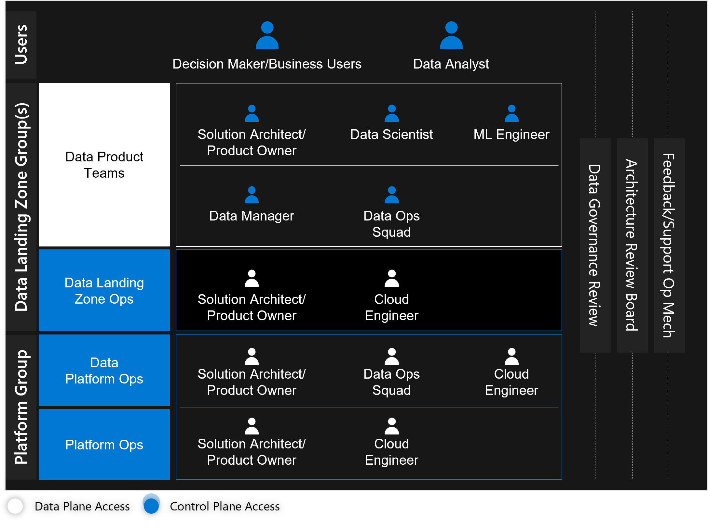

# Understand the personas and teams for the data management and analytics scenario in Azure

For the data management and analytics scenario, we recommend moving teams like ingest, processing, analysis, consumption, and visualization from working in horizontally siloed teams, to agile vertical cross domain teams in each tier. Platform teams like data platform operations and platform operations are grouped together in a common platform group.

## Personas

Multiple personas are involved a data management and analytics scenario deployment. The following sections outline the personas that are key to a successful deployment, and data governance roles are described further down this page.

| Persona | Role |
|-|-|
|Product owners| They optimize Azure to transform solutions, bring agility to the business, and optimize business processes.|
| Solution architects | They propose solutions for the boundaries of the enterprise business network and learn how to diagnose, analyze, design, deploy, and integrate Azure services. |
|Developer/DevOps engineers|They use Azure DevOps or GitHub to design, build, deploy, test, and maintain continuous integration and delivery processes.|
| Security engineers 1 | They support teams to design and implement secure Azure infrastructure with best practices. |
| Technical/business managers 1|They help to develop an understanding of Azure services, control costs, and optimize your team's operations and agility.|
|Decision makers/business users|They optimize Azure to gain actionable insights in their most relevant forms and identify AI embedded in current solutions to streamline business processes.|
| Data managers | They provision and manage access to data assets. |
|Data/performance analysts |They use Azure to discover and share new insights from existing data assets or as-needed data queries. They create one-click AI transformations, consume prebuilt models, and generate machine learning models quickly.|
|Data engineers | They use Azure to build, integrate, and manage data and analytics products. When necessary, they also create AI-enabled applications/solutions.|
|Citizen data scientists |They create machine learning models with powerful visual, drag-and-drop, and no-code tools where coding isn't necessary. |
| Data scientists | They use preferred tools and machine learning frameworks to build scalable data science solutions. They also accelerate the end-to-end machine learning lifecycle.|
| Machine learning engineers | They support the right processes and infrastructure models to be deployed and managed easily. |

> [!NOTE]
> Azure policies assist these roles to control some of the scope that they oversee.

## Data landing zone teams

The data landing zone group consists of three teams:

**Data Product teams (one team per product)**:

- Are responsible for delivering new data products such as insights, reports, notebooks, and applications.
- Partner closely with business analysts and business unit stakeholders.
- Transform data into new read data stores.
- Manage access hierarchy (groups) and approval requests.
- Furnish metadata in data catalogs.

**Integration Ops (one team per integration)**:

- Ingest and register new read data sources.
- Manage access hierarchy (groups) and approval requests.
- Furnish metadata in data catalogs.

**Data Landing Zone Ops (one group per data landing zone)**:

- Operate and maintain their data landing zone instance.
- Respond to new data integration and data product service requests.

### Decide between a central or business data office

Depending on your organization's size and structure, a data landing zone group can be assembled in different ways. For example, if you create one data landing zone where the business already has its own set of data engineers, program managers, and solution architects, like a business data office. You can provision a data landing zone and allow the business data office to operate the landing zone based on governance from your central platform group.

Another option is for when a data landing zone's business doesn't have a business data office to build out their data integrations or data products. In this scenario, the central data office can consider itself a consultancy that shifts people from the bench to work on the data landing zone. Those resources should be embedded into the business to collect and execute on use cases with Scrum or agile methods. Once completed, they would return to the central data office.

Individuals should work within multidisciplinary teams in both of these scenarios, sharing goals and diverse experience, skills, and approaches that support more effective outcomes than if everyone is in a silo.

> [!NOTE]
> In the scenario where only one data landing zone is deployed, it's common for businesses to overlap in one data landing zone. This could create crossover functions where integration operations or data product teams are sourced from central and business data offices. However, data landing zone operations functions to be located in the central data office for this scenario.

## Teams within the platform group

The platform group consists of two teams:

**Data Platform Ops:**

- Define common policies for data landing zone, integration, and product services.

- Provision and operate data management services like the data catalog and runtimes for shared integration.

- Instantiate data landing zone scaffolding, including data lakes and configuring how metadata is managed before passing it to data landing zone operations.

- Support stakeholders.

**Platform Operations:**

- Operate and own the cloud platform.

- Instantiate data management landing zone and data landing zone scaffolding, including networking, peering, monitoring, and other core services.

## The digital security office

Digital security deals with the entire management and analytics scenario. It's usually a dedicated department lead by a chief information security officer. This department works closely with data platform ops, the data governance review board, and the architecture review board.

## Data governance roles and responsibilities

There are many data governance roles and responsibilities related to people. The roles and responsibilities can vary across organization. The roles and responsibilities in the table are provided as guidance only.

|Role |   Responsibility|
|--|--|
|Executive sponsor, for example, the CFO or CIO. |  This is a senior business stakeholder with authority and budget. They're accountable for establishing data governance.|
|Data governance program leader, for example, the chief development officer, or the appointed lead. | This person is accountable and responsible for implementing the data governance program.|
|Data governance control board |   This board includes a data governance lead and data owners. They establish metrics for success, own the data governance roadmap, select working groups, hold the budget for the data governance program, and mediate during conflicts about prioritizing and defining cross-functional data.|
|Data governance working group  |  They plan and develop defining data and improving specific data domains (for example, customer, or supplier); update the data governance control board on progress; and manage stewardship across the enterprise for a specific domain.|
|Data owner   | This is a senior business stakeholder with authority and budget. They're accountable for quality assurance (QA) and protecting a specific data subject area or entity across the enterprise. They decide who can access and maintain that data and how it's used.|
|Business data steward |   This business professional responsible oversees QA and protects a data subject area or entity. They're often experts in the data domain, work in a team with other data stewards across the enterprise, and monitor and decide how to maintain data quality.|
|Data protection officer  | This is a senior business stakeholder with authority and budget, accountable for protecting personal data. Their tasks are specific to compliance legislation in all jurisdictions where company operates.|
|Data security team  |  This team is responsible and accountable for enforcing data access security and a data privacy policy.|
|Data publishing manager   | This person is responsible and accountable for checking QA and publishing new, trusted data assets in a data marketplace for consumer use.|

:::image type="content" source="./images/data-governance-review-board.png" alt-text="Diagram of the structure of how to organize data governance.":::

The goal is for businesses to organize governance in a way that allows them to divide and conquer when governing data throughout its lifecycle across a hybrid computing environment. One way is to have multiple working groups reporting to a data governance control board, with each working group responsible for a particular data domain or entity, for example, the customer, or a data subject area that consists of multiple data entities.

## Other groups

Companies can run several smaller teams with key stakeholders and subject matter experts across the entire operating model to maintain a centralized view of the analytics platform.

### Architecture review board

The architecture review board's main functions are to review and assess architectures, and create and maintain standards and references. The board consists of individuals who are experts in their field. Typically, the individuals are domain architects and other technical leaders invited to give opinions when needed.

### Feedback and support operating board

The feedback and support operating board receives feedback about processes and works with the other groups to create backlog items to address gaps and improve the solution.

For more information about how groups align within a data management landing zone and data landing zones, see the [data management and analytics scenario DevOps models](./organize-team-functions.md).

## Next steps

[Team functions](./organize-team-functions.md)
