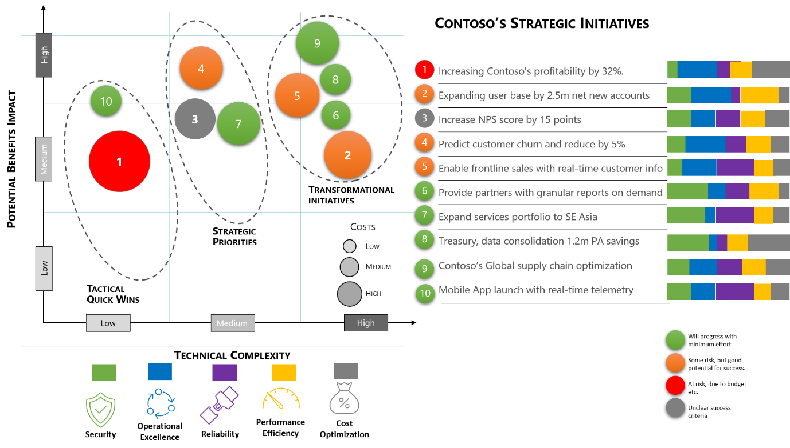

# Develop a plan for 'data management and analytics'

[Cloud Adoption Framework's Plan methodology](../../plan/index.md) helps create an overall cloud adoption plan to guide the programs and teams involved in your cloud-based digital transformation. The Plan methodology also provides templates for creating your backlog and plans for building necessary skills across your teams, all based on what you are trying to do in the cloud. 

This article will build on that methodology with specific guidance for data estate rationalization and skilling plans specific to 'data management and analytics'

## Data estate rationalization

Much of the guidance in the Plan methodology focuses on the [five rs of rationalizing your digital estate](../../digital-estate/5-rs-of-rationalization.md). This scenario narrows the primary focus of rationalization to the **data estate**, which is a subset of the overall digital estate. This plan will also look broader and deeper at the data estate than you might in other plans. Specifically, it must include plans for your overall [analytics maturity](./intro-analytics-maturity.md) and the [data governance practices](./intro-data-governance.md) required to support the desired maturity.

To properly rationalize your data estate, begin by aligning your business outcomes to each of your data initiatives. This will aid in prioritization and a clear understanding of the value your can derive from each data initiative. Initiatives which represent little business value and also present lesser complexity with regards to migration could easily be included in you cloud migration plan to deliver quick efficiency gains. Initiatives with greater business impact or those with greater technical complexity would likely require richer planning to enable long term innovation value.

Figure 1: Strategic Initiatives

Benchmarking your current estate and capability is critical in ensuring you can track progress and measure success. This allows you to quantify the exact investment needed in terms of people, process and technology. You'll be able to see where you are on the Maturity Model, and the gaps you need to bridge.

To help you get started, here is a table showing the thought process:

|Category| Action Areas | Current Status focusing on 5 pillars of architecture |
|----------|--------------|-------------------------------------|
|**Preparation**| There are about 8-10 topics here starting from Strategy, Charter, Ethics, etc.| |
| **Agility**| Depending on the organizations there could be 5 to 10 topics here, such as strategy around Data Lake, Catalogue, Common Data Model etc. |  |
| **Resilience**|10-20 topics are here starting from discovery, recovery and anomaly detection. |  |

Table 1: Using the maturity level detailed further below, rate your current capability between 0-4 and use the 5 pillars of architecture to guide those benchmarks.

Once you're clear about the business outcomes you're looking to drive through your data strategy, the next step is to build the capability to deliver them.

## Develop a skilling plan

Clear mapping of the Product, Services or Tools capabilities Maturity Assessment along with People skills, who will help deliver on the achieving the overall objectives.

The above is not an exhaustive list by any means and could vary depending on the organization type/structure.

### Assess Capability Maturity

There must be an exercise in assessing the Data Analytics & AI capabilities required to deliver on a specific use case, holistically or at an organizational level. However, there has to be some guiding principles/process to go about the assessment:

- Define current capabilities and ambition
- Identify risks and blockers to progress
- Clearly state benefits and key stakeholders
- Link benefits to stated business objectives
- Identify key dependencies

As a next step, look at Azure native services, and start mapping what you need to deliver success.

Along with capability maturity assessment, culture is also another important aspect which is the key focus of this framework to make it successful.

## Additional tips to prepare your plan

The following are critical tips that can improve your overall plan.

### Prepare for potential challenges and roadblocks early

It can be difficult to harness the power of data in a secure and compliant manner. Sometimes, you can run into challenges like organizational silos, building a data-driven culture, and a never-ending challenge coming out of running multiple tools and technologies across the organization. Time to market is one of the most critical factors these days for all businesses. Organizations can have great ideas and data can be an enabler, but with so many challenges it can take weeks, if not months, before they can start getting insights and ultimately deliver business value from data.

### Initial org alignment: Center of Excellence

Center of Excellence would assist in:

- Driving adoption, standards, best practices and innovation
- Funded team for full delivery and specialist skills provision
- Deep technical skills in key technologies
- Active participation and evangelizing in Communities of Practice

### Adopting Agile Delivery Method

Agile is the ability to create and respond to change. It is a way of dealing with, and ultimately succeeding in, an uncertain and turbulent
environment.

It's really about thinking through how you can understand what's going on in the environment that you're in today, identify what uncertainty you're facing, and figure out how you can adapt to that as you go along.

## Next step: Assess for 'data management and analytics'

The following list of articles will take you to guidance found at specific points throughout the cloud adoption journey to help you be successful in the cloud adoption scenario.

* [Review your environment or Azure Landing Zone(s)](./ready.md)
* [Assess for 'data management and analytics' migration](./migrate-assess.md)
* [Migrate 'data management and analytics'](./migrate-deploy.md)
* [Release 'data management and analytics' to production](./migrate-release.md)
* [Innovate with 'data management and analytics'](./innovate.md)
* [Govern 'data management and analytics'](./govern.md)
* [Manage 'data management and analytics'](./manage.md)
