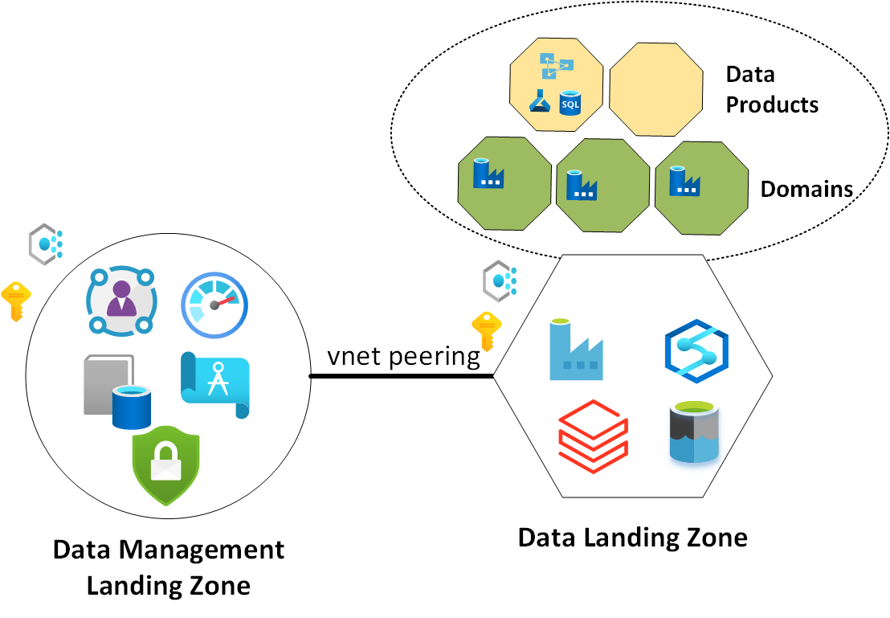
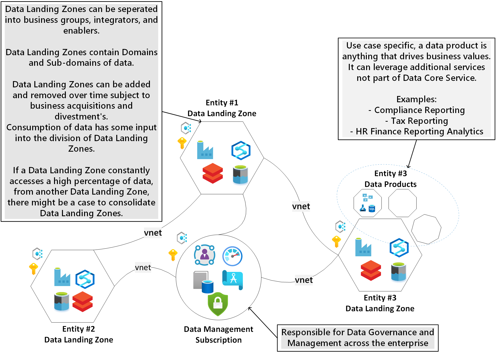

# Provisioning the Enterprise Scale Analytics and AI platform

In order to extend your analytics platform to include other Azure services on demand, the prescribed approach is to provision the platform with only the services you require, with t-shirt sizing, and extend it further as new use cases are on-boarded. This approach also allows enterprises to regulate the platform cost effectively.

Design considerations:

- If your environment is at a starting point, consider [starting with a single Data Landing Zone](#starting-with-a-single-data-landing-zone).

- If your environment is more advanced requiring the ability to scale up using consistent patterns, consider [starting with multiple Data Landing Zones](#starting-with-multiple-data-landing-zones).

## Starting with a single Data Landing Zone

*Figure 1: Enterprise Scale Data Management with a single Data Landing Zone*

Figure 1 gives an overview of an Enterprise Scale Analytics and AI platform with a central Data Management Landing Zone and a **single** spoke (i.e., the Data Landing Zone). For many environments this approach of deploying a central hub with a single spoke will be the starting point. An advantage of starting with this approach is that it allows you to conform to the principles of Enterprise Scale Analytics and AI whilst giving you the option to add additional Data Landing Zones at a later stage as needed. This is close to a core service provider pattern which builds out common core services with flexibility to bolt on domain specific customizations.

## Starting with Multiple Data Landing Zones

*Figure 2: Enterprise Scale Data Management with multiple Data Landing Zones*

Figure 2 gives an overview of an Enterprise Scale Analytics and AI platform with a central Data Management Landing Zone and **multiple** spokes (i.e., the [Data Landing Zones](eslz-data-landing-zone.md)). This is similar to a harmonized mesh pattern which leverages common policies that ensure baseline security and compatibility. Different groups within the enterprise can customize capabilities as they see fit using this pattern.

The Enterprise Scale Analytics and AI framework advocates consistent governance using a common architecture that defines baseline capabilities and policies. Thus, all Data Landing Zones adhere to the same controls and auditing. Crucially, however, teams operating within the Data Landing Zone have the freedom to create data pipelines, ingest sources, create data products (such as reports and dashboards), and perform *ad hoc* Spark/SQL analysis. Furthermore, Data Landing Zone capabilities can be augmented by adding services on top of the baseline capability set out in the policy. For instance, a team could add a third-party graph engine to address some niche business requirement.

If you have multiple Data Landing Zones, these can connect to data lakes hosted in other zones, allowing groups to collaborate across the enterprise (subject to SSO access controls).

The solution pattern places a strong emphasis on central cataloging and classification to protect data and allow various groups to discover datasets.