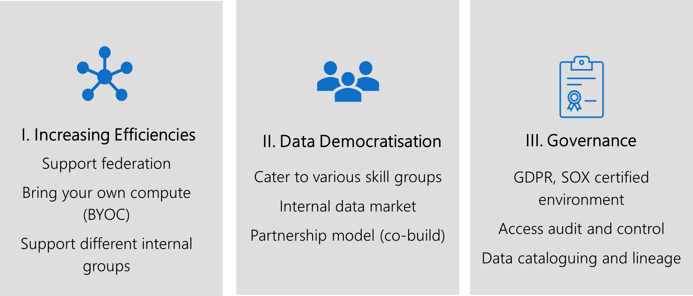

# Strategic impact of 'data management and analytics'

Best practice encourages customers to create a single centralized cloud adoption strategy, using the [Cloud Adoption Framework's Strategy methodology](../../strategy/index.md). If you haven't already, use the [strategy and plan template](https://raw.githubusercontent.com/microsoft/CloudAdoptionFramework/master/plan/cloud-adoption-framework-strategy-and-plan-template.docx) to record your cloud adoption strategy.

This article will help expose a number of considerations regarding 'data management and analytics' that will have an impact on your broader strategy.

## 'Data management and analytics' motivations

'Data management and analytics' is generally aligned to [innovation focused motivations](../../strategy/motivations.md). Customers who integrate this scenario into their cloud adoption strategy are motivated by the following common drivers:

- Improved customer experiences and engagements
- Transformation of products or services
- Market disruption with new products or services
- Democratization and/or self-service environments

Below are a number key themes outlining how these motivations can be realized within your strategy.

## Prioritize the business outcomes you want your data strategy to achieve

It is key to align your data strategy with your business outcomes. Having a successful data strategy will give you competitive advantage. In essence, most business outcomes can be classified under one or more of these four umbrella categories:

1. **Empower your employees**  
Consider enabling your workforce with real-time knowledge of customers/devices/machines, efficiently collaborating to meet customer or business needs with agility.
2. **Engage with customers**
Deliver a personalized, rich, connected experience, inspired through your brand. Drive loyalty along every step of the customer journey by harnessing the power of data and insights.
3. **Optimise operations**  
Increase the flow of information across your entire business operation. Keep your business processes synchronized and make every interaction valuable through a data driven approach.
4. **Transform your products and development lifecycle**
Gather telemetry data about your services and offerings. Use the data to prioritize a release or create a new feature, and evaluate effectiveness and adoption continuously.

Once you have prioritized your business outcomes, it is key to look at current projects, long-term strategic initiatives and classify them accordingly. Consider combining the 4 business outcomes in a matrix format shown below, based on complexity and impact. Also, think about adding the architectural pillars to help you dive deeper into the scenario.

## Unlocking Strategic Value

Throughout your BI, Analytics & AI maturity journey, there are *key themes* in unlocking the strategic value of data for consistent business growth. There are inherent complexities and ground realities in building a data-driven culture to drive business forward in a consistent, forward thinking, agile and informed way. Before moving to the deploy phase your should focus efforts towards formulating a coherent Data Strategy to achieve desired business outcomes.

## Key Themes

If we carefully analyze the above key themes and how they relate to important facets of a coherent Data Strategy:

*"A **data strategy** is the foundation to leveraging **data** as an asset and driving business forward. It's not a patch job for **data** problems. It's a long-term, guiding plan that defines the people, processes, and technology to put in place to solve **data** challenges."*

Creating a strategy is one thing but to execute one on enterprise scale poses a great challenge to organization's existing culture, people, processes, and technology choices. It requires a great deal of commitment and clearer ownership at all levels of an organization.

### Increasing Efficiencies

The agility of the cloud more than ever before it has imposed the need for organizations to adapt quickly and brining efficiencies in all areas of business. According to the [report by Gartner on emerging risks](https://www.gartner.com/en/newsroom/press-releases/2018-10-24-gartner-survey-shows-digitalization-misconceptions-threaten-organizations-as-the-top-emerging-risk-in-3q19), while organizations continue to focus on digital initiatives and invest in them, two-thirds not only fail to deliver upon expectations, but also demonstrate enterprise weaknesses.

### Data Democratization

Central IT has slowly been shifting to shadow IT becoming more de-centralized and enabling agility. They want to innovate quickly by having access to enterprise-wide **unified** quality data in self-serve fashion, in order to meet challenging business requirements. There are many reasons why businesses fail to tap into the full potential of their data - business functions working in separate silos, each team using different tools & standards for data analysis, or a failure to link KPIs to overall business goals.

Data Democratization is the key to delivering that value back to business and achieving the challenging business growth targets.

### Governance

In relation to Data Governance there has to be a right balance in the decentralized world of data democratization approach. If governance is enforced too hard it can stifle innovation. However, not having some core principles and processes in place create data silos. This could result in damaging organizations reputation and potential revenues. Hence a holistic Data Governance approach is fundamental to unlocking strategic value of data in a consistent manner.

In the absence of a well thought-out Data Strategy, there is a clear need to just "get going" and quickly start demonstrating value back to business. In this pursuit, acting on the above key themes or using them as strategic principles wrapped in a framework could not only lead to addressing current business problems but even assist in the formation of
future holistic data strategy in an iterative way with validation, yet yielding quick timely results.

### Iterative Data Strategy Validation Framework

Business & Technology Leaders need to develop the mindset and strategies required to generate value from data and scale quickly in a simplified structured manner.

## Business Aligned Objectives

Identifying key priorities in line with business vision and keeping **"think big, start small, and act fast"** ideology is the fundamental key for success. Picking up the right use case(s) doesn't always need to be long haul difficult vetting process, it could be an on-going problem in any business unit where there is enough data to validate its return on investment, more appetite and easy buy-in. Things can move quickly and that's where most of the organization could be struggling to get started.

## Understand the 7 attributes of data for a strong data strategy

To build a strong data strategy, you first need to understand how data works. Understanding these core characteristics will help you build a principled practice around how to deal with data.

1. Data travels fast, but the velocity of data movement cannot defy the laws of physics. It must conform to the laws of the land or the industry that created it.
2. Data never changes by itself, but it is prone to changes and accidental loss, unless explicit measures are in place to mitigate such challenges. Ensure controls, databases and storage anti-corruption measures, monitoring, audits, alerts and downstream processes are in place to deal planned or unforeseen changes.
3. Data by itself, and simply though the act of storing it, does not produce any insights or yield any value. In order to discover insights or extract value, most (if not all) data, independent of the volume, velocity, variety and veracity, has to go through four discrete steps: ingestion, storage, processing, and analytics. These each have their own set of principles, processes, tools, and technologies. Withholding data assets and related insights may affect socio-economic, political, research and investment decisions, hence it is of paramount importance for organizations to build the capability to provide insights in a secure and responsible manner.
4. All data generated or procured must go through a data classification exercise, unless otherwise explicitly stated. Where needed, the gold standard for dealing with confidential data is encryption at rest and in transit.
5. Data has gravity. This means that data, applications, and services all have their own gravitational pull. But data is the heaviest here, and therefore has the most gravitational pull. Unlike Newton's apple, data doesn't have a physical mass to draw in surrounding objects; instead, latency and throughput act as accelerators to the analytics process.
6. Latency, throughput, and ease of access often warrants that data is duplicated even when that is not the desired outcome. Set up people, processes, tools, and technologies appropriately to balance such requirements against organization's data polices.
7. The speed at which data can be processed is governed by architectural constructs, and facilitated through innovations in software, hardware, and networking. Some of the key architectural considerations are: setting up data distribution, partitioning, cache technologies, batch vs stream-processing, and balancing backend vs client-side processing.

## Defining a Data Strategy

Leveraging data to build better products and higher value services as a point of competitive advantage is nothing new. What is new is the volume, velocity, and variety of data that has been enabled by cloud computing. Designing a modern data analytics platform in the cloud is the convergence of security, governance, monitoring, on-demand scaling, data-ops, and self-service. What distinguishes a great data strategy from a good one is understanding how these facets interplay. We use tools like the Cloud Adoption Framework and the Well Architected Framework to ensure architectural cohesiveness, integrity, and best practices.

## Commitment

There has to be clear understanding around the adopted approach and desired common business objectives among all the key roles involved in making this a success i.e. Leadership Team (C -- Level), Business Unit, IT, Ops etc.

## Communication

Communication being one of the most important elements of this framework and requires communication process to be devised between Leadership, Business, IT & Delivery Teams.

As this would not only assist in delivering effectively in the context of current project but establishing a forum to stay in line, up-to date and focused on the overall objective of formulating a Holistic Data Strategy for future.

There are couple of key strategic processes which would help in delivering successfully in the context of this framework, both of which are discussed in greater detail when [building your plan](./plan.md):

1. Formation of Center of Excellence
1. Adopting Agile Delivery Method

## Deliver Value

Final Data product delivery against the set-out success criteria in a standardized & structured way is going to validate the above iterative framework. Additionally, taking the learning and continuously innovating will help in building business confidence and widening out of the Data Strategy strategic goals, for clearer and quicker adoption across
business.

## Next step: Plan for 'data management and analytics'

The following list of articles will take you to guidance found at specific points throughout the cloud adoption journey to help you be successful in the cloud adoption scenario.

- [Plan for 'data management and analytics'](./plan.md)
- [Review your environment or Azure Landing Zone(s)](./ready.md)
- [Assess for 'data management and analytics' migration](./migrate-assess.md)
- [Migrate 'data management and analytics'](./migrate-deploy.md)
- [Release 'data management and analytics' to production](./migrate-release.md)
- [Innovate with 'data management and analytics'](./innovate.md)
- [Govern 'data management and analytics'](./govern.md)
- [Manage 'data management and analytics'](./manage.md)
