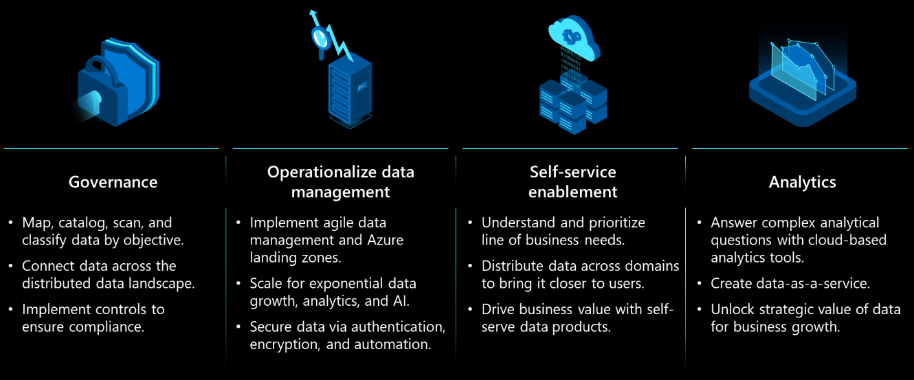
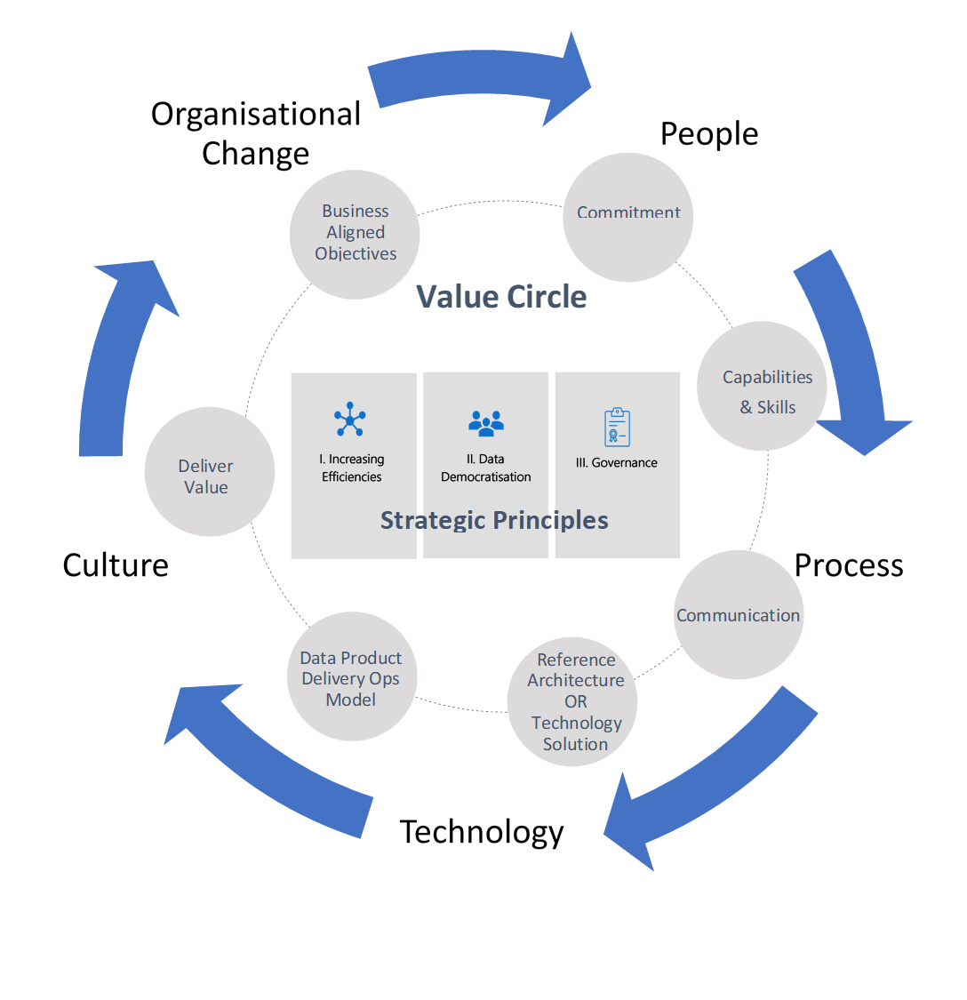
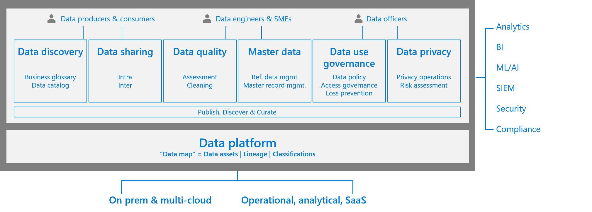

# Strategic impact of data management and analytics

Best practice encourages customers to create a single centralized cloud adoption strategy, using the [Cloud Adoption Framework's Strategy methodology](../../strategy/index.md). If you haven't already, use the [strategy and plan template](https://raw.githubusercontent.com/microsoft/CloudAdoptionFramework/master/plan/cloud-adoption-framework-strategy-and-plan-template.docx) to record your cloud adoption strategy.

This article helps expose many considerations about data management and analytics that will have an effect on your broader strategy.

## Data management and analytics motivations

Data management and analytics is aligned to [innovation focused motivations](../../strategy/motivations.md). Customers who integrate this scenario into their cloud adoption strategy are motivated by the following common drivers:

- A scalable analytics framework designed to enable building an enterprise data platform
- Self service to empower the user in data exploration, data asset creation, and product development
- Foster a data led culture with reusable data assets, data communities, secure third-party exchange, and in-place sharing
- Share data with confidence secured by policies, common identity, confidentiality, and encryption
- Improved customer experiences and engagements
- Transformation of products or services
- Market disruption with new products or services
- Democratization and self-service environments

There are a number key themes that outline how these motivations can be realized within your strategy.

## Prioritize the business outcomes you want your data strategy to achieve

It's key to align your data strategy with your business outcomes. Having a successful data strategy will give you a competitive advantage. In essence, most business outcomes can be classified under one or more of these four categories:

**Empower your employees:** Consider enabling your workforce with real-time knowledge of customers, devices, and machines, to efficiently collaborate to meet customer or business needs with agility.
**Engage with customers:** Deliver a personalized, rich, connected experience, inspired through your brand. Drive loyalty along every step of the customer journey by harnessing the power of data and insights.
**Optimize operations:** Increase the flow of information across your entire business operation. Keep your business processes synchronized and make every interaction valuable through a data-driven approach.
**Transform your products and development lifecycle:** Gather telemetry data about your services and offerings. Use the data to prioritize a release or create a new feature, and evaluate effectiveness and adoption continuously.

Once you have prioritized your business outcomes, it's key to look at your current projects and long-term strategic initiatives, and classify them accordingly. Consider combining the four business outcomes in a matrix format, based on complexity and impact. Also, think about adding the architectural pillars to help you dive deeper into the scenario.

## Unlock strategic value

Throughout your business intelligence, analytics and AI maturity journey, there are *key themes* in unlocking the strategic value of data for consistent business growth. There are inherent complexities and ground realities in building a data-driven culture to drive business forward in a consistent, forward thinking, agile, and informed way. Before moving to the deploy phase, you should focus efforts toward formulating a coherent data strategy to achieve desired business outcomes.

## Key themes

Carefully analyze the above key themes and how they relate to important facets of a coherent data strategy:

*"A **data strategy** is the foundation to using **data** as an asset and driving business forward. It's not a patch job for **data** problems. It's a long-term, guiding plan that defines the people, processes, and technology to put in place to solve **data** challenges."*

To create a strategy is one thing, but to execute one at enterprise-scale poses a great challenge to an organization's existing culture, people, processes, and technology choices. It requires a great deal of commitment and clearer ownership at all levels of an organization.

### Increase efficiencies

The agility of the cloud, more than ever before, has imposed the need for organizations to adapt quickly and bring efficiencies to all areas of business. According to the [report by Gartner on emerging risks](https://www.gartner.com/en/newsroom/press-releases/2018-10-24-gartner-survey-shows-digitalization-misconceptions-threaten-organizations-as-the-top-emerging-risk-in-3q19), while organizations continue to focus on digital initiatives and invest in them, two-thirds not only fail to deliver upon expectations, but also demonstrate enterprise weaknesses.

### Data democratization

Central IT has slowly been shifting to shadow IT becoming more de-centralized and enabling agility. They want to innovate quickly by having access to enterprise-wide **unified** quality data in self-serve fashion to meet challenging business requirements. There are many reasons why businesses fail to tap into the full potential of their data. It might be because of business functions working in separate silos, each team using different tools and standards for data analysis, or a failure to link KPIs to overall business goals.

Data democratization is the key to delivering that value back to business and achieving the challenging business growth targets.

### Governance

With data governance, there has to be the right balance in the decentralized world of a data democratization approach. If governance is enforced too hard, it can stifle innovation. However, not having some core principles and processes in place might create data silos. These silos can result in damaging an organization's reputation and potential revenues. That's why a holistic data governance approach is fundamental to unlocking strategic value of data in a consistent manner.

In the absence of a well thought-out data strategy, there's a clear need to just "get going" and quickly start demonstrating value back to business. In this pursuit, acting on the above key themes or using them as strategic principles wrapped in a framework can address current business problems. It can also help the formation of a holistic data strategy, in an iterative way with validation, and still yield timely results.

For more information, see [What is data governance?](./govern.md).

### Iterative data strategy validation framework

Business and technology leaders need to develop the mindset and strategies required to generate value from data and scale quickly in a simplified structured manner.

## Business aligned objectives

Identifying key priorities in line with the business vision and keeping **"think big, start small, and act fast"** ideology is the fundamental key for success. Picking up the right use case doesn't always need to be long haul difficult vetting process. It could be an ongoing problem in any business unit where there's enough data to validate its return on investment, more appetite, and easy buy-in. Things can move quickly and that's where most of the organization can be struggling to get started.

## Understand the seven attributes of data for a strong data strategy

To build a strong data strategy, you first need to understand how data works. Understanding these core characteristics will help you build a principled practice around how to deal with data.

Data travels fast, but the velocity of data movement can't defy the laws of physics. It must conform to the laws of the land or the industry that created it. Data never changes by itself, but it's prone to changes and accidental loss, unless explicit measures are in place to mitigate such challenges. Ensure controls, databases and storage anti-corruption measures, monitoring, audits, alerts, and downstream processes are in place to deal planned or unforeseen changes. Data by itself, and simply through the act of storing it, doesn't produce any insights or yield any value. To discover insights or extract value, most or all of the data, independent of the volume, velocity, variety, and veracity, has to go through four discrete steps:

- Ingestion

- Storage

- Processing

- Analytics

These steps each have their own set of principles, processes, tools, and technologies. Withholding data assets and related insights might affect sociol-economic, political, research, and investment decisions. That's why it's of paramount importance for organizations to build the capability to provide insights in a secure and responsible manner. All data generated or acquired must go through a data classification exercise, unless otherwise explicitly stated. Where needed, the gold standard for dealing with confidential data is encryption at rest and in transit. Data has gravity and data, applications, and services all have their own gravitational pull. But data is the heaviest here, and so it has the most gravitational pull. Unlike newton's Apple, data doesn't have a physical mass to draw in surrounding objects. Instead, latency and throughput act as accelerators to the analytics process. Latency, throughput, and ease of access often requires that data is duplicated even when that isn't the desired outcome. Set up people, processes, tools, and technologies appropriately to balance such requirements against the organization's data policies. The speed at which data can be processed is governed by architectural constructs, and facilitated through innovations in software, hardware, and networking. Some of the key architectural considerations are: setting up data distribution, partitioning, cache technologies, batch versus stream-processing, and balancing backend versus client-side processing.

## Defining a data strategy

Using data to build better products and higher value services as a point of competitive advantage is nothing new. What is new is the volume, velocity, and variety of data that has been enabled by cloud computing. Designing a modern data analytics platform in the cloud is the convergence of security, governance, monitoring, on-demand scaling, data-operations, and self-service. Understanding how these facets interplay distinguishes a great data strategy from a good one. You can use tools like the Cloud Adoption Framework to ensure architectural cohesiveness, integrity, and best practices.

## A principled approach to your data strategy

With data governance in mind, the following diagram shows the essential stages for the data lifecycle:

An effective data strategy must have provisions for data governance. They're mutually inclusive, but not the same thing.

Let's take a closer look at the considerations to take when building design principles for the four layers that are key in your data strategy. Focus on delivering business outcomes and value from data.

### Data ingestion

A key consideration for data ingestion is the ability to build a data pipeline fast, from requirements to production, in a secure and compliant manner. Elements such as metadata-driven, self-service, low-code technologies to hydrating your data lake are key. When building a pipeline, consider design, the ability to do data wrangling, scale compute and also data distribution capabilities. Also, having the right DevOps support for the continuous integration and delivery of your pipeline is critical. Tools such as Azure Data Factory support a plethora of on-premises, software as a service (SaaS), and data sources from other public clouds. Having such agility from the get-go is always helpful.

### Storage

Tag and organize data in physical and logical layers. Data lakes are key in all modern data analytics architectures. Organizations must apply appropriate data privacy, security, and compliance requirements based on data classification and the industry compliance requirements they operate in. The other key considerations are cataloging and self-service to aid organization level data democratization to fuel innovation, guided by appreciate access control.

Choosing the right storage based on the workload is key. Even if you don't get it right the first time, the cloud provides you options to fail over quickly and provide options to restart the journey. You can choose the right database based on your application requirements. When choosing an analytics platform, make sure you consider the ability to process batch and streaming data.

### Data processing

Your data processing needs will vary according to the workload. For example, most big data processing has elements of both real-time and batch processing. Most enterprises also have elements of time series processing requirements and the need to process free-form text for enterprise search capabilities.

The most popular organizational processing requirements come from online transaction processing (OLTP). Certain workloads need specialized processing such as high performance computing (HPC), also called "big compute". These use many CPU or GPU-based computers to solve complex mathematical tasks.

For certain specialized workloads, customers can secure execution environments like Azure confidential computing, which helps users secure data while it's in use on public cloud platforms. This state is required for efficient processing. The data is protected inside a Trusted Execution Environment (TEE), also known as an enclave. This environment protects the code and data against viewing and modification from outside of the TEE. This creates the ability to train AI models using data sources from different organizations without sacrificing data confidentiality.

### Analytics

Extract, transform, load construct, or called ETL or ELT depending on where the transformation happens, relates to online analytical processing (OLAP) and data warehousing needs. One of the useful capabilities is the ability to automatically detect schema drift. Consider end-to-end architectures like automated enterprise BI with Azure Synapse Analytics and Azure Data Factory. To support advanced analytics including Azure Machine Learning and AI capabilities, it's key to consider the reusability of platform technologies already in use for other processing requirements of similar nature. Here's a quick start guide with working example for end-to-end processing.

Batch processing on Azure Databricks, R, Python or for deep learning models are common examples. Compute, storage, networking, orchestration, DevOps and MLOps, are key considerations here. For super large models, look at distributed training of deep learning models on Azure or the turning project. You also need to consider the ability to deal with data and model drift.

Azure enterprise-scale for analytics and AI helps collate all four layers together with people, process, security, and compliance. We also suggest using the recommended architectures from Azure landing zones to get started. They use the Microsoft Cloud Adoption Framework and culminate our experience working through thousands of large-scale enterprise deployments.

Now that we've covered the four stages, the following representation shows the key capabilities needed on top of your data platform to provide end-to-end data governance capability.

## Building blocks

After making all the capability provisions, and taking a principled architectural view as discussed in this section, you'll most likely end up with the building blocks required for your cloud strategy journey.

:::image type="content" source="./images/data-strategy-building-block.png" alt-text="Diagram of the manage credentials decision tree." lightbox="./images/data-strategy-building-block.png":::

## Data strategy summary

Taking a principled approach on additional, but relevant considerations, such as data governance and responsible AI will pay dividends later.

At Microsoft, we use four core principles of fairness, reliability and safety, privacy and security, and inclusiveness. Underpinning these principles are two foundational principles of transparency and accountability.

We put responsible AI and our principles into practice through the development of resources and a system of governance. Some of our guidelines focus on human-AI interaction, conversational AI, inclusive design, an AI fairness checklist, and a data sheet for datasets.

In addition to practices, we've developed a set of tools to help others understand, protect, and control AI at every stage of innovation. Our tools are a result of collaboration across various disciplines to strengthen and accelerate responsible AI, spanning software engineering and development, to social sciences, user research, law, and policy.

To further collaboration, we also open-sourced many tools such as interpret machine learning and Fair Learn that others can use to contribute and build upon alongside democratizing tools through Azure Machine Learning.

The pivot to becoming a data-driven organization is fundamental to deliver competitive advantage in the new normal. We want to help our customers shift from an application only approach to an application and data-led approach, helping to create an end-to-end data strategy that can ensure repeatability and scalability across current and future use cases that impact business outcomes.

## Commitment

There must be clear understanding around the adopted approach and desired common business objectives among all key roles involved in making your data strategy a success. The key roles might include the leadership team (C-level), business units, IT, operations, and others.

## Communication and engagement

Communication is one of the most important elements of this framework. It requires a communication process to be devised between leadership, business, IT, and the delivery teams. Communication helps deliver effectively in the context of the current project, and it established a forum to stay in line, up-to date, and focused on the overall objective of formulating a holistic data strategy for the future.

Engagement is essential between team members designing and implementing the data strategy, and team members contributing, consuming, and exploiting the data, such as the business units who will make decisions and build outcomes based upon the data. Put another way, data strategies and associated data platforms that are built without engagement of the end users of such platforms risk challenges in relevance and adoption.

There are two key strategic processes that will help to deliver successfully in the context of this framework:

- Formation of a center of excellence
- Adoption of an agile delivery method

For more information, see [Building your plan](./plan.md).

## Deliver value

When you deliver data products against the set-out success criteria in a standardized and structured way, it's going to validate the iterative framework. Additionally, when you take the learning and continuously innovate, it will help build business confidence and widen out the data strategy strategic goals. This process will provide clearer and quicker adoption across the business.

## Next steps

The following articles can guide your cloud adoption journey and help you succeed in the cloud adoption scenario.

- [Plan for data management and analytics](./plan.md)
- [Review your environment or Azure landing zones](./ready.md)
- [Govern data management and analytics](./govern.md)
- [Secure data management and analytics](./secure.md)
