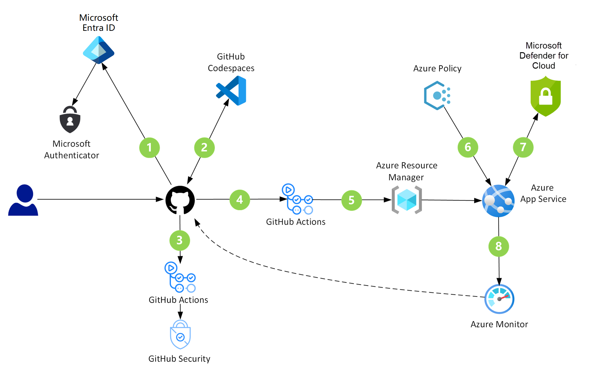

# How GitHub accelerates cloud adoption

## Overview

Innovation is the new currency in today's competitive landscape. Ride sharing, streaming content, self-driving cars, and other services have fundamentally changed people's daily rhythms while turning markets upside down and showing how the competitive landscape has moved from physical assets to digital experiences.

These types of superior digital experience are leading a disruption where well-established businesses face stiff competition from companies that can innovate and deliver value to their customers faster. To compete and avoid disruption, businesses need to build a culture of innovation and use the best and most fitting tools and cloud services.

GitHub provides a range of features that can help companies to:

- Take advantage of Azure services and capabilities.
- Modernize their practices.
- Become more agile and innovative during this cultural shift.

Companies can take advantage of GitHub's connectedness to the open-source community and find thousands of reiterated, enhanced, and ready-to-deploy cloud solution examples from organizations that have successfully adopted Azure services. They can easily borrow from and iterate on these solutions to tailor them to their business needs.

GitHub makes it easy for organizations to share within their teams, which makes it faster to modernize and deploy the next application or workload. Companies can look to *innersource*, a key tenet of innovation, to borrow best practices like sharing and reuse, collaboration and communication, and more from the open-source community and apply them within their organization.

From securing the open-source packages to the intellectual property that's written daily, securing the entire software supply chain should be a main priority for to every company. This goal requires advanced security technology that can be incorporated and automated throughout the entire lifecycle, and native GitHub capabilities like GitHub advanced security and GitHub Actions offer this type flexibility.

## Take advantage of open-source assets

Highly effective organizations recognize open-source software (OSS) as essential versus optional for modern software development. They engage with the developer communities on which they depend and use a secure platform to strategically invest in OSS. As a result, these organizations experience innovate quickly, outpace competitors, and cut costs while minimizing risk.

While OSS could be interpreted as the packages, libraries, scripts, and dependencies incorporated into applications, there are thousands of open-source assets in the form of infrastructure as code (IaC), documentation, guidance, and blueprints for well-defined Azure architectures. These blueprints have been contributed to the OSS community by Microsoft, partners, vendors, customers, and individuals, and they're readily available in GitHub. They can be easily modified, reused, and deployed to a specific Azure environment.

### Infrastructure as code

Infrastructure as code (IaC) is the management of infrastructure (networks, virtual machines, load balancers, and connection topology) in a descriptive model, using the same versioning system that the DevOps team uses for source code. Like the principle that the same source code generates the same binary, an IaC model generates the same environment every time that it's applied. IaC is a key DevOps practice that's used with [continuous delivery (CD)](/devops/deliver/what-is-continuous-delivery).

IaC evolved to solve the problem of environment drift in the release pipeline. Without it, teams must maintain the settings of individual deployment environments, and inconsistencies between environments lead to issues during deployments. Every environment eventually becomes a snowflake, a unique configuration that can't be reproduced automatically. With snowflakes, infrastructure administration and maintenance requires manual processes that contribute to errors and are hard to track. Infrastructure deployments with IaC are repeatable and prevent runtime issues caused by configuration drift or missing dependencies.

With IaC, teams make changes to the environment description and version the configuration model, which is typically in well-documented code formats like JSON; see [Azure Resource Manager templates](/azure/azure-resource-manager/templates/overview) for more information. Developers can simplify their workflows by hosting IaC code in the same GitHub repo as their application source code and adopt the same continuous integration (CI) /CD practices for IaC powered by [GitHub Actions](https://github.com/features/actions).

See the [AzOps](https://github.com/Azure/azops) GitHub action for an example of how to deploy custom Resource Manager templates at various Azure scopes. If you're new to Resource Manager templates or IaC, you can also browse the [`azure-quickstart-templates` repo](https://github.com/Azure/azure-quickstart-templates) on GitHub, find the template that you wish to deploy, and select the **Deploy to Azure** button to test how it works.

### Cloud pattern components and best practices

The following architecture diagram highlights the security checks that run in the GitHub and Azure components of a GitHub DevSecOps environment:

- [GitHub](https://docs.github.com/en) provides a code-hosting platform that developers can use for collaborating on open-source and innersource projects.

- [Codespaces](https://docs.github.com/codespaces/about-codespaces) is an online development environment. Hosted by GitHub and powered by Microsoft Visual Studio Code, this tool provides a complete development solution in the cloud.

- [GitHub security](https://github.com/features/security) works to eliminate threats in multiple ways. Agents and services identify vulnerabilities in repositories and dependent packages. They also upgrade dependencies to current and secure versions.

- [GitHub Actions](https://docs.github.com/actions/learn-github-actions) are custom workflows that provide CI/CD capabilities directly in repositories. Computers named runners host these CI/CD jobs.

- [Azure Active Directory](/azure/active-directory/fundamentals/active-directory-whatis) is a multitenant, cloud-based identity service that controls access to Azure and other cloud applications like Microsoft 365 and GitHub.

- [Azure App Service](https://azure.microsoft.com/services/app-service/) provides a framework for building, deploying, and scaling web apps. This platform offers built-in infrastructure maintenance, security patching, and scaling.

- [Azure Policy](/azure/governance/policy/overview) helps teams manage and prevent IT issues through policy definitions that can enforce rules for cloud resources. For instance, if a project is about to deploy a virtual machine with an unrecognized SKU, Azure Policy sends alerts about the problem and stops the deployment.

- [Azure Security Center](/azure/security-center/security-center-introduction) provides unified security management and advanced threat protection across hybrid cloud workloads.

- [Azure Monitor](/azure/azure-monitor/overview) collects and analyzes performance metrics, activity logs, and other application telemetry. This service alerts applications and personnel when it identifies irregular conditions.

## Innersource

### Innersource overview

Many companies use the term *innersource* to describe how their engineering teams work together on code. Innersource is a development methodology where engineers build proprietary software with best practices from large-scale open-source projects like Kubernetes or Visual Studio Code.

Large-scale open-source projects require coordination and teamwork across thousands of contributors. The most successful projects are driven by a vision for their future and daily user needs: speed, reliability, and functionality. The scale at which these projects operate provides some lessons and can help companies build better software more quickly with innersource.

With GitHub's pull requests and issues, collaboration and code review are built into the development process. Internal and outsourced teams can share work, discuss changes, and get feedback all in one place. This helps organizations share expertise internally and avoid reinventing field-tested solutions developed for other projects.

### The anatomy of an innersource project

The right mix of individuals, teams, and resources can ensure a project's success. Many open-source projects follow a similar organizational structure that can help organizations to set up cross-functional teams to manage innersource projects. A typical open-source project has the following types of people:

- **Maintainers:** These contributors are responsible for driving the vision and managing the organizational aspects of the project. They might not be the original owners or authors of the code.

- **Contributors:** These people are everyone who has contributed something to the project.

- **Community members:** These are people who use the project. They might be active in conversations or express their opinion on the project's direction.

Bigger projects could also have subcommittees or working groups focused on different tasks like tooling, triage, and community moderation. Innersource projects are likely to follow a similar structure. Many engineering organizations sort developers into teams like application engineering, platform engineering, and web development. Structuring organizations this way can leave blind spots that exclude qualified people. Organizing a core decision-making group supported by teams across an organization can help to rally the expertise necessary to solve problems faster.

Within an enterprise, contributors are developers across the company, and maintainers are a project's leaders and key decision-makers.

- **Maintainers:** Developers, product managers, and other key decision-makers within a company responsible for driving a project's vision and for managing day-to-day contributions.

- **Contributors:** Developers, data scientists, product managers, marketers, and other roles within a company that help drive software forward. Contributors might not be part of the direct project team but help build software by contributing code, submitting bug fixes, and more.

For more information, see the white paper [An introduction to innersource](https://resources.github.com/whitepapers/introduction-to-innersource/).

## Automation

GitHub Actions allows users to create custom workflows directly in their GitHub repositories. Users can discover, create, and share actions to perform any job, including CI/CD, and combine actions in a completely customized workflow. They can also create CI workflows that build and test projects written in different programming languages. Examples are available in the [guides for GitHub Actions](https://docs.github.com/en/actions/guides).

GitHub Actions can be used to combine IaC concepts and CI/CD practices to automate the entire end-to-end deployment lifecycle, including provisioning or updating the target environment in a repeatable manner and packaging and deploying the application itself.

**Example:**

[GitHub Actions for Azure](https://github.com/azure/actions) are built to simplify how you automate your deployment processes to target Azure services such as Azure App Service, Azure Kubernetes Service, Azure Functions, and more. The [Azure starter action workflows repository](https://github.com/azure/actions-workflow-samples) includes end-to-end workflows to build and deploy web apps of any language and any ecosystem to Azure. Visit [GitHub marketplace](https://github.com/marketplace?query=azure&type=actions) to see all of the actions that are available.

## Security

### GitHub's shift-left security features

Starting with the first steps of development, DevSecOps adheres to security best practices. By using a shift-left strategy, DevSecOps redirects the security focus. Instead of pointing toward auditing at the end, it shifts to development in the beginning. Besides producing robust code, this fail-fast approach helps to resolve problems early when they're easy to fix.

With many security capabilities, GitHub offers tools that support every part of a DevSecOps workflow:

- Browser-based IDEs with built-in security extensions
- Agents that continuously monitor security advisories and replace vulnerable and out-of-date dependencies
- Search capabilities that scan source code for vulnerabilities
- Action-based workflows that automate every step of development, testing, and deployment
- Spaces that provide a way to privately discuss and resolve security threats and then publish the information
- Combined with the monitoring and evaluation power of Azure, these features provide a superb service for building secure cloud solutions

**Example:**

GitHub DevSecOps installations cover many security scenarios. Possibilities include the following cases:

- Developers who want to take advantage of preconfigured environments that offer security capabilities.
- Administrators who rely on having up-to-date, prioritized security reports at their fingertips, along with details on affected code and suggested fixes.
- Streamlined organizations that need systems to automatically acquire new and uncompromised security devices when secrets are left exposed in code.
- Development teams that could benefit from automatic upgrades when newer or more secure versions of external packages become available.

For more information, see:

- [DevSecOps in GitHub: Azure solution ideas](/azure/architecture/solution-ideas/articles/devsecops-in-github)
- [Code scanning a GitHub repository using GitHub advanced security within an Azure DevOps pipeline](https://github.blog/2020-10-27-code-scanning-a-github-repository-using-github-advanced-security-within-an-azure-devops-pipeline/)
- [Applying DevSecOps to your software supply chain](https://github.blog/2020-12-03-applying-devsecops-to-your-software-supply-chain/)

## Next steps

- Choose your implementation team (typically a developer manager and a few developers defined as admins), and deploy GitHub.
- Learn common and advanced Git workflows to enhance how you use GitHub.

The following links provide more information about GitHub.

- [GitHub modules in Microsoft Learn](/learn/browse/?products=github)
- [GitHub Learning Lab](https://lab.github.com/)
- [GitHub Docs](https://docs.github.com/en)
- [Tips for getting started with GitHub DevSecOps](https://resources.github.com/whitepapers/Architects-guide-to-DevOps/)
