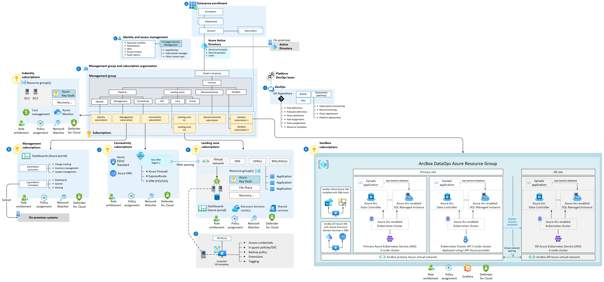
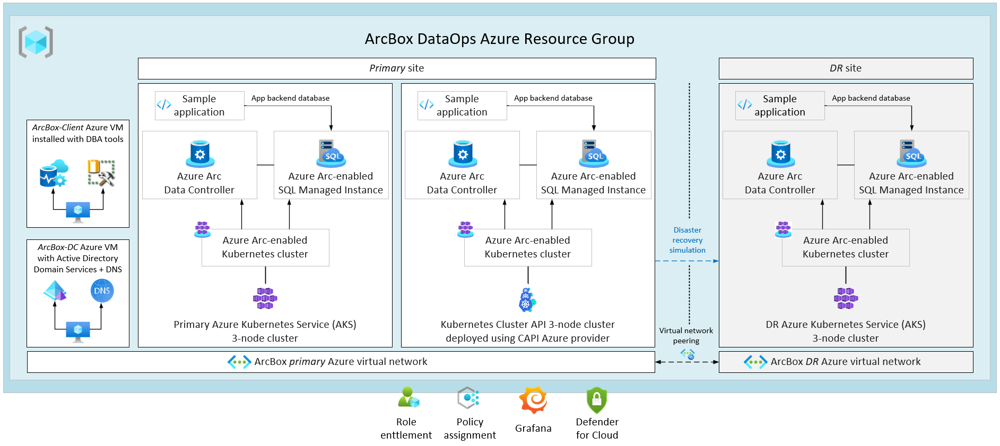

# Deploy a sandbox for Azure Arc-enabled SQL Managed Instance

Microsoft Azure Arc-enabled SQL Managed Instance has nearly 100% compatibility with the latest SQL Server database engine. Existing SQL Server customers can lift-and-shift their applications to Azure Arc data services with minimal application and database changes while maintaining data sovereignty. At the same time, SQL Managed Instance includes built-in management capabilities that drastically reduce management overhead.

## Azure landing zone sandbox subscription

You can practice your skills with an automated, easy-to-deploy sandbox solution named *ArcBox* using an Azure Arc-enabled Kubernetes environment. ArcBox runs in your [Azure landing zone sandbox subscription](../../../ready/considerations/sandbox-environments.md) and bootstraps all required Azure resources within a single resource group.

*Figure 1: Diagram of ArcBox in a sandbox subscription.*

*For more information on the design areas labeled A-I in the visual, see [environment design areas](../../../ready/landing-zone/design-areas.md#environment-design-areas).*

ArcBox is entirely self-contained within a single Azure subscription and resource group. It lets you get hands-on with Azure Arc-enabled server technology while needing nothing more than an Azure subscription.

*Figure 2: Diagram of an ArcBox resource group.*

The single resource group that ArcBox deploys contains three Azure Arc-enabled Kubernetes clusters. It also includes a *unified operations* resource layer to integrate with Azure services and understand the Azure Arc-enabled data services value proposition.

## Deployment options and prerequisites

The ArcBox solution can be deployed using one of four methods:

- Azure Bicep using the [Azure CLI](/cli/azure/install-azure-cli)
- Terraform using the [Terraform CLI](https://learn.hashicorp.com/tutorials/terraform/install-cli)
- Azure Resource Manager (ARM) template using the Azure CLI
- ARM template using the Azure portal

You can install either the Azure CLI or Terraform CLI based on the desired deployment method.

## Next steps

The Azure Arc-enabled data services landing zone accelerator sandbox is based on the fully automated Jumpstart ArcBox solution. For more information, see the [Jumpstart ArcBox overview](https://azurearcjumpstart.io/azure_jumpstart_arcbox).
