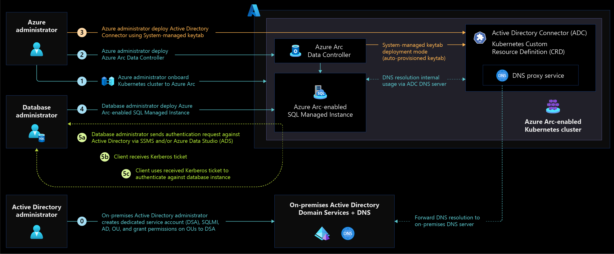
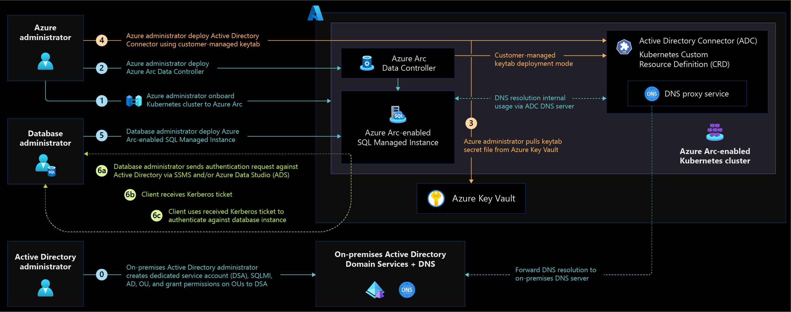
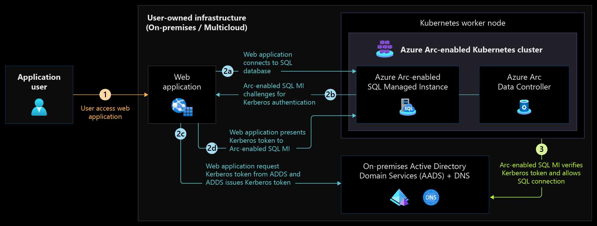
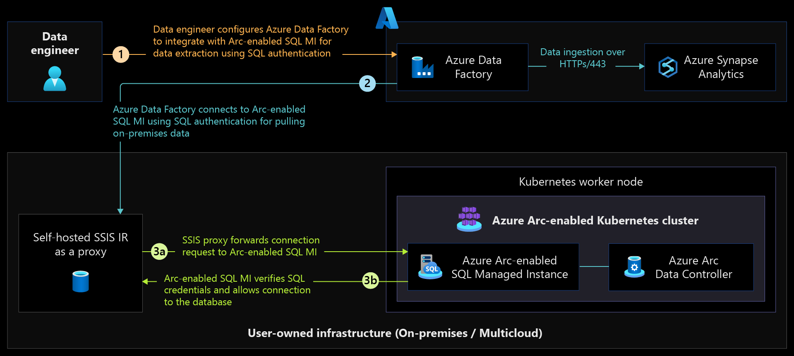

# Identity and access management for Azure Arc-enabled SQL Managed Instance

This article describes [Azure Arc-enabled SQL Managed Instance](/azure/azure-arc/data/managed-instance-overview) identity and access management (IAM) architecture, design considerations, and recommendations for various scenarios.

Arc-enabled SQL Managed Instance relies on the [Azure Arc-enabled data services](/azure/azure-arc/data/overview) extension running on Azure Arc-enabled Kubernetes cluster. Following are the various components of Azure Arc-enabled data services that are important for identity and access management as part of this critical design area.

- Azure Arc Data Controller
- Azure Arc Active Directory Connector
- Azure Arc-enabled SQL Managed Instance

## Architecture

### SQL authentication

SQL authentication is supported for Arc-enabled SQL Managed Instance using local [SQL identities](/sql/relational-databases/security/choose-an-authentication-mode#connecting-through-sql-server-authentication). SQL authentication method is used during first-time sign in to create sign-in credentials from Windows for administrators and to grant permissions to the database to access Arc-enabled SQL Managed Instance using Active Directory authentication. Grafana and Kibana dashboards support only basic authentication at this time.

### Active Directory authentication

For many enterprise organizations, Active Directory (AD) authentication is the standard for enforcing role-based access control (RBAC) with SQL Servers running on-premises and on cloud environments. Azure Arc-enabled SQL Managed Instance supports AD authentication to seamlessly migrate existing SQL Server databases to Arc-enabled SQL Managed Instance and stay current with the latest SQL Server version and security patches.

Arc-enabled SQL Managed Instance uses Kerberos keytab to support [AD authentication](/azure/azure-arc/data/active-directory-introduction) when running on Arc-enabled Kubernetes clusters. [Active Directory connector](/azure/azure-arc/data/active-directory-introduction#what-is-an-active-directory-ad-connector) is a key component in Arc-enabled data services to support AD authentication.

Following are two ways to generate and manage Kerberos keytab and use it in Arc-enabled SQL Managed Instance. The following sections explain the scenarios and when to use the appropriate keytab mode.

#### System-managed keytab

Active Directory connector in [system-managed keytab mode](/azure/azure-arc/data/deploy-system-managed-keytab-active-directory-connector#active-directory-connector-in-system-managed-keytab-mode) simplifies AD account generation and keytab management for Arc-enabled SQL Managed Instance. The AD connector is responsible for creating the service accounts, assigning [service principals](/windows/win32/ad/service-principal-names), and [generating keytab](/windows-server/administration/windows-commands/ktpass) to support AD authentication. This method is recommended for customers who prefer simplifying operations over granular control to auto-manage the keytab for AD authentication.

*Figure 1: Architecture diagram for the AD connector in system-managed keytab mode.*

#### Customer-managed keytab

Active Directory connector in [customer-managed keytab mode](/azure/azure-arc/data/deploy-customer-managed-keytab-active-directory-connector) provides full control of managing service accounts, service principals, and generating keytab to the customers who strictly follow the [Information Technology Infrastructure Library (ITIL)](https://www.axelos.com/certifications/itil-service-management) process and separation of duties to delegate activities to different teams.

*Figure 2: Architecture diagram for AD connector in customer-managed keytab mode.*

### Azure Arc Data Controller

When the Arc-enabled data services extension is installed in Directly connected mode, a [managed identity](/azure/azure-arc/data/create-data-controller-direct-cli?tabs=windows#retrieve-the-managed-identity-and-grant-roles) is created for Arc-enabled data services to interact with Azure Resource Manager (ARM) APIs control plane and data plane. Azure Arc Data Controller uses this managed identity to perform these actions when managing Arc-enabled SQL Managed Instance.

In an Indirect connectivity mode, a [service principal](/azure/azure-arc/data/upload-metrics-and-logs-to-azure-monitor#create-service-principal) with [required permissions](/azure/azure-arc/data/upload-metrics-and-logs-to-azure-monitor?tabs=windows#assign-roles-to-the-service-principal) is needed by Azure Arc Data Controller to periodically [export usage information](/en-us/azure/azure-arc/data/upload-usage-data#upload-usage-data) such as inventory and resource usage to Azure.

### Azure RBAC on Azure Arc-enabled data services

Following are the required RBAC permissions to publish monitoring metrics to Azure Monitor.

|Role|Description|
|-----------|------------|
|Monitoring Metrics Publisher|Enables publishing metrics against Azure resources.|

### Secure access to Azure Arc-enabled SQL Managed Instance

The following architecture diagram shows secure access using AD authentication.

The following architecture diagram shows secure access using SQL authentication.

## Design considerations

Review the [identity and access management critical design area](/azure/cloud-adoption-framework/ready/landing-zone/design-area/identity-access) of Azure landing zones to assess the effect of Azure Arc-enabled data services on your overall identity and access model.

### Arc-enabled data services deployment

- Consider the identity being used to deploy Azure Arc-enabled data services depending on the type of deployment, such as manual or automated, for Arc-enabled data services deployment. This identity could be an Azure Active Directory (Azure AD) account or Lightweight Directory Access Protocol (LDAP) account from Active Directory Domain Services (AD DS) or a third-party LDAP provider based on how underlying Azure Arc-enabled Kubernetes access controls are managed in on-premises or other cloud environments.

- Consider whether group-based access control or individual identity-based access controls are more appropriate for your Information Technology (IT) organization to manage Arc-enabled data services based on the operations overhead created by both options.

- Consider between Azure Arc-enabled Kubernetes administrators vs database management group (DMG) vs application administration group to deploy and manage Azure Arc-enabled data services depending on your organization's security governance and separation of duties requirements.

- Consider the usage pattern between system-managed keytab and customer-managed keytab to deploy Azure Arc AD Connector to support AD authentication in Arc-enabled SQL Managed Instance. Both methods have the benefits of simplified operations compared to full customer control of managing service accounts and keytab for AD authentication support.

### Arc-enabled data services access

Arc-enabled SQL Managed Instance access controls are fully independent of underlying [Azure Arc-enabled Kubernetes access controls](/azure/azure-arc/kubernetes/azure-rbac). It's important to make a few design decisions to administer Arc-enabled SQL Managed Instance and provide access to consumer applications and end users.

- Choose between AD and SQL authentication depending on your organization's applications or service capabilities. As not all applications support AD authentication, review your organization's security policies for allowed authentication types, and enforce extra security controls necessary when using SQL authentication.

- When cloud-native services need to authenticate and connect to Arc-enabled SQL Managed Instance databases to extract and ingest data into data analytics services, consider using self-hosted runtime virtual or physical machines on-premises that are AD joined over SQL to authenticate and connect to Arc-enabled SQL Managed Instance.

## Design recommendations

In addition to the following design recommendations, review the [identity and access management design recommendations](../arc-enabled-kubernetes/eslz-arc-kubernetes-identity-access-management.md#design-recommendations) for Azure Arc-enabled Kubernetes since Arc-enabled SQL Managed Instance is deployed on the Arc-enabled Kubernetes cluster.

### Arc-enabled data services deployment

- For enterprise organizations that follow strict ITIL processes, isolate teams responsible for managing Arc-enabled data services from Arc-enabled Kubernetes by creating different security groups, then assign permissions to manage Arc-enabled data services.

- Use system-managed keytab mode for AD authentication support to offload domain account and keytab management overhead to simplify operations.

- Use customer-managed keytab mode for AD authentication to have full control of service account creation and keytab generation.

- Create a dedicated [AD Organization Unit (OU)](/azure/azure-arc/data/active-directory-prerequisites#create-an-ou) to delegate access control and simplify operations for all Arc-enabled SQL Managed Instance accounts.

- Use AES256 encryption for Kerberos keytab files and avoid use of RC4 ciphers.

### Arc-enabled data services access

- Where appropriate, use AD authentication with SQL Managed Instance to offload user lifecycle management to directory services and use security groups in AD to manage user permissions.

- Use SQL authentication with Arc-enabled SQL Managed Instance as a [least preferred authentication](/sql/relational-databases/security/choose-an-authentication-mode#disadvantages-of-sql-server-authentication) type and [when it's not possible to use AD authentication](/sql/relational-databases/security/choose-an-authentication-mode#advantages-of-sql-server-authentication).

- Once AD authentication is made possible for your organizational needs, avoid using SQL authentication for day-to-day operations. Use SQL authentication only for emergency access to the database server for database administration.

- In deployment scenarios that don't support AD authentication, use SQL authentication supported in Arc-enabled SQL Managed Instance. Make sure to use strong password policies and enable auditing to monitor SQL user identities and permissions granted to access database servers and databases.

## Role-based access controls (RBAC)

In system-managed keytab mode, explicit permissions to [Domain Service Account (DSA)](/azure/azure-arc/data/active-directory-prerequisites#create-the-domain-service-account-dsa) are required at [Active Directory OU](/azure/azure-arc/data/active-directory-prerequisites#create-an-ou) level for Arc-enabled SQL Managed Instance.

Following are [the required RBAC permissions](/azure/azure-arc/data/active-directory-prerequisites#set-permissions-for-the-dsa). For customer-managed keytab mode, no explicit permissions are required for the domain service account at the Active Directory OU level.

### Azure Arc AD Connector permissions

|Permission|Description|
|-----------|------------|
|Read all properties|Allow to read all properties of a directory object. |
|Write all properties|Allow updates to all properties of the directory object.|
|Create User objects|Allow creation of directory objects in the OU.|
|Delete User objects|Allow deletion of directory objects in the OU. |
|Reset password| Allow password reset of user objects in the OU.|

### SQL Server roles

- [Server-level roles](/sql/relational-databases/security/authentication-access/server-level-roles)
- [Database-level roles](/sql/relational-databases/security/authentication-access/database-level-roles)
- [Application roles](/sql/relational-databases/security/authentication-access/application-roles)

## Next steps

For more information about Azure Arc-enabled SQL Managed Instance identity and access management, see the following articles:

- [Azure Arc-enabled SQL Managed Instance with Active Directory authentication](/azure/azure-arc/data/active-directory-introduction)
- [Azure Arc-enabled SQL Managed Instance in Active Directory authentication pre-requisites](/azure/azure-arc/data/active-directory-prerequisites)
- [Tutorial: Deploy Active Directory connector using Azure CLI](/azure/azure-arc/data/deploy-active-directory-connector-cli)
- [Deploy Active Directory integrated Azure Arc-enabled SQL Managed Instance](/azure/azure-arc/data/deploy-active-directory-sql-managed-instance)
- Experience Azure Arc-enabled SQL Managed Instance automated scenarios with [Azure Arc Jumpstart](https://azurearcjumpstart.io/azure_arc_jumpstart/azure_arc_data/).
- To learn more about Azure Arc, review the [Azure Arc learning path on Microsoft Learn](/learn/paths/manage-hybrid-infrastructure-with-azure-arc/).
