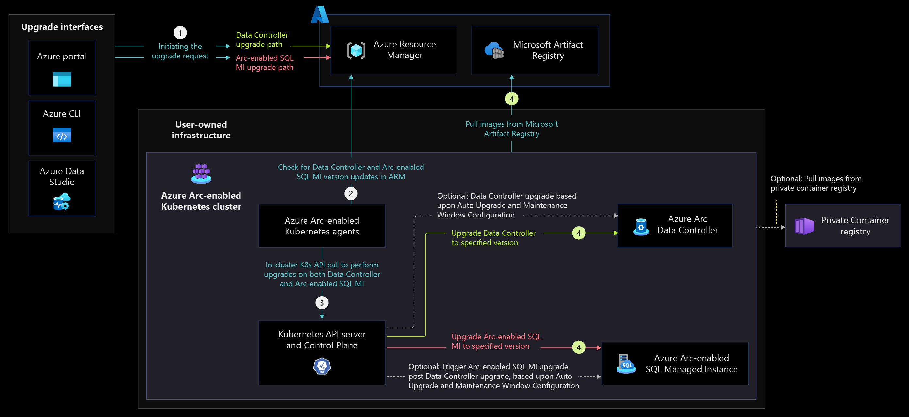
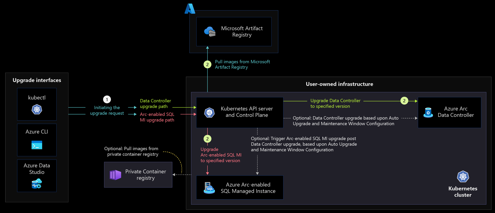
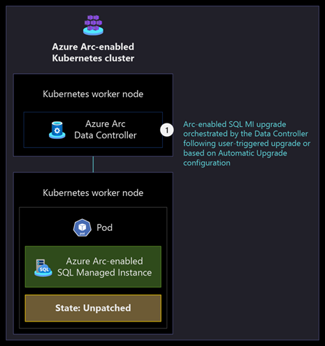
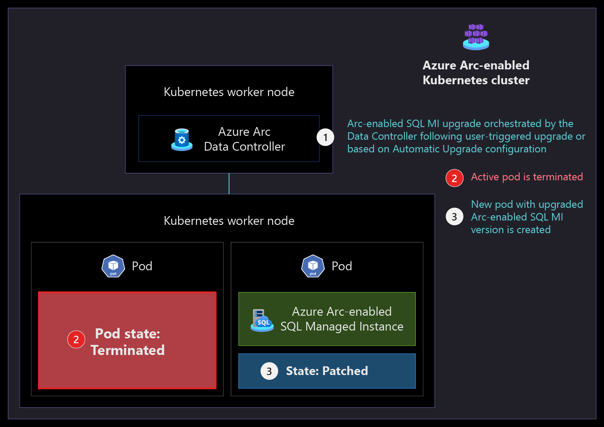
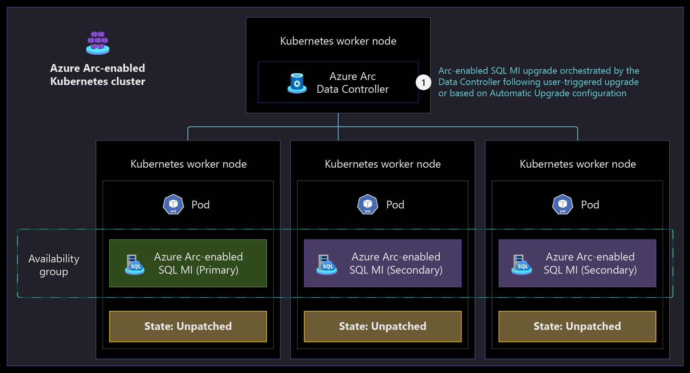
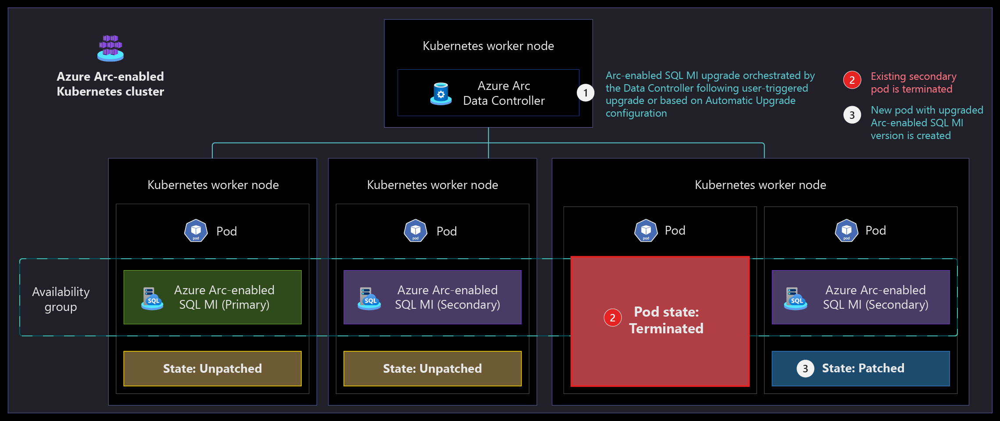
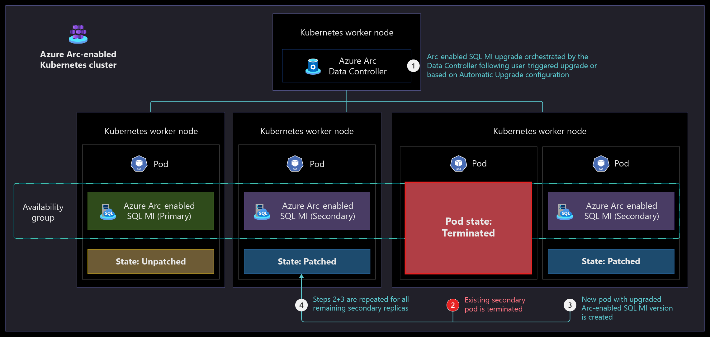
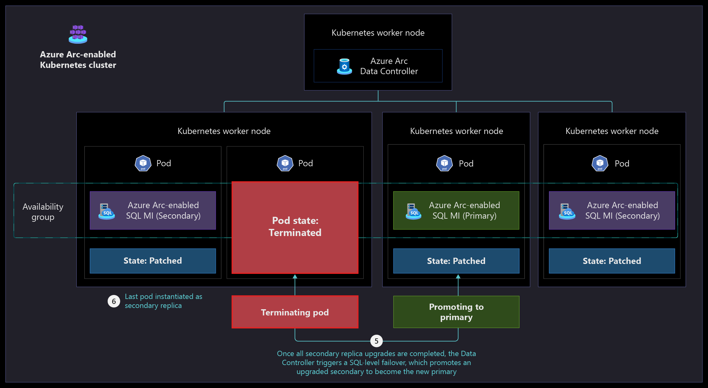

# Upgradeability disciplines for Azure Arc-enabled SQL Managed Instance

Azure Arc-enabled data services allow you to get an evergreen version of SQL that's only available in Arc-enabled SQL Managed Instance. By nature of being evergreen, Arc-enabled SQL Managed Instance provides managed service-based upgradeability so you can benefit from innovation in your Azure infrastructure as soon as it’s available, unlike on-premises installations or multicloud environments.

This article provides key design considerations and recommendations for configuring and managing the upgrade process for your Azure Arc-enabled data services.

## Architecture

### Directly connected mode

The following diagram displays the data service upgrade flow in *Directly connected* mode.

   [](./media/arc-enabled-data-svc-sql-mi-direct-connect-upgrade-flow.png#lightbox)

### Indirectly connected mode

The following diagram displays the data service upgrade flow in *Indirectly connected* mode.

   [](./media/arc-enabled-data-svc-sql-mi-indirectly-connect-upgrade-flow.png#lightbox)

### General Purpose service tier

The following diagrams display the upgrade process for Arc-enabled SQL Managed Instance in a *General Purpose* service tier.

   [](./media/arc-enabled-data-svc-sql-mi-general-purpose-tier-pre-upgrade.png#lightbox)

   [](./media/arc-enabled-data-svc-sql-mi-general-purpose-tier-upgrade.png#lightbox)

### Business Critical service tier

The following diagrams display the upgrade process for Arc-enabled SQL Managed Instance in a *Business Critical* service tier.

   [](./media/arc-enabled-data-svc-sql-mi-business-critical-tier-pre-upgrade.png#lightbox)

   [](./media/arc-enabled-data-svc-sql-mi-business-critical-tier-new-pod.png#lightbox)

   [](./media/arc-enabled-data-svc-sql-mi-business-critical-tier-rollout.png#lightbox)

   [](./media/arc-enabled-data-svc-sql-mi-business-critical-tier-last-pod.png#lightbox)

## Design considerations

### Azure Arc Data Controller upgrades

- Upgrades can be performed using various tools, such as Azure CLI, Azure portal, or Kubernetes. Consider which tool to use depending on the connectivity mode being used, either Directly or Indirectly connected mode, and the tool you're most comfortable with.
- Review your Azure Arc Data Controller to check if you have any preview data services, like Azure Arc-enabled PostgreSQL, deployed alongside Arc-enabled SQL Managed Instance. You can't perform in-place upgrades if you have a mix of preview and generally available services deployed on the same Data Controller.
- Review the versions of all Arc-enabled SQL Managed Instances used by the Data Controller to confirm they are at the same version as the Data Controller before performing the upgrade.
- Consider the [supported upgrade path](/azure/azure-arc/data/upgrade-data-controller-direct-cli#upgrade-path) to determine the next correct version for your Data Controller before the upgrade.

> [!NOTE]
> An upgrade of the Azure Arc Data Controller doesn't cause downtime for the Arc-enabled SQL Managed Instance.

#### Directly connected mode

- Determine if the Azure Arc Data Controller upgrade in Directly connected mode should be implemented using the Azure portal, the Azure CLI, or [Azure Data Studio](/sql/azure-data-studio/what-is-azure-data-studio).
- Review the prerequisites for upgrades using the [Azure portal](/azure/azure-arc/data/upgrade-data-controller-direct-portal#prerequisites) and the [Azure CLI](/azure/azure-arc/data/upgrade-data-controller-direct-cli#prerequisites).
- Review the [extensions management critical design area](../arc-enabled-kubernetes/eslz-arc-kubernetes-extensions-management.md) in the [Azure Arc-enabled Kubernetes landing zone accelerator](../enterprise-scale-landing-zone.md).

#### Indirectly connected mode

- Determine if the Azure Arc Data Controller upgrade in Indirectly connected mode should be implemented using the [Azure CLI](/azure/azure-arc/data/upgrade-data-controller-indirect-cli) or [Kubernetes tools](/azure/azure-arc/data/upgrade-data-controller-indirect-kubernetes-tools).
- Review the prerequisites for upgrades using [Kubernetes tools](/azure/azure-arc/data/upgrade-data-controller-indirect-kubernetes-tools#prerequisites) and the [Azure CLI](/azure/azure-arc/data/upgrade-data-controller-indirect-cli#prerequisites).
- Decide if you'll use [Microsoft Artifact Registry](https://mcr.microsoft.com/) in case your clusters have internet connectivity or a private registry if your clusters are air-gapped to pull the Azure Arc-enabled data services images.
- Plan for [required Kubernetes permissions](/azure/azure-arc/data/upgrade-data-controller-indirect-kubernetes-tools#create-the-service-account-for-running-upgrade) for the service account used to upgrade the Azure Arc Data Controller using Kubernetes tools.
- Check the repository information to make sure it's valid and new images have been already pulled into it.

### Azure Arc-enabled SQL Managed Instance upgrades

#### General considerations

- Upgrades to the Azure Arc Data Controller must be performed prior to upgrading the Arc-enabled SQL Managed Instance. The _arcdata_ cluster extension and SQL Managed Instance extensions versions are related and must be the same.
- Decide if you'll use automatic or manual upgrades of your Arc-enabled SQL Managed Instance depending on your requirements.
- In the case of automatic upgrades, only a single maintenance window can be defined for a Data Controller. Consider the number of different maintenance windows needed for different workloads to identify the number of needed data controllers.

#### General Purpose service tier

- During a General Purpose service-tier upgrade, the Kubernetes pod is terminated and reprovisioned with the new version. It's important to understand the application and client-side effect of an upgrade where there's a short amount of downtime as the new pod is created.
- Review the architecture of your applications to understand if they have the needed resiliency and retry logic to support brief impact during an upgrade.

#### Business Critical service tier

- During a Business Critical service-tier upgrade with multiple replicas, the secondary replicas are upgraded first. One of the upgraded secondary replicas is promoted to become the new primary replica while the old primary becomes a secondary and is upgraded. During the transition from the old primary to the new primary, there's a brief moment of downtime when the failover happens. It's important to understand the application and client-side impact of an upgrade when the failover occurs.
- Review the architecture of your application to understand if they have the needed resiliency and retry logic to support brief impact during an upgrade.

## Design recommendations

### Azure Arc Data Controller upgrades

- If you upgrade using the Azure CLI, verify that the _arcdata_ Azure CLI extension version corresponds to the image version you want to upgrade to in the [version log](/azure/azure-arc/data/version-log).
- In multi-cluster environments, perform upgrades first in a test/dev environment to validate any potential issues or breaking changes.
- Perform a [dry run](/azure/azure-arc/data/upgrade-data-controller-direct-cli#upgrade-data-controller-1) prior to the upgrade to validate the version schema, the private repository authorization token if used, and that the registry exists before attempting an actual upgrade.
- Create a process to [monitor for new Azure Arc Data Controller upgrades](/azure/azure-arc/data/upgrade-data-controller-direct-cli#view-available-images-and-chose-a-version).
- Don't mix PostgreSQL and Arc-enabled SQL Managed Instance on the same Data Controller since PostgreSQL is still in preview while Arc-enabled SQL Managed Instance is generally available. Consider a separate cluster with its own Data Controller to test PostgreSQL.
- Avoid using preview features in your production environment and only use preview features for evaluation purposes on dev/test instances.
- Create an inventory of the current versions of deployed data controllers. [Azure Resource Graph](/azure/governance/resource-graph/overview) can be used to query your current deployed data controllers.

   ```shell
    resources
    | where type == 'microsoft.azurearcdata/datacontrollers'
    | extend version = tostring(properties.k8sRaw.status.runningVersion)
    | project name,location,resourceGroup,version
   ```

- Review the [troubleshooting guide](/azure/azure-arc/data/maintenance-window#failed-upgrades) to understand how to get the needed logs to resolve any upgrade issues.

#### Directly connected mode

- Create a process to monitor the upgrade process using the [Azure portal](/azure/azure-arc/data/upgrade-data-controller-direct-portal#monitor-the-upgrade-status), [Azure CLI](/azure/azure-arc/data/upgrade-data-controller-direct-cli#monitor-the-upgrade-status), or [Azure Data Studio](/sql/azure-data-studio/what-is-azure-data-studio).
- Upgrade the [_arcdata_ cluster extension](/azure/azure-arc/data/upgrade-data-controller-direct-cli#upgrade-arc-data-controller-extension) before upgrading Azure Arc Data Controller itself.

#### Indirectly connected mode

- Create a process to monitor the upgrade process using [Kubernetes tools](/azure/azure-arc/data/upgrade-data-controller-indirect-kubernetes-tools#monitor-the-upgrade-status) or the [Azure CLI](/azure/azure-arc/data/upgrade-data-controller-indirect-cli#monitor-the-upgrade-status).
- Automate the process to [pull down images](https://github.com/microsoft/azure_arc/tree/main/arc_data_services/deploy/scripts) to your private registry.

### Azure Arc-enabled SQL Managed Instance upgrades

#### General recommendations

- Keep your Arc-enabled SQL Managed Instance up-to-date with the latest available version to receive the latest patches, bug fixes, and features. Currently, Arc data services don't support skipping releases during upgrades. So if there are multiple releases to upgrade, you'll need to upgrade to sequential releases to get to the latest version. It's recommended to not drift too far from the latest releases.
- Make sure to have your "point-in-time restore" backup policy configured so that you can recover if there are problems during an upgrade. Review the [business continuity and disaster recovery critical design area](../arc-enabled-data-service-sql-managed-instance/eslz-arc-data-service-sql-managed-instance-business-continuity-disaster-recovery.md) and use the `kubectl describe sqlmi` command against your instances to verify the current retention settings.
- In multi-cluster environments or scenarios with multiple deployments of Arc-enabled SQL Managed Instance that represent different environments, perform upgrades first in dev/test environments, such as the development environment, to validate any potential issues or breaking changes.
- Perform a [dry run](/azure/azure-arc/data/upgrade-sql-managed-instance-direct-cli#upgrade-the-managed-instance) prior to the upgrade to validate the version schema, the private repository authorization token if used, and that the registry exists before attempting an actual upgrade.
- Use the Azure CLI to perform at-scale upgrades of your Arc-enabled SQL Managed Instance.
- Use [automatic upgrades](/azure/azure-arc/data/maintenance-window) for workloads that can tolerate immediate upgrades and opt-out of automatic upgrades for workloads that need a scheduled off-peak hour to perform the upgrade.
- If automatic upgrades are used, make sure to define a suitable [maintenance window](/azure/azure-arc/data/maintenance-window) to allow for upgrades to happen during off-peak hours.
- In case of manual upgrades, ensure that you establish a regular cadence to perform upgrades to stay within supported versions.
    >[!NOTE]
    >You can also [poll the Microsoft Artifact Registry](https://mcr.microsoft.com) for new container image versions.

- Create a process to monitor the upgrade status using the [Azure CLI](/azure/azure-arc/data/upgrade-data-controller-direct-cli#monitor-the-upgrade-status) or [Kubernetes tools](/azure/azure-arc/data/upgrade-data-controller-indirect-kubernetes-tools#monitor-the-upgrade-status).
- Review the [corresponding versions](/azure/azure-arc/data/version-log) of the different components before performing an upgrade to validate that the correct versions of the components are in place.

#### General Purpose service tier

- Perform upgrades during noncritical hours to minimize the impact on users and the organization data.
- Review the [reliability pillar](/azure/architecture/framework/resiliency/overview) of the [Microsoft Azure Well-Architected Framework](/azure/architecture/framework/) for more information on how to architect for [resiliency and retry guidance](/azure/architecture/best-practices/retry-service-specific#sql-database-using-adonet) for your applications.

#### Business Critical service tier

- Deploy the Business Critical instance with three replicas instead of two to achieve higher availability and less downtime during upgrade and failover activities.
- Perform upgrades during noncritical hours to minimize the impact on users and organization data.

## Next steps

For more information about the hybrid cloud and multicloud journey, see the following articles:

- Review the [capabilities of Azure Arc-enabled data services](/azure/azure-arc/data/overview).
- Review the [validated Kubernetes distributions](/azure/azure-arc/data/validation-program) for Azure Arc-enabled data services.
- Review the upgrade process of Azure Arc in [Directly](/azure/azure-arc/data/upgrade-data-controller-direct-cli) and [Indirectly](/azure/azure-arc/data/upgrade-data-controller-indirect-cli) connected modes.
- Review the upgrade process of the Azure Arc SQL Managed Instance in [directly](/azure/azure-arc/data/upgrade-sql-managed-instance-direct-cli) and [indirectly](/azure/azure-arc/data/upgrade-sql-managed-instance-cli) connected modes.
- Manage [hybrid and multicloud environments](../manage.md).
- Experience Arc-enabled SQL Managed Instance automated scenarios with [Azure Arc Jumpstart](https://azurearcjumpstart.io/azure_arc_jumpstart/azure_arc_data/).
- To learn more about Azure Arc, review the [Azure Arc learning path on Microsoft Learn](/learn/paths/manage-hybrid-infrastructure-with-azure-arc/).
