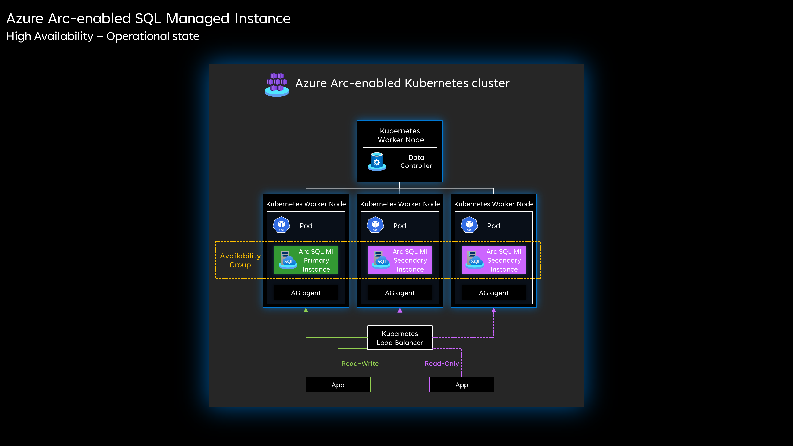
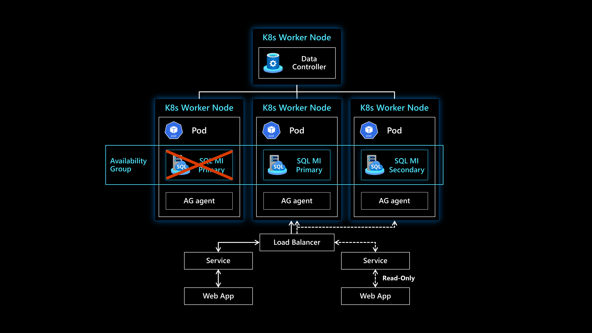
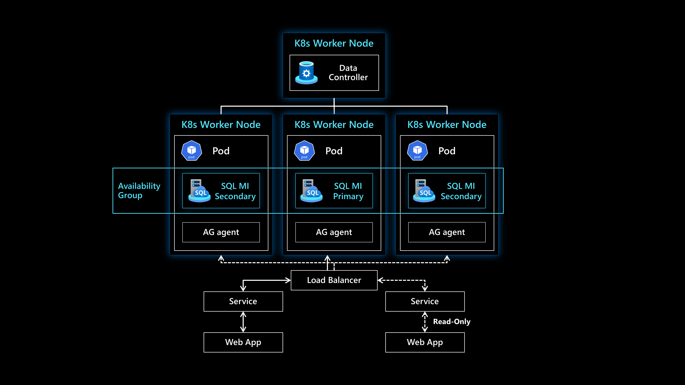
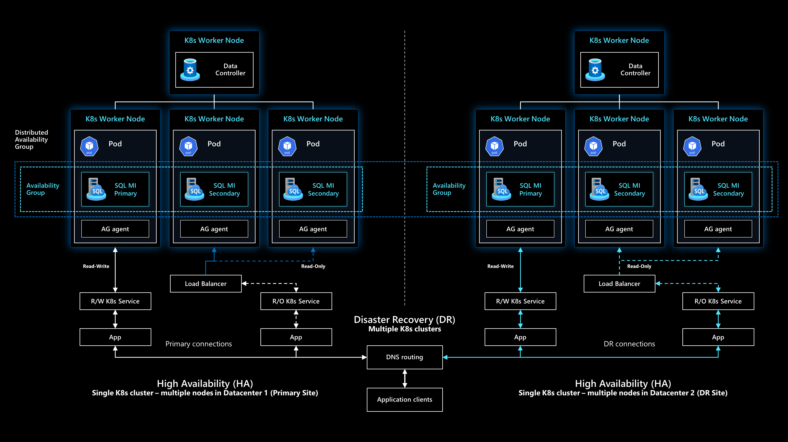

# Business continuity and disaster recovery for Azure Arc-enabled SQL Managed Instance

Azure Arc-enabled SQL Managed Instance provides capabilities for business continuity which allows businesses to recover and continue operating in the event of disruptions with minimal downtime.

This article provides key design considerations and recommendations for configuring and managing the business continuity capabilities like point-in-time restore, high availability and disaster recovery.

## Architecture

The following architecture diagrams show the high availability capabilities of the Business Critical service tier which allows for near-zero downtime failover. Once the primary instance fails, the load balancer stops sending traffic to it and starts redirecting towards the secondary instances, in addition to promoting one of the secondary instances to primary. Once the failed instance comes back online, it will be added as secondary.

  

  

  

The following architecture diagram shows how Azure Arc-enabled SQL Managed Instance can be deployed into a disaster recovery architecture on two separate clusters across different sites.

  

## Design considerations

Review the [business continuity and disaster recovery design area](/azure/cloud-adoption-framework/ready/landing-zone/design-area/management-business-continuity-disaster-recovery) of Azure landing zones to assess the effect of Azure Arc-enabled SQL Managed Instance on your overall BCDR model.

### Point-in-time restore

- Understand your Recovery Point Objective (RPO) and Recovery Time Objective (RTO) targets.
- Determine how long you would want to retain and restore your backups according to the supported retention period limits.
- Consider the storage implications of increasing the retention period of your backups.
- Consider the [storage class](/azure/azure-arc/data/storage-configuration#database-instance-storage-configuration) to be used for the backups persistent volume.
- Consider the persistent volume size for backups according to the expected data size and retention period configured
- Review the [storage critical design area](./eslz-arc-datasvc-sqlmi-storage-disciplines.md) for storage best practices.
- Backups are always performed on the primary replica, consider the performance impact of the backup and restore processes when identifying the resources allocated to your Azure Arc-enabled SQL Managed Instances.
- Point-in-time-restores can not overwrite an existing database,it can restore a database from an existing database to a new database on the same Azure Arc-enabled SQL Managed Instance.
- Consider the additional steps needed to fully recover your database if your application is online during your restore process.
- Consider the [extra steps needed](/azure/azure-arc/data/managed-instance-high-availability#restoring-a-database-onto-a-multi-replica-instance) to restore a database onto a multi-replica Azure Arc-enabled SQL Managed Instance.
- Determine the [tools](/azure/azure-arc/data/connect-managed-instance) that will be used by Database administrators to configure and restore backups.

### High availability

- Decide on the service tier to deploy Azure Arc-enabled SQL Managed Instance in, depending on the high availability requirements of your workload
  - In the General Purpose service tier, there is only one replica available, and the high availability is achieved via Kubernetes orchestration
  - In the Business Critical service tier, in addition to what is natively provided by Kubernetes orchestration, Azure SQL Managed Instance for Azure Arc provides a contained availability group.
- Consider the potential downtime in the General Purpose service tier, due to the existence of only one replica.
- Consider the number of replicas (1-3) to deploy in the Business Critical service tier.
- When deploying an instance in a Business Critical service tier with two or more replicas, you can configure the secondary replicas as readable. Decide on the [number of secondary replicas](/azure/azure-arc/data/configure-managed-instance#configure-readable-secondaries) to deploy in the Business Critical service tier.
- Decide on the number of secondary replicas required to commit a transaction in the Business Critical service tier
  - In a two-replica configuration, If there are connectivity issues between the replicas, then the primary replica may not commit any transactions as every transaction needs to be committed on both replicas before a success is returned back on the primary.
  - In a three replica configuration, a transaction needs to commit in at least 2 of the 3 replicas before returning a success message back to the application.
- Decide if you need to designate a [specific replica to be the primary one](/azure/azure-arc/data/managed-instance-high-availability#preferred-primary-replica).
- Decide which service type you will use between load balancer and nodeport. If load balancer is the service type used, then applications can reconnect to the same primary endpoint and Kubernetes will redirect the connection to the new primary. If the service type is nodeport then the applications will need to reconnect to the new Ip address.

### Disaster recovery

- The Azure Arc-enabled SQL Managed Instance in both geo-primary and geo-secondary sites need to be identical in terms of their compute & capacity, as well as service tiers they are deployed in.
- Decide on a location to store the mirroring certificates when creating the disaster recovery setup that is accessible by both clusters hosting the Azure Arc-enabled SQL Managed Instances.
- Consider how to monitor the downtime of the primary instance to decide when to perform a failover to the secondary instance.
- Each Azure Arc-enabled SQL Managed Instance has its own endpoints, consider how your applications will access the primary endpoint in case of a failover with minimum disruption.

## Design recommendations

### Point-in-time restore

- When deploying a new Azure Arc-enabled SQL Managed Instance, always define the [storage class](/azure/azure-arc/data/storage-configuration#database-instance-storage-configuration) for backups to avoid defaulting to the data storage class.
- Use a ReadWriteMany (RWX) capable storage class for the backups volume.
- Use the [Dry-run switch](/azure/azure-arc/data/point-in-time-restore#create-a-database-from-a-point-in-time-using-az-cli) for restores first to validates if the restore operation can be successful or not before performing the actual restore.
- Create a process to send backups that need longer retention to Azure or other on-opremises storage.

### High availability

- Perform regular drills to validate the high availability of your Azure Arc-enabled SQL Managed Instance, whether its deleting the pod of a General Purpose instance or failing one of the replicas of a Business Critical instance.
- Deploy a Business Critical SQL Managed Instance in a three replica configuration instead of a two replica configuration to achieve near-zero data loss.
- Use load balancer as your service type when deploying Azure Arc-enabled SQL Managed Instance for better availability.
- Review the [high availability limitations](/azure/azure-arc/data/managed-instance-high-availability#limitations) of the Azure Arc-enabled SQL Managed Instance.
- Review the [supported availability modes](/sql/database-engine/availability-groups/windows/availability-modes-always-on-availability-groups) to decide on the right mode to use based on your high availability needs.

### Disaster recovery

- Ensure the SQL instances have different names for both primary and secondary sites, and the shared-name value should be identical on both sites.
- Perform regular disaster recovery drills to validate the failover process.
- Create a process for initiating both manual and forced failovers.
- Define different names for the Azure Arc-enabled SQL Managed Instance names in both the primary and secondary sites.
- Review the [management critical design area](./eslz-arc-datasvc-sqlmi-management-disciplines.md) of Azure Arc-enabled SQL Managed Instance to understand the best practices to monitor the health of the clusters to understand when a failover is required.
- Define the DNS record for the shared name of the [Distributed Availability Group](/sql/database-engine/availability-groups/windows/distributed-availability-groups) in your DNS servers to avoid creating manual DNS records during the failover.

## Next steps

For more information on your hybrid and multicloud cloud journey, see the following articles:

- Review the [capabilities](/azure/azure-arc/data/overview) of Azure Arc-enabled Data Services.
- Review the [business continuity features](/azure/azure-arc/data/managed-instance-business-continuity-overview) for Azure
- Review the [validated Kubernetes distributions](/azure/azure-arc/data/validation-program) for Azure Arc-enabled Data Services.
- Review [Manage hybrid and multicloud environments](/azure/cloud-adoption-framework/scenarios/hybrid/manage)..
- Experience Azure Arc-enabled SQL Managed Instance automated scenarios with [Azure Arc Jumpstart](https://azurearcjumpstart.io/azure_arc_jumpstart/azure_arc_data/).
- To learn more about Azure Arc, review the [Azure Arc learning path on Microsoft Learn](/learn/paths/manage-hybrid-infrastructure-with-azure-arc/).
