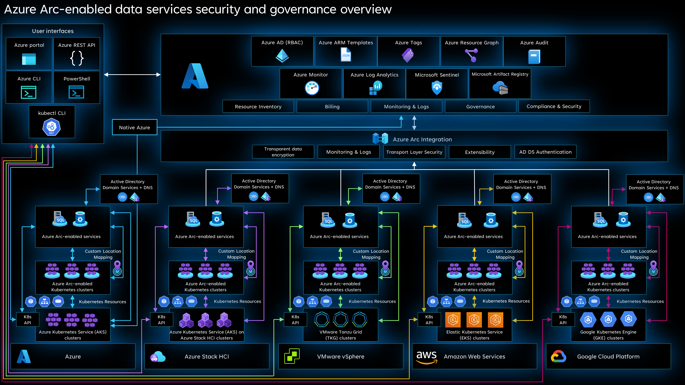

# Governance and security disciplines for Azure Arc-enabled SQL Managed Instance

This article provides key design considerations and best practices for security, governance, and compliance that you should use when planning and implementing your Azure Arc-enabled SQL Managed Instance deployment. While the enterprise-scale landing zone documentation covers [governance](/azure/cloud-adoption-framework/ready/landing-zone/design-area/governance) and [security](/azure/cloud-adoption-framework/ready/landing-zone/design-area/security) as separate topics, these critical design areas are consolidated into a single topic for Arc-enabled SQL MI.

## Architecture

The following diagram shows a conceptual reference architecture depicting the security, compliance, and governance design areas for Arc-enabled SQL MI:

  

## Design considerations

This section contains design considerations you should keep in mind while planning the security and governance of your Arc-enabled SQL MI.

Review the [security](/azure/cloud-adoption-framework/ready/landing-zone/design-area/security) and [governance](/azure/cloud-adoption-framework/ready/landing-zone/design-area/governance) design areas of the Azure landing zones to assess the effect of Arc-enabled SQL MI on your overall governance and security models.

### Governance disciplines

- Review the [resource organization critical design area](./eslz-arc-datasvc-sqlmi-resource-organization.md) for best practices on enforcing governance in your landing zone.
- Review and enforce your organization's naming convention for your hybrid resources like the Arc-enabled SQL MI, Data Controller, and the Custom Location.
- Review the built-in configuration profiles for Indirectly Connected mode and decide if any [custom profiles](/azure/azure-arc/data/create-custom-configuration-template) are needed according to your Kubernetes infrastructure.

### Data privacy and residency

- Consider which Azure regions you plan to provision your Arc-enabled SQL MI and Data Controllers within based on your security and compliance requirements taking into consideration any data sovereignty requirements. Understand [what data is collected from your resources](/azure/azure-arc/data/privacy-data-collection-and-reporting) in Directly and Indirectly Connected mode, and plan accordingly based on the data residency requirements of your organization.

>[!NOTE]
> No database data is sent to Microsoft, only Operational data, billing & inventory data, diagnostics and [Customer Experience Improvement Program (CEIP) data](/sql/sql-server/usage-and-diagnostic-data-configuration-for-sql-server).

### Cluster security

- Your Arc-enabled SQL MI can reside on hybrid or multi-cloud Kubernetes clusters, review the security and governance considerations for your chosen cloud provider and Kubernetes distribution.
- Review the design considerations in the Azure Arc-enabled Kubernetes [governance and security disciplines design area](/azure/cloud-adoption-framework/scenarios/hybrid/arc-enabled-kubernetes/eslz-arc-kubernetes-governance-disciplines).

### Network security

- Review the [network connectivity critical design area](./eslz-arc-datasvc-sqlmi-network-connectivity.md) for best practices and guidance.
- Decide on the [connectivity mode](/azure/azure-arc/data/connectivity#connectivity-modes) to be used for your Arc-enabled SQL MI depending on your organization's security and compliance requirements.
- Depending on where your cluster is deployed, consider the [network ports and endpoints](/azure/azure-arc/data/monitor-grafana-kibana#additional-firewall-configuration) needed for monitoring your Arc-enabled SQL MI using Grafana and Kibana.
- When creating the Data Controller, decide which service type you will use between Kubernetes _LoadBalancer_ or _NodePort_.

### Identity and access management

- Review the [identity and access management for Arc-enabled SQL MI](./eslz-arc-datasvc-sqlmi-identity-access-management.md) for best practices and guidance.
- While considering your organization's separation of duties and least privileged access requirements, define cluster administration, operations, database administration, and developer roles within your organization that are responsible for day-to-day operations across your hybrid clusters and the Arc-enabled SQL MI deployed on them. Mapping each team to actions and responsibilities determines Azure role-based access control (RBAC) roles or the Kubernetes _ClusterRoleBinding_ and _RoleBinding_ depending on the connectivity mode used.
- Consider using a [RACI](/azure/cloud-adoption-framework/organize/raci-alignment) matrix to support this effort and build controls into the management scope hierarchy that you define based on [resource consistency](/azure/cloud-adoption-framework/govern/resource-consistency/) and [inventory management](/azure/cloud-adoption-framework/manage/considerations/inventory) guidance.
- Deploying the Azure Arc Data Controller requires some permissions which can be considered high privilege such as creating a Kubernetes namespace or creating a cluster role. Understand the [permissions](/azure/azure-arc/data/least-privilege) needed to prevent excessive privileges.
- Decide on the authentication model to be used within your Arc-enabled SQL MI whether it is Active Directory (AD) authentication or SQL authentication. Review the [Identity and access management design area](./eslz-arc-datasvc-sqlmi-identity-access-management.md) for design considerations and recommendations to choose right authentication mode for Arc-enabled SQL MI.
- Consider the differences between system-managed keytab vs customer-managed keytab to deploy Azure Arc AD connector to support AD authentication in Arc-enabled SQL MI. Both methods have the benefit of simplified operations vs full customer control of managing service accounts and keytab for AD authentication support.

### Azure Arc-enabled SQL Managed Instance security

- Decide on the [connectivity mode](/azure/azure-arc/data/connectivity#connectivity-modes) to be used, considering the trade-offs between having and not having direct connection to Azure and how this can affect your hybrid and multi-cloud instances from leveraging the current and future security capabilities enabled by Azure.
- Review the [security capabilities](/azure/azure-arc/data/managed-instance-features#RDBMSS) that are available in Arc-enabled SQL MI for your data workloads.
- Define the storage platform to be used for persistent volumes within your Kubernetes clusters and understand the security capabilities available to secure data residing on the persistent volumes. Review the [storage disciplines critical design area](./eslz-arc-datasvc-sqlmi-storage-disciplines.md) while you design for your landing zone.
- Review the requirements and architecture of [Transparent Data Encryption](/sql/relational-databases/security/encryption/transparent-data-encryption) before enabling it on your Arc-enabled SQL MI.
- Consider the [different locations](/azure/azure-arc/data/configure-transparent-data-encryption-manually?tabs=windows#back-up-a-transparent-data-encryption-credential) where you can store your Transparent Data Encryption credentials based on your organization cryptographic key management policies and procedures.
- When deploying Arc-enabled SQL MI in Indirectly Connected mode, decide on the certificate authority that will be used to provide the user-managed certificate according to your organization's security and compliance requirements.
- Deploying Arc-enabled SQL MI in Directly Connected mode provides a system-managed certificate with auto-rotation capabilities. In Indirectly Connected mode, manual intervention is needed to rotate a user-managed certificate. Consider the manual operations and security requirements when choosing the connectivity mode to deploy.
- Consider the need for keeping your Arc-enabled SQL MI up-to-date with the latest versions whether they are deployed in Directly or Indirectly Connected mode. Review the [upgradeability disciplines critical design area](./eslz-arc-datasvc-sqlmi-upgradeability-disciplines.md) for more guidance.

### Monitoring strategy

- Review the [management disciplines critical design area design](./eslz-arc-datasvc-sqlmi-management-disciplines.md) and plan to collect metrics and logs from your hybrid resources into a Log Analytics workspace for further analysis, auditing, and alerting
- Understand the [least privilege permissions](/azure/azure-arc/data/upload-metrics-and-logs-to-azure-monitor?tabs=windows#create-service-principal) required for the service principal to upload logs and metrics to Azure Monitor.

## Design Recommendations

### Network security

- Secure your Grafana and Kibana monitoring dashboards with [SSL/TLS certificates](/azure/azure-arc/data/monitor-certificates) for transport layer security.
- Use Kubernetes _LoadBalancer_ as your service type when deploying Arc-enabled SQL MI for better availability.

### Identity and access management

- Prefer the use of AD authentication to offload user lifecycle management to the directory services and use security groups in AD to manage user permissions to access the SQL database.
- Use system-managed keytab mode for AD authentication support to offload domain account and keytab management overhead to simplify operations.
- If SQL authentication is used. Make sure to use strong password policies and enable auditing to monitor SQL user identities and permissions granted to access database servers and databases.
- Dedicate a Kubernetes namespace for the Azure Arc Data Controller deployment and assign the least privilege permissions to deploy and manage.
- Create [strong passwords for Grafana and Kibana](/azure/azure-arc/data/least-privilege#create-the-metrics-and-logs-dashboards-user-names-and-passwords) dashboards and make sure to audit and rotate on a regular basis.
- Monitor the [activity log](/azure/azure-monitor/essentials/activity-log) of your Arc-enabled SQL MI and Data Controllers to audit the different operations occurring on your hybrid resources, create alerts for relevant events and integrate with SIEM tools such as [Azure](/azure/sentinel/overview) for security monitoring and incident response.

### Azure Arc-enabled SQL Managed Instance security

- Whenever possible, choose Directly Connected mode over Indirectly Connected mode deployment of Azure Arc-enabled data services and Arc-enabled SQL MI to make sure you are getting all the current and future security [feature benefits](/azure/azure-arc/data/connectivity#feature-availability-by-connectivity-mode) associated with Directly Connected mode.
- Enable [Transparent Data Encryption](/azure/azure-arc/data/configure-transparent-data-encryption-manually) whenever possible to encrypt your data at rest.
- Store your Transparent Data Encryption credentials on [persistent volumes](/azure/azure-arc/data/configure-transparent-data-encryption-manually?tabs=windows#back-up-a-transparent-data-encryption-credential) for better resiliency.
- Leverage your storage platform capabilities to encrypt persistent volumes according to your organization's security and compliance requirements.
- Make sure to have your backup policy in place according to your requirements to recover from data loss. Review the [business continuity and disaster recovery critical design area](./eslz-arc-datasvc-sqlmi-bcdr.md) for more guidance.
- When deploying in Indirectly Connected mode, create a process to [rotate the user-managed certificate](/azure/azure-arc/data/rotate-user-tls-certificate).
- Make sure to have a process to keep your Arc-enabled SQL MI updated to the latest versions, independently of the connectivity mode.

### Monitoring strategy

- Monitor the credential expiration or the change of the service principal used to upload metrics and logs to Azure.
- Create a process to rotate the service principal credentials according to your organization's security and compliance requirements.

## Next steps

For more information on your hybrid and multicloud cloud journey, see the following articles:

- Review the [capabilities](/azure/azure-arc/data/overview) of Azure Arc-enabled Data Services.
- Review the [validated Kubernetes distributions](/azure/azure-arc/data/validation-program) for Azure Arc-enabled data services.
- Review [Manage hybrid and multicloud environments](/azure/cloud-adoption-framework/scenarios/hybrid/manage).
- To learn more about operating Arc-enabled SQL MI with least privilege, review [this](/azure/azure-arc/data/least-privilege) guidance.
- Experience Arc-enabled SQL MI automated scenarios with [Azure Arc Jumpstart](https://azurearcjumpstart.io/azure_arc_jumpstart/azure_arc_data/).
- To learn more about Azure Arc, review the [Azure Arc learning path on Microsoft Learn](/learn/paths/manage-hybrid-infrastructure-with-azure-arc/).
