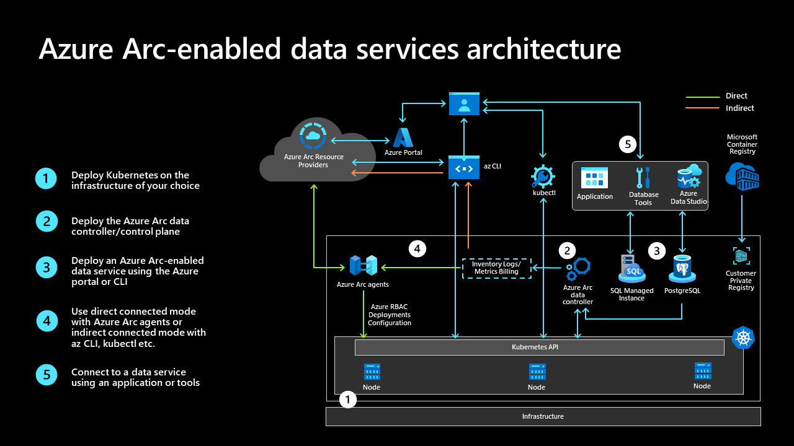

# Management and monitoring for Azure Arc-enabled SQL Managed Instance

This article provides key design considerations and recommendations for managing and monitoring Azure Arc-enabled SQL Managed Instance clusters to help you understand and design solutions for operational excellence. Use the guidance provided in this document and in other critical design areas referenced throughout it to better understand related design considerations and recommendations.

## Architecture

To build the right architecture for your organization to onboard on-premises or public cloud Kubernetes clusters, you need to understand the broad  [Azure Arc-enabled Kubernetes network architecture](/azure/cloud-adoption-framework/scenarios/hybrid/arc-enabled-kubernetes/eslz-arc-kubernetes-network-connectivity) and [network connectivity for Azure Arc-enabled data services](./eslz-arc-datasvc-sqlmi-network-connectivity.md), specifically concerning the two connectivity modes.

The diagram below illustrates the overall management architecture:

### Cluster management

Prior to deploying an Azure Arc-enabled SQL MI instance, review the [Cloud Adoption Framework (CAF)](/azure/cloud-adoption-framework/scenarios/hybrid/arc-enabled-kubernetes/eslz-arc-kubernetes-management-disciplines) design considerations and recommendations for [Azure Arc-enabled Kubernetes](/azure/cloud-adoption-framework/scenarios/hybrid/arc-enabled-kubernetes/eslz-arc-kubernetes-management-disciplines) to understand cluster management principles for the underlying Kubernetes cluster.

### Cluster monitoring

Refer to the [Network Connectivity critical design area](./eslz-arc-datasvc-sqlmi-network-connectivity.md) (CDA) to understand the two connectivity modes: direct and indirect.  

In either connectivity modes, the open source tools Grafana and Kibana can be integrated into the cluster for monitoring.  In the direct connectivity both, both the Grafana and/or Kibana dashboards can be used as well as Azure Monitor.

## Design considerations

First, Review the [management design area](/azure/cloud-adoption-framework/ready/landing-zone/design-area/management) of the Azure landing zones to understand role of Azure Arc-enabled Kubernetes on your overall management design.

### Cluster monitoring

- Azure Arc-enabled SQL MI offers integration with popular open source monitoring tools like Grafana and Kibana.  In addition, metrics and logs are visible within Azure Monitor. Consider your organization's preferred monitoring tools when evaluating how to monitor your deployment.
- Grafana and Kibana are installed and configured automatically, so consider this in terms of the ease of deployment and reduced setup for your organization
- Azure Policy can be used to deploy Azure Monitor Container Insights for cluster-level monitoring within Azure Monitor.  Consider how Azure Policy factors into your organization's Azure deployments.

### Directly connected mode

- when an Arc-enabled SQL MI is deployed in Directly connected mode, certain metadata about your cluster is automatically sent to Azure for inventory and billing purposes.
- All traffic is initiated from the cluster and no inbound firewall rules are required to facilitate this
- during the deployment of the Data Controller, logs and metrics can be uploaded automatically to an Azure Log Analytics workspace by providing the Workspace ID and the workspace's access key.  After deployment, this can be disabled or enabled as desired.

### Indirectly connected mode

- when an Arc-enabled SQL MI is deployed in Indirectly connected mode, there is assumed to be no direct connection to Azure.  At least once per month, metadata about the instance must be uploaded to Azure for inventory and billing purposes.  Get more information about this it in the data collection and reporting document available [here](/azure/azure-arc/data/privacy-data-collection-and-reporting).
- When deploying in Indirectly connected mode, consider how the Arc-enabled SQL MI data will be exported from the cluster and [uploaded to Azure](/azure/azure-arc/data/upload-logs?tabs=windows) and consider ways to automate this upload process.

> [!NOTE]
> The uploaded data is not the underlying database information but instead is information about the Arc-enabled SQL MI itself and is only for inventory and billing purposes.

## Design recommendations

- Wherever possible, it is recommended to use the Directly connected mode connectivity pattern.  This makes monitoring through Azure easier; however, it is not suitable for all scenarios. See [Connectivity nodes and requirements](/azure/azure-arc/data/connectivity) for more details.
- Use the integrated open source tools like Grafana and Kibana if these tools are already used across the your organization.
- Collect logs and metrics using [Azure Monitor Container insights for Azure Arc-enabled Kubernetes clusters](/azure/azure-monitor/containers/container-insights-enable-arc-enabled-clusters). Use these logs and metrics to create dashboards and generate alerts for cluster-related issues.
- Enable [recommended metric alert rules from Container insights](/azure/azure-monitor/containers/container-insights-metric-alerts) to receive notifications from Azure Monitor about the cluster itself.
- Use [Azure Policy](/azure/cloud-adoption-framework/scenarios/hybrid/arc-enabled-kubernetes/eslz-arc-kubernetes-governance-disciplines#policy-management-and-reporting) to ensure that Container Insights is deployed automatically.
- For an easy, out-of-the-box experience for monitoring, use the [Workbooks available in Container Insights](/azure/azure-monitor/containers/container-insight-reports) to view performance and health information about your cluster and components such as nodes, pods, and persistent volumes.  Once familiar with workbooks, design a custom workbook that illustrates the data in a way that's most useful to your operations.
- Review the included Grafana dashboards to see what's provided out-of-the-box to avoid re-work

- Use [Azure Resource Graph](/azure/azure-arc/kubernetes/resource-graph-samples?tabs=azure-cli) or [Log Analytics queries](/azure/azure-monitor/logs/queries) to monitor cluster health and raise alerts.
- refer to [Design a Log Analytics workspace architecture](/azure/azure-monitor/logs/workspace-design) to strategize how best to organize Log Analytics Workspace(s) based on business needs and organization
- because of the importance of [storage](./enterprise-scale-landing-zone-arc-data-svc-sql-mi-storage-disciplines.md) on the various components of an Azure Arc-enabled SQL MI deployment, establish dashboards and alerts on the health and capacity of local and remote storage.
- review considerations and recommendations for [managing upgrades](./eslz-arc-datasvc-sqlmi-upgradeability-disciplines.md)
- if using the indirect connectivity mode, implement an automated mechanism, such as a cron job, to [upload usage data](/azure/azure-arc/data/upload-usage-data), [logs](/azure/azure-arc/data/upload-logs?tabs=windows), and [metrics](/azure/azure-arc/data/upload-metrics?tabs=powershell) on a daily basis.  While uploading logs and metrics are optional, doing so is recommended so as to be able to use Azure Monitor for visibility across your environment.
- implement a process to verify that usage and billing data is being uploaded at least once per month to ensure that the ability to create new instances is not disabled

## Next steps

For more information about your hybrid and multicloud cloud journey, see the following articles:

- Review the [connectivity modes and requirements](/azure/azure-arc/data/connectivity) for Azure Arc-enabled data services.
- Read about how to use [Azure Data Studio dashboards](/azure/azure-arc/data/azure-data-studio-dashboards) to view information on your Arc-enabled SQL MI.
- Experience Azure Arc-enabled data services scenarios with [Azure Arc Jumpstart](https://azurearcjumpstart.io/azure_arc_jumpstart/azure_arc_data/).
- Learn about Azure Arc in the [Azure Arc learning path on Microsoft Learn](/learn/paths/manage-hybrid-infrastructure-with-azure-arc/).
