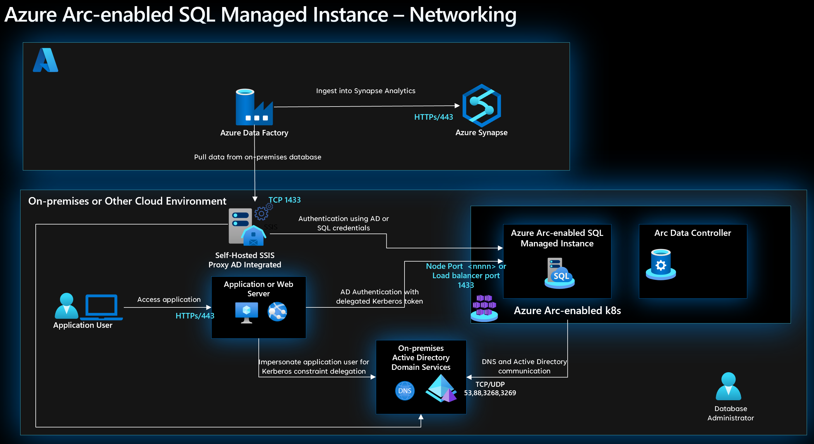

# Network connectivity for Azure Arc-enabled SQL Managed Instance

Azure Arc-enabled data services support two different connectivity modes [Directly connected and Indirectly connected](/azure/azure-arc/data/connectivity) to deploy Azure Arc-enabled SQL Managed Instance running on Azure Arc-enabled Kubernetes clusters with Azure Arc's control plane. Arc-enabled data services components such as Azure Arc Data Controller, Azure Arc Active Directory connector, and Arc-enabled SQL MI communicate with Azure Arc endpoints, Active Directory domain controllers, and domain name system (DNS) servers running on-premises and in other cloud environments.

This document explains network architecture, design considerations, and design recommendations that help you understand connectivity to the Azure control plane from on-premises or other cloud infrastructure and will help you manage and operate Arc-enabled data services and Arc-enabled SQL MI running on Arc-enabled Kubernetes clusters in on-premises and other cloud environments.

## Architecture

The following diagram shows an Arc-enabled data services network architecture that supports directly connected and indirectly connected network connectivity modes.

The following is an example scenario diagram for securely accessing Arc-enabled SQL MI by various consumer services.

## Design considerations

- Review the [network topology and connectivity design area](/azure/cloud-adoption-framework/ready/enterprise-scale/network-topology-and-connectivity) of the Azure landing zones to align Arc-enabled data services network connectivity with your organization's adopted landing zone design.

- Review the [Network connectivity for Azure Arc-enabled Kubernetes](/azure/cloud-adoption-framework/scenarios/hybrid/arc-enabled-kubernetes/eslz-arc-kubernetes-network-connectivity) for understanding network architecture and recommendations to make right design decisions for deploying and operating Arc-enabled data services on Arc-enabled Kubernetes cluster. Arc-enabled data services use Azure Arc-enabled Kubernetes network connectivity for service deployment and operations.

- Review the [Arc-enabled data services feature availability by connectivity-mode](/azure/azure-arc/data/connectivity#feature-availability-by-connectivity-mode) and [network requirements](/azure/azure-arc/data/connectivity) for Azure Arc-enabled data services and consider whether directly connected mode or indirectly connected mode option is better suited to align with your organization network security policies of on-premises network or other cloud providers.

- Directly Connected mode requires a direct connection to Azure and provides additional benefits by nature of this connectivity. Consider the trade-offs needed to enable this [direct connection](/azure/azure-arc/data/connectivity#connectivity-modes) based on your organization security and compliance requirements.

- Depending on where the Arc-enabled Kubernetes cluster is running, consider the use of [a Kubernetes _LoadBalancer_](https://kubernetes.io/docs/tasks/access-application-cluster/create-external-load-balancer/) or [_NodePort_ type](https://kubernetes.io/docs/concepts/services-networking/service/#type-nodeport) to expose Arc-enabled data services such as Data Controller and SQL MI. Load Balancer allows maintaining the same port number across multiple instances whereas node port requires different port numbers for each Arc-enabled SQL MI.

- Consider deploying software load balancer types such as [MetalLB](https://metallb.universe.tf/) in on-premises environments and internal load balancers in cloud-based environments for Arc-enabled SQL MI service. This provides consistent IP addresses and SQL server ports such as 1433 or custom port and load balances nodes in the Kubernetes cluster. Node IPs change in auto-scale clusters and don't provide high availability when pods move from one Kubernetes worker node to another during failover, upgrades, and maintenance of Kubernetes clusters, Data Controllers, and Arc-enabled SQL MI.

- Consider using Transport Layer Security (TLS) ports such as 636 and 3269 vs non-TLS ports 389 and 3268 with [Active Directory Domain Services (ADDS)](/windows-server/identity/ad-ds/active-directory-domain-services) to keep connections secure when using [AD authentication](/azure/azure-arc/data/active-directory-introduction) in Azure Arc-enabled SQL Managed Instance.

- When using Azure Key Vault to protect [Kubernetes secrets](/azure/aks/csi-secrets-store-driver) of Arc-enabled SQL MI for AD authentication, consider using [Azure Key Vault private endpoints](/azure/key-vault/general/private-link-service?tabs=portal) to keep connections private. Please refer [Azure Key Vault Secrets Provider extension to fetch secrets into Azure Arc-enabled Kubernetes clusters](/azure/azure-arc/kubernetes/tutorial-akv-secrets-provider) to use Azure Key Vault with Arc-enabled Kubernetes clusters.

- Consider between public vs private endpoints when using [Azure Storage Account archive blob](/azure/storage/blobs/archive-blob?tabs=azure-portal) to retain Arc-enabled SQL MI database backup files for long term retention.

## Design recommendations

- Review Azure [Arc-enabled Kubernetes networking design recommendations](/azure/cloud-adoption-framework/scenarios/hybrid/arc-enabled-kubernetes/eslz-arc-kubernetes-network-connectivity#design-recommendations) as Arc-enabled SQL MI deployed on an existing Arc-enabled Kubernetes cluster.

- Prefer Directly Connected mode over Indirectly Connected mode deployment of Arc-enabled data services and Arc-enabled SQL MI to gain the [feature benefits](/azure/azure-arc/data/connectivity#feature-availability-by-connectivity-mode) associated with Directly Connected mode deployment.

- Prefer Kubernetes _LoadBalancer_ service type over _NodePort_ service type for Arc-enabled data services such as data controller, dashboards, and Arc-enabled SQL MI. _LoadBalancer_ type provides resiliency across Kubernetes node failures, node restarts, and node removal during [upgrade and maintenance](./eslz-arc-datasvc-sqlmi-upgradeability-disciplines.md) of Kubernetes clusters.

- Use internal load balancers over external load balancers when using public cloud infrastructure for Arc-enabled data services deployment. The internal load balancer assigns private IP addresses from the virtual network and keeps database traffic private to the internal network.

- For on-premises deployment prefer containerized load balancer such as [MetalLB](https://metallb.universe.tf/#why) to support [load balancer service type](https://kubernetes.io/docs/tasks/access-application-cluster/create-external-load-balancer/). This simplifies firewall rules using standard SQL port 1433 and is easy to remember rather than using random ports when using _NodePort_ service type. Make sure to [allocate a subnet CIDR size](https://metallb.universe.tf/concepts/#address-allocation) to support the number of Arc-enabled SQL MI deployed on the Azure Arc-enabled Kubernetes cluster.

- When using [AD authentication](/azure/azure-arc/data/active-directory-introduction) for Arc-enabled SQL MI in both system-managed or customer-managed keytab modes, automate DNS registration for Arc-enabled SQL MI endpoints to discover service using on-premises or other cloud DNS servers. This eliminates operations overhead and automatically updates the IP addresses when changed and/or a service instance is deleted.

- Use firewall rules to restrict network access to Arc-enabled SQL MI, Data Controller, and dashboards endpoints to prevent access from untrusted sources. This reduces the attack surface of the Arc-enabled SQL MI and prevents data exfiltration.

- When using Azure private endpoints for Microsoft Artifact Registry (also known as Microsoft Container Registry or MCR), Azure Key Vault, Azure Log Analytics, and Storage Accounts configure [on-premises DNS servers to forward DNS queries](/azure/private-link/private-endpoint-dns#on-premises-workloads-using-a-dns-forwarder) to DNS forwarder in Azure. This will enable auto-discover these private endpoints using DNS names and eliminates the need to use host entries or DNS entry registration in on-premises DNS servers.

- Since AD authentication for Arc-enabled SQL MI requires connectivity to ADDS, make sure to have connectivity to domain controllers in primary and disaster recovery sites for high availability. As many enterprises deploy site recovery forests across geographies, make sure to use the nearest site to reduce network latency to domain controllers. Please review [Arc-enabled SQL MI business continuity and disaster recovery](./eslz-arc-datasvc-sqlmi-bcdr.md) for additional guidances.

## Next steps

For more information about your hybrid and multicloud cloud journey, see the following articles:

- Review [Azure Arc-enabled data services connectivity modes and requirements](/azure/azure-arc/data/connectivity)
- Review [Active Directory authentication](/azure/azure-arc/data/active-directory-introduction)
- Review the [Network connectivity for Azure Arc-enabled Kubernetes](/azure/cloud-adoption-framework/scenarios/hybrid/arc-enabled-kubernetes/eslz-arc-kubernetes-network-connectivity)
- Experience Arc-enabled SQL MI automated scenarios with [Azure Arc Jumpstart](https://azurearcjumpstart.io/azure_arc_jumpstart/azure_arc_data/).
- To learn more about Azure Arc, review the [Azure Arc learning path on Microsoft Learn](/learn/paths/manage-hybrid-infrastructure-with-azure-arc/).
