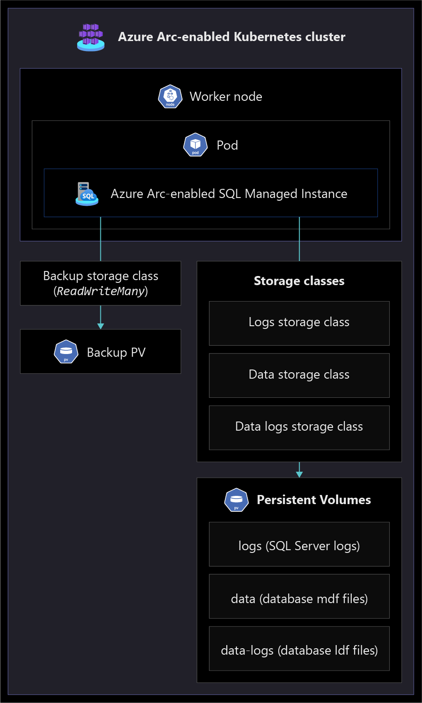

# Storage disciplines for Azure Arc-enabled SQL Managed Instance

Storage is a critical component in an Azure Arc-enabled SQL Managed Instance (Arc-enabled SQL MI) deployment.  Understanding how the storage-related concepts described in this document affect the functioning of Kubernetes clusters is an important aspect of the storage design choices and management.

Rather than directly interacting with underlying storage, Kubernetes provides an abstraction layer to a variety of storage technologies through Storage Classes. Cloud providers, hardware vendors, and other Kubernetes-managed platforms offer varying Storage Class options to suit specific environments and implementation scenarios.

Arc-enabled SQL MI does not limit or enforce any Storage Classes to be used, so it is important to choose the correct storage design and configuration. The storage design for Arc-enabled SQL MI is just as important as if you were choosing backing storage devices for a SQL Server when running on bare metal or virtual machines. These choices will ultimately represent your requirements surrounding RPO, RTO, capacity & performance.

For Arc-enabled SQL MI deployments, effectively planning for storage capabilities and configuration is crucial to operate successfully.  Read on to learn about the storage-related factors to consider, followed by recommendations for configuring Arc-enabled SQL MI.

## Architecture

The following architecture diagram shows the logical design of Azure Arc-enabled data services components. These components include a required Data Controller and one or more Arc-enabled SQL MI which contain databases provisioned for reference. Both the Data Controller and Arc-enabled SQL MI have various options for backing storage devices which will be dependent upon Kubernetes distribution and storage infrastructure providers.

## Design considerations

### Storage Classes

Choosing the right Kubernetes Storage Class and configuration for your Azure Arc-enabled data services components is important for your data storage performance, resiliency, and capacity.

[Storage Classes](https://kubernetes.io/docs/concepts/storage/storage-classes/), [Persistent Volumes (PV)](https://kubernetes.io/docs/concepts/storage/persistent-volumes/), and [Persistent Volume Claims (PVC)](https://kubernetes.io/docs/concepts/storage/persistent-volumes/#persistentvolumeclaims) are Kubernetes resource objects that are created in your Kubernetes cluster when provisioning the Azure Arc-enabled data services components.

The Storage Class options will vary depending upon what your cloud provider, hardware vendor offers, and what the Kubernetes Administrator has configured. The Persistent Volume Claim will request a Persistent Volume be created for the desired Storage Class and size requested. The following diagram is a reference of the relationship between these Kubernetes resources and potential options for Storage Classes.

Configuration of the PV and PVC Kubernetes resources occurs when provisioning the Data Controller and Arc-enabled SQL MI respectively.

There are two different storages types to choose from:

- **Local:** this is a volume that is mounted on a local storage device attached to the Kubernetes node where the pod is running on. This type of storage usually provides lower latency along with higher IOPS and throughput compared to Remote/Shared storage.
- **Remote/Shared Storage:** these are network-attached storage devices that tend to come with built-in redundancy. Common options for this are NAS and SAN devices.

The following should be taken into account when choosing a Storage Class, these criteria would also hold true for any database server you would build:

- **Performance:** The storage device I/O throughput and IOPS should meet your database needs.
- **Read/Write Ratio:** Understanding the workload can help choose the backing hardware to best meet the needs with appropriate costs. Heavy write workloads can take advantage of RAID 0 configurations, whereas infrequently accessed data might be best served using a SAN device storage.
- **Database isolation and co-location:** All databases on an instance of Arc-enabled SQL MI share Persistent Volume, so you can choose to move databases to separate instances of Arc-enabled SQL MI to avoid storage resource contention.
- **Capacity:** The defined storage size should meet the future capacity of your Data Controller and database instances to avoid having to re-size a PVC. Consider any storage limitations that your chosen Storage Class might have.
- **Access Mode:** Storage Class providers have different Access Modes, allowing different capabilities for how storage can be mounted and read or written by pods. RWX (Read Write Many) is required for the SQL Backup volume.
- **Redundancy:** Replication of data at the physical storage layer (RAID) to support seamless failover in the event of hardware disk failure, which is separate from database level redundancy done by Availability Groups (AG).

Arc data services (both the Data Controller and Arc-enabled SQL MI) provide granular options for configuring different Storage Classes for database data and logs allowing flexibility in choosing storage classes to meet needs.

### Data Controller

A single Data Controller is required for a Kubernetes Cluster as a pre-requisite for creating instances of Arc-enabled SQL MI. More than one Data Controller running in a cluster is not supported.

The Data Controller will have 4 different stateful pods running in the Kubernetes cluster: Controller SQL, Controller API, Logs DB, and Metrics DB. Each pod will require two Persistent Volumes for the data and logs volumes. All Data Controller components require a remote Storage Class to ensure data durability, as the Data Controller components themselves do not natively provide data durability.

Be sure to consider the [compute and memory resources](/azure/azure-arc/data/sizing-guidance#data-controller-sizing-details) the Data Controller requires. The following diagram represents the Data Controller Storage, PV, and PVC Kubernetes resources.

The Data Controller default volume sizing is the recommended minimum. The storage used will be dependent on the number of databases, how the databases are being used, and the number of logs generated. The Data Controller Storage Class is not sensitive to low latency, but users might see benefits in the Grafana and Kibana interfaces with faster-performing storage if you have a large number of Arc-enabled SQL MI deployments in a cluster. Grafana and Kibana are open source monitoring visualization tools deployed with the Data Controller which are provisioned with dashboards for [viewing metrics and logs](/azure/azure-arc/data/monitor-grafana-kibana) in context of Arc-enabled SQL MI.  

#### Data Controller installing and uninstalling

When provisioning the Data Controller, you can configure the Storage Class and the storage capacity for both Logs and Data, this will apply to all 8 PVs created for the Data Controller pods. During the provisioning, you can specify a [custom deployment template](/azure/azure-arc/data/create-custom-configuration-template) that can override default parameters such as capacity, log retention, and items related to security such as Kubernetes Service Types used. Once the provisioning is complete, PV and PVC Kubernetes objects will be created.

It is important to understand that the Storage Class for the Data Controller cannot be changed once it is provisioned. Without specifying a Storage Class, the Data Controller will use the Kubernetes default Storage Class, which can vary dependent on your Kubernetes instance or provider.

When uninstalling the Data Controller, all Persistent Volumes associated with the Data Controller will be deleted. Take into consideration archiving any Azure Arc-enabled data services control-plane level logs that might be required to be saved by your organization before uninstalling the Data Controller.

### Azure Arc-enabled SQL Managed Instance

Arc-enabled SQL MI offers two different tiers depending on business requirements: General Purpose and Business Critical. For both tiers, it is important to review the minimum and maximum [Arc-enabled SQL MI limits](/azure/azure-arc/data/sizing-guidance#sql-managed-instance-sizing-details) which can be configured, and ensure the deployed Kubernetes cluster has the appropriate compute and memory capacity.

In scenarios with multiple databases on a given database instance, all of the databases will use the same Storage Class, PVC, and PV that has been specified for the Arc-enabled SQL MI. It is possible to have multiple instances of Arc-enabled SQL MI in a single Kubernetes cluster, this allows for independent Persistent Volumes and can help separate IO contention from different databases by deploying the databases to different instances of Arc-enabled SQL MI.

The following table describes the different Persistent Volumes used by each Arc-enabled SQL MI pod and its purpose.

| Persistent Volume       | Description           | Storage Class Requirements |
| ------------- |:-------------:| -----:|
| Data      | SQL Database Data files (.mdf files) | Depends on tier |
| DataLogs     | SQL Database Log files (.ldf files)      |   Depends on tier |  
| Logs  | SQL agent, error logs, trace files, health logs      |   Depends on tier  |
| Backups  | SQL Server Backup files including Full, Diff, Transactional Log      |    Remote, ReadWriteMany Access Mode |

#### General Purpose service tier

The General Purpose tier of Arc-enabled SQL MI must use remote storage for the database instance so that, upon failure of a pod, the data remains available to newly created pods. Failover is managed by Kubernetes pod and node orchestration. This is a simpler configuration compared to Business Critical which uses [SQL Availability Groups](/azure/azure-arc/data/managed-instance-high-availability) and multiple Arc-enabled SQL MI replicas. The single pod configuration of the General Purpose tier means that you can minimize the amount of storage due to not having to duplicate storage capacity for other replicas.

#### Business Critical service tier

Business Critical tier uses a multiple pod model where data and log volumes can be stored on local or remote Storage Classes. Local Storage Classes typically perform better in terms of latency and throughput because the storage device is directly attached to the node.  Remote storage typically offers built-in redundancy but often has lower latency and throughput compared with local storage.  Keep in mind that with Business Critical, additional replicas will also require additional Persistent Volumes for _Data_, _Logs_, and _DataLogs_. This means the total storage capacity required is significantly higher.

Below is a diagram to illustrate the Business Critical storage configuration for Arc-Enabled SQL MI with two replicas.

Business Critical allows for the configuration of 2 or 3 secondary replicas, and failover is managed by [SQL Always On Availability Group](/sql/database-engine/availability-groups/windows/overview-of-always-on-availability-groups-sql-server), which will provide less downtime for upgrades and failures than the General Purpose tier.

Configuring multiple replicas with synchronous-commit mode data replication can ensure better protection against failures such as a failed pod, node, or storage hardware as there will be multiple copies of the data on the replicas. Consider configuring secondary replicas as Read scale-out instances, which can be connected to by clients when using the secondary listener endpoint.

#### Azure Arc SQL Managed Instance provisioning and uninstalling

When provisioning Arc-enabled SQL MI, you have the flexibility to assign different Storage Classes to each of the required Arc-enabled SQL MI Persistent Volumes. Higher performance storage options could be desired for _Data_ and _DataLogs_, but the _Logs_ and _Backup_ volumes could use more cost-efficient Storage Class options to save on costs. In scenarios where local storage is used, ensure that the volumes are able to land on different nodes and physical storage devices to avoid contention on disk I/O. Placing the _Data_ and _DataLogs_ on the same physical drive can cause contention for that storage drive, resulting in poor performance. Instead, consider placing the _Data_ and _DataLogs_ on separate storage drives to parallelize I/O for both database data and logs.

When deleting Arc-enabled SQL MI, this does not remove its associated PVs and PVCs. This ensures that you can access the database files in case the deletion was accidental.

## Design recommendations

### Storage Classes

For specific public clouds, the recommended Storage Classes for production workloads are shown in the following table.

| Provider    | Storages Validated & Recommended |
| ------------- |:-------------:|
| Azure (AKS)      | Managed Premium (Azure Disks Premium tier) |
| AWS (EKS)     | EBS CSI storage driver    |
| Google (GKE)  | GCE Persistent disks     |

When choosing a production Storage Class in on-premises or multicloud scenarios, ensure the Storage Class is capable of meeting your intended storage capacity, IOPS, redundancy, and throughput needs. The following sections provide additional recommendations for these scenarios.

### Data Controller

Choose a remote, shared Storage Class to ensure data durability in the event a pod or node is removed, the pod is brought back up and can connect again to the Persistent Volume. The underline Storage Class needs to provide redundancy and high availability.

It is recommended to use a custom deployment template when creating your Arc-enabled data services Data Controller, which allows fine-tuning of Storage Classes, storage size for data and logs, security, and Kubernetes Service Types. This can be customized to your environment and enterprise needs. The Data Controller requires a total of 8 Persistent Volumes. The default minimum configuration allows for 15Gi for data and 10Gi for logs on the PVs. Configure capacity that not only meets minimum recommendations but supports higher growth from having many Arc-enabled SQL MI implementations running in a cluster. This will prevent the need for re-sizing PVCs in the future.

It is recommended to choose a lower latency Storage Class in the event your cluster will have many databases and Arc-enabled SQL MI deployments. This will improve the user experience in Grafana and Kibana interfaces.

### Azure Arc-enabled SQL Managed Instance

It is recommended to plan and account for all of the new and existing databases involved in the migration and deployment of Arc-enabled SQL MI. This will prevent needing to move databases between instances at a later time.

Depending on your Kubernetes cluster organization, provision Arc-enabled SQL MI deployments to different Kubernetes clusters based on the need to separate environments (non-prod, prod), regions and other business factors. Review the [Resource Organization](./eslz-arc-datasvc-sqlmi-resource-organization.md) design area for more recommendations. When configuring multiple database instances on a cluster, be sure to separate busy databases to their own instance to avoid I/O contention.

Use node labels to ensure that database instances are put onto separate nodes to distribute the overall I/O traffic across multiple nodes, see Kubernetes [Node Labels](https://kubernetes.io/docs/concepts/scheduling-eviction/assign-pod-node/#built-in-node-labels) along with Kubernetes [Node Affinity and Anti-Affinity Labels](https://kubernetes.io/docs/concepts/scheduling-eviction/assign-pod-node/#affinity-and-anti-affinity) for configuring this. If operating in a virtualized environment, ensure that I/O is appropriately distributed at the physical host-level.

Plan the capacity for Arc-enabled SQL MI to have adequate storage sizes for _Data_, _Logs_, _DataLogs_, and _Backups_ that can accommodate both current needs and projected growth for all the databases that will live on the instances of Arc-enabled SQL MI. This will prevent having to resize the PVCs in the future. Choose separate physical drives for _Data_ and _DataLogs_ to allow parallel I/O activity to occur, resulting in improved performance by avoiding possible contention caused when using a shared drive.

While there are several factors that might dictate a deployment of the Business Critical or General Purpose tier of Arc-enabled SQL MI, Business Critical using local storage will provide the lowest latency and highest availability. It is recommended to review the [Arc-enabled SQL MI Business Continuity](./eslz-arc-datasvc-sqlmi-bcdr.md) design area for recommendations surrounding point-in-time restore, high availability, and disaster recovery. Additionally, review the [Arc-enabled SQL MI Cost Governance](./eslz-arc-datasvc-sqlmi-cost-governance.md) design area to learn more about the cost implications between tiers.

The following subsections provide more specific recommendations for each tier:

#### General Purpose service tier

It is recommended to choose a low latency remote Storage Class for the _Data_ and _DataLogs_ Persistent Volumes to have optimal performance. Avoid using a Storage Class that can introduce network partitions, such as having an on-premises cluster configured to use an internet-provided Storage Class for the _Backup_ and _Logs_ Persistent Volumes.

#### Business Critical service tier

It is recommended to review the [Availability mode differences](/sql/database-engine/availability-groups/windows/availability-modes-always-on-availability-groups), which will require different configuration for each chosen mode.

For the lowest possible latency requirement scenarios, it is recommended to choose local storage if this is an option for your Kubernetes infrastructure. The local storage volumes should land on different underlying storage devices to avoid contention on disk I/O and maximize performance. The storage device should not have multiple functions, such as hosting the Operating System partition.

For read-intensive workloads and high availability, configure multiple replicas and configure your applications or clients to use secondary replicas as Read scale-out instances. Secondary replicas are not readable by default, this is a configurable setting.

### Monitoring

It is recommended to monitor all PVCs created by Arc-enabled data services, including the Data Controller and all instances of Arc-enabled SQL MI in a cluster. Set alerts to be notified when a PVC is approaching near capacity. This will allow you to do re-sizing to the PVC prior to reaching capacity. For Directly Connected clusters, [monitoring of PVCs](/azure/azure-monitor/containers/container-insights-persistent-volumes) and Alerting can be done by Azure Monitor and Container Insights. When using Indirect Connected clusters, monitoring and alerting can be done in Grafana and Kibana. The Grafana installation includes dashboards for Arc-enabled SQL MI metrics and Kubernetes resources.

Review the [Arc-enabled SQL MI Governance Disciplines](./eslz-arc-datasvc-sqlmi-cost-governance.md) for additional recommendations on monitoring Arc-enabled SQL MI.

## Next steps

For more information on your hybrid and multicloud cloud journey, see the following articles:

- Review the [storage configuration](/azure/azure-arc/data/storage-configuration) for Azure Arc-enabled data services.
- Review the [validated Kubernetes distributions](/azure/azure-arc/data/validation-program) for Azure Arc-enabled data services.
- Review the [Sizing Guidance](/azure/azure-arc/data/sizing-guidance) of Azure Arc-enabled data services.
- Review [Monitoring with Grafana & Kibana](/azure/azure-arc/data/monitor-grafana-kibana) of Arc-enabled SQL MI.
- Experience Arc-enabled SQL MI automated scenarios with [Azure Arc Jumpstart](https://azurearcjumpstart.io/azure_arc_jumpstart/azure_arc_data/).
- To learn more about Azure Arc, review the [Azure Arc learning path on Microsoft Learn](/learn/paths/manage-hybrid-infrastructure-with-azure-arc/).
