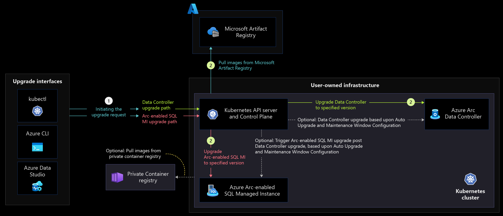
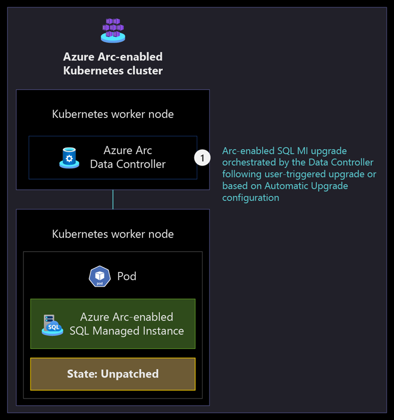

# Upgradeability disciplines for Azure Arc-enabled SQL Managed Instance

Azure Arc-enabled data services allow you to get the evergreen version of SQL that is only available in Azure as Arc-enabled SQL Managed Instance (SQL MI). By nature of being evergreen, and unlike you would do for on-premises installations of SQL Server, Arc-enabled SQL MI provides managed service-based upgradeability so you can benefit from Azure innovation on your infrastructure, rather on-premises or in a Multicloud environment, as soon as it’s available in Azure.

This article provides key design considerations and recommendations for configuring and managing the upgrade process on your Azure Arc-enabled data services.

## Architecture

### Directly Connected mode

The following diagram displays the data service upgrade flow in the Directly Connected mode.

   [](./media/arc-enabled-data-svc-sql-mi-direct-connect-upgrade-flow.png#lightbox)

### Indirectly Connected mode

The following diagram displays the data service upgrade flow in the Indirectly Connected mode.

   [](./media/arc-enabled-data-svc-sql-mi-indirectly-connect-upgrade-flow.png#lightbox)

### General Purpose service tier

The following diagrams display the upgrade process of an Arc-enabled SQL MI in a General Purpose service tier.

   [](./media/arc-enabled-data-svc-sql-mi-general-purpose-tier-pre-upgrade.png#lightbox)

   [](./media/arc-enabled-data-svc-sql-mi-general-purpose-tier-upgrade.png#lightbox)

### Business Critical service tier

The following diagrams display the upgrade process of an Arc-enabled SQL MI in a Business Critical service tier.

   [](./media/arc-enabled-data-svc-sql-mi-business-critical-tier-pre-upgrade.png#lightbox)

   [](./media/arc-enabled-data-svc-sql-mi-business-critical-tier-new-pod.png#lightbox)

   [](./media/arc-enabled-data-svc-sql-mi-business-critical-tier-rollout.png#lightbox)

   [](./media/arc-enabled-data-svc-sql-mi-business-critical-tier-last-pod.png#lightbox)

## Design considerations

### Data Controller upgrades

- Upgrades can be performed using a variety of tools (Azure CLI, Azure portal or Kubernetes tools). Consider which tool to use depending on the connectivity mode being used (directly or Indirectly Connected mode) and the tool you are most comfortable with.
- Review your Data Controller to check if you have any preview data services like Azure Arc-enabled PostgreSQL deployed alongside Arc-enabled SQL MI. You cannot perform in-place upgrades if you have a mix of preview and Generally Available services deployed on the same Data Controller.
- Review the versions of all the Arc-enabled SQL MI used by the Data Controller to confirm they are at the same version as the Data Controller before performing the upgrade.
- Consider the [supported upgrade path](/azure/azure-arc/data/upgrade-data-controller-direct-cli#upgrade-path) to determine the next right version for your Data Controller before the upgrade.

> [!NOTE]
> An upgrade of the Data Controller will not cause downtime for the Arc-enabled SQL MI.

#### Directly Connected mode

- Determine if upgrading the Data Controller in Directly Connected mode will be implemented using the Azure Portal, the Azure CLI or [Azure Data Studio](/sql/azure-data-studio/what-is-azure-data-studio).
- Review the prerequisites for upgrades using the [Azure portal](/azure/azure-arc/data/upgrade-data-controller-direct-portal#prerequisites) and the [Azure CLI](/azure/azure-arc/data/upgrade-data-controller-direct-cli#prerequisites).
- Review the [extensions management critical design area](/azure/cloud-adoption-framework/scenarios/hybrid/arc-enabled-kubernetes/eslz-arc-kubernetes-extensions-management) in the [Azure Arc-enabled Kubernetes Landing Zone Accelerator](/azure/cloud-adoption-framework/scenarios/hybrid/enterprise-scale-landing-zone).

#### Indirectly Connected mode

- Determine if upgrading the Azure Arc Data Controller in Indirectly Connected mode will be implemented using the [Azure CLI](/azure/azure-arc/data/upgrade-data-controller-indirect-cli) or [Kubernetes tools](/azure/azure-arc/data/upgrade-data-controller-indirect-kubernetes-tools).
- Review the prerequisites for upgrades using the [Kubernetes tools](/azure/azure-arc/data/upgrade-data-controller-indirect-kubernetes-tools#prerequisites) and the [Azure CLI](/azure/azure-arc/data/upgrade-data-controller-indirect-cli#prerequisites).
- Decide if you will use the [Microsoft Artifact Registry](https://mcr.microsoft.com/) in case your clusters have internet connectivity or a private registry in case your clusters are air-gapped to pull the Azure Arc-enabled data services images.
- Plan for the [required Kubernetes permissions](/azure/azure-arc/data/upgrade-data-controller-indirect-kubernetes-tools#create-the-service-account-for-running-upgrade) to for the service account used to upgrade the Azure Arc Data Controller using Kubernetes tools.
- Validate the repository information to make sure it is valid and new images have been already pulled to it.

### Azure Arc-enabled SQL Managed Instance upgrades

#### General considerations

- Upgrades to the Data Controller must be performed prior to upgrading the Arc-enabled SQL MI. The _arcdata_ Cluster extension and SQL MI extensions versions are related and must be the same.
- Decide if you will use automatic or manual upgrades of your Arc-enabled SQL MI depending on your requirements.
- In the case of automatic upgrades, only a single maintenance window can be defined for a Data Controller. Consider the number of different maintenance windows needed for different workloads to identify the number of needed Data Controllers.

#### General Purpose service tier

- During an Arc-enabled SQL MI in a General Purpose service tier upgrade, the Kubernetes pod will be terminated and reprovision with the new version. It is important to understand the application and client-side impact of an upgrade where there will be a short amount of downtime as the new pod is created.
- Review the architecture of your applications to understand if they have the needed resiliency and re-try logic to support brief impact during an upgrade.

#### Business Critical service tier

- During an Arc-enabled SQL MI in a Business Critical service tier upgrade with multiple replicas, the secondary replicas are upgraded first, and one of the upgraded secondary replicas is promoted to become the new primary replica while the old primary becomes a secondary and is upgraded. During the transition from the old primary to the new primary, there is a brief moment of downtime when the failover happens. It is important to understand the application and client-side impact of an upgrade when the failover occurs.
- Review the architecture of your application to understand if they have the needed resiliency and re-try logic to support brief impact during an upgrade.

## Design recommendations

### Data Controller upgrades

- If upgrading using the Azure CLI, verify that the _arcdata_ Azure CLI extension version corresponds to the image version you want to upgrade to in the [Version log](/azure/azure-arc/data/version-log).
- In multi-cluster environments, perform upgrades first in a test/dev environment to validate any potential issues or breaking changes.
- Perform a [dry run](/azure/azure-arc/data/upgrade-data-controller-direct-cli#upgrade-data-controller-1) prior to the upgrade to validate the version schema, the private repository authorization token (if used) and that the registry exists before attempting an actual upgrade.
- Create a process to [monitor for new Data Controller upgrades availability](/azure/azure-arc/data/upgrade-data-controller-direct-cli#view-available-images-and-chose-a-version) availability.
- Do not mix PostgreSQL and Arc-enabled SQL MI on the same Data controller as PostgreSQL is still in preview while Arc-enabled SQL MI is generally available. Consider a separate cluster with its own data controller to test PostgreSQL.
- Avoid using Preview features in your production environment and only use preview features for evaluation purposes on dev/test instances.
- Create an inventory of the current versions of the deployed Data Controllers. [Azure Resource Graph](/azure/governance/resource-graph/overview) can be used to query your current deployed Data Controllers.

   ```shell
    resources
    | where type == 'microsoft.azurearcdata/datacontrollers'
    | extend version = tostring(properties.k8sRaw.status.runningVersion)
    | project name,location,resourceGroup,version
   ```

- Review the [troubleshooting guide](/azure/azure-arc/data/maintenance-window#failed-upgrades) to understand how to get the needed logs to resolve any upgrade issues.

#### Directly Connected mode

- Create a process to monitor the upgrade process using the [Azure Portal](/azure/azure-arc/data/upgrade-data-controller-direct-portal#monitor-the-upgrade-status), [Azure CLI](/azure/azure-arc/data/upgrade-data-controller-direct-cli#monitor-the-upgrade-status) or [Azure Data Studio](/sql/azure-data-studio/what-is-azure-data-studio).
- Upgrade the [_arcdata_ Cluster extension](/azure/azure-arc/data/upgrade-data-controller-direct-cli#upgrade-arc-data-controller-extension) before upgrading the Data Controller itself.

#### Indirectly Connected mode

- Create a process to monitor the upgrade process using the [Kubernetes tools](/azure/azure-arc/data/upgrade-data-controller-indirect-kubernetes-tools#monitor-the-upgrade-status) or [Azure CLI](/azure/azure-arc/data/upgrade-data-controller-indirect-cli#monitor-the-upgrade-status).
- Automate the process to [pull down images](https://github.com/microsoft/azure_arc/tree/main/arc_data_services/deploy/scripts) to your private registry.

### Azure Arc-enabled SQL Managed Instance upgrades

#### General recommendations

- Keep your Arc-enabled SQL MI up-to-date to the latest available version to make sure you receive the latest patches, bug fixes, and features. Currently Arc data services does not support skipping releases during upgrades. So if there are multiple releases to upgrade, you will need to upgrade to sequential releases to get to to the latest version. So, it is recommended to not drift too far from the latest releases.
- Make sure to have your "point-in-time restore" backup policy configured as needed to be able to recover in case of issues during an upgrade. Review the [Business continuity and disaster recovery critical design area](../arc-enabled-datasvc-sqlmi/eslz-arc-datasvc-sqlmi-bcdr.md) and use the _kubectl describe sqlmi_ command against your instances to verify the current retention settings.
- In multi-cluster environments or scenarios with multiple deployments of Arc-enabled SQL MI which represent different environments, perform upgrades first in dev/test environments, such as the development environment to validate any potential issues or breaking changes.
- Perform a [dry run](/azure/azure-arc/data/upgrade-sql-managed-instance-direct-cli#upgrade-the-managed-instance) prior to the upgrade to validate the version schema, the private repository authorization token (if used) and that the registry exists before attempting an actual upgrade.
- Use the Azure CLI to perform at-scale upgrades of your Arc-enabled SQL MI.
- Use [Automatic upgrades](/azure/azure-arc/data/maintenance-window) for workloads that can tolerate immediate upgrades and opt-out of automatic upgrades for workloads that need a scheduled off-peak hour to perform the upgrade.
- If automatic upgrades will be used, make sure to define a suitable [maintenance window](/azure/azure-arc/data/maintenance-window) to allow for upgrades to happen during off-peak hours.
- In case of manual upgrades, ensure that you establish a regular cadence to perform upgrades to stay within supported versions.

>[!NOTE]
>You can also [poll the Microsoft Artifact Registry](/azure/azure-arc/data/upgrade-data-controller-direct-cli#view-available-images-and-chose-a-version) for new container image versions.

- Create a process to monitor the upgrade status using [Azure CLI](/azure-arc/data/upgrade-data-controller-direct-cli#monitor-the-upgrade-status) or the [Kubernetes tools](/azure/azure-arc/data/upgrade-data-controller-indirect-kubernetes-tools#monitor-the-upgrade-status).
- Review the [corresponding versions](/azure/azure-arc/data/version-log) of the different components before performing an upgrade to validate having the versions of the right components in place.

#### General Purpose service tier

- Perform upgrades during non critical hours to minimize the impact on users and the organization data.
- Review the [reliability pillar](/azure/architecture/framework/resiliency/overview) of the [Microsoft Azure Well-Architected Framework](/azure/architecture/framework/) for more information on how to architect for [resiliency and retry guidance](/azure/architecture/best-practices/retry-service-specific#sql-database-using-adonet) for your applications.

#### Business Critical service tier

- Deploy the Business Critical instance with 3 replicas instead of 2 to achieve higher availability and less downtime with during upgrade and failover activities.
- Perform upgrades during non critical hours to minimize the impact on users and organization data.

## Next steps

For more information on your hybrid and multicloud cloud journey, see the following articles:

- Review the [capabilities](/azure/azure-arc/data/overview) of Azure Arc-enabled data services.
- Review the [validated Kubernetes distributions](/azure/azure-arc/data/validation-program) for Azure Arc-enabled data services.
- Review the upgrade process of the Data Controller in [directly](/azure/azure-arc/data/upgrade-data-controller-direct-cli) and [indirectly](/azure/azure-arc/data/upgrade-data-controller-indirect-cli) connected modes.
- Review the upgrade process of the Azure Arc SQL MI in [directly](/azure/azure-arc/data/upgrade-sql-managed-instance-direct-cli) and [indirectly](/azure/azure-arc/data/upgrade-sql-managed-instance-cli) connected modes.
- Review [Manage hybrid and multicloud environments](/azure/cloud-adoption-framework/scenarios/hybrid/manage).
- Experience Arc-enabled SQL MI automated scenarios with [Azure Arc Jumpstart](https://azurearcjumpstart.io/azure_arc_jumpstart/azure_arc_data/).
- To learn more about Azure Arc, review the [Azure Arc learning path on Microsoft Learn](/learn/paths/manage-hybrid-infrastructure-with-azure-arc/).