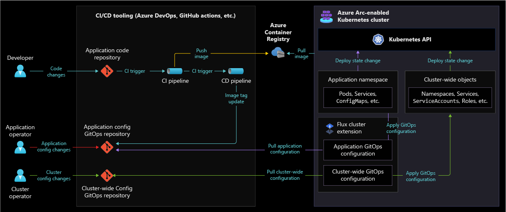
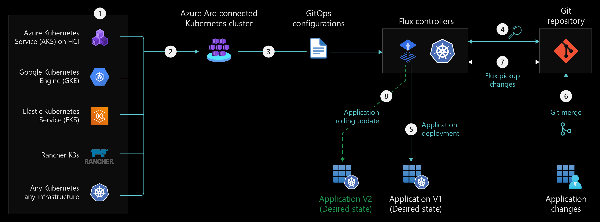

# CI/CD and GitOps disciplines with Azure Arc-enabled Kubernetes

As a cloud-native construct, Kubernetes requires a cloud-native approach to deployment and operations. With GitOps, you declare the desired state of your application-based deployments in files stored in Git repositories. Applications will have Kubernetes objects needed to run, which can include Deployments, Horizontal-Pod-Autoscalers, Services, and ConfigMaps. Kubernetes operators run in the clusters and continually reconcile the cluster state with the desired state declared in the Git repository. These operators pull the files from the Git repositories and apply the desired state to the clusters. The operators also continuously assure that the cluster remains in the desired state.

By implementing GitOps, you can achieve some of the following benefits:

- Improve overall visibility into the Kubernetes cluster state and configuration.
- Have a simple audit and version history of changes to your cluster through Git change history which shows who made changes, when those changes were been made, and why.
- Automatic correction of drift that can occur to your cluster to match the desired cluster state defined in your Git repository.
- Ability to roll back the Kubernetes configuration to a previous version, using Git revert or Git rollback commands. Cluster deployments re-creation for disaster recovery scenarios also becomes a fast and straightforward process because your Kubernetes desired cluster configuration is stored in Git.
- Improve security by reducing the amount of service accounts that are required to have deployment permission to your cluster.
- Implement a CI/CD pipeline for deploying applications to your cluster.

GitOps on Azure Arc-enabled Kubernetes uses an extension that implements [Flux](https://www.weave.works/oss/flux/), a popular open-source tool set. Flux is an operator that automates the GitOps configuration deployments in your cluster. Flux provides support for common file sources (Git and Helm repositories, Buckets) and template types (YAML, Helm, and Kustomize). Flux also supports multi-tenancy and deployment dependency management, among other features.

## Architecture

The following images show a conceptual reference architecture that highlights the Flux cluster extension installation provisioning in your cluster, GitOps configuration process for an Azure Arc-enabled Kubernetes cluster and GitOps Flow.

- Flux v2 Cluster Extension provisioning process

    

- Gitops Configuration process

    

- GitOps Flow showing an application update

    

## Design considerations

The following are some design considerations before implementing GitOps to Azure Arc-enabled Kubernetes:

### Configuration Repository Structure

Before defining your cluster configuration repository, consider the different layers of configuration on your Kubernetes cluster and different responsibilities for provisioning these different layers of configurations.

#### Configuration layers

- Application configuration needed to deploy an application and its related Kubernetes objects to the cluster such as Deployment, Service, HPA, and ConfigMap resources. Application configurations are typically applied to a namespace-level GitOps configuration, requiring the application components only to be configured within a single namespace.
- Cluster-wide components such as an Ingress Controller, monitoring and security stack, and various agents that operate across the cluster.
- Cluster-wide configuration for creation of Kubernetes objects such as Namespaces, ServiceAccounts, Roles and RoleBindings, and other cluster-wide policies.

#### Responsibilities

- Application Developers who are responsible for pushing their source code, triggering builds, and creating container images.
- Application Operators who are responsible for maintaining the application repositories, configurations, environment variables, app-specific helm charts, Kustomizations etc.
  - [Apply a Flux configuration by using the Azure CLI](/azure/azure-arc/kubernetes/tutorial-use-gitops-flux2#apply-a-flux-configuration-by-using-the-azure-cli)
  - [Flux2 helm and kustomize example](https://github.com/fluxcd/flux2-kustomize-helm-example)
- Cluster Operators are responsible for setting up the cluster baseline. They are typically concerned with setting up cluster-wide components and policies. They maintain a Git repo directory or directories which contain common infrastructure tools such as Namespaces, Service Accounts, RoleBindings, CRDs, cluster-wide policies, Ingress components, etc.

#### Repository Structure

Consider different tradeoffs with how you choose a Git repository structure that will define your Kubernetes cluster state which includes applications and cluster-wide components. Depending on the responsibilities and personas identified, it is important to consider the necessary collaboration or desired team independence required for different repository structure options.

For your code repositories, you can use any branching strategy you like since it is only used by your Continues Integration (CI) process. For your GitOps configuration repositories, you need to consider the following strategies based on your organization business needs, size and tooling:

- Single repository (Branch per environment):
  - This allows the most flexibility to control Git policies and permissions for each branch that represents an environment.
  - The drawback is that there will be no sharing of the common config among environments since tooling such as [Kustomize](https://kubernetes-sigs.github.io/kustomize/) does not work with Git branches.
- Single repository (Directory per environment):
  - As an example, this approach can be implemented using Kustomize which allows you to define a base configuration for Kubernetes objects and a set of  (i.e patches) for an environment that overrides configurations in the base.
  - This can reduce duplicating YAML files for each environment but reduces the configuration separation between environments. Making a single change to the repository has the potential to impact all environments at once, so understanding the impact of changes to base directories must be fully understood and taken with care.
- Multiple repositories (each serving a specific purpose):
  - This could be used for separating configuration repositories for each application, team, layer, or tenant.
  - This allows teams to have more independent control but moves away from the principle of defining your system state in a single repository to improve the central configuration, visibility and control of deployments to a cluster.
  - Setting up multiple repositories should be considered for multi-tenancy needs. There is role-based access control (RBAC) and security built-in to limit what configuration a team/tenant assigned to a specific repository can apply, such as only allowing deployment to certain namespaces.

See additional ways of structuring your repository in the [Flux Guide](https://fluxcd.io/docs/guides/repository-structure/).

### Application & Platform Configuration

Platform Operators and Application Operators have several options for managing Kubernetes configuration, the following are choices:

- Raw Kubernetes YAML files that represent YAML specs for each Kubernetes API object you are deploying, this approach works well for single environments. The drawbacks to using raw YAML files is that customizing becomes difficult when you begin to incorporate multiple environments as you need to then duplicate YAML files, and there is not a good method of re-use.
- [Helm](https://helm.sh/) is a package management tool for Kubernetes objects. It’s a valid option for Cluster Operators to install third-party off-the-shelf applications. Be aware of using its templating too heavily as a configuration management tool for internal applications as it can become complex to manage as the templates grow.
  - If using Helm, Flux includes a Helm Controller, allowing one to declaratively manage Helm Chart releases with Kubernetes manifests. You can create a _HelmRelease_ object to manage that process.
- Kustomize is a Kubernetes native configuration management tool and introduces a template-free way to customize application configuration.
  - If using Kustomize, Flux includes a Kustomize-controller which specialized in running continuous delivery pipelines for infrastructure and workloads defined with Kubernetes manifests and assembled with Kustomize. You can create a Kustomization object to manage that process.
- With Azure Arc-enabled Kubernetes, there is a list of available extensions which become managed and supported by Microsoft instead of requiring you to manage the lifecycle and support of the component. These extensions are managed by [Azure Resource Manager](/azure/azure-resource-manager/management/overview). Some of these extensions have Open-Source alternative options, an example of this is the Azure Key Vault Secrets Provider. Managing it outside of the extension process allows you more control of these components but adds an additional overhead of support and lifecycle management.

### Continues Integration and Continues Delivery (CI/CD) Flow

#### Application pipeline

- Consider the necessary application build, testing, and validations that you want to include in your CI process. This can include linting and testing related to security, integration and performance which are required to create a release candidate (RC) for environment deployments.
- For bridging the gap between a build container image in a CI pipeline to being deployed on a cluster, a traditional push deployment method would be done by calling the Kubernetes API directly from the deployment pipeline.

With a GitOps process, to avoid manual configuration modifications to your GitOps repository, the CD pipeline can have permission or run as a service account which then has permission to open a Pull Request (PR) or commit directly to a configuration repository with the new container image change. These changes from your CD pipeline can also provision all YAML objects required for your application.

The following is a process flow that contains the traditional application CI process incorporated with changes to support GitOps.

#### Cluster-wide component update process

- As Cluster Operators need to manage cluster-wide components, this likely will not originate from a CD pipeline used to deploy the applications and services. Consider defining a promotion process specific to Cluster Operators to ensure changes can smoothly transition from one environment to another.
- In scenarios where you need to apply identical GitOps configuration at scale to your Azure Arc-enabled Kubernetes clusters, you can consider applying an Azure Policy that can automatically install the Flux extension and apply the GitOps configuration to existing Arc-enabled Kubernetes clusters or new clusters as they get onboarded to Azure Arc.

For all updates to your configuration, to verify changes have been successfully applied to your desired environment, consider defining notifications in Flux to integrate to your CI/CD tools, email, or ChatOps tools to alert on successful changes as well as deployment failures. Deployment status information is also available in the Azure portal and through the k8s-configuration cli and ARM API.

### Security

#### Repository Auth

- A Public or private Git repository can be used with GitOps, but due to the sensitive nature of Kubernetes configuration, a private repository that requires authentication by SSH key or API key should be considered. GitOps will also work with a Git repository that is only accessible within a private network as long as the Kubernetes cluster can access it, but this will limit your ability to use cloud-based Git providers such as Azure DevOps Repos or GitHub.
- HTTPS or SSH: when choosing between HTTPS or SSH for connecting to your source control tool, both protocols offer a reliable and secure connection. However, HTTPS is often times easier to set up and uses a port that usually does not require opening additional ports in your firewalls.

#### Repo and Branch security

- Set branch permissions and policies on your configuration repository. As your Git repo becomes the central piece of your Kubernetes deployments, it is key to set up permissions to control who can read and update the code in a branch as well as implement policies to enforce your team's code quality and change management, otherwise, the GitOps workflow can ship code that is not up to your organizations' standards.
- Pull request (PR) Pipelines can work with your branch policies to validate YAML configuration and/or deploy test environments as required. These gates will help eliminate configuration errors and increase deployment security and confidence.
- For access permission, consider which users in your organization should have repository read access, PR creation access, and PR Approval access.

#### Secret Management

- Avoid storing plain text or base64 encoded secrets in your Git repository, instead consider integrating to an external secrets provider such as Azure Key Vault. The [Azure Key Vault Provider for Secrets Store CSI Driver](/azure/azure-arc/kubernetes/tutorial-akv-secrets-provider) allows for the integration of an Azure key vault as a secrets store with an Azure Kubernetes Service (AKS) cluster via a CSI volume. This is available through the Azure Arc-enabled Kubernetes extension. [HashiCorp Vault](https://www.vaultproject.io/) is a third party alternative for a managed secret provider.
- Another alternative to manage secrets is to use [Bitnami's Sealed Secrets](https://github.com/bitnami-labs/sealed-secrets/releases), which works on the concept of public and private keys. This allows operators to store the one-way encrypted secret using a public key in Git, which can only be decrypted by the private key which is used by a SealedSecrets controller running in your cluster.

## Design Recommendations

The following image is a reference architecture that shows the responsibilities, repositories, and pipelines to implement a GitOps process using the Azure Arc-enabled Kubernetes [Flux Extension](/azure/azure-arc/kubernetes/tutorial-use-Gitops-flux2).

### Repositories

The following three Git repositories are included in the design:

- Application code repository:
  - This repository stores application code and any pipeline definition and configuration scripts.
  - Use a development branching strategy that is easy to understand and limits the amount of undesired long-running branches.
- Application configuration repository:
  - This repository is used to store application configuration including Kubernetes objects such as ConfigMaps, Deployments, Services, and HPA objects. Structure the repository with different directories for each application. Flux will synchronize changes from this repository and target branch, to the cluster.
  - Incorporate tools that make it easier for application developers and operators to build initial configuration per environment. Application Operators should define Kubernetes specific application configuration that takes advantage of package managers such as Helm or configuration tools like Kustomize overlays to make configuration simpler.
  - Create a branch that represents each environment type. This will allow fine-grain control of changes into each specific environment such as non-prod and production environments.
  - When the application(s) are deployed to a particular namespace, use the namespace scope feature within the GitOps configuration to enforce configuration to only a certain namespace.
- Cluster-wide configuration repository:
  - Define cluster-wide components that a Cluster Operator will manage such as Ingress Controller, Namespaces, RBAC, monitoring, and security stack. Flux will synchronize changes from this repository and target branch, to the cluster.
  - Structure the repository with different directories representing different components.
  - Create a branch that represents each environment type. This will allow fine-grain control of changes into each specific environment such as non-prod and production environments.
  - Cluster Operators should take advantage of package managers such as Helm or configuration tools like Kustomize overlays to make configuration simpler.

### CI/CD and Configuration Update Process

#### CI/CD, Container Image Update

- CI Pipeline
  - Development teams should define a CI pipeline with a process that includes building, linting, testing, and pushing an application to a container registry.
- CD Pipeline
  - Create a CD pipeline that runs a script which targets changes against your application configuration repository. This script creates a temporary branch sourced from your target environment, makes a change to the image tag version, commits the change, and opens a pull request against the target environment branch. This CD pipeline can have environment stages with appropriate environment variables that target the correct GitOps Configuration repository and branch.
  - Define manual approval steps on environment stages to limit unwanted pull requests to all environments.
- Branch policies should be enabled on the application configuration repository to enforce peer review or approvals for environments. This can be a minimum number of required reviews or auto-approval for lower environments. Additionally, consider 3rd party integrations and approvals as necessary to meet any organization standards.

#### Cluster-wide and Application Configuration updates

- Cluster Operators and Application Operators will each be defining configuration in their respective configuration repository. These users will not require pipeline tooling to push configurations, and instead can use the native Git commit and PR processes to define the configuration and push the changes to a branch that represents an environment.
- For new configuration definitions, start with defining configuration in lower environments, such as Dev and promote to higher environments by merges and pull requests. Cherry-pick configuration updates that are only specific to certain environments as needed.
<!-- The following section is commented until support/documentation is added -->
<!-- 
- For implementing at-scale GitOps Configurations which require a Kubernetes configuration to be applied to all Azure Arc-enabled Kubernetes clusters, create an Azure Policy to automatically apply this configuration at scale.
-->

### Feedback and alerting

- Configure [Flux Notifications](https://fluxcd.io/docs/guides/notifications/) to alert users on GitOps configurations that are unable to synchronize or are erroring. Application Operators should configure alerts to determine when an application deployment has been deployed and is healthy. Cluster Operators should configure alerts when cluster-wide component reconciliation has failed, and additionally alert on synchronization issues with the Git repository.
- Implement [GitOps Connector](https://github.com/microsoft/Gitops-connector) to integrate feedback from the Flux agent to your CI/CD tooling.
  
### Security

- Review [the recommendations for governance and security](./governance-disciplines.md) of your Azure Arc-enabled Kubernetes clusters.
- It is recommended to use a private Git repository that has authentication and authorization required for defining any configuration repository, this will ensure unwanted access to any cluster configuration.
  - [Connecting to GitHub with SSH](https://docs.github.com/en/authentication/connecting-to-github-with-ssh)
  - [Choose the right authentication mechanism for Azure DevOps](/azure/devops/integrate/get-started/authentication/authentication-guidance)
- Access the Git repository through SSH protocol and an SSH key if your Git provider supports it. In scenarios where SSH is unusable due to outbound connectivity restrictions or your Git provider does not support the required SSH libraries, it is recommended to use a dedicated service account and associate an API key with the account for Flux to use. As an alternative to SSH when using GitHub, you can review [Creating a personal access token](https://docs.github.com/en/authentication/keeping-your-account-and-data-secure/creating-a-personal-access-token) for authentication.
- Configure branch policies and permissions that match the responsibilities of the cluster, with a minimum amount of reviewers to approve changes.
- Configure a PR pipeline to validate YAML configurations, syntax, and optionally deploy a test Kubernetes cluster. Setup a branch policy to require this pipeline to run successfully before any merge can be accepted.
- Implement secrets using the [Azure Key Vault Provider for Secrets Store CSI Driver](/azure/azure-arc/kubernetes/tutorial-akv-secrets-provider), this will allow for the integration of an Azure Key Vault as a secrets store with an Azure Arc-enabled Kubernetes cluster via a CSI volume.
- The Flux extension supports namespace and cluster scoped configurations, choose the namespace scope when a configuration should not have access beyond a single namespace.

## Next steps

For more information about your hybrid and multicloud cloud journey, see the following articles:

- Review the [prerequisites](/azure/azure-arc/kubernetes/quickstart-connect-cluster?tabs=azure-cli#prerequisites) for Azure Arc-enabled Kubernetes.
- Review [validated Kubernetes distributions](/azure/azure-arc/kubernetes/validation-program#validated-distributions) for Azure Arc-enabled Kubernetes.
- Review [Manage hybrid and multicloud environments](/azure/cloud-adoption-framework/scenarios/hybrid/manage).
- To learn more about GitOps with Azure Arc-enabled Kubernetes:
  - [Conceptual GitOps with Flux v2](/azure/azure-arc/kubernetes/conceptual-Gitops-flux2)
  - To learn more about GitOps with Azure Arc-enabled Kubernetes, review the [Use GitOps with Flux v2](/azure/azure-arc/kubernetes/tutorial-use-Gitops-flux2).
  - To learn more about GitOps with Azure Arc-enabled Kubernetes, review the [Conceptual GitOps Flux v2 CI/CD Process](/azure/azure-arc/kubernetes/conceptual-Gitops-flux2-ci-cd).
  - To learn more about GitOps with Azure Arc-enabled Kubernetes, review the [Tutorial to implement Flux v2 CI/CD](/azure/azure-arc/kubernetes/tutorial-Gitops-flux2-ci-cd).
- Experience Azure Arc-enabled Kubernetes with a GitOps flow from the [Azure Arc Jumpstart](https://azurearcjumpstart.io/azure_arc_jumpstart/azure_arc_k8s/day2/cluster_api/cluster_api_gitops_basic/#deploy-gitops-configurations-and-perform-basic-gitops-flow-on-cluster-api-as-an-azure-arc-connected-cluster-flux-v2).
- To learn more about Azure Arc, review the [Azure Arc learning path on Microsoft Learn](/learn/paths/manage-hybrid-infrastructure-with-azure-arc/).
- Review [Frequently Asked Questions - Azure Arc-enabled](/azure/azure-arc/kubernetes/faq) to get answers to most common questions.
